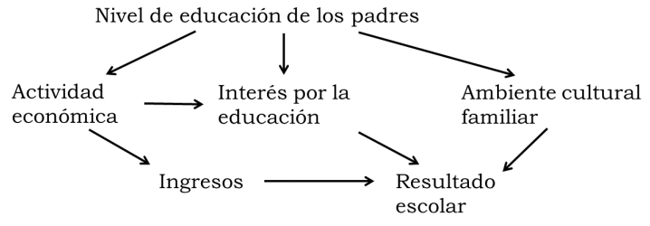
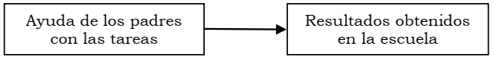

---
output:
  html_document: default
  pdf_document: default
---
# Relación entre variables: los fundamentos

Hasta este punto se han descripto variables observadas o medidas a
través de instrumentos de a una por vez, ahora, el objetivo se acerca
más al modo de hacer investigación en Ciencias Sociales. Es así porque en este capítulo y el siguiente se trata con relaciones entre variables: no ya describir cada variable por separado sino reunirlas en
relaciones de dos como mínimo, pero que puede incluir a una gran
cantidad. Buscar relaciones entre variables es comenzar a transitar el camino de la explicación de los fenómenos que observamos, es buscar respuesta a los "por qué" de las descripciones que se lograron en los capítulos anteriores.  

Si nos preguntamos, por ejemplo: ¿por qué un tratamiento es exitoso con algunos pacientes diagnosticados de depresión y con otros no?
A partir de antecedentes que existan sobre el tema, formularemos hipótesis sobre la respuesta: quizás la edad influya, puede suceder que con pacientes más jóvenes se obtenga mejor resultado que con los de más edad. Razonando así, introducimos otra variable, la edad,
que aportaría a explicar la razón de los diferentes resultados del
tratamiento. La hipótesis está formulada como una relación entre dos
variables: se trata de indagar por el efecto que la edad (primera
variable) tendría sobre el resultado del tratamiento (segunda
variable). La edad podría ser un factor explicativo del resultado
del tratamiento.

Dentro del mismo ejemplo, también podemos sospechar que quienes han sido diagnosticados más precozmente pueden aprovechar el tratamiento mejor que quienes traen una dolencia de larga data. Aquí la variable que viene a explicar el resultado es el tiempo de evolución de la enfermedad. Ahora el tiempo de evolución de la enfermedad podría ser otro factor explicativo del resultado del tratamiento. Notemos el acento en "podría ser": estas relaciones son hipotéticas, nuestro objetivo será analizar la evidencia que haya a su favor o en su contra.
Esquemáticamente la relación se plantea de la siguiente manera:

```{r fig.cap="Relación hipotética entre dos factores explicativos y el resultado de un tratamiento para la depresión", fig.asp = 0.1, fig.width = 3, fig.align='center'}
knitr::include_graphics("imagenes/resultadotratamiento.png")
```

Estas dos variables son parte de la hipótesis para explicar las
diferencias en los resultados que ofrece un determinado tratamiento
sobre pacientes diagnosticados de depresión. Puede haber más variables: la gravedad de la depresión, el sexo del paciente (quizás el resultado no sea igual en mujeres que en hombres), el apoyo familiar que el paciente reciba, etc.

Jamás agotaremos el conjunto de todos los factores explicativos de un
fenómeno, porque en última instancia cada caso es único. Los fenómenos que observamos son multicausados, por lo que no puede decirse que una
variable X sea la causa de otra variable Y[^no_causa]. Pero lo que sí
puede hacerse es analizar la importancia relativa de los diferentes
factores explicativos; saber en qué grado aporta cada uno a las
diferencias que se observan.

Ilustremos esto con otro ejemplo: el resultado escolar que alcanzan los alumnos. No hay dudas que cada niño tiene una trayectoria única, que depende de su historia, de su contexto familiar, etc. Supongamos que analizamos el resultado escolar obtenido en primer grado y observamos que algunos cursos tienen docentes tradicionales, que usan los mismos métodos estandarizados de enseñanza desde hace muchos años. Otros cursos tienen docentes que invitan a los alumnos participar, que innovan en los métodos de enseñanza. Luego comparamos el rendimiento de los alumnos en los dos cursos y vemos que los alumnos del primer grupo aprenden más lentamente que los del segundo y que además, los primeros dicen que se aburren yendo a la escuela y los otros no. Esto no sucede con todos los niños: habrá en el primer grupo algunos que aprenden más rápido y que se divierten, así como algunos del segundo grupo tardarán más en aprender. Pero, en general, en promedio, podríamos hallar mejores resultados entre los alumnos que tienen docentes innovadores. Esto nos lleva a indicar que hay evidencia para creer que los docentes innovadores obtienen con sus alumnos mejores resultados que los docentes tradicionales. Pero esto
no es para todos los alumnos, sino para la mayoría de ellos. De eso se trata la búsqueda de factores explicativos: en este ejemplo diremos que, de los múltiples factores que explican por qué a algunos chicos les va bien en la escuela y a otros les va mal, el tipo de docente es parte de la explicación.  

Las elecciones de autoridades nacionales o provinciales, son resultados que provienen de procesos muy complejos. Existen  algunos elementos que ayudan a explicar un resultado: características personales de los candidatos, situación económica, clima social, etc. Pero el resultado depende también de otros factores que no se conocen, por lo que la anticipación del resultado no puede lograrse de manera certera. Aquello que los encuestados hayan dicho que votarían aporta a anticipar el resultado, pero la predicción es aproximada.    

Las hipótesis son respuestas tentativas a la pregunta formulada como
problema de la investigación. Como tales, consisten en el planteamiento de una relación entre, al menos, dos variables. Recordemos que las hipótesis constituyen afirmaciones que se derivan del modelo de análisis que el investigador ha propuesto para explicar una situación dada. Las hipótesis son consecuencias deductivas de la teoría, cuya verificación no es suficiente para validar la teoría, aunque sí para "aportar evidencia en su favor". Además, las hipótesis como tales, rara vez pueden ponerse a prueba de manera directa, son sus consecuencias observables las que permiten la verificación empírica. En cualquier modelo explicativo hipotético participa un número de variables mayor a dos, sin embargo de las hipótesis pueden deducirse relaciones más simples, inicialmente solo de dos variables.

El siguiente esquema muestra la relación entre varias variables que aportarían (hipotéticamente) a explicar las diferencias en el rendimiento escolar, desde la perspectiva de las condiciones familiares (arrobaQuivy1992).

```{r fig.cap="Relación hipotética entre dos factores explicativos y el resultado de un tratamiento para la depresión", fig.asp = 0.1, fig.width = 3, fig.align='center'}

```

El esquema muestra una hipótesis según la cual, los padres con más
educación tienden a tener ocupaciones de mayor jerarquía, lo que implica de mejores ingresos y esto puede ayudar a crear condiciones adecuadas para el estudio, como disponer de un lugar para estudiar o tener acceso a otras fuentes de aprendizaje (visitas a museos, viajes, etc.). También los padres con mayor educación probablemente valoren más el estudio y así ofrezca mayor apoyo a sus hijos en la escuela. Por último, sería de esperar que los padres con más educación generen un ambiente con hábitos de lectura y discusiones que transmitan a sus hijos el valor de la educación.

Esto es más cercano a la realidad, en la que las variables se relacionan de manera más compleja que la simple $x \rightarrow y$. Sin embargo la base para analizar estas relaciones complejas, son las relaciones bivariadas, es decir, entre solo dos variables.

Establecer de manera hipotética una relación entre dos variables
equivale a afirmar que, por alguna razón, los cambios de una de ellas
van acompañados de cambios en la otra. Pero esto puede suceder de
maneras muy diferentes, por ejemplo, el trueno sucede al relámpago, los síntomas de tuberculosis coinciden con la detección del bacilo de Koch, los movimientos sociales se incrementan en tiempos de deterioro
económico, las personas abusadas en la infancia son más propensas a la depresión. En algunos de estos ejemplos puede identificarse una
secuencia cronológica, señalando cuál de los dos eventos sucede primero, en otros esta distinción no es segura, a veces una variable es la que incide sobre la otra, otras veces es solo una contribución, por último, hay casos en que su ocurrencia conjunta o sucesiva se debe a otras razones. Evitaremos, por ahora hablar de relaciones de causalidad, llegaremos a este concepto hacia el final del capítulo y veremos que debe tratarse con cuidado.

Con el objetivo de ordenar la gran variedad de formas que pueden asumir las relaciones entre variables, estableceremos algunos criterios de clasificación que, sin ser exhaustivos, nos ayudarán a verlas desde diferentes ópticas.

El modo más usado para observar relaciones entre dos variables consiste en presentar el comportamiento conjunto de ellas a través de tablas o gráficos. Las primeras son más adecuadas para variables con pocas categorías (usualmente nominales), mientras que los gráficos son más pertinentes para mostrar relaciones entre variables métricas. Veamos un ejemplo para ilustrar el primer modo de representación: creemos que los niños que han crecido en diferentes tipos de hogar (solo con su madre, solo con su padre, con ambos o con otros parientes) tienen diferentes formas de relacionarse con sus compañeros (con relaciones de liderazgo,
sumisión o rebeldía). En el lenguaje de las relaciones entre variables,
estaríamos proponiendo que existe asociación entre el tipo de hogar
en que el niño crece (con las cuatro categorías mencionadas) y el tipo
de relación que mantiene con sus pares. La presentación conjunta de esas
dos variables es:

<!-- Las dos tablas que vienen de word, via rmd, se cortaron y las que armé manualmente salieron mal -->

Disposición de las variables y sus categorías para analizar la relación entre dos variables

```{r}
aux_table <- tibble::tribble(
  ~"", ~"Relación", ~"con los", ~"pares",
  "**Tipo de hogar**", "Sumisión", "Rebeldía", "Liderazgo",
  "Monoparental materno", "", "", "",
  "Monoparental paterno", "", "", "",
  "Nuclear", "", "", "",
  "Extendido", "", "", "",
)
kableExtra::kable_styling(
  knitr::kable(aux_table, format = "pandoc", booktabs = TRUE, align = "lccc"),
  latex_options = "striped"
)
```

## Tablas de contingencia

Cuando se distribuyen los datos en las celdas, se obtiene una **tabla bivariada** (porque contiene dos variables), que también se llama **tabla de contingencia** o **tabla de distribución conjunta** o **también tabla de doble entrada**. Las celdas del interior de la tabla llevarán, cuando los datos sean recolectados, la cantidad de niños que se encuentren en cada coincidencia de categorías. Si nuestra hipótesis afirmara que los niños provenientes de hogares nucleares son más propensos a ser líderes, esperaríamos una concentración relativa de casos en la celda correspondiente a "hogar nuclear" - "liderazgo", hipótesis que luego deberemos confrontar con la información recogida.

||
|:--:|
| Una **tabla bivariada** o **tabla de contingencia** o **tabla de distribución conjunta** es un arreglo con tantas filas (horizontales) como categorías tenga una de las variables y tantas columnas (verticales) como categorías tenga la otra variable. |

Por oposición, las tablas que se mostraron en los capítulos anteriores, así como las medidas descriptivas que se calcularon, se denominan univariadas.  
La matriz de datos o base de datos no es una tabla bivariada, aunque en alguna bibliografía aparezca con ese nombre. No lo es porque las filas no son categorías de una variable, sino unidades de análisis; las columnas no son categorías de otra variables, sino variables y las celdas no contienen cantidades de casos, sino categorías.

Al  arreglo anterior se agrega una fila y una columna adicionales que corresponden a los totales de cada categoría. A los fines de usar un lenguaje común, en la tabla llamaremos filas a la líneas horizontales y columnas a las verticales e identificaremos la **dimensión** de la
tabla indicando cuántas filas tiene y cuántas columnas, en este orden. En el ejemplo anterior, la dimensión de la tabla es cuatro por tres, porque tiene cuatro filas y tres columnas correspondientes a la cantidad
de categorías de cada una de las dos variables.

||
|:--:|
| La **dimensión** de la tabla se indica como $f X c$, donde $f$ es el número de categorías de la variable que está en las filas y $c$ es el número de categorías de la variable que está en las columnas. |

La celda en la que, bajo la hipótesis indicada, esperaríamos una mayor concentración relativa de casos corresponde entonces a la tercera fila y tercera columna. Con f indicaremos la frecuencia y con el subíndice la celda a que corresponde, así, $f_{ij}$ será la cantidad de casos en la celda que corresponde a la fila i y a la columna j simultáneamente. La frecuencia de la celda de "nuclear-liderazgo" será indicada entonces como $f_{33}$. Para aclarar la presentación de la tabla, se agregan una fila y una columna en la que se indica el total de casos de cada una de ellas, que se llaman marginales de fila y de columna. La notación será:

$f_{i.}$ ("efe i-punto") para los marginales de fila

$f_{.j}$ ("efe punto-jota") para los de columnas

$f_{..}$ ("efe punto-punto") para el total general.

Con esa notación, $f_{3.}$indica el total de niños que crecieron en
hogares nucleares y $f_{.2}$ el total de quienes se vinculan con rebeldía con sus compañeros, la tabla anterior resulta:

```{r}
aux_table <- tibble::tribble(
  ~"", ~"Relación", ~"con los", ~"pares", ~"",
  "**Tipo de hogar**", "Sumisión", "Rebeldía", "Liderazgo", "Total",
  "Monoparental materno", "$f_{11}$", "$f_{12}$", "$f_{13}$", "$f_{1.}$",
  "Monoparental paterno", "$f_{21}$", "$f_{22}$", "$f_{23}$", "$f_{2.}$",
  "Nuclear", "$f_{31}$", "$f_{32}$", "$f_{33}$", "$f_{3.}$",
  "Extendido", "$f_{41}$", "$f_{42}$", "$f_{43}$", "$f_{4.}$",
  "Total", "$f_{.1}$", "$f_{.2}$", "$f_{.3}$", "$f_{..}$",
)
kableExtra::kable_styling(
  knitr::kable(aux_table,
    format = "pandoc", booktabs = TRUE, align = "lcccc",
    caption = "Disposición de las frecuencias para el análisis de la relación entre dos variables."
  ),
  latex_options = "striped"
)
```

Si hemos recogido datos sobre estas características de los niños, la tabla podría quedar así:

```{r}
aux_table <- tibble::tribble(
  ~"", ~"Relación", ~"con los", ~"pares", ~"",
  "**Tipo de hogar**", "Sumisión", "Rebeldía", "Liderazgo", "Total",
  "Monoparental materno", 20, 30, 50, 100,
  "Monoparental paterno", 10, 40, 15, 65,
  "Nuclear", 5, 10, 25, 40,
  "Extendido", 30, 20, 10, 60,
  "Total", 65, 100, 100, 265,
)
kableExtra::kable_styling(
  knitr::kable(aux_table,
    format = "pandoc", booktabs = TRUE, align = "lcccc",
    caption = "Alumnos de escuelas primarias por relación con sus pares según tipo de hogar (organización de las frecuencias)."
  ),
  latex_options = "striped"
)
```

Esta tabla dice que se han observado un total de 265 niños y se ha
registrado el tipo de hogar en que crecieron y la forma en que se
relacionan con sus compañeros. De los 265:

* 100 provienen de hogares monoparentales maternos: $f_{1.}$,  
* 65 de monoparentales paternos: $f_{2.}$,  
* 40 de nucleares: $f_{3.}$ y  
* 60 de hogares extendidos: $f_{4.}$.  

Los mismos niños se relacionan con sus compañeros:  

* 65 de ellos con sumisión: $f_{.1}$,  
* 100 con rebeldía: $f_{.2}$ y  
* 100 con liderazgo: $f_{.3}$.  

Todas estas son lecturas de las **frecuencias marginales**. Marginales de fila las del tipo de hogar y marginales de columna las de la forma de la relación.

||
|:--:|
| Se llama **frecuencias marginales de fila** a las frecuencias absolutas de las categorías de la variable que se ubica en las filas. |

||
|:--:|
| Las **frecuencias marginales de columna** son las frecuencias absolutas de las categorías de la variable ubicada en las columnas.* |

Las frecuencias de las celdas, que se llaman **frecuencias conjuntas**
se leen: 20 de los niños observados crecieron en hogares monoparentales
maternos y se relacionan con sus compañeros con sumisión ($f_{11}$), 30
niños se relacionan con liderazgo y provienen de hogares monoparentales
maternos ($f_{12}$), 10 se relacionan con rebeldía y provienen de hogares
nucleares ($f_{32}$) y del mismo modo el resto de las frecuencias
conjuntas. Ellas indican la cantidad de casos que reúnen al mismo tiempo
las dos condiciones que se indican en la fila y en la columna.

||
|:--:|
| Las **frecuencias conjuntas** indican la cantidad de casos que corresponden simultáneamente a una determinada categoría de la variable de las filas y una categoría de la variable de columnas. |

## Frecuencias relativas

Del mismo modo en que trabajamos con las tablas de distribución de
frecuencia de una sola variable, podemos transformar todas estas
frecuencias absolutas en relativas, por el simple procedimiento de
dividirlas en el total general. Resulta así:

```{r}
aux_table <- tibble::tribble(
  ~"", ~"Relación", ~"con los", ~"pares", ~"",
  "**Tipo de hogar**", "Sumisión", "Rebeldía", "Liderazgo", "Total",
  "Monoparental materno", 0.08, 0.11, 0.19, "**0.38**",
  "Monoparental paterno", 0.04, "**0.15**", 0.06, 0.25,
  "Nuclear", 0.02, 0.04, 0.09, 0.15,
  "Extendido", 0.11, 0.08, 0.04, 0.23,
  "Total", "**0.25**", 0.38, 0.38, 1.00,
)
kableExtra::kable_styling(
  knitr::kable(aux_table,
    format = "pandoc", booktabs = TRUE, align = "lcccc",
    caption = "Alumnos de escuelas primarias por relación con sus pares según tipo de hogar, frecuencias relativas."
  ),
  latex_options = "striped"
)
```

Leemos así las frecuencias que están destacadas en la tabla:

- El 15% del total de alumnos observados proviene de hogares
monoparentales paternos y se relacionan con sus pares con rebeldía: Por ser una frecuencia relativa usamos la "prima" en la notación, entonces es $f'_{22}$

- Un 25% del total se relaciona con sumisión, sin considerar el tipo de hogar del que provengan. Es $f'_{1.}$

- Un 38% proviene de hogares monoparentales maternos, sin tener en cuenta de qué manera se relacionan con sus pares. Es $f'_{.1}$

La primera de estas frecuencias relativas es conjunta, las otras dos
marginales.  

## Una clasificación en referencia al tiempo

Como señalamos al principio hay relaciones en las que resulta posible identificar a una de las variables como previa a la presencia de la otra, o a un evento como anterior a la ocurrencia del otro. Así, el trueno siempre sucede luego del relámpago, si tenemos la oportunidad de
oírlo. Aun cuando no podamos establecer la causa de la relación entre los dos eventos, no tenemos dudas en señalar a uno como anterior al otro. Los malos tratos sufridos durante la niñez son anteriores (en la historia del sujeto) a la eventual manifestación adulta de conductas antisociales. De modo que si nos interrogáramos sobre la existencia de una relación entre estos dos eventos, ubicaríamos a los malos tratos como variable anterior, aunque solo fuera porque su manifestación es temporalmente previa. Así sucede también al buscar una relación entre
los resultados de un examen de ingreso a la universidad y el rendimiento posterior de los estudiantes.

Es importante indicar a esta altura que no estamos suponiendo que la relación exista, nos encontramos en el momento del planteo de las hipótesis; bien puede suceder que, luego del análisis de los datos, encontremos que la relación no es válida, que no se sostiene, en fin, que las observaciones no avalan una asociación entre malos tratos
infantiles y conducta antisocial, o que el resultado de examen de ingreso no se relaciona con el desempeño posterior, pero esto no invalida que, en la relación que proponíamos, una variable sea tratada como anterior a la otra.

Así como en ciertos casos es posible anticipar el orden (sea lógico o cronológico) en que se presentan las variables que constituyen una relación, hay algunas situaciones en que esto es muy difícil, o imposible y otras en las que no tiene ningún interés. Una relación que
ilustra el primer caso es la relación entre el comportamiento infantil y el trato que recibe de sus padres. Puede interpretarse a los niños revoltosos como respondiendo a la escasa atención que le brindan sus
padres, o leer la forma en que los padres tratan a sus hijos como consecuencia de la mala conducta de estos últimos. En este ejemplo se ve que el orden en que se establezcan las variables que se busca relacionar
está influido por la posición teórica que el investigador asuma.

Otros casos en los que no tiene interés mencionar qué variable es anterior y cual posterior son típicos de los estudios descriptivos, en los que interesa mostrar cómo se distribuyen ciertas variables, y no se plantea a una como factor explicativo de la otra. Así, una distribución de la población por sexo y edad como la de la tabla siguiente:

```{r}
aux_table <- tibble::tribble(
  ~"Grupos de edad", ~"Varones", ~"Mujeres",
  "0-4", 56913, 55053,
  "5-9", 57471, 56073,
  "10-14", 55564, 54394,
  "15-19", 55581, 55834,
  "20-24", 67519, 69727,
  "25-29", 53736, 54667,
  "30-34", 42209, 43852,
  "35-39", 36910, 39894,
  "40-44", 34681, 38243,
  "45-49", 31879, 36634,
  "50-54", 30780, 36187,
  "55-59", 24485, 29448,
  "60-64", 19914, 25038,
  "65-69", 16485, 22387,
  "70-74", 13858, 20831,
  "75-79", 8816, 15318,
  "80-84", 4423, 9471,
  "85-89", 1827, 5355,
  "90-94", 600, 1906,
  "95-99", 120, 448,
  "100 y más", 8, 43,
  "Total", 613779, 670803,
)
aux_table$Total <- rowSums(aux_table[, c("Varones", "Mujeres")])
kableExtra::kable_styling(
  knitr::kable(aux_table,
    format = "pandoc", booktabs = TRUE, align = "lcccc",
    caption = "Departamento Capital, Provincia de Córdoba. Población por sexo según grupos de edad. Año 2001."
  ),
  latex_options = "striped"
) %>%
  footnote(general = "Fuente: INDEC (2009)")
```

Solo pretende describir a la población y no tiene sentido preguntar qué variable es prioritaria a la otra o cuál depende de cuál.

Las relaciones en que no es posible o no interesa señalar qué variable es anterior, se llaman **simétricas**[^aclara_simet] o de variación conjunta o de
covariación, con ellas simplemente puede preguntarse si las variables están correlacionadas. Es decir si varían simultáneamente, sin preguntar cuál es la que podría preceder a la otra.

Otro ejemplo de este tipo de relaciones es la que puede plantearse entre las calificaciones que les estudiantes obtienen en dos materias que cursan simultáneamente; si encontramos que a aquelles estudiantes que les va bien en Epistemología también obtienen buenas notas en Biología, no creeremos que un resultado incida en el otro, solamente describiremos que varían conjuntamente. Si luego nos interesamos por avanzar en un estudio explicativo iremos a buscar otras variables que den cuenta de esta covariación.

||
|:--:|
| Una relación entre dos variables es **simétrica** cuando es de variación conjunta y no puede identificarse a una variable como previa a la otra* |

Por el contrario, aquellas relaciones en las que puede identificarse a una variable como anterior a otra se denominan *asimétricas*, es
decir, no es lo mismo planearlas en un sentido que en otro. Una de las
variables (la anterior) se llama antecedente y la otra (posterior)
consecuente. En el contexto del diseño experimental, estas variables se denominan, respectivamente independiente y dependiente.

Puede observarse que una variable cambia a continuación de la otra (en
sentido temporal) pero esto no nos autoriza a decir que cambia a causa
de la otra, como resulta claro en el ejemplo del relámpago y el trueno.
Que la relación sea asimétrica no implica que una variable sea ni la
causa, ni un factor explicativo, de la otra.

A la inversa, en los estudios explicativos la relación debe ser
asimétrica, porque se busca identificar factores que anticipen
determinados eventos. Por eso decimos que la asimetría es una condición
necesaria de la causalidad, pero no suficiente.

||
|:--:|
| Una relación entre dos variables es **asimétrica** cuando una de las variables precede (lógica o cronológicamente) a la otra y puede identificarse a una como antecedente y a la otra como consecuente. |

## La dirección de la relación

Cuando las variables que se ponen en juego en una relación tienen un
nivel de medición superior al nominal, resulta posible hacer juicios de orden entre sus categorías, con lo que es posible indicar si los valores
van creciendo o decreciendo. Ya sea que se trate de una relación
simétrica o asimétrica, si las variables tienen nivel ordinal o
superior, resulta de interés plantear la **dirección** de la relación.
Se trata de otro criterio para clasificar relaciones entre variables: si
a cambios ascendentes (crecientes) de una variable se siguen cambios
ascendentes de la otra, llamamos a la relación **directa**. Si, por el contrario, un crecimiento de una de las variables va acompañado de una disminución en los valores de la otra, la denominaremos **inversa**[^rel_inversa]. Cuando se espera que la relación entre dos variables sea directa o inversa para toda la serie de categorías, decimos que la relación es monótona.

Por ejemplo, puede plantearse, de manera hipotética, la relación entre los años de educación y el salario. Las personas que han asistido más años a instituciones educativas tienden, en promedio, a tener ingresos más altos que quienes asistieron menos tiempo. La hipótesis anticipa una relación directa entre la escolarización y los ingresos.


||
|:--:|
| Una relación entre dos variables medidas a nivel ordinal o superior es **directa** si cuando los valores de una de ella aumentan, también aumentan los de la otra. |

Análogamente:

||
|:--:|
| Se llama **inversa** a la relación entre dos variables de nivel ordinal o superior en la que los incrementos en los valores de una de ellas van acompañados de disminuciones en los valores de la otra. |

La clasificación solo tiene sentido si puede hablarse de aumento o
disminución, es decir, si es factible realizar juicios de orden entre
las categorías de las variables. Por eso es que este criterio requiere,
para su aplicación, que ambas variables tengan por lo menos nivel
ordinal.

Por ejemplo, la calificación que se obtiene en un examen (variable
consecuente, de nivel ordinal) puede tener relación directa con las
horas dedicadas a estudiarla (variable antecedente, de nivel
proporcional). Lo que equivale a decir que quienes estudian más horas
tenderían a obtener calificaciones más altas.

Si en otro ejemplo, se formula como hipótesis que el tipo de escuela
secundaria (variable antecedente, de nivel nominal) a la que los alumnos
asistieron tiene relación con el rendimiento que alcanzan en su
carrera universitaria (variable consecuente, de nivel ordinal), no es
posible establecer la dirección de esta relación, porque no se cumple
que ambas variables sean al menos ordinales.

Ejemplo (datos ficticios): la expresión "si los padres los ayudan con
las tareas, a los chicos les va mucho mejor en la escuela" equivale a
decir que la ayuda que los padres les dan a sus hijos está relacionada con mucha intensidad con el rendimiento en la escuela. La primera variable, la ayuda es la antecedente, que puede ser de nivel nominal, con categorías: ayuda, no ayuda; o bien ordinal, con categorías: ayuda siempre, casi siempre, pocas veces, nunca. La segunda variable, el rendimiento, es la consecuente, y sus categorías podrían ser: rendimiento alto, medio, bajo. El esquema de la relación
será:

```{r fig.cap="Relación hipotética entre la ayuda de los padres y el rendimiento escolar", fig.asp = 0.1, fig.width = 3, fig.align='center'}

```

Y la tabla que reúna los datos para verificar esta relación podrá tener
dimensión $2 \times 3$, con forma:

Disposición de las variables para analizar la relación entre la ayuda
que los padres dan a sus hijos y el rendimiento que alcanzan en la
escuela

```{r}
aux_table <- tibble::tribble(
  ~"", ~"", ~"Rendimiento", ~"", ~"",
  "**Ayuda**", "Alto", "Medio", "Bajo", "Total",
  "Si", "", "", "", "",
  "No", "", "", "", "",
  "Total", "", "", "", "",
)
kableExtra::kable_styling(
  knitr::kable(aux_table, format = "pandoc", booktabs = TRUE, align = "lcccc"),
  latex_options = "striped"
)
```

O bien, considerando a la ayuda como ordinal, en una tabla de $4 \times 3$

Disposición de las variables para analizar la relación entre la ayuda
que los padres dan a sus hijos y el rendimiento que alcanzan en la
escuela

```{r}
aux_table <- tibble::tribble(
  ~"", ~"", ~"Rendimiento", ~"", ~"",
  "**Ayuda**", "Alto", "Medio", "Bajo", "Total",
  "Siempre", "", "", "", "",
  "Casi siempre", "", "", "", "",
  "Pocas veces", "", "", "", "",
  "Nunca", "", "", "", "",
  "Total", "", "", "", "",
)
kableExtra::kable_styling(
  knitr::kable(aux_table, format = "pandoc", booktabs = TRUE, align = "lcccc"),
  latex_options = "striped"
)
```

Planteada de este modo, se trata de una relación asimétrica, ya que
suponemos que es la ayuda (antecedente) la que incide sobre el resultado
(consecuente). Si vemos el último esquema, puede considerarse la
dirección (en el anterior no ¿por qué?) y la formularíamos como directa,
es decir que, cuanto mayor sea ayuda que los padres aportan, tanto
mejores serán los resultados. Esto está dentro de la hipótesis, aún no
hemos recogido datos para avalarla o refutarla. Llegar a conocer si la
ayuda de los padres contribuye en gran medida o escasamente a los
resultados en la escuela, es un problema de la intensidad de la
relación, que solo podrá responderse a posteriori, una vez que los datos están recolectados.

## Concepto de riesgo relativo

En las tablas de contingencia de dimensión $2\times2$, que plantean relaciones
asimétricas se suele calcular una medida que resulta de muy accesible
interpretación, denominada **riesgo relativo**. Se trata de un cociente
entre la proporción de casos que se encuentran en una categoría de la
variable consecuente bajo determinado escenario (una categoría de la
variable antecedente) y la proporción de casos que se hallan en la
misma, bajo el escenario complementario (la otra categoría de la
variable antecedente). Es un término que tiene uso regular en
epidemiología y tiene la ventaja de la claridad en la comunicación. Por
ejemplo, un informe afirma que "El riesgo relativo de cardiopatía
isquémica (CI) es 2,5 veces mayor en pacientes hipertensos." Se
interpreta que las personas que son hipertensas tienen dos veces y media
mayores posibilidades de sufrir CI que quienes no lo son. El riesgo relativo
se usa principalmente (pero no solo) en la relación entre dos variables
dicotómicas; en este ejemplo las variables dicotómicas son: ser hipertenso y haber sufrido cardiopatía isquémica, ambas con categorías si - no, a las que denominamos: hip, nohip y card, nocard, respectivamente. La primera es el antecedente y la segunda el consecuente, porque interesa plantear el posible efecto de la hipertensión sobre la CI. A partir de los datos obtenidos en el estudio de arrobaRamonGonzalezJuanatey2001, la relación se plantea así:

```{r echo=FALSE, warning=FALSE}
card <- as.data.frame(c(rep("card", 6090), rep("nocard", 25961)))
hip <- as.data.frame(c(
  rep("hip", 4022), rep("nohip", 2068),
  rep("hip", 6555), rep("nohip", 19406)
))
para.tabla.RR <- data.frame(card, hip)
names(para.tabla.RR) <- c("cardiopatia", "hipertension")
tabla21 <- addmargins(
  table(para.tabla.RR$hipertension, para.tabla.RR$cardiopatia)
)
colnames(tabla21) <- sub("Sum", "Total", colnames(tabla21))
rownames(tabla21) <- sub("Sum", "Total", rownames(tabla21))
kableExtra::kable_styling(
  knitr::kable(tabla21, format = "pandoc", booktabs = TRUE, align = "ccc"),
  latex_options = "striped"
)
```

Las frecuencias relativas por filas son:

```{r}
tabla22 <- prop.table(tabla21[, -3], 1)
# tabla22 <- round(cbind(tabla22, Total = rowSums(tabla22)) * 100, 1)
tabla22 <- round(cbind(tabla22, Total = rowSums(tabla22)), 3)
# tabla22 <- matrix(paste0(tabla22, "%"), ncol = ncol(tabla22))
kableExtra::kable_styling(
  knitr::kable(tabla22, format = "pandoc", booktabs = TRUE, align = "ccc"),
  latex_options = "striped"
)
```

La frecuencia relativa 0.380 es el riesgo de tener cardiopatía isquémica si se es hipertenso, mientras que 0.096 es el mismo riesgo para personas que no padecen hipertensión. El 38% de los hipertensos tuvo CI, mientras que solo el 9.6% de los no hipertensos tuvo CI. La comparación de ellos es el riesgo relativo:
$$\frac{0.380}{0.096}=3.96$$
El resultado es el mismo si se dividen los porcentajes. Este cociente mide cuántas veces más grande es el numerador que el denominador, por lo que indica cuántas veces más riesgo hay de tener cardiopatía isquémica si se padece hipertensión, que si no es así.

Ejemplo (datos del Operativo Nacional de Evaluación Argentina 2000): interesados en el efecto que podría tener el hábito de lectura de los alumnos sobre su rendimiento en Lengua, usamos una pregunta de un cuestionario aplicado a estudiantes del último año del secundario, que dice: "Durante los últimos dos meses ¿Leíste o estás leyendo algún libro, además de los que te pidieron en la escuela?" Con categorías de respuesta si - no. Nos interesa analizar la relación de esta variable con el resultado que los alumnos obtienen en la prueba de lengua, para lo cual cortamos los puntajes de esta prueba en dos categorías: altos (50 puntos o más) y bajos (menos de 50 puntos). Para la provincia de Córdoba, en el año 2000 resulta la siguiente tabla:

<!-- EB: salen raras estas tablas-->

```{r}
aux_table <- tibble::tribble(
  ~"Durante los últimos dos meses ¿Leíste o estás leyendo algún libro, además de los que te pidieron en la escuela?", ~"Puntaje prueba", ~"de de", ~"la Lengua",
  "", "Bajos", "Altos", "Total",
  "Si", 2382, 10299, 12681,
  "No", 3530, 9821, 13351,
  "Total", 5912, 20120, 26032,
)
kableExtra::kable_styling(
  knitr::kable(aux_table, format = "markdown", booktabs = TRUE, align = "lccc"),
  latex_options = "striped"
) %>%
  footnote(general = "Fuente: ONE 2000")
```

A fin de comparar los puntajes que obtienen quienes leen con los que obtienen los que no leen (para ver si hay alguna diferencia), hacen falta frecuencias relativas. En este caso se calculan según las filas de la tabla:

```{r}
aux_table <- tibble::tribble(
  ~"Durante los últimos dos meses ¿Leíste o estás leyendo algún libro, además de los que te pidieron en la escuela?", ~"Puntaje prueba", ~"de de", ~"la Lengua",
  "", "Bajos", "Altos", "Total",
  "Si", "18.8%", "81.2%", "100%",
  "No", "26.4%", "73.6%", "100%",
  "Total", "22.7%", "77.3%", "100%",
)
kableExtra::kable_styling(
  knitr::kable(aux_table, format = "markdown", booktabs = TRUE, align = "lccc"),
  latex_options = "striped"
) %>%
  footnote(general = "Fuente: ONE 2000")
```

En esta tabla se observa que menos de un cuarto (el 22.7%) obtuvo resultados bajos, pero que este porcentaje es diferente entre quienes lee y quienes no lo hacen: entre quienes dicen que leen, menos del 19% (el 18.8%) tiene bajo puntaje, mientras que entre quienes dicen que no leen, ese porcentaje sube a más del 26 (26.4%). Dado que el resultado
bajo se considera como el evento desfavorable, puede hablarse del riesgo de obtenerlo. Así, el riesgo de obtener puntaje bajo en Lengua es 18.8% para quienes dicen que leen y de 26.4% para quienes dicen que no leen.  
Estos valores son los que se usan para calcular el riesgo relativo, el cociente entre 26.4 y 18.8 es 1.4, por lo que diremos que hay 1.4 veces más chances de obtener bajos resultados en Lengua entre alumnos que no leen que entre los que sí lo hacen.

## La intensidad

Sea que se trate de relaciones simétricas o asimétricas y que pueda o no decidirse sobre la dirección, siempre es posible (y tiene mucho interés hacerlo) evaluar la **intensidad** en que se manifiesta la relación
entre las variables a partir de los datos de nuestras observaciones. Esta medida de la relación se corresponde con la idea intuitiva de "X tiene mucha influencia en Y", la idea de mucha o poca influencia, es la de intensidad de la relación. Cuando hay muchos factores explicativos
para un fenómeno, interesa saber qué factores inciden en mayor o menor
medida en el fenómeno y a eso se responde indicando la intensidad de
cada relación.

La intensidad o grado de la relación puede también aplicarse a
relaciones simétricas. En ese caso, la intensidad mide cuán a menudo los
cambios de una de las variables se ven acompañados de cambios en la
otra, y es un resultado descriptivo, no explicativo.

||
|:--:|
| La **intensidad de una relación**[^inten_rel] es una medida de la fuerza con que los cambios en una variable afectan los cambios en la otra (si es una relación asimétrica) o bien, de la frecuencia con que los cambios de una variable acompañan a los de la otra (si se trata de una relación simétrica). |

La evaluación de esta intensidad puede lograrse, en una primera
aproximación, observando la distribución conjunta de las dos variables.
En la medida que cierta combinación de categorías de una y otra variable
concentren la mayor parte de los casos, estaremos en presencia de
relaciones más fuertes o de mayor intensidad. Los siguientes son
resultados de un estudio que relaciona el tipo de docente con el
rendimiento de sus alumnos:

```{r}
aux_table <- tibble::tribble(
  ~"", ~"", ~"rendimiento", ~"", ~"",
  "**tipo de docente**", "alto", "medio", "bajo", "Total",
  "Autoritario", 5, 35, 50, 90,
  "Democrático", 260, 40, 10, 310,
  "Total", 265, 75, 60, 400,
)
kableExtra::kable_styling(
  knitr::kable(aux_table,
    format = "pandoc", booktabs = TRUE, align = "lcccc",
    caption = "Alumnos primarios por rendimiento según tipo de docente, frecuencias absolutas"
  ),
  latex_options = "striped"
)
```

Ejemplo: se compara la idea de emigrar entre quienes tienen diferente opinión sobre la evolución de su país. Para ellos se cruzan las siguientes variables de la edición 2017 de Latinobarómetro:

S11. ¿Ud. y su familia han pensado en la posibilidad
concreta de ir a vivir a otro país?

1. Sí
2. No

P2ST. ¿Diría Ud. que este país...?

1. Está progresando
2. Está estancado
3. Está en retroceso


```{r}
latinob <- read.csv("bases/archivostxt/latinobarometro2017.txt")

latinob$P2ST <- ifelse(latinob$P2ST > 0, latinob$P2ST, NA)
latinob$P2ST <- as.factor(latinob$P2ST)
levels(latinob$P2ST) <- c("progresando", "estancado", "en retroceso")

latinob$S11 <- ifelse(latinob$S11 > 0, latinob$S11, NA)
latinob$S11 <- as.factor(latinob$S11)
levels(latinob$S11) <- c("pensó emigrar", "nunca pensó emigrar")

tabla10 <- table(latinob$P2ST, latinob$S11)
tabla11 <- addmargins(tabla10)
colnames(tabla11) <- sub("Sum", "Total", colnames(tabla11))
rownames(tabla11) <- sub("Sum", "Total", rownames(tabla11))
kableExtra::kable_styling(
  knitr::kable(tabla11,
    format = "pandoc", booktabs = TRUE, align = "ccc",
    label = "abs",
    caption = "Distribución conjunta de la opinión sobre la evolución de su país y la intención de emigrar. Frecuencias absolutas"
  ),
  latex_options = "striped"
)
```

En la que, la opinión sobre la evolución del país (en las filas) y los proyectos migratorios (en las columnas) están codificados como las opciones de respuesta del cuestionario.

Al pedir las frecuencias relativas al total obtenemos:

```{r}
tabla12 <- round((addmargins(prop.table(tabla10))), 3)
colnames(tabla12) <- sub("Sum", "Total", colnames(tabla12))
rownames(tabla12) <- sub("Sum", "Total", rownames(tabla12))
tabla12 <- tabla12 * 100
kableExtra::kable_styling(
  knitr::kable(tabla12,
    format = "pandoc", booktabs = TRUE, align = "ccc",
    label = "rel",
    caption = "Distribución conjunta de la opinión sobre la evolución del propio país y la perspectiva de emigrar. Frecuencias relativas al total"
  ),
  latex_options = "striped"
)
```

Leemos las frecuencias conjuntas y las marginales como en la tabla ref(tab:cual).
Por ejemplo:

El 36.7% de los encuestados considera que su país está estancado *y* no considera la posibilidad de emigrar.

El 25.3% de los encuestados ha pensado en emigrar (sin importar su opinión sobre la evolución de su país).

El 25.7% cree que su país está mejorando (sin tener en cuenta su proyecto migratorio).

El análisis que se haga de la tabla depende del modo en que se formule la hipótesis sobre la relación. Si se plantea a la "opinón sobre la evolución del país" como uno de los posibles elementos que influiría a la decisión de emigrar, entonces, la opinión es antecedente de la decisión de migrar. Con esta formulación, el interés estaría en comparar la decisión de emigrar entre quienes tienen diferente opinión sobre la evolución del país. Para ello, generamos frecuencias relativas en dirección de la opinión (variable antecedente) y, por comodidad, expresamos esas frecuencias relativas como porcentajes:

```{r}
tabla13 <- 100 * round(addmargins(prop.table(tabla10, 1), 2), 3)
colnames(tabla13) <- sub("Sum", "Total", colnames(tabla13))
rownames(tabla13) <- sub("Sum", "Total", rownames(tabla13))
kableExtra::kable_styling(
  knitr::kable(tabla13,
    format = "pandoc", booktabs = TRUE, align = "ccc",
    label = "frecConj",
    caption = "Distribución conjunta de la opinión sobre la evolución del propio país y la perspectiva de emigrar. Frecuencias relativas por filas"
  ),
  latex_options = "striped"
)
```

Ahora la lectura es por las filas, es decir, por las categorías de la opinión. Entre quienes opinan que su pais está mejorando, hay un 22.3% que ha pensado en emigrar, mientras que entre quienes creen que está empeorando, el porcentaje sube al 30%. 

La ventaja de usar porcentajes (o frecuencias relativas) es que las comparaciones se hacen sobre los mismos totales, es "como si" hubiese 100 personas que opinan que el país está mejorando, 100 que está estancado y 100 que está empeorando.

Que haya cierta relación entre la opinión acerca de la evolución del pais (antecedente) y la idea de emigrar (consecuente) no es equivalente a que la opinión sea "la causa" de las intenciones de emigrar. En la tabla se observa que la intención de emigrar es expresada por una minoría se los encuestados, solo que esa minoría es levemente mayor entre quienes opinan que el país está empeorando. Se puede afirmar que quienes opinan que el país está empeorando tienen "un poco más" de intenciones de emigrar que aquellos que opinan que está mejorado. La opinión sobre la evolución del país es uno de los muchos factores que pueden incidir en la intención de emigrar.

Al comparar la tabla \@ref(tab:rel) con la \@ref(tab:frecConj) vemos que aunque ambas ofrecen frecuencias relativas, la primera las calcula respecto del total general (los 19649 casos) mientras que en la segunda los totales son las frecuencias marginales de cada fila. Son dos resultados muy diferentes, en efecto, la frecuencia de la celda 1,1 en la tabla \@ref(tab:rel) es 0.057 e indica que el 5.7% del total de encuestados cree que su país está mejorando **y** han pensado en emigrar. La misma celda en la tabla \@ref(tab:frecConj) tiene frecuencia de 0.223 y se lee: de los encuestados que creen que su país está mejorando, el 22.3% ha pensado en emigrar.

Veamos que la primera de las frecuencias (relativa al total) contiene
información simultanea sobre las dos variables, mientras que la segunda (relativa a los totales de fila), fija una categoría para una de las variables: al hablar de los encuestados que creen que su país está mejorando, estamos restringiendo el conjunto completo, ya no es un juicio sobre los 19649 encuestados del total, sino solo sobre los 5040 que cumplen con ese requisito. La frecuencia está condicionada por ese requisito. Esto equivale a decir que las frecuencias relativas cambian cuando se establece una condición como la mencionada. En general, la proporción de encuestados que piensa emigrar es 25.3% <!--no sale aun en la tabla--> , pero si agregamos el dato que indica que estamos tratando solo con los que creen que el país está mejorando, entonces la proporción decae al 22.3%. La opinión sobre la evolución del país es una condición que imponemos cuando calculamos estas frecuencias relativas a los totales de fila.

El modo en que se calcularon las frecuencias relativas (o los
porcentajes) en la segunda tabla fue tomando como total al número de encuestados que dieron cada opinión sobre el país. No es ésta la única opción posible, ¿por qué no lo hicimos dividiendo por los totales de cada nivel de la otra variable, la intención de emigrar?
Es decir ¿qué hizo que eligiéramos en esta tabla las filas y no las
columnas como totales para el cálculo de los porcentajes? Es porque es trata de una relación asimétrica, y en esos casos siempre elegiremos como denominador a los totales de la variable
antecedente, porque queremos ver qué diferencia hay entre los grupos que definen sus categorías. En el caso del ejemplo, el interés se centra en saber si la opinión sobre la evolución del país implica diferencia en la intención de emigrar. No es importante si la variable antecedente se ubica en las filas o en las columnas, aunque hay una práctica de ubicarla en las filas; en cualquier caso, son sus totales los que usaremos para el cálculo de los porcentajes.

Con el paso de las frecuencias simples a las relativas, hemos avanzado en la detección de la relación entre las dos variables, pero aun no podemos cuantificar su intensidad. Para ello existe una gran cantidad de coeficientes que se usan para reconocer si se trata de relaciones fuertes, débiles o simplemente inexistentes. Estos coeficientes varían según el nivel de medición de las variables, según el número de categorías, la simetría de la relación y, en especial, en el aspecto que analizan de la relación y el modo en que se interpretan. En este capítulo solo nos detendremos en uno de ellos que es de utilidad para tratar relaciones entre variables que tienen dos categorías cada una, es decir entre dos variables dicotómicas. En el próximo capítulo trataremos con otros coeficientes.

El coeficiente que usaremos para evaluar la intensidad de una relación entre dos variables dicotómicas se denomina **Q de Kendall - Yule** y en su cálculo tiene en cuenta el modo en que las frecuencias se distribuyen entre las cuatro celdas de la tabla.

Para ejemplificar el uso de este coeficiente, transformaremos la
relación del caso anterior, dejando de lado a quienes opinan que el pais está estancado. Es decir, conservamos las categorías extremas de la variable. Así, la tabla queda:


```{r}
dics <- subset(latinob, latinob$P2ST != "estancado")
tabla14 <- table(dics$P2ST, dics$S11)
tabla14 <- tabla14[-2, ]
kableExtra::kable_styling(
  knitr::kable(tabla14,
    format = "pandoc", booktabs = TRUE, align = "ccc",
    caption = "Distribución conjunta de la opinión sobre la evolución del propio país y la perspectiva de emigrar. Frecuencias absolutas, variables dicotomizadas"
  ),
  latex_options = "striped"
)
```

La concentración de la mayoría de los casos en las celdas de una de las diagonales de la tabla se considera como señal de la asociación existente entre las dos variables. El coeficiente Q se calcula operando con esas frecuencias del siguiente modo:

$$Q = \frac{1126*3543 - 1521*3914}{1126*3543 + 1521*3914} = \frac{-1963776}{9942612} = -0.198$$

En el numerador, hemos multiplicado las frecuencias de una de las diagonales y le hemos restado el producto de las frecuencias de la otra diagonal. En el denominador, hemos sumado los mismos dos productos. De manera simbólica, si representamos a las frecuencias de las celdas como A, B, C y D, tenemos

  --- ---
  A   B
  C   D
  --- ---

$$Q = \frac{AD - CB}{AD + CB}$$

El cálculo de este coeficiente da un número que puede ser positivo o negativo pero que siempre se encuentra entre -1 y 1.

$$- 1 \leq Q \leq 1$$

En este coeficiente, el signo no tiene interpretación, se consideran iguales, por ejemplo, los valores 0.80 y -0.80. Esto se debe a que el signo depende del orden (que se eligió arbitrariamente) con que se hayan dispuesto las filas y las columnas.

Cuanto más próximo a uno (1) o a menos uno (-1) sea el coeficiente, tanto más intensa es la relación entre las dos variables. Los valores del coeficiente cercanos a cero indican una relación entre las variables que es débil o inexistente.

Por lo tanto, el valor obtenido en el ejemplo anterior señala una relación débil entre las dos variables, pudiendo llevarnos a afirmar que la opinión que se tenga sobre la evolución del país tiene, según estos datos, un efecto muy leve sobre la decisión de emigrar. Sin duda esta última es resultado de procesos complejos en los que intervienen muchos factores, entre ellos, la opinión que se tenga del país.

En el caso extremo que el coeficiente sea igual a uno (o a menos uno)
diremos que la relación es perfecta. Se trata de un caso ideal, no factible de ser observado en la realidad, pero que sirve para establecer el valor límite del coeficiente. Un ejemplo en que esto sucedería es si las frecuencias de la tabla anterior fueran como las siguientes:

```{r}
aux_table <- tibble::tribble(
  ~"", ~"pensó emigrar", ~"nunca pensó emigrar",
  "progresando", 0, 5040,
  "en retroceso", 5064, 0,
)
kableExtra::kable_styling(
  knitr::kable(aux_table,
    format = "pandoc", booktabs = TRUE, align = "lcc",
    caption = 'Distribución ficticia de la opinión sobre la evolución del propio país y la perspectiva de emigrar. Caso ideal de asociación "perfecta"'
  ),
  latex_options = "striped"
)
```

Aquí resulta que ninguno de los que opinan que el país está progresando pensó en emigrar, mientras que todos los que creen que está empeorando sí pensaron emigrar.

En esta tabla

$$Q = \frac{0*0 - 5040*5064}{0*0+5040*5064} = \frac{25522560}{25522560} = -1$$

El valor $-1$ se interpreta entonces indicando que la relación entre la opinión y la intención de emigrar es perfecta. Si así fuera, diríamos que la opinión **determina** la intención de emigrar, esto no sucede con datos reales.

El caso contrario es aquél en el que no haya relación alguna entre las variables, allí es cuando el coeficiente alcanza (en valor absoluto) su mínimo valor posible, cero. Otra vez se trata de un caso ideal, porque muy improbablemente se encontrarán en la realidad observaciones que lleven a un coeficiente que sea exactamente cero.

Modifiquemos nuevamente las frecuencias de nuestra tabla para ejemplificar esa situación ficticia:

```{r}
aux_table <- tibble::tribble(
  ~"", ~"pensó emigrar", ~"nunca pensó emigrar",
  "progresando", 1512, 3528,
  "en retroceso", 1519, 3545,
)
kableExtra::kable_styling(
  knitr::kable(aux_table,
    format = "pandoc", booktabs = TRUE, align = "lcc",
    caption = 'Distribución ficticia de la opinión sobre la evolución del propio país y la perspectiva de emigrar. Caso ideal de asociación "nula"'
  ),
  latex_options = "striped"
)
```

En este caso los encuestados están distribuidos en las celdas del mismo modo si opinan que el país está ejorando o empeorando. que se verifica calculando las frecuencias relativas por filas. Se encuentra que un 30% de los encuestados ha pensado en emigrar, tanto entre los que opinan que el país está mejorando como entre los que creen que empeora.

El cálculo del coeficiente da ahora:

$$Q = \frac{1512*3545-1519*3528}{1512*545+1519*3528} = 0.00$$

Este valor indica que no hay relación entre las variables, es decir que, según estos datos, la opinión no haría diferencia alguna sobre la intención de emigrar. En una situación así se considera a las dos variabes como **estadísticamente independientes**, nuevamente, es un caso que no se observa con datos reales.  


||
|:--:|
| El coeficiente Q de Kendall - Yule mide la intensidad de la relación
entre dos variables dicotómicas comparando la concentración de
frecuencias en las diagonales. Alcanza su valor máximo cuando todos los casos se ubican sobre una diagonal y la asociación es perfecta (determinación). Alcanza su mínimo valor cuando las frecuencias están distribuidas de manera proporcional entre las celdas y la asociación es nula (independencia estadística). |


Una limitación importante de este coeficiente aparece cuando la distribución de las frecuencias es "rinconal". Esto quiere decir que una de las frecuencias es cero, como sucedería si en las tablas anteriores, no se hubiesen encontrado casos de gente que opinara que el pais está mejorando y hubiesen pensado emigrar:

```{r}
aux_table <- tibble::tribble(
  ~"", ~"pensó emigrar", ~"nunca pensó emigrar",
  "progresando", 0, 5040,
  "en retroceso", 1519, 3545,
)
kableExtra::kable_styling(
  knitr::kable(aux_table,
    format = "pandoc", booktabs = TRUE, align = "lcc",
    caption = 'Distribución ficticia de la opinión sobre la evolución del propio país y la perspectiva de emigrar. Caso de distribución "rinconal"'
  ),
  latex_options = "striped"
)
```

En este ejemplo -y siempre que una celda tenga frecuencia cero-, el
coeficiente Q dará valor 1 (ó -1) y esto no debe interpretarse como una asociación perfecta, es una limitación del coeficiente, que no puede usarse en estos casos.

Terminaremos esta introducción a la relación entre variables con una referencia al problema de la causalidad. El hecho de haber encontrado
que, en una relación asimétrica, existe una asociación intensa entre las variables, no nos lleva inmediatamente a suponer que la antecedente sea causa del consecuente. En toda explicación de un fenómeno, en especial de los fenómenos sociales, la causalidad es múltiple, es casi siempre imposible atribuir una causa única a la explicación de un hecho. Desde el sentido común es frecuente enunciar que "todo tiene una causa", pero en el dominio de la investigación que involucra a sujetos humanos, los hechos que nos interesa analizar tienen múltiples causas, las cuales compiten entre sí en la explicación. Por lo tanto, descubriendo relaciones entre variables podemos aportar a la inclusión o exclusión de variables como factores explicativos de un fenómeno dado, pero no a "determinar su causa". Podremos afirmar qué factores hacen más probable la aparición de un fenómeno dado, bajo qué condiciones su ocurrencia es más frecuente, o inclusive indicar cuáles son las variables más importantes para que el fenómeno suceda, pero muy difícilmente lleguemos a afirmaciones del tipo X es la causa de Y.

Pensemos por ejemplo en fenómenos psicosociales complejos, como la delincuencia juvenil. El tipo de hogar del que las personas provienen puede tener efecto, la relación con los padres, el abandono temprano de la escuela, la estructura familiar actual, el contexto social y cultural, y pueden seguir enumerándose factores que contribuirían a explicar que algunas personas desarrollen conductas delictivas y otras no. Pero no será posible alcanzar una explicación completa del fenómeno, en una expresión ingenua como "la causa de la delincuencia es..."

## El concepto de independencia estadística

Formulemos ahora el problema de manera inversa, interrogándonos por las
condiciones en que puede decirse que dos variables son independientes.
Intuitivamente la independencia entre dos eventos equivale a que la
ocurrencia de uno de ellos no tiene efecto en el del otro. Así, las
oportunidades que un evento ocurra serán iguales tanto si el otro evento
sucedió como si no lo hizo. Cuando decimos que X no tiene efectos sobre
Y, indicamos que Y sucede tanto si X está presente como si no lo está.
La independencia de dos variables es equivalente a que no haya
asociación entre ellas.

Consideremos ahora la distribuión de la actividad económica por sexos según datos de la EPH. 

```{r echo=FALSE, warning=FALSE}
eph.3.18 <- read.csv("bases/archivostxt/usu_individual_T318.txt", sep = ";")

eph.3.18$sexo <- as.factor(eph.3.18$CH04)
levels(eph.3.18$sexo) <- c("varones", "mujeres")

eph.3.18$ESTADO.2 <- as.factor(eph.3.18$ESTADO)
levels(eph.3.18$ESTADO.2) <- c(NA, "ocupades", "desocupades", "inactives", NA)

tabla16 <- table(
  subset(eph.3.18, eph.3.18$ESTADO > 0 & eph.3.18$ESTADO < 4)$ESTADO.2,
  subset(eph.3.18, eph.3.18$ESTADO > 0 & eph.3.18$ESTADO < 4)$sexo
)

aux_table <- addmargins(tabla16)
colnames(aux_table) <- sub("Sum", "Total", colnames(aux_table))
rownames(aux_table) <- sub("Sum", "Total", rownames(aux_table))
kableExtra::kable_styling(
  knitr::kable(aux_table,
    format = "pandoc", booktabs = TRUE, align = "ccc",
    caption = "Distribución de la condición laboral por sexos. Frecuencias absolutas"
  ),
  latex_options = "striped"
)
```

En este caso es más claro formular la pregunta sobre la relación entre variables, en términos de la diferencia entre grupos.¿Se distribuyen del mismo modo mujeres y varones entre las condiciones de ocupade, desocupade e inactive? La relación es, como en el ejemplo anterior, asimétrica, donde la variable sexo es antecedente y condición laboral, consecuente. Por esa razón, las frecuencias relativas se calculan por columnas, donde se encuuentra la variable antecedente.

```{r echo=FALSE, warning=FALSE}
tabla17 <- 100 * round(addmargins(prop.table(tabla16, 2), 1), 3)
rownames(tabla17) <- sub("Sum", "Total", rownames(tabla17))
kableExtra::kable_styling(
  knitr::kable(tabla17,
    format = "pandoc", booktabs = TRUE, align = "ccc",
    label = "tablaanterior",
    caption = "Distribución de la condición laboral por sexos. Frecuencias relativas por columnas"
  ),
  latex_options = "striped"
)
```


Se lee aquí que *del total de varones*, el 57.6% está ocupado, mientras que, de las mujeres, el 40.0% lo está. 

Si la distribución de categorías laborales no tuviera ninguna relación con el hecho de ser hombre o mujer, se esperaría que haya igual proporción de personas ocupades, desocupades e inactives entre varones y mujeres. Si del total de personas, el 48.3% está ocupade, habría un 48.3% de varones ocupados y un 48.3% de mujeres ocupadas. De modo que, de los 22929 varones, 11077 (que constituyen aproximadamente el 48.3% de 22929) deberían estar ocupados. Análogamente, el 48.3% de 25506,
(aproximadamente 12321 mujeres) son las que deberían estar ocupadas.

Las frecuencias de las demás celdas se obtienen replicando la frecuencia marginal de desocupades e inactives sobre los totales de varones y mujeres. Puede entonces construirse una nueva tabla con las frecuencias que se esperaría encontrar si las dos variables fueran independientes, es decir si el hecho de ser varones o mujeres no tuviese ningún efecto sobre la actividad laboral. Dicho de otro modo, si la actividad laboral fuera independiente del sexo.

```{r}
ji <- chisq.test(tabla16)
aux_table <- addmargins(round(ji$expected, 0))
rownames(aux_table) <- sub("Sum", "Total", rownames(aux_table))
colnames(aux_table) <- sub("Sum", "Total", colnames(aux_table))
kableExtra::kable_styling(
  knitr::kable(aux_table,
    format = "pandoc", booktabs = TRUE, align = "ccc",
    caption = "Frecuencias esperadas bajo la hipótesis de independencia
correspondiente a la tabla anterior"
  ),
  latex_options = "striped"
)
```

Observemos algunos detalles de esta tabla. En primer lugar, las frecuencias marginales no han cambiado (salvo por elgún efecto de redondeo), los totales son los mismos y solo se trata de un reordenamiento de las frecuencias conjuntas bajo la hipótesis de independencia de las dos variables[^aclara_tabla].

Tratemos ahora de formalizar las operaciones que condujeron a esta segunda tabla. Los valores 48.3%, 8.07% y 47.8% provienen de las proporciones de casos en cada una de las categorías de la variable condición de actividad, y se calcularon como $$\frac{23398}{48435}$$,  $$\frac{1870}{48435}$$ y $$\frac{23167}{48435}$$ respectivamente. Luego esas proporciones se multiplicaron por los totales de casos de cada categoría de la variable sexo. De esa operación obtuvimos 11077 como $$22929*0.483$$ (salvo diferencias por redondeo), que daría lo mismo expresado como $$22929*\frac{23398}{48435}$$. Y del mismo modo el resto de las celdas.

De manera general entonces, obtenemos cada una de las frecuencias de la segunda tabla multiplicando la frecuencia marginal de su fila por la de su columna y dividiendo por el total general. En símbolos, las
frecuencias esperadas son:

$$f_{\text{ij}}^{e} = \frac{f_{i}f_{j}}{n}$$

Si las dos variables fueran estadísticamente independientes, las frecuencias conjuntas que se
esperaría encontrar serían como las que calculamos con este
procedimiento. ¿Y qué sería en ese caso de las frecuencias relativas?

<!--EB: se podrá redndear a dos decimales?-->
```{r}
tabla18 <- prop.table(addmargins(round(ji$expected, 0), 2), 2)
colnames(tabla18) <- sub("Sum", "Total", colnames(tabla18))
kableExtra::kable_styling(
  knitr::kable(tabla18,
    format = "pandoc", booktabs = TRUE, align = "ccc",
    caption = "Frecuencias relativas por columnas, esperadas bajo la hipótesis de independencia correspondiente a la tabla anterior"
  ),
  latex_options = "striped"
)
```

Que habría idéntica proporción de ocupades, desocupades e inactives entre varones y mujeres, que es la condición de independencia que estamos proponiendo.

La tabla de relativos respecto del total resulta así:

```{r}
tabla19 <- round(addmargins(prop.table(ji$expected)), 3)
rownames(tabla19) <- sub("Sum", "Total", rownames(tabla19))
colnames(tabla19) <- sub("Sum", "Total", colnames(tabla19))
kableExtra::kable_styling(
  knitr::kable(tabla19,
    format = "pandoc", booktabs = TRUE, align = "ccc",
    caption = "Frecuencias relativas por columnas esperadas bajo la hipótesis de independencia correspondiente a la tabla anterior"
  ),
  latex_options = "striped"
)
```

Puede llegarse directamente a las frecuencias relativas, porque la
frecuencia absoluta de cada celda es:

$$f_{\text{ij}} = \frac{f_{i}f_{j}}{n}$$

Y relativa de esa celda:

$$f_{\text{ij}}^{'} = \frac{f_{\text{ij}}}{n}$$

Si reemplazamos, nos queda:

$$f_{\text{ij}}^{'} = \frac{f_{\text{ij}}}{n} = \frac{\left( \frac{f_{i}f_{j}}{n} \right)}{n} = \frac{f_{i}}{n}\frac{f_{j}}{n} = f_{i}^{'}f_{j}^{'}$$

Más brevemente:

$$f_{\text{ij}}^{'} = f_{i}^{'}f_{j}^{'}$$

Es decir que, si las variables fueran independientes, cada frecuencia relativa será producto de las correspondientes frecuencias relativas marginales. Ahora podemos dar una definición de independencia estadística.

||
|:--:|
| Dos variables son **estadísticamente independientes** si la frecuencia relativa de cada celda es igual al producto de las frecuencias relativas marginales de la fila y la columna a las que la celda pertenece. |

<!--EB: la referencia 5.17 está manual, no se como se llama la tabla-->
En efecto, cada frecuencia conjunta de la tabla 5.17 es el producto de las marginales correspondientes.

En este capítulo solo se trató con variables nominales, y en un caso también ordinales, pero aún no se ha dicho nada sobre las variables intervalares y proporcionales. En las distribuciones univariadas se vio que una tabla de distribución de frecuencias no puede listar todas las categorías de una variable de estos niveles, sino que deben construirse intervalos de valores. Eso mismo puede hacerse para construir una tabla bivariada, cuando se analiza la relación entre variables intervalares y/o proporcionales. De ese modo resultaría la tabla que pone en relación la condición de actividad con la edad, categorizada en cuatro intervalos proporcionales:

```{r}
eph.3.18$edad <- ifelse(eph.3.18$CH06 == -1, 0, eph.3.18$CH06)
eph.3.18$edad4 <- cut(eph.3.18$edad, breaks = c(
  min(eph.3.18$edad),
  quantile(eph.3.18$edad, .25),
  quantile(eph.3.18$edad, .5),
  quantile(eph.3.18$edad, .75),
  max(eph.3.18$edad)
))

tabla20 <- table(
  subset(eph.3.18, eph.3.18$ESTADO > 0 & eph.3.18$ESTADO < 4)$ESTADO.2,
  subset(eph.3.18, eph.3.18$ESTADO > 0 & eph.3.18$ESTADO < 4)$edad4
)
tabla20 <- addmargins(tabla20)
rownames(tabla20) <- sub("Sum", "Total", rownames(tabla20))
colnames(tabla20) <- sub("Sum", "Total", colnames(tabla20))
kableExtra::kable_styling(
  knitr::kable(tabla20,
    format = "pandoc", booktabs = TRUE, align = "ccccc",
    caption = "Distribución conjunta de la condición de actividad y la edad en cuatro grupos"
  ),
  latex_options = "striped"
)
```

Pero en el próximo capítulo veremos que para variables de estos niveles de medición se cuenta con procedimientos más simples y más eficaces que permiten analizar con más detalle sus relaciones.

## Hacerlo en R

Para ver el modo de construir las tablas bivariadas de este capítulo, usaremos la base de la Encuesta Permanente de Hogares del tercer trimestre de 2018. El primer paso es leerla desde el lugar donde esté guardada y darle un nombre:  
```{r echo=TRUE, warning=FALSE}
eph.3.18<-read.table("bases/archivostxt/usu_individual_T318.txt",
                     sep=";", header = TRUE)
```

Se indica que los campos están separados por ";" y que la primera fila contiene los nombres de las variables.  
Trabajaremos con las variables CH04 (sexo, 1=varones, 2=mujeres) y ESTADO (0=no entrevistado, 1=ocupade, 2=desocupade, 3=inactive, 4=menor de 10 años).  

La elaboración de las tablas en R se pide con el comando `table` aplicado sobre las variables de la matriz de datos que se quiera cruzar:

```{r warning=FALSE, echo=TRUE}
table(eph.3.18$CH04, eph.3.18$ESTADO)
```

Así presentada, la tabla no es muy clara; solo interesan las categorías válidas de ESTADO, por lo que harán falta algunos ajustes. Para eliminar el 0 y el 4 de ESTADO, tomamos un subconjunto de la base que cumpla con que la variable ESTADO valga 1, 2 ó 3, el simbolo de "o" es "|". Llamamos *eph.3.18.validos.estado* a esa nueva base:

```{r echo=TRUE, warning=FALSE}
eph.3.18.validos.estado<-subset(eph.3.18, eph.3.18$ESTADO==1|
                                 eph.3.18$ESTADO==2|
                                 eph.3.18$ESTADO==3)
```

Vemos en el panel superior derecho que la nueva base tiene la misma cantidad de variables y menos casos.

Ahora hay que etiquetar las categorías de ESTADO y de CH04, pero como ambas tienen codificación numérica, fueron leídas como si fueran numéricas, se transforma ESTADO a factor:

```{r echo=TRUE, warning=FALSE}
eph.3.18.validos.estado$ESTADO<-as.factor(
  eph.3.18.validos.estado$ESTADO)
```

Ahora sí, se etiquetan sus niveles:
```{r echo=TRUE, warning=FALSE}
levels(eph.3.18.validos.estado$ESTADO)<-c("ocupade","desocupade","inactive")
```

Con CH04 vamos a crear una variable nueva, que se llamará "sexo", para que sea más simple recordarla:

```{r echo=TRUE, warning=FALSE}
eph.3.18.validos.estado$sexo<-as.factor(eph.3.18.validos.estado$CH04)
```

Vemos ahora en el panel superior derecho que aumentó una variable en la base, es la que acabamos de crear.  
Luego etiquetamos los niveles:
```{r echo=TRUE, warning=FALSE}
levels(eph.3.18.validos.estado$sexo)<-c("varones", "mujeres")
```


Y solicitamos nuevamente la tabla:


```{r echo=TRUE, warning=FALSE}
table(eph.3.18.validos.estado$sexo, eph.3.18.validos.estado$ESTADO)
```

Que tiene un aspecto más legible.  
Para evitar escribir cada vez el nombre de la base de donde las variables provienen, se la puede adosar durante la sesión de trabajo, con el comando `attach`:

```{r echo=TRUE, warning=FALSE}
attach(eph.3.18.validos.estado)
```

De este modo, la base queda como referencia para las operaciones que siguen, y la tabla puede pedirse directamente:

```{r echo=TRUE}
# table(sexo, ESTADO)
```

Los totales de filas y de columna (frecuencias marginales) deben pedirse explícitamente, con `addmargins`:

```{r warning=FALSE, echo=TRUE}
# addmargins(table(sexo, ESTADO))
```

Así como las relativas, usando `prop.table`:

```{r warning=FALSE, echo=TRUE}
# prop.table(table(sexo, ESTADO))
```

Para reducir los decimales, se solicita redondeo a solo tres:

```{r warning=FALSE, echo=TRUE}
# round(prop.table(table(sexo, ESTADO)), 3)
```

Y para expresarlos como porcentajes, lo multiplicamos por 100:

```{r warning=FALSE, echo=TRUE}
# round(prop.table(table(sexo, ESTADO)), 3) * 100
```

Estas frecuencias relativas, lo son respecto del total, si se las quiere por filas, se indica en el argumento *1*

```{r warning=FALSE, echo=TRUE}
# round(prop.table(table(sexo, ESTADO), 1), 3) * 100
```

Para obtenerlas por columnas, se indica *2* en el argumento de `prop.table`:

```{r warning=FALSE, echo=TRUE}
# round(prop.table(table(sexo, ESTADO), 2), 3) * 100
```


El paquete {summarytools} que se usó para tablas univariadas, tiene comandos para tablas bivariadas también, se trata de `ctable`. Sus argumentos son: en primer lugar la variable que se quiere ubicar en las filas, luego la de las columnas y la opción `prop` que especifica en qué dirección calcular las frecuencias relativas; sus posibilidades son: "n": ninguna, "c": por columnas, "r": por filas, "t": sobre el total. Si no se indica, por defecto, la calcula por filas.  
Se carga el paquete correspondiente:
```{r warning=FALSE,echo=TRUE}
library(summarytools)
```

Y como la matriz de datos ya está adosada, solo hace falta indicar el nombre de las variables en el argumento.
```{r warning=FALSE, echo=TRUE}
# ctable(ESTADO, sexo)
```

Por defecto calcula relativas por filas. Si las queremos por columnas:

```{r warning=FALSE, echo=TRUE}
# ctable(ESTADO, sexo, prop = "c")

```


Si solo se quieren las frecuencias absolutas:

```{r warning=FALSE, echo=TRUE}
# ctable(ESTADO, sexo, prop = "n")
```

```{r}
detach(eph.3.18.validos.estado)
```

Para darles un formato más personalizado, una opción es llevar la tabla a una hoja de cálculo y allí rotular, centrar, etc. De lo contrario, R ofrece un entorno llamado R Markdown con muchas posibilidades de formato y exportación a pdf o html.

[^no_causa]: Salvo en el caso de diseños experimentales que permitan tener control sobre el conjunto de variables que participan en el resultado que se observa.

[^aclara_simet]: Atención, éste es un uso diferente de los términos simetría y asimetría. La simetría de una distribución (univariada) indica su forma, acá se refiere al tipo de relación entre dos variables. El primer uso caracteriza a una variable, el segundo a una relación.

[^rel_inversa]: No es directamente o inversamente proporcional. La proporcionalidad es otra cosa. Aquí solo se trata de que cambien en la misma dirección (ambas aumentan o ambas disminuyen) o en dirección inversa (una aumenta y la otra disminuye).

[^inten_rel]: No es posible ofrecer una definición más precisa porque según el modo en que se mida la intensidad, es decir, según el coeficiente que se use, es diferente el aspecto de la relación que se tiene en cuenta.

[^aclara_tabla]: Como consecuencia de ello, de las cuatro celdas solo es necesario calcular una frecuencia, ya que las demás pueden obtenerse restando de los totales de filas y de columnas. Una vez que sabemos que la frecuencia de la celda 1,1 es 120, podemos obtener 60 como lo que resta para llegar a 180 (de la primera fila), 80 como la diferencia con 200 (de la primera columna) y 40 como lo que le falta a 60 para llegar a 100 (segunda columna) o lo que le falta a 80 para alcanzar 120 (segunda fila).
