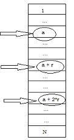
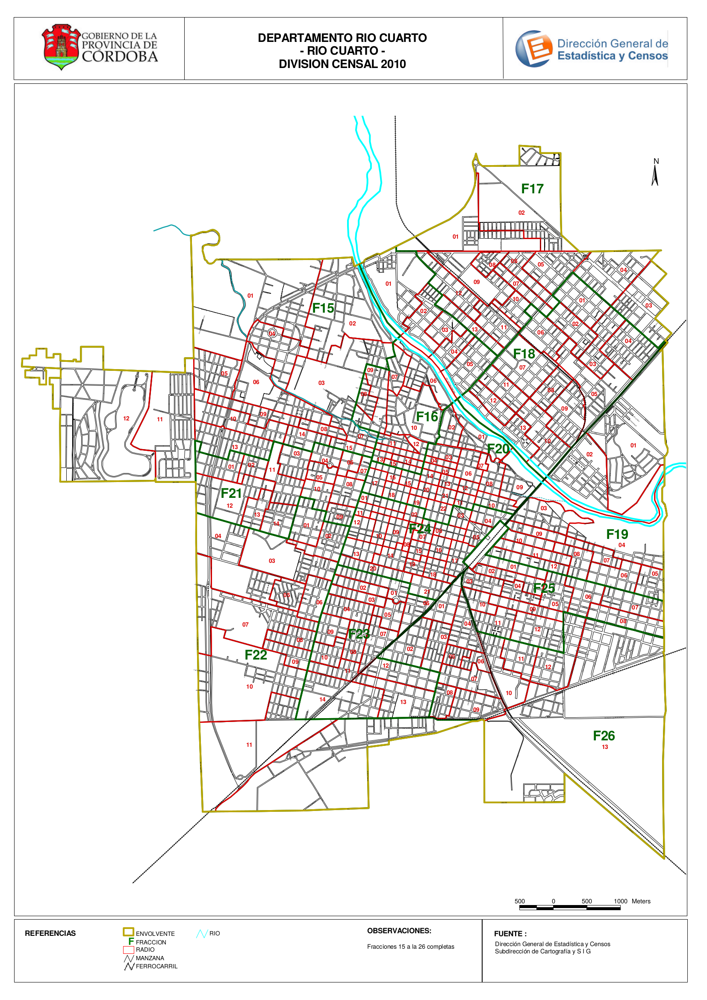
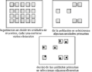

```{r message=FALSE, warning=FALSE, include=FALSE}
source("depencias.R")
```

# (PART) De la descripción a la inferencia {-}

<!-- # De la descripción a la inferencia {.unnumbered} -->

Hasta aquí hemos trabajado sobre datos que han sido observados; pudo haberse tratado de datos de una encuesta o un relevamiento que nosotros hayamos realizado o bien que nos haya provisto alguna fuente de buena calidad: conjunto de hogares encuestados por la EPH, lista de de personas afiliadas a un partido político, registros de una institución educativa, historias clínicas de un hospital, etc. Se trata de información realmente recopilada, que ha sido obtenida por observación a través de algún instrumento de recolección de datos o registrada oficialmente. Por el contrario, en los capítulos que siguen nos ocuparemos de lo que _no_ ha sido observado, haremos _inferencias_ para sacar conclusiones acerca de lo que no hemos visto. Partiremos de la información que provee una muestra y con ello generalizaremos a un conjunto mayor. Como resultado de ello buscaremos dar respuesta a preguntas como las siguientes:
  
  - Si en varias escuelas primarias se ven más dificultades en el aprendizaje de Matemática que de Lengua, ¿será esta observación válida para las  escuelas primarias?
  
  - Si un nuevo medicamento tiene efecto en un grupo de pacientes sobre quienes se experimenta, ¿bajo qué condiciones podemos saber si también tendrá efecto en la población general de pacientes?
  
  - Si en una muestra de 200 personas encuestadas el 42% dice que va a votar al partido A, ¿qué porcentaje se votos puede esperar obtener el partido A cuando sean las elecciones?
  
  - Si en un grupo conformado voluntariamente, que participa en un experimento se descubre una relación entre las expectativas de logro y el número de errores que se cometen en una prueba, ¿es suficiente con eso para afirmar que esa relación se mantiene entre quienes no participaron del experimento?, o dicho de otra manera ¿es esa una relación general entre esas variables ($expectativa\: de\: logro \rightarrow cantidad \:de \: errores$)?
  
  - Si en la muestra de la EPH se detecta un 8% de personas desocupadas, ¿Cuál es la tasa de desocupación de la población completa?
  
  - Si a una muestra de pacientes de sexo femenino con diagnóstico de psicosis se administra una droga y se encuentra que produce estabilización en los síntomas en el 90% de ellas, ¿corresponde recomendar que esa droga sea utilizada en las pacientes diagnosticadas como psicóticas?
  
  Como vemos, se trata de llevar los resultados más allá del ámbito en el que fueron obtenidos, se trata de generalizarlos. Para hacer esto será necesario usar conceptos nuevos, a los que nos dedicaremos en los capítulos de esta parte. Veremos cómo seleccionar casos para que lo que se observe en ellos tenga validez general (muestreo), luego cómo decidir en el terreno de la incertidumbre (probabilidad), y finalmente, lo que sucede con las medidas descriptivas que conocemos cuando se las pone en correspondencia con valores generales (distribuciones en el muestreo).

Sobre la relación entre la probabilidad y la inferencia, @hacking_2006 cita un pasaje de un relato indio[^part_2_1] en el que uno de los personajes estima "el número de hojas y frutos que hay en dos grandes ramas de un árbol frondoso. Aparentemente lo hace en base a una sola rama más pequeña que observa. Hay, según afirma, 2095 frutos. [$\ldots$] y cuando le preguntan ¿cómo pudo saberlo?, responde: _Yo de los dados poseo su ciencia y así en los números diestro soy_" [@hacking_2006]. De este modo aparecen relacionadas, en este antiguo texto, la capacidad para hacer una estimación de lo que no es observado con "la ciencia de los dados", desde tan temprano hay indicios de la relación entre estimación y probabilidad.

Las respuestas a las preguntas que buscan generalidad no pueden ser certeras, como en el relato mítico, sino inciertas. A diferencia de las descripciones, que se limitan a mostrar información recopilada, las inferencias solo pueden ser afirmaciones tentativas, aproximativas, probabilísticas. La diferencia entre la certeza de una descripción y la incertidumbre de una inferencia se ve con claridad al comparar las siguientes expresiones:
  
  1. "El tiempo promedio que tardaron estas 100 personas en responder al cuestionario fue de 12 minutos"
  
  2. "Cuando este cuestionario sea aplicado, se espera que quienes lo respondan tarden entre 11 y 13 minutos para hacerlo, con una certeza del 95%".

Hay dos diferencias en estos enunciados, que pertenecen a distintos niveles de proximidad a los datos. Una diferencia es que el primero ofrece un valor único: los 12 minutos que se obtuvieron al promediar los tiempos de los 100 personas que fueron observadas. Por el contrario, el segundo ofrece un intervalo: entre 11 y 13 minutos.

La segunda diferencia es que el primer enunciado _afirma_ ese valor, mientras que el segundo expresa que _hay una certeza del 95%_. Esto quiere decir que no estamos seguros que el tiempo que tardarán en responder vaya a estar realmente entre 11 y 13 minutos; hay una confianza del 95% que sea así, pero no una certeza plena. Por eso, puede ser que el tiempo sea, o bien menor que 11 minutos, o bien mayor que 13; y esto puede suceder con una probabilidad de 5%. Los enunciados del segundo tipo transmiten incertidumbre porque se refieren a casos que no han sido observados, sino inferidos. Esta incertidumbre, para la que disponemos de procedimientos que permiten cuantificarla de manera probabilística, es inherente a todo proceso de inducción, donde se requiere formular generalizaciones.

Los capítulos que vienen a continuación ofrecen las bases para ingresar a la _Estadística Inferencial_, son cuatro capítulos de articulación que fundamentan los procedimientos de inferencia.

# Obtención de la muestra  

La idea de conocer una totalidad a partir de un fragmento no es novedosa, cuando se prueba solo una cucharada de una sopa que se está preparando, se supone que lo que se concluya de ella (que está bien, que le falta sal…) será válido para toda la olla. Bethlehem (Bethlehem2009) señala que el procedimiento de usar una parte para evaluar una totalidad era usual en la industria desde muy antiguo. En alemán, la palabra "muestra" se compone de "cortar" y "probar" y aparece en la literatura en 1583 como un procedimiento usado en minería que consistía en tomar una pequeña cantidad de material para observar cuánto metal contenía. También el autor cita referencias a estos procedimientos en la industria quesera holandesa en la edad media. Por aquellos tiempos no se hablaba de muestreo, sino de "razonamiento inductivo". El establecimiento del muestreo y de sus fundamentos se data en la publicación de Anders Kiaer _The Representative Method of Statistical Surveys_ [@kiaer1897] en 1897.  

La estadística inferencial provee los procedimientos para estudiar un
subconjunto de elementos y generalizar las conclusiones obtenidas a un
total; esto se debe a que estudiar uno o varios atributos o variables en
todos los elementos, como se hace en los censos, requiere mucha
inversión, de tiempo y de dinero. Por ello es que se procede estudiando
tales variables en una muestra y se estiman por inferencia los valores
de la población. Se reducen así los costos y se disminuye el tiempo
necesario para llevar adelante las investigaciones, si se respetan los
procedimientos de la estadística inferencial el error que proviene de
trabajar sólo con una parte de la población puede ser conocido y
controlado. Pero el ahorro de tiempo y dinero no es la única utilidad del muestreo, luego veremos que hay situaciones en las que el muestreo es la única opción para construir conocimiento.

El muestreo es un conjunto de procedimientos mediante los cuales se
selecciona, de un universo determinado, llamado **población**, un
subconjunto que recibe el nombre de **muestra**, con el objetivo de llegar
al conocimiento de ciertas características de los elementos de la
población a través de la observación y generalización de esas
características presentes en los elementos de la muestra.

Este recurso no es ajeno a la vida cotidiana, por ejemplo, cuando se
considera a una persona "poco confiable" suele ser a partir de varias
veces en que esa persona mintió. Al hacerlo, se extiende ese
comportamiento (se generaliza) a situaciones que no han sido observadas,
se espera que en el futuro, esa persona actúe de modo similar. Esta
forma de generalizar tienen requisitos, ya que no es suficiente que haya
mentido una vez para caracterizarlo como poco confiable, ni que haya
mentido varias veces sobre un mismo asunto. Por el contrario, debe ser
una conducta que se haya apreciado en diversidad de situaciones, la que permita hacer un juicio sobre la persona. Por la complejidad de los procesos que involucran a personas, el conocimiento que tengamos de ellos siempre será fragmentario, solo está a nuestro alcance conocer una porción de la infinidad de situaciones humanas posibles. Esos fragmentos constituyen nuestra experiencia cotidiana y necesitamos generalizar intuitivamente para orientarnos en el mundo, para tomar decisiones de todos los días. Pero cuando queremos dar a ese conocimiento un carácter tan validado como sea posible, debemos poner bajo análisis crítico nuestras observaciones y el modo en que han sido seleccionadas. De eso se trata el muestreo; de elegir algunas observaciones que permitan generalizar parcialmente. No lograremos afirmaciones universales, pero sabremos cuáles son los límites de esas afirmaciones.

En la inferencia estadística hay dos subprocesos. El primero es la selección, que consiste en operaciones mediante las cuales se incluyen algunos elementos de la población en la muestra. El segundo es la estimación, donde, a partir de lo observado en la muestra, ofrecemos una aproximación a los valores poblacionales. A su vez, la selección de la muestra implica decidir cuáles y cuántos casos seleccionar, es decir, la calidad del proceso de selección por un lado, y la cantidad de casos a seleccionar por otro. En este capítulo nos ocupamos de la primera de estas preguntas: de qué modo seleccionar individuos para que lo que se observe de ellos pueda extrapolarse a otros individuos no observados. El número de casos que deben seleccionarse, será tema de los capítulos posteriores.

Destaquemos aquí un punto importante: la calidad de la muestra es un requisito de base. Si la muestra está correctamente elegida, los procedimientos de inferencia son válidos, de lo contrario no lo son, es una clasificación dicotómica, por sí o por no. Por el contrario, el tamaño de la muestra incide gradualmente, veremos que si las muestras son más grandes se detectan mejor las diferencias y se reduce el error de estimación. Pero esto es cierto siempre y cuando se cumpla la primera condición. Si la muestra no es adecuada, el aumento en el número de casos no mejora la estimación, e inclusive puede empeorarla.

## Población

Utilizaremos la palabra **población** o, indistintamente, **universo**,
para designar, de manera genérica, a un conjunto de unidades de análisis
que son objeto de un estudio particular. Tal conjunto puede estar
definido con precisión en el tiempo y el espacio o no, a él se referirán
los resultados obtenidos en la investigación por muestreo. Ejemplos de
estos son: pacientes con trastornos alimenticios que se atendieron en el hospital
Misericordia de la ciudad de Córdoba en el año 2019, quienes votaron en las elecciones para intendente de la ciudad de Río Cuarto en 2008, las
escuelas primarias de la provincia de Córdoba, las carreras que se
dictaban en universidades en Argentina en 2017, los países representados en la ONU.

Las unidades de análisis antes mencionadas constituyen los elementos de la población, son entidades de diferente naturaleza: personas, hogares, instituciones, ciudades, países, etc.

El tamaño que tiene una población influye en el diseño de la muestra
porque dependiendo de su tamaño, la población puede ser tratada como
finita o infinita. Se dice que es finita si el número de elementos es
limitado y se puede tener acceso a todos o casi todos los elementos,
ejemplo de ello serían quienes cursan cuarto año del colegio Manuel
Belgrano del ciclo lectivo 2020, personas admitidas como pacientes en el Hospital
de Clínicas en mayo de 2017, el conjunto de países representados en la ONU en 2015, integrantes del bloque parlamentario oficialista en un país en un año determinado.  Se habla de población infinita[^44] cuando
el número de elementos que integra la misma es elevado, por ejemplo, los vehículos que circulan por rutas nacionales en una provincia, o estudiantes de nivel inicial de la República Argentina. En ciertas ocasiones no se especifica con precisión el tiempo por lo que se habla de población hipotética, tal caso sería el de quienes cursan primer año de una carrera universitaria (sin especificar ciclo lectivo), por lo que no sólo se incluyen los elementos existentes hoy y en años anteriores, sino también los que en el futuro lo hagan. En este caso, la población no puede siquiera enumerarse. Así sucede también con estudios que plantean probar los efectos de un tipo de psicoterapia sobre pacientes con diagnóstico de esquizofrenia. En ese caso la "población" es la de las personas diagnosticadas como esquizofrénicas en la actualidad y también aquellas que lo serán en el futuro. Cuando se ensaya en una muestra una droga para la hipertensión, la generalización se espera válida para una población que no puede enumerarse: la de "las personas hipertensas", tanto las ya diagnosticadas como las que lo serán en el futuro. En casos como estos no tenemos posibilidad de delimitar la población completa, decimos que se trata de **poblaciones hipotéticas**.

Para analizar características de las unidades de análisis, puede creerse que lo mejor sería realizar un **relevamiento exhaustivo** de las mismas. Este relevamiento consistiría en observar dicha característica (una variable) en cada uno de los elementos de la población. Tal modo de recolectar la información se conoce con el nombre de **censo**.

La mayoría de los países realiza censos periódicamente (a menudo cada 10 años), que son operativos organizados desde el estado, que involucran a muchas personas, y tienen un alto presupuesto. En la práctica de la investigación social, es frecuente realizar relevamientos exhaustivos cuando las poblaciones son de pequeño tamaño y están bien delimitadas en el tiempo y en el espacio. Un ejemplo de este caso sería la situación en que se pretende conocer la opinión de quienes asistieron a un curso acerca de su docente, aquí lo más adecuado es indagar (vía encuesta) a todos.  
Sin embargo, la mayoría de las poblaciones de interés para la
investigación social tienen dimensiones considerables (asistentes a  primer grado de la escuela primaria en un país) o son inaccesibles (quienes consumen una marca de gaseosa, practicantes del budismo) o son hipotéticas (las personas diagnosticadas de depresión, votantes con ideología de derecha).

Cuando se busca dar generalidad a los resultados alcanzados a través de experimentos, la población de referencia suele ser hipotética: los
efectos de una droga sobre la depresión, la relación entre xenofobia y autoritarismo, la eficacia de una estrategia didáctica. Son casos que aspiran a generar
resultados válidos para una población hipotética, por lo que el
relevamiento completo es imposible y solo se puede observar a unos pocos
casos. El modo en que seleccionemos esos pocos casos es de máxima
importancia para que los resultados también sean válidos para los casos
que no son observados.

Además de permitir economía de recursos y de ser a menudo la única opción, el muestreo permite profundizar
los estudios que se realizan sobre los elementos de la muestra. En
efecto, en los relevamientos exhaustivos de gran magnitud, como los
censos nacionales o provinciales, no es posible profundizar con la
indagación; se deben hacer pocas preguntas a fin de
alcanzar a una gran población en un tiempo aceptable. Si se trabaja con
una muestra, se puede indagar con más detalle y profundidad, y luego,
con los procedimientos adecuados, extender los hallazgos a la población
de la cual la muestra proviene.

### Muestra

Se llama **muestra** a un subconjunto de una población que comparte sus
características en los aspectos de interés para la investigación. El
concepto de muestra va ligado al de representatividad, es decir a su
capacidad de actuar como "representante" de los elementos de la
población que no han sido seleccionados. Tal representatividad no
implica una identidad en todos los aspectos, son solamente aquellas
características que se encuentran bajo análisis las que deben ser
compartidas por la muestra y la población.  

Ejemplos:  
- Población de quienes votan en una ciudad --> muestra de votantes para consulta de opinión política.
- Población de docentes de una universidad -->  muestra de docentes para analizar la distribución de tiempo entre docencia, investigación y extensión.
- Población de hogares existentes en una ciudad --> muestra de hogares para conocer sus condiciones de vida.

Cuando se planifica la extracción de una muestra, no se conoce en
detalle a la población, por lo que no es posible saber a priori cómo
debe ser la muestra que la represente. Si se conocen algunas características de la población que estén relacionadas con el aspecto que se estudia, entonces corresponde reproducirlas en la muestra. En el primero de los ejemplos anteriores, la muestra de votantes debe respetar las proporciones de varones y mujeres que hay en la población, así como de los diferentes grupos de edad; ya que se supone que sexo y edad pueden estar relacionados con la preferencia política. Si se extrajera una muestra que solo tenga mujeres de 18 a 25 años sería una muestra sesgada, porque solo tomaría en cuenta un grupo, cuyo comportamiento electoral podría ser diferente al resto de la población. Una muestra así, sirve para estudiar el comportamiento de ese grupo particular, se puede generalizar a la población de mujeres entre 18 y 25 años, pero no a la población de votantes.

En el segundo ejemplo, si sabemos que en la población de docentes de esa universidad, hay 60% de mujeres, y se espera que las respuestas que den las mujeres sean diferentes a las de los varones, entonces debe respetarse ese porcentaje en la muestra. Pero si la proporción de quienes van a trabajar en auto es del 70%  y esto no tiene ninguna relación con la distribución de tiempo en las diferentes actividades, entonces ese porcentaje es irrelevante para el muestreo. Por otro lado, si la dedicación (simple, semiexclusiva o exclusiva) incide en el tema de investigación, entonces, las diferentes categorías de dedicación deben estar representadas en la muestra.

La posibilidad de extrapolar los resultados muestrales a la población
completa está ligada a la posibilidad de asignar probabilidades a
cada una de las muestras que podrían seleccionarse de una población. De manera que sólo será lícito utilizar los resultados muestrales como
estimación de valores poblacionales, cuando sea posible conocer a priori
cuál es la probabilidad que tiene cada individuo de la población de ser
incluido en la muestra. Las técnicas de muestreo que aseguran
este requisito se denominan **probabilísticas**. Otras
técnicas que no cumplen esta condición se llaman muestreos **no probabilísticos** y muchas veces son utilizadas para 
reducir tiempos y costos, pero los resultados obtenidos de ellas no se
pueden usar para extraer conclusiones sobre la población. Son
adecuados en estudios que no buscan generalidad de sus conclusiones sino
profundidad en el análisis de los casos observados. Sin embargo, hay
investigaciones que usan muestras no probabilísticas para dar carácter
general a los resultados que se obtienen. Cuando se hace esto, nunca hay
certeza del grado de generalidad de lo que se concluye y hasta qué punto
no se trata de características específicas de los individuos a los que
se observó, ya que no puede conocerse el margen de error de lo que se
estima. Cuando las limitaciones prácticas hacen imposible la obtención
de una muestra probabilística, hay que cuidar que la
muestra sea heterogénea y que la inclusión de casos dependa lo menos
posible de la voluntad de los participantes.

Para que sea posible asignar probabilidades a cada una de los individuos
de formar parte de la muestra, el método por el cual se seleccionan los individuos tiene que excluir la elección voluntaria. Esto implica que el
proceso de elección debe quedar estrictamente librado al azar, sin dejar
margen para que se filtre la intencionalidad, no se trata de elegir a
"cualquiera". En consecuencia, caerán en la categoría de técnicas de
muestreo no probabilísticas todos los procedimientos en que exista
alguien que pueda tomar la decisión acerca de si una unidad va a ser o
no incluida en una muestra.

||
|:--:|
| **Muestreos probabilísticos**: las muestras obtenidas por estos procedimientos permiten generalizar los resultados obtenidos en ellas a toda la población de referencia. El requisito para que una muestra sea probabilística es que sus elementos hayan sido elegidos al azar (aleatoriamente), sin que haya alguien que decida a quién incluir y a quién excluir de la muestra. |

||
|:--:|
| **Muestreos no probabilísticos**: en estas muestras no se cumple el requisito de aleatoriedad en la selección de los elementos que la componen. Los resultados no se pueden generalizar de manera probabilística más allá de los casos observados. |

## Muestreos probabilísticos

Cuando se pretende que los resultados obtenidos en una muestra puedan
ser generalizados a la población de la cual ésta proviene, se hace
necesario recurrir a muestreos de tipo probabilísticos. Se trata de
diseños que requieren más cuidado en su elaboración y de manera
concomitante son más costosos. Señalamos a continuación los tipos puros
de muestreos probabilísticos y luego veremos algunas combinaciones de
ellos que se usan a menudo.

### Muestreo irrestricto aleatorio o aleatorio simple

Se trata de una técnica que asigna igual probabilidad de pertenecer a la
muestra a todos los individuos de la población. Para su realización se
requiere contar con una lista de los elementos de la población. Este
listado es lo que se denomina el **marco de la muestra**. Dicho marco
debe cumplir con los requisitos de exhaustividad (es decir, que sea
completo) y debe cuidarse que no existan duplicaciones. La tarea de
depuración de un listado puede insumir bastante tiempo según el tamaño
de la población y el tipo de marco muestral de que se trate. Es
diferente el caso de un registro electoral, del total de historias
clínicas de un gran hospital o del listado de estudiantes de una
facultad, o de quienes componen la Cámara de Diputados de la nación).

Su realización consiste en numerar los elementos del listado y elegir
aleatoriamente una cantidad $n$ de ellos (el tamaño de la muestra). La
aleatoriedad de la elección queda garantizada por el uso de una tabla de
números aleatorios o de un generador electrónico de los mismos. Algunas
calculadoras de los teléfonos disponen de esta opción en la tecla _#RAN_ (por random, aleatorio), en Excel, el comando _=ALEATORIO()_ produce un número aleatorio entre cero y uno, en LibreOffice.Calc, _RANDBETWEEN_ lo hace entre dos valores provistos.

La exigencia de contar con el listado de los elementos de la población
es una limitación importante para este tipo de muestreo por lo que, como
se verá más adelante, a menudo se lo utiliza en combinación con otros
procedimientos. Además, puede ocurrir que los elementos elegidos en la
muestra se encuentren dispersos geográficamente de manera que resulte
muy costoso ubicar a cada uno de ellos.

Una ventaja importante es que no exige que se conozca a priori ninguna
característica de la población. Desde el punto de vista estrictamente
estadístico, resulta más fácil acotar el error de muestreo ya que las
distribuciones de probabilidad subyacentes son bien conocidas para este
tipo de muestreo.

### Muestreo sistemático

Un procedimiento alternativo al muestreo irrestricto aleatorio lo constituye el muestreo sistemático. En este caso solo se selecciona un elemento aleatoriamente y, comenzando por él, se recorre el marco de la muestra tomando los elementos siguientes a intervalos regulares. El primer paso consiste en determinar el número de veces que se incluye la muestra en la población. Ese valor es el que resulta de dividir el tamaño de la población en el tamaño de la muestra:

$$r = \frac{N}{n}$$

Donde:

$r$ representa a las veces que la población contiene a la muestra,

$N$: tamaño de la población,

$n$: tamaño de la muestra.

Luego se genera un número aleatorio entre 1 y $r$, éste constituye el
primer elemento de la muestra al que llamaremos "a". A continuación se
selecciona el elemento que se encuentra $r$ unidades más adelante en la lista (el elemento que ocupa el lugar $a+r$) y así sucesivamente hasta recorrer la lista completa, lo cual ocurrirá cuando se haya alcanzado al
enésimo y último elemento de la muestra.

El gráfico \@ref(fig:estrat) ilustra este procedimiento, las flechas a la
izquierda señalan los primeros elementos que constituyen la muestra; el
procedimiento prosigue de idéntica manera hasta la última unidad de la
muestra.
```{r estrat, fig.cap="En el muestreo estratificado se eligen muestras diferentes de cada uno de los subconjuntos definidos en la población.", fig.asp = 0.1, fig.width = 3, fig.align='center'}

```

Esta técnica tiene, en principio, los mismos requerimientos que el
muestreo irrestricto aleatorio, porque pide que se tenga el
marco de la muestra, pero se puede adaptar cuando no se lo tiene.

Su uso se justifica por dos razones. La primera es que si la lista no
presenta ninguna tendencia especial, el muestreo sistemático facilita la
extracción de la muestra, simplifica la operación, ya que la elección de
todos los números aleatoriamente puede ser lenta por la aparición de
elementos repetidos que hay que descartar. La segunda razón es que puede
ocurrir que el listado este ordenado según algún criterio (por fechas, o
por edades de los individuos, etc.), de ser así, existe el riesgo que
una muestra irrestricta aleatoria concentre los elementos elegidos en
alguna "zona" de la lista, y que así sobre-represente a los
individuos que tienen alguna característica en común. En este caso el
muestreo sistemático asegura que el marco de la muestra sea recorrido
completamente a intervalos iguales.

Cuando la población tiene un *comportamiento cíclico* el muestreo sistemático no es adecuado. Eso quiere decir que hay alguna característica que se repite cada cierta cantidad fija de casos. Un ejemplo de esto es una muestra a lo largo del
tiempo, en que algunos "momentos", tales como los inicios o los fines de mes,
algunos días de la semana, etc., se repiten periódicamente en el
año. Por ejemplo, si se trata de estimar los ingresos a un hospital y elegimos, de manera sistemática, los días que constituirán la muestra, hay que cuidar que no se repitan siempre los mismos días de la semana. Eso pasaría si el valor de r fuera 7 ó 14 ó 21, y sería un sesgo grave, porque los ingresos al hospital pueden ser muy diferentes en los diferentes días de la semana. Aunque este ejemplo va más allá de lo realista, sirve para tener en cuenta que los procedimientos sistemáticos fallan si hay alguna tendencia cíclica en el listado con que se cuenta.

Por último, hay casos en que el muestreo sistemático se usa para
prescindir del marco de la muestra. Es cuando se seleccionan casos a
partir de poblaciones en movimiento: la cola para entrar al cine es un
caso. Otro caso frecuente son las encuestas "boca de urna" en las que se
pregunta por quién votó a personas que salen del lugar de votación. Allí
no hay listado al que recurrir, es a la gente que está físicamente
presente que se encuesta. El recurso consiste en elegir a una
persona cada $r$, buscando que la muestra incluya a personas que llegaron temprano y que llegaron tarde, que votaron a la mañana y a la tarde, es decir que recorramos la "fila" alcanzando a quienes están en los primeros lugares y también a quienes están al final.

### Muestreo estratificado

El procedimiento consiste en extraer muestras de subconjuntos de la
población llamados estratos. Se espera que tales estratos sean
homogéneos en su interior con respecto a alguna característica conocida
a priori. Dicha característica se denomina criterio de estratificación.

```{r fig.cap="En el muestreo estratificado se eligen muestras diferentes de cada uno de los subconjuntos definidos en la población.", fig.asp = 0.1, fig.width = 3, fig.align='center'}

```


Supongamos que se va a estimar el consumo de bebidas alcohólicas de personas jóvenes (y supongamos también que se ha dado una definición precisa de quiénes son personas jóvenes). Como es posible que esa variable está influida por el nivel socioeconómico, se lo puede usar éste como criterio para estratificar a la población, dividiéndola
en subconjuntos en los que el nivel socioeconómico sea homogéneo. La
cantidad de estratos que puedan definirse de esta manera dependerá del
grado de precisión con que pueda medirse el nivel socioeconómico. Si
estratificamos con categorías nivel socioeconómico alto, medio y bajo,
entonces será $k=3$ y seleccionaremos jóvenes de cada uno de los tres
estratos.

La división de la población en estratos demanda cierta información acerca de ella (en este ejemplo el nivel socioeconómico). Cuanta más precisión se pretenda lograr con la
estratificación, tanto mayor será la información necesaria a priori.

A veces los estratos están dados de manera más inmediata, como sucede
con estudiantes de una carrera universitaria. Si se busca una muestra
representativa, lo más razonable es estratificar por año de cursado, de modo de incluir estudiantes de todos los años.

Este procedimiento de muestreo se utiliza cuando se busca aumentar la
precisión de la estimación sobre la población total o bien para mejorar
la precisión sobre los estratos individuales. Se obtendrá tanto mayor
ganancia en la estimación cuanto más homogéneos sean los estratos en su
interior y más diferentes (heterogéneos) sean entre ellos. En el capítulo sobre estimación por intervalo se verá por qué es así.  

Se llama afijación a la forma de distribuir la muestra sobre los estratos que se definieron, es decir, una vez decidido el tamaño de la muestra completa, la afijación indica cuántos casos seleccionar para la muestra de cada estrato. Según cuánta información se tenga a priori, se podrán hacer diferentes afijaciones. Hay tres posibilidades: igual o uniforme, proporcional y óptima. Tratamos solo las dos primeras.  

#### Afijación igual o uniforme  

Esta afijación se aplica cuando no hay ninguna información sobre los
estratos y no hay razón para ponderar alguno de ellos. El
procedimiento es simplemente extraer la misma cantidad de casos de cada
estrato. Las muestras tienen todas el mismo tamaño, que es:

$$n_{i} = \frac{n}{k}$$

Donde:

$n_{i}$ es el tamaño de las muestras extraídas de cada estrato

$n$ es el tamaño de la muestra total.

$k$ representa el número de estratos en que fue dividida la población.

En el ejemplo sobre el consumo de bebidas alcohólicas, si se trata de
una muestra de 600 personas jóvenes, con este tipo de afijación, y como son tres
estratos, extraeremos 200 casos de cada estrato.

#### Afijación proporcional  

Consiste en extraer de cada estrato una muestra cuyo tamaño resulte
proporcional al estrato del que proviene. Para ello, primero calculamos $f$
que es la proporción de población que integra la muestra:

$$f = \frac{n}{N}$$

Este cociente se llama **fracción de muestreo**, en su cálculo:

$n$ es el tamaño de la muestra total.

$N$ representa el tamaño de la población.

Una vez que conocemos la fracción de muestreo, la aplicamos a cada uno
de los estratos para obtener la cantidad de casos que deben extraerse de
cada uno:

$$n_{i} = f*N_{i}$$

Donde:

$N_{i}$: es la cantidad de casos en el estrato i-ésimo (en la población),

$n_{i}$: es la cantidad de casos que se extraerán del estrato i-ésimo,

$f$: es la fracción de muestreo que calculamos antes.

Para usar este tipo de afijación en el ejemplo del consumo de bebidas
alcohólicas necesitaríamos conocer la cantidad de personas jóvenes que hay en
cada estrato, es decir cuántos jóvenes de nivel socioeconómico alto,
medio y bajo hay en la población. Este dato usualmente es desconocido.

Veamos un ejemplo con datos reales: en el año 2008 en la carrera de Psicología de la Universidad Nacional de Córdoba, la siguiente
era la distribución de estudiantes según el año en que habían
ingresado a la carrera (considerando solo a los ingresados a partir del
año 2000).

```{r}
aux_table <- tibble::tribble(
  ~"Año de ingreso a la carrera", ~"Cantidad de estudiantes",
  2008, 1357,
  2007, 1113,
  2006, 1001,
  2005, 807,
  2004, 859,
  2003, 764,
  2002, 700,
  2001, 483,
  2000, 399,
  "total", 7483,
)
knitr::kable(aux_table, kable_outp, align = "c", booktabs = TRUE) %>%
  kableExtra::footnote(
    general_title = "Fuente: ", footnote_as_chunk = TRUE,
    general = "Anuario estadístico 2008, UNC."
  ) %>%
  kableExtra::kable_styling(latex_options = "striped")
```


Si queremos una muestra de 200 estudiantes de esa población, la fracción de muestreo será: $f = \frac{200}{7483} = 0,027$ que redondeamos a $0,03$.  
En la tabla siguiente se aplica esta fracción a cada estrato, es decir se multiplica por esa
fracción a la cantidad de casos que hay en cada estrato y se redondea al
entero más próximo. 


```{r}
aux_table <- tibble::tribble(
  ~"Año de ingreso a la carrera", ~"Cantidad de estudiantes", ~"Casos a seleccionar",
  2008, 1357, 41,
  2007, 1113, 33,
  2006, 1001, 30,
  2005, 807, 24,
  2004, 859, 26,
  2003, 764, 23,
  2002, 700, 21,
  2001, 483, 14,
  2000, 399, 12,
  "total", 7483, "",
)
knitr::kable(aux_table, format = kable_outp, booktabs = TRUE, align = "ccc") %>%
  kableExtra::kable_styling(latex_options = "striped")
```


Entonces, para la muestra debemos elegir 41 estudiantes que hayan ingresado
en 2008, luego 33 del 2007 y así sucesivamente. A esa selección la
hacemos aleatoria, ya que es posible contar con el marco de la muestra
que es el registro de estudiantes que tiene la facultad.

#### Afijación óptima  
Esta afijación tiene en cuenta la heterogeneidad de cada estrato para elegir la cantidad de casos que se extraen de cada uno, que se mide con la varianza al interior de cada estrato. Esto es porque cuando los elementos son muy homogéneos (poca varianza), pocos casos son suficientes para tener una imagen adecuada del conjunto completo; pero si son muy diferentes (heterogéneos, mucha varianza) van a ser necesarias más
observaciones para hacer estimaciones de buena calidad. Para ilustrar esta idea, supongamos que en una bolsa hay fichas de dos colores (poca dispersión) y hay que adivinar cuáles son esos colores extrayendo cuatro fichas. Dada la poca dispersión, solo dos colores, es muy probable que con cuatro fichas podamos saber cuáles son. Pero si la bolsa contiene fichas de 9 colores diferentes (heterogénea, con mucha variabilidad), con cuatro fichas nunca puede alcanzar para saber cuáles son los colores de las que están en la bolsa, harían falta bastante más de nueve extracciones para lograrlo.  

También, si se dispone de suficiente información, es posible incluir el
costo de acceso a los casos pertenecientes a diferentes estratos y
realizar una afijación que minimice el costo global del muestreo, para
más detalles sugerimos @Scheaffer2006.

Dos puntos que hay que recordar para decidir el uso del muestreo
estratificado:

- Cada criterio de estratificación demanda información sobre la
población. Esa información debe provenir de un conocimiento anterior al
muestreo.

- El muestreo estratificado implica un aumento de la calidad de la
estimación bajo la condición que los elementos que están en un mismo
estrato sean homogéneos entre sí y que los estratos sean diferentes unos de otros (heterogéneos entre sí).

### Muestreo por conglomerados

Un conglomerado es una unidad de muestreo que contiene varios elementos de la población. Para un diseño por conglomerado deben definirse unidades primarias de muestreo que contengan en su interior a las unidades elementales.

Un ejemplo clásico de este tipo de muestreo es el caso en que
hay que extraer una muestra de hogares en una ciudad. Se trata de
una situación en la que resulta imposible contar con un listado de las
unidades primarias (los hogares). Un muestreo por conglomerados permite
resolver este problema tomando como unidad de selección a los radios censales, a los que se puede acceder por medio de las Direcciones Provinciales de Estadística, la figura \@ref(fig:radios) muestra un ejemplo. Numerando estas unidades sobre un plano de la ciudad (o del
área que se vaya a relevar), se selecciona aleatoriamente un número $n$ de ellas. Una vez identificadas las unidades primarias que constituirán
la muestra (los radios censales) se relevan todos los hogares (unidades elementales) que residen en cada una de ellos.

```{r radios, fig.cap="Radios censales 2010 de la ciudad de Río Cuarto, provincia de Córdoba, Argentina.", fig.asp = 0.1, fig.width = 3, fig.align='center'}

```

Otro ejemplo es en el que necesitamos una muestra de 100 niñas y niños
de primer grado de escuelas municipales la ciudad de Córdoba. Tenemos dos problemas: el primero es que no hay una lista, por lo que no se cuenta con un marco muestral. El segundo es que, aunque lo tuviéramos, tendríamos que ir a
buscar a cada uno de los 100 estudiantes muestreados al lugar donde viven, lo que tendría un costo muy elevado. En este caso, el
conglomerado (o unidad primaria) que se elige es la escuela: en lugar de
elegir 100 niños y niñas al azar, se eligen, por ejemplo 10 escuelas al azar del listado de ellas, que sí existe. Luego, en cada escuela se eligen 10 estudiantes, también al azar, a partir del listado de primer grado, que sí está disponible en cada escuela.

Los requisitos para la efectividad de este tipo de muestreo son:

- Las unidades primarias de muestreo deben ser homogéneas entre sí, de
tal manera que cada unidad sea intercambiable con otra.

- Cada unidad primaria debe contener, en su interior, la heterogeneidad propia de la población que se releva.

Volviendo al ejemplo anterior en que las unidades primarias son los radios censales, se espera que cada radio sea similar a los vecinos en cuanto a su composición (dentro de un área geográfica dada, se trata de un supuesto válido). Además, cada radio dispondrá, en su interior, de la
variedad que sea propia del área en cuestión (en términos de su
composición: proporción de hogares particulares, comercios, escuelas, etc.).

Además del ejemplo de los radios censales y las escuelas como unidades primarias de muestreo, otros conglomerados utilizados son: empresas, al interior de las cuales se releva a su personal; organizaciones religiosas, para entrevistar fieles, etc. En general, todo conjunto que contenga en su interior a las unidades elementales, puede elegirse como conglomerado.

### Método de Kish

Es un procedimiento para seleccionar aleatoriamente un individuo entre los que residen en un hogar, que es independiente del método de muestreo utilizado para seleccionar los hogares. Solo depende de la composición del hogar y se usa para controlar el sesgo que se pueda producir si el encuestador elige quién encuestar o encuesta al que tiene más accesible, por ejemplo a quien atiende a la puerta.
Se trata de ordenar a los integrantes del hogar, asignando un número a cada uno de acuerdo a su sexo y edad. El Centro de Control de Enfermedades de Estados Unidos sugiere asignar el número 1 a la persona de mayor edad y sucesivamente a los demás miembros. En el caso que hubiese dos personas de la misma edad, se puede usar la fecha de cumpleaños para decidir cuál va primero. Luego se consulta una planilla que el encuestador lleva consigo, donde tiene impresos números aleatorios entre 1 y el total de personas que habitan en el hogar.

La planilla tiene cada fila para identificar el número de hogar al que se está encuestando, que es el número de cuestionario que se va a aplicar. Cada columna de la planilla tiene la cantidad de integrantes que hay en el hogar. Por ejemplo: si es el quinto hogar que el encuestador visita y en él viven seis personas adultas, luego de enumerarlas según edad, de acuerdo a la siguiente tabla, debe aplicar el cuestionario a la persona que tiene el número 3.

<!-- hay que darle formato a esta tabla-->

```{r}
aux_table <- tibble::tribble(
  ~"", ~"1", ~"2", ~"3", ~"4", ~"5", ~"6", ~"7", ~"8", ~"9", ~"10", ~"12",
  1, 1, 1, 3, 4, 4, 4, 4, 4, 8, 3, 7,
  2, 1, 2, 2, 4, 5, 3, 3, 7, 4, 7, 8,
  3, 1, 2, 1, 4, 5, 1, 1, 5, 6, 5, 1,
  4, 1, 1, 1, 2, 4, 2, 5, 3, 9, 6, 6,
  5, 1, 1, 3, 4, 4, "**3**", 7, 3, 5, 7, 9,
  6, 1, 1, 3, 4, 2, 2, 2, 3, 5, 4, 7,
  7, 1, 2, 2, 1, 3, 5, 3, 7, 3, 6, 10,
  8, 1, 2, 1, 1, 2, 3, 5, 2, 5, 9, 4,
)
knitr::kable(aux_table, kable_outp, align = "c", booktabs = TRUE) %>%
  kableExtra::add_header_above(c("hogar" = 1, "Cantidad de integrantes" = 11)) %>%
  kableExtra::kable_styling(latex_options = "striped")
```

Las encuestas de salud, como la Encuesta Nacional de Factores de Riesgo de Argentina, usan este método. Ver [https://www.who.int/ncds/surveillance/steps/Parte2_Seccion2.pdf](https://www.who.int/ncds/surveillance/steps/Parte2_Seccion2.pdf) y [https://www.cdc.gov/Spanish/EncuestasSR/disenoM/muestreo2.html](https://www.cdc.gov/Spanish/EncuestasSR/disenoM/muestreo2.html) para las recomendaciones de la Organización Mundial de la Salud y del Centro de Control de Enfermedades.

### Uso combinado de técnicas de muestreo

Las modalidades de muestreo presentadas pueden combinarse de varias
formas para resolver problemas particulares.

En el muestreo por conglomerados puede usarse una segunda etapa
posterior a la selección de las unidades primarias consistente en la
incorporación en la muestra sólo de algunas de las unidades elementales
contenidas en ellas. Tal elección puede realizarse por un diseño
aleatorio irrestricto o sistemático.

Aplicando este concepto al ejemplo anterior, la situación consistirá en
la elección de algunos hogares dentro de los radios seleccionadas (en
lugar de relevarlos a todos). Para lograr esta muestra, se instruye a
los encuestadores para que, recorriendo un circuito establecido de antemano, entrevisten
a un hogar cada una cantidad dada (uno cada diez por ejemplo para contar
con una muestra del 10% de los hogares del radio).

O bien, en el ejemplo de niñas y niños de primer grado, se trataría de
seleccionar a 10 en cada escuela de manera aleatoria.

```{r fig.cap="Muestreo por conglomerados en dos etapas.", fig.asp = 0.1, fig.width = 3, fig.align='center'}

```

La obtención de una muestra en una situación real implica la combinación de varios de estos procedimientos. Por ejemplo, para un sondeo de
opinión sobre la población adulta de una ciudad, el primer paso es
estratificar a la población (los adultos residentes en la ciudad), según nivel socioeconómico, porque esta es una variable que suele hacer diferencias marcadas en opinión política o en pautas de consumo. Un dato que puede tenerse sobre el nivel socioeconómico de los habitantes, es el
provisto por el censo de población, que incluye preguntas que permiten
hacer una caracterización de los hogares según esta variable. Sin
embargo, el censo se hace cada diez años y se vuelve desactualizada al
poco tiempo. Por eso suele usarse, como aproximación al nivel
socioeconómico, el área de residencia. Si bien no es absoluta, la
división puede aproximarse con barrios habitados mayoritariamente por
hogares con nivel socioeconómico más alto y más bajo. Así, en un primer
momento es posible dividir la ciudad en estratos, determinados por
grandes áreas que aproximan el nivel socioeconómico. Con los datos del censo se conoce la cantidad de habitantes de cada una de esas áreas (según lo cercano que sea el último censo, este dato será más o menos certero), por lo que el muestreo estratificado se puede hacer con afijación proporcional.

En la etapa siguiente, en lugar de seleccionar a las personas que
responderán a la encuesta, se seleccionan unidades geográficas más pequeñas que los barrios: los radios censales. Éstos son enumerados dentro de cada estrato (barrio) y se selecciona aleatoriamente la cantidad de radios que sea necesaria para el tamaño de muestra establecido. Una vez seleccionados los radios, a cada encuestador se le indica que recorra el que le tocó según un circuito establecido de antemano y que llame a la puerta en un domicilio cada $k$. En cada domicilio seleccionado se debe preguntar por las personas adultas que viven allí y se debe seleccionar aleatoriamente a una de ellas, por el método de Kish, quien será finalmente la que responda a nuestro cuestionario.

A este esquema general deben agregarse precisiones para casos
particulares, como el rechazo a responder o la falta de gente en el
domicilio seleccionado. Lo usual es volver dos veces luego de un rechazo y si se fracasa las dos veces, entonces ese domicilio se reemplaza por otro, según una regla establecida de antemano. También hay que aclarar desde el principio qué hacer en los casos de edificios, barrios cerrados, etc.

Para los sondeos de opinión, en una ciudad mediana, se estila usar 400
casos en 20 conglomerados de 20 casos cada uno.

Si se busca una muestra de pacientes internados en centros de salud de
una determinada región, se empezará por el listado de esos centros, a
los cuales es posible estratificar según su dependencia pública o
privada, según su tamaño, o según otra característica de interés. Una
vez establecida la estratificación, se seleccionan al azar una cierta
cantidad de centros de salud de cada estrato y, en cada centro será
necesario contar con el registro de pacientes internados, aquí se
introducirán las restricciones propias de cada investigación, el período
durante el cual nos interesan los datos, las patologías que fueron
motivo de la internación, etc. La selección de casos (historias clínicas
de los pacientes internados) puede realizarse de manera irrestricta
aleatoria si se dispone del listado.  

Como se ve, lo que se busca es dejar el menor margen posible para
improvisar, para evitar que la selección sea voluntaria. Esto se hace
para asegurar que la muestra sea aleatoria y por tanto probabilística.

### Muestreo de panel  
Consiste en seleccionar una muestra aleatoria por cualquiera de los métodos mencionados y posteriormente "seguir" al grupo muestreado a lo largo del tiempo. Se realizan las mismas preguntas a las mismas personas en diferentes momentos. Esto permite el seguimiento de algunas características, que pueden ser condiciones de salud, trayectorias laborales, opiniones políticas, gastos de hogares, etc. Fue desarrollado por Paul Lazarsfeld [@Lazarsfeld1938].  

## Muestreos no probabilísticos

Ya dijimos que los procedimientos que buscan estimar valores de la población a
partir de resultados muestrales sólo pueden aplicarse cuando es posible
asignar probabilidades a priori a los individuos de ser parte de la
muestra. Aun cuando no cumplen con este requisito, las técnicas de
muestreo no probabilísticas se utilizan en situaciones en que se
quiere lograr un conocimiento inicial de un problema que se
encuentra escasamente delimitado, como sucede en los estudios de tipo
exploratorio. También es frecuente su uso cuando no se busca un
conocimiento acabado sobre la población completa sino que el objetivo es
profundizar sobre algunos casos en particular (estudios de casos) a
través de entrevistas en profundidad que, por ejemplo, reconstruyan la historia de
vida de algunas personas solamente. Un tercer uso es el de aproximar los
resultados que se obtendrían con muestras probabilísticas. Como
señalamos antes, deben tenerse recaudos con la generalidad de las
conclusiones provenientes de este tipo de muestreo.

Una clasificación útil para este tipo de muestreo toma en consideración
su definición, esto es que la elección no depende del azar sino de la
voluntad de alguien. De esta manera los muestreos no probabilísticos
pueden clasificarse según quien sea el responsable de la elección en:
muestreo por cuotas, de juicio o intencional, autoelegido y accidental.
Una combinación de estos procedimientos es el muestro por bola de nieve.

### Muestreo por cuotas

En este muestreo se busca reproducir de la manera lo más ajustada
posible las características de la población en la muestra. Se llama
cuotas a las fracciones de la muestra con las distintas características.
Este muestreo se usa cuando se conocen algunas características de la
población y se busca reproducirlas en la muestra. Por ejemplo, si la
muestra contiene una proporción de varones y mujeres igual a la que hay
en la población y además respeta las proporciones de diferentes grupos
de edad, decimos que usamos cuotas de sexo y edad. A estos criterios
suele agregarse otros, según los objetivos de la investigación, por
ejemplo, en las encuestas políticas, es frecuente establecer cuotas de
acuerdo al voto en las elecciones pasadas. Los ejemplos que indicamos
antes, como reproducir la proporción de varones y mujeres entre los
docentes primarios, o de las diferentes proporciones de niveles
educativos de la población en la muestra, son casos de muestreo por
cuotas.

En la práctica, se encarga a los encuestadores una cantidad especificada
de casos a relevar, sin indicar quiénes serán esos casos ni cómo
hallarlos, esto le da el carácter de no probabilístico, pero respetando
las cantidades de casos en cada cuota. El entrevistador elige a
"cualquiera", según su comodidad o preferencias, es decir que no es
posible conocer a priori qué probabilidad tienen los elementos de la
población de caer en la muestra, pero esa elección está limitada por la
exigencia que los elementos reúnan ciertas características.

Un ejemplo es en el que se indica a un encuestador que complete 10
entrevistas a médicos que trabajen en relación de dependencia en la
ciudad de Córdoba que tengan hasta diez años de egresados; a otro, que
entreviste a 15 médicos también en relación de dependencia, pero que
tengan más de diez años de egresados. Si bien en este caso los
entrevistadores pueden elegir según su preferencia cuáles serán los
médicos a los que entrevistará, sus posibilidades de elección están
restringidas a cumplir la cuota asignada.

En las encuestas políticas, el encuestador puede verse limitado a elegir
personas de sexo femenino, de 45 años, que en las elecciones pasadas
hayan votado por el partido X (mientras que a otros encuestadores se les
encargarán otras cuotas). No hay azar, porque el encuestador elegirá a
quienes prefiera o tenga más a su alcance, pero deberá respetar las
cantidades que le fueron indicadas.

Atención: una muestra construida por cuotas, es evidentemente
representativa de los criterios correspondientes de las cuotas con los
que fue elaborada (sexo, edad, ocupación, región, $\ldots$). Pero no hay ningún
medio para saber si es representativa de aquello para lo cual fue
construida, es decir, el tema de la investigación: la opinión, los
rendimientos académicos, las actitudes, etc.

### Muestreo de juicio o intencional

En este tipo de muestreo, conocido también como "selección experta", es
el investigador quien decide qué elementos son los más adecuados para
realizar la investigación. La elección se basa en la apreciación
subjetiva del investigador sobre la representatividad de los elementos
que muestrea. En algunos ámbitos de la investigación, suele solicitarse
a expertos que seleccionen los elementos de la población que consideren
más adecuados para construir la muestra, esta selección se apoya en la
experiencia de los consultados.

Un primer uso de este tipo de muestreo es aquel en el que el interés no
se centra en la representatividad sino en la riqueza de contenidos que
pueden ofrecer algunos individuos a diferencia de otros.

Si se pretende reconstruir la historia de un asentamiento urbano
marginal, sería más adecuado elegir a personas que hayan residido en él
por largo tiempo. Se espera que los pobladores más antiguos puedan dar
mayor información acerca de la génesis y evolución que los que han
arribado recientemente. En este caso, el investigador se preocupará
primero por identificar a los residentes en el asentamiento y, a partir
de ese conocimiento, decidirá a quiénes va a incluir en la muestra.

Aquí no se pretende la generalización de los resultados, ni se busca
encontrar una historia típica en el sentido de que, en mayor o menor
grado, la mayoría de los pobladores la comparta. Lo que se busca es
profundizar el análisis a partir del testimonio de aquellos a los que
consideramos como informantes más idóneos.

### Muestreo autoelegido

Usado principalmente en razón de la reducción de costos que implica,
cuando se usa este tipo de muestreo no se selecciona a los sujetos del
estudio, sino que se solicita a las personas que participen
voluntariamente. La decisión de formar parte o no de la muestra queda en
manos de la persona invitada, por eso se llama autoelegido, es ella
quien optará por participar o no hacerlo (por falta de interés, de
tiempo, etc.).

Supongamos que se pretende estudiar el gasto por familia en actividades
de recreación y para reducir costos, en lugar de enviar encuestadores,
se envían por correo formularios anónimos a los domicilios de los
hogares seleccionados aleatoriamente. Podría suceder que aquellos
hogares que tienen gastos en recreación muy bajos contesten en
proporción menor que los que más gastan. De esta manera, las respuestas
resultantes darían un valor promedio por encima del verdadero por el
hecho que, inadvertidamente, la muestra estaría representando en mayor
medida a los hogares que tienen los más altos gastos en recreación.

En el estudio acerca del comportamiento sexual de las mujeres en Estados
Unidos, el Informe Hite (1976) basó sus conclusiones sobre el 4.5% de
mujeres que remitieron completos los cuestionarios que habían recibido
por correo. Aun cuando haya recibido de vuelta 4500 respuestas (de 100000 cuestionarios enviados), resulta riesgoso extender las
conclusiones a la población en general. Es así porque no se sabe si ese
pequeño porcentaje de mujeres que respondieron tiene conductas
semejantes o muy diferentes de aquellas que no lo hicieron.

En la actualidad ya no se envían formularios por correo postal para que
la gente responda, pero sí se hacen encuestas por mail o se invita a
expresar la opinión en encuestas en sitios web. A esas encuestas
responde una fracción muy específica de la población: la que accede a
internet, que visita esa página, que tiene tiempo e interés por
responder a las preguntas que allí se hacen. No es posible saber qué
recorte de la población es representado por esa muestra y es
completamente inválido extender los resultados a toda la población, como
lo es generalizar a los visitantes de esa página, ya que no todos tienen
el tiempo ni el interés para responder. Se trata de un dato imposible de
adjudicar a alguna población identificable, es simplemente "la opinión
de los que opinaron". Sin embargo a veces se tratan equivocadamente esos
resultados como si representaran una tendencia de opinión.

El muestreo autoelegido tiene una aplicación en el campo de experimental
cuando se trabaja con sujetos humanos. Allí, la selección de quienes
participarán de los experimentos, muy raramente puede hacerse al azar,
habitualmente resulta de la voluntad de personas que se prestan para los
estudios. Sin embargo, es un requisito indispensable en los experimentos
que se asignen las personas de manera aleatoria a los grupos
experimental y control. Es decir, que se elija aleatoriamente a cuáles
de las personas voluntarias se someterá a los tratamientos que se ponen
a prueba y a cuáles se tomará como controles. También es frecuente usar
cuotas en la asignación de sujetos a los dos grupos de modo que estén
equilibrados respecto de algunas variables, cuya determinación depende
del estudio particular. En este caso las cuotas indican qué proporción
de casos se requieren en cada categoría de las variables de interés, la
selección de los sujetos que constituirán el grupo experimental y el
grupo control se hace aleatoriamente.

### Muestreo accidental o según disponibilidad

Esta modalidad cuenta con mucha difusión, sobre todo por los
medios de comunicación, y consiste en entrevistar a los individuos que
se encuentran accidentalmente en determinado lugar. La expresión
"accidental" se presta a equívocos ya que puede confundirse con
"aleatorio". Si bien no resulta posible identificar a quien toma la
decisión por la selección de la muestra, nos encontramos en una
situación en que múltiples factores son los responsables de la misma.
Algunos de estos factores son: la voluntad de los encuestados para
prestarse o no a participar de la entrevista, la elección (consciente o
no) que el entrevistador hace entre las personas que transitan, el lugar
donde se hace la entrevista (ciertas personas difícilmente transitan por
determinadas áreas de una ciudad), etc.

El hecho que se trate de la confluencia de múltiples factores fortuitos
lo que determina cuáles serán las personas que formarán parte de la
muestra y quienes no, no puede considerarse sinónimo de aleatoriedad.
Por lo tanto, no se trata de un muestreo probabilístico dado que no es
posible asignar probabilidades a priori de pertenecer a la muestra a los
elementos de la población.

En consecuencia, las conclusiones obtenidas a través de este tipo de
relevamiento (porcentaje de opiniones a favor o en contra de un tema
cualquiera, etc.) sólo pueden ser válidas para aquellas personas que
fueron parte integrante de la muestra, no pudiendo generalizarse los
resultados más allá de la misma.

Por el contrario cuando se lo utiliza en ámbitos académicos, suelen
tomarse los resguardos mencionados antes para conseguir que sea tan
representativo como sea posible. Para hacer esto se consideran en primer
lugar las características conocidas de la población y se las reproduce
en la muestra por ejemplo la proporción de varones y mujeres, los
niveles de educación, como en el caso del muestreo por cuotas. Luego se
busca la mayor heterogeneidad posible y un número elevado de casos. Con
estos cuidados, este tipo de muestreo puede usarse, por ejemplo para la
validación de escalas psicométricas.

### Muestreo bola de nieve

Esta técnica fue publicada por primera vez por Leo Goodman (1961), de la
Universidad de Chicago. Es adecuada cuando se debe estudiar una
población infrecuente, poco representada en el total general y no hay un
marco disponible para el muestreo. Estas situaciones se presentan, por
ejemplo, si se requiere entrevistar a consumidores de drogas ilegales,
personas afectadas por alguna enfermedad rara, trabajadores inmigrantes.

Comienza con la selección de una muestra inicial o básica de individuos
y en cada entrevista se pregunta a qué otras personas de la población el
entrevistado conoce. Luego se visita a esos casos referenciados por los
primeros, repitiendo el procedimiento hasta que se completa la muestra.
Así, al entrevistar a cada miembro de un grupo, se puede pedir que
indique otros individuos en ese grupo que podrían dar información sobre
el tema; o pedirle que mencione personas que compartan sus puntos de
vista y a otras de opinión opuesta. De este modo se entrevistan nuevos
individuos y se continúa del mismo modo hasta que no se encuentran
nuevos puntos de vista. Cuando se llega a ese punto, se dice que se ha
saturado el tema. Este es un buen método para recoger los distintos
puntos de vista existentes en un grupo, o para alcanzar a persona que no
son visibles en una comunidad, pero no ofrece información sobre la
distribución de los casos en la población.

Si es posible, la primera selección se hace en forma probabilística, y
los casos siguientes quedan determinados por las referencias que se van
encontrando. Lo más frecuente es que se carezca de datos iniciales, por
lo que la primera muestra deberá seleccionarse en forma intencional o
estar constituida por voluntarios. En cualquier caso se trata de un
muestreo no probabilístico, cuya ventaja es que puede asegurar una
amplia cobertura, porque permite llegar a través de contactos
personales, a individuos que de otro modo permanecerían invisibles. El
carácter no representativo viene dado porque la probabilidad de
entrevistar a una determinada persona depende de sus conexiones:
aquellas muy conectadas tendrán más probabilidad de ser entrevistadas
que las que estén aisladas, o tengan pocos conocidos.

Este método puede mejorarse para lograr que la muestra sea
representativa de la población. Para eso se lo combina con un modelo
matemático que da peso diferente a los casos teniendo en cuenta que han
sido seleccionados de manera no aleatoria. La técnica que así resulta se
llama "Muestreo Dirigido por el Respondente" y fue desarrollado por
Douglas Heckathorn en 1997, como parte de un proyecto de investigación
sobre prevención de VIH dirigido a consumidores de drogas inyectables en
varias ciudades de Connecticut. Aplicando este procedimiento se logran
muestras no sesgadas (representativas) aun cuando se haya partido, como
generalmente sucede, con una muestra no probabilística. Para detalles
sobre el modo de usarlo, puede consultarse
[http://www.respondentdrivensampling.org/](http://www.respondentdrivensampling.org/), donde se encuentran abundantes
ejemplos de aplicación.

\pagebreak  

## Hacerlo en R

### Aleatorio simple

Una muestra aleatoria de casos de una matriz de datos, es una selección aleatoria de un número determinado de filas, manteniendo todas las columnas igual.

En primer lugar leeremos la base Encuesta Nacional de Factores de Riesgo con el nombre enfr y luego, extraeremos una submuestra aleatoria de 100 casos de ella a la que denominamos enfr100.

```{r echo=TRUE}
enfr <- read.table(
  "bases/archivostxt/ENFR2013_baseusuario.txt",
  sep = "|", header = TRUE
)

enfr100 <- enfr[sample(nrow(enfr), 100), ]
```

El corchete se refiere a los elementos de enfr que se van a seleccionar. De las filas (primer componente dentro del corchete, antes de la coma) se elige una muestra de 100 filas de enfr. Luego de la coma no se indica nada, con lo que se dejan todas las columnas de la base original. En el panel superior derecho se observa la aparición del nuevo objeto enfr100, con 100 casos y 204 variables, las mismas que tenía enfr.

### Estratificado

#### Afijación uniforme

Es necesario instalar un paquete específico y cargarlo en la sesión

```{r eval = FALSE, echo=TRUE}
install.packages("splitstackshape")
```

```{r echo=TRUE}
library("splitstackshape")
```

Luego se define la nueva matriz muestra.estrat.eph, indicando la matriz de donde se extrae la muestra, el criterio de estratificación y la cantidad de casos. Pediremos 100 casos de cada nivel de educación:

```{r echo=TRUE}
eph.3.18 <- read.csv("bases/archivostxt/usu_individual_T318.txt", sep = ";")
muestra.estrat.eph <- stratified(eph.3.18, "NIVEL_ED", 100)
```

Para ver el resultado, se puede pedir cualquier tabla, con los márgenes a fin de ver el total de casos en cada categoría:
```{r echo=TRUE}
addmargins(table(muestra.estrat.eph$CH04, muestra.estrat.eph$NIVEL_ED))
```

La muestra tiene 700 casos que son 100 de cada nivel de educación. También se puede pedir más de un criterio de estratificación, por ejemplo, educación y sexo:

```{r echo=TRUE}
muestra.estrat.eph <- stratified(eph.3.18, c("NIVEL_ED", "CH04"), 100)

addmargins(table(muestra.estrat.eph$CH04, muestra.estrat.eph$NIVEL_ED))
```

Ahora hay 1400 casos en total 100 en cada combinación de sexo y nivel de educación (2X7).

#### Afijación proporcional

En lugar de especificar la cantidad de casos, se puede indicar la proporción de casos que se requieren de cada categoría, por ejemplo para el 10%:

```{r echo=TRUE}
muestra.estrat.prop.eph <- stratified(eph.3.18, "NIVEL_ED", .1)

addmargins(
  table(muestra.estrat.prop.eph$CH04, muestra.estrat.prop.eph$NIVEL_ED)
)
```

La cantidad de casos en cada categoría depende de cuántos casos había en la matriz original.

<!-- todo: chequear que sea la nota 48 -->

[^part_2_1]: Se trata de la epopeya Mahabarata, cuya versión actual habría sido concluida hacia el año 400d.c.

[^44]: La idea de infinito no es la de la matemática, sino que se refiere a una relación pequeña entre la cantidad de casos de muestra y los de la de la población. Ver nota 48.
