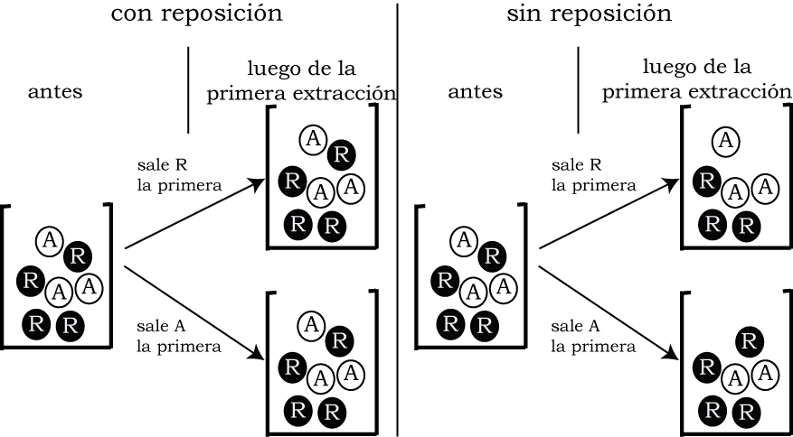
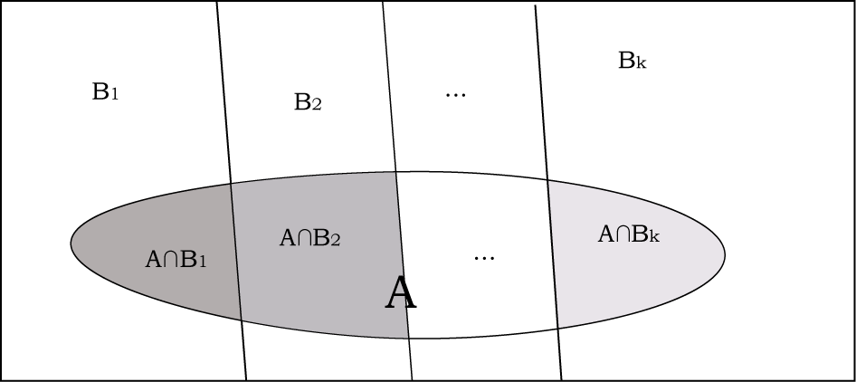
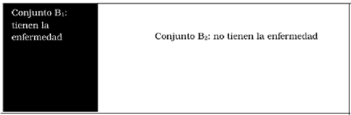
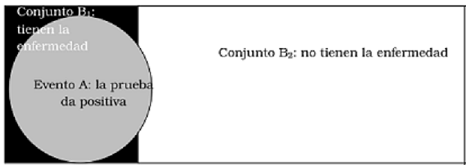

---
output:
  pdf_document: default
---

```{r message=FALSE, warning=FALSE, include=FALSE}
source("depencias.R")
```

# Probabilidad: los fundamentos

Para hacer inferencias se requiere de la probabilidad porque se trabaja con situaciones inciertas, que no se conocen y que son difíciles de
prever. Por eso se comienza aquí haciendo la distinción entre las
preguntas que pueden responderse con certeza y las que no. De las
primeras, son ejemplos: ¿cuándo será el próximo eclipse de sol? ¿A qué temperatura se funde el hierro? ¿Cuáles son las condiciones óptimas para el desarrollo de determinado vegetal?
Sobre estas preguntas tenemos, o bien una teoría que explica de manera muy completa los procesos, o bien una gran cantidad de observaciones sistematizadas, que nos permiten dar una respuesta certera.

Por el contrario, si preguntamos ¿cuál es el efecto sobre la
personalidad, de haber tenido figuras parentales autoritarias en la
niñez? ¿Qué determina que las trayectorias escolares sean disímiles entre estudiantes? ¿Cómo afecta la estabilidad económica a la intención de voto?,
solo podemos ofrecer respuestas parciales, tentativas, aproximadas. Se
trata de hechos que dependen de muchos factores a los que no conocemos
en su totalidad, por lo que el resultado es variable: algunas personas
criadas en ambientes autoritarios desarrollan una personalidad
autoritaria, otras no. En algunos casos, las trayectorias escolares exitosas se correlacionan con familias con estudios elevados, pero no siempre es así.
La estabilidad económica que favorecería una reelección, puede estar
acompañada de mucha pobreza, o de corrupción; también eventos
inesperados antes de las elecciones pueden cambiar decisiones a último
momento. Hay razones más allá de nuestro alcance que inciden en la
personalidad o en el resultado de la escuela, o la intención de voto. En
estas situaciones, cuando no tenemos toda la información que hace falta
para predecir el resultado, recurriremos a la probabilidad.

Ingresaremos al tema desde situaciones muy sencillas, desde el muy usado ejemplo de arrojar una moneda. Pero detengámonos un momento en él: si
tuviéramos toda la información necesaria para predecir la trayectoria de
la moneda en el aire (distancia desde donde se arroja, fuerza que se le
aplica, el lugar de la moneda donde se aplica esa fuerza, eventuales
corrientes de aire que puedan incidir en el desplazamiento de la moneda,
etc.), podríamos predecir con certeza el resultado. Esa información no
está disponible, el lado del que caiga la moneda está determinado por
una multiplicidad de factores, por esa razón no podemos anticipar el
resultado de la tirada. A esa ignorancia la resumimos diciendo que el
resultado de la tirada de la moneda "depende del azar" y llamamos al
experimento de tirar una moneda "experimento aleatorio".

Es un paso muy largo ir desde este ejemplo a decir que el modo en que se desarrolle la personalidad de alguien que se crió en una familia autoritaria depende del azar o que la distribución de votos en las próximas elecciones depende del azar. Sabemos que esos resultados no dependen del azar, dependen de muchos factores que ignoramos, por eso usaremos probabilidades en las disciplinas que tratan con personas humanas, por la imposibilidad de predecir con certeza los resultados. Podremos decir que alguien cuyos padres valoran la educación tiene una probabilidad mayor de tener éxito en la escuela, pero no podremos asegurar que lo tendrá. Es razonable creer que si un gobierno logró estabilidad económica, tendrá más posibilidades de ser reelegido, pero no hay certeza sobre que lo será. Los tratamientos de salud más exitosos encuentran casos en los que no logran resultados, por lo que su efectividad no puede garantizarse completamente, hay una componente impredecible en la evolución de la patología.

La probabilidad trata con la incertidumbre, con lo que hay entre la
certeza en que algo ocurrirá y la certeza en que no ocurrirá.

Los eventos que no son azarosos no tienen que ver con probabilidades: no
asignamos probabilidad a un eclipse porque hay conocimiento suficiente
como para saber cuándo ocurrirá; pero sí se asigna probabilidad a una
tormenta, porque no se conocen simultáneamente todos los factores que la
determinan. Se asignan probabilidades a hechos de cuya ocurrencia no se
tiene certeza. Con la probabilidad se cuantifica (se le asigna un
número) a la expectativa sobre el fenómeno. Intuitivamente, cuando
decimos que algo tiene "mucha probabilidad de suceder" es porque estamos
bastante seguros que sucederá. Esta es la posición conocida como "azar
epistemológico", que considera azarosos o aleatorios a los eventos cuya
ocurrencia no puede anticiparse con certeza. Desde esta posición, que un evento sea azaroso o no, depende el conocimiento que se tenga sobre sus determinantes del.

La cuantificación de la probabilidad implica que ésta se expresa con un
número; un número que está comprendido entre cero y uno. Que un evento tenga
probabilidad cero significa que es imposible que suceda. Si un evento
tiene probabilidad igual a uno, es porque hay certeza en que sucederá. El primero se llama *evento imposible*, el segundo, *evento seguro*

## Formas para asignar probabilidades

### Asignación a priori

Podemos partir de esa idea intuitiva de probabilidad, ligada a procesos
cuya ocurrencia no nos es conocida con certeza. Para evocar esta idea,
el ejemplo que más a menudo se cita es el del lanzamiento de una moneda,
¿cuál es la probabilidad de obtener "cara" al arrojar una moneda? Si la
respuesta es $1/2$ (ó $0.50$ ó $50$ y $50$), debe tenerse en cuenta que eso solo
será cierto si la moneda está equilibrada, es decir si tiene iguales
chances de salir de un lado que del otro. Si esto es cierto,
efectivamente la probabilidad de obtener cara es $1/2$ (ó $0.50$). Con
idéntica condición, la probabilidad de obtener un 5 al arrojar un dado
es $1/6$ (ó $0.17$). Esta asignación de probabilidad a los resultados de un
experimento es previa a su realización, no es necesario tirar realmente
la moneda: es suficiente con que tengamos razones para *suponer* que
está equilibrada, para poder afirmar que la probabilidad de cara es $1/2$.
Diremos en este caso que asignamos la probabilidad *a priori*, es decir,
antes de hacer el experimento.

De mismo modo sucede si el evento que nos interesa en un poco más
complejo. Por ejemplo: ¿Cuál es la probabilidad de obtener un número
mayor a cuatro si se tira un dado? Debido a que hay dos números mayores
a cuatro (el 5 y el 6), el evento tiene dos casos a su favor y hay seis
resultados posibles, por lo que la probabilidad será: $2/6$ (ó $1/3$, si se simplifica la fracción).

La expresión formal de esta asignación de probabilidades es.

$$P(A)=\frac{\#A}{\#\Omega}$$

En la que $\#A$ (que se lee "numeral de A") indica el número de maneras en que puede suceder el evento A, y $\#\Omega$ (numeral de omega) es el número
total de resultados que se pueden obtener al realizar el experimento. $\Omega$
es el conjunto de resultados posibles, es llamado *espacio muestral*. En
el caso del ejemplo, el experimento es el de tirar el dado y buscar un
número mayor que cuatro, $\#A$ es 2 porque son las formas en que puede
obtenerse un número mayor que cuatro, y $\#\Omega$ es 6, que es el número total
de resultados posibles al tirar un dado.

Con este mismo razonamiento, la probabilidad de obtener un número par es
$3/6$ ($1/2$ después de simplificar), porque hay tres números pares (2, 4 y
6) en un dado.

Vamos a un caso más complejo: tiremos ahora dos dados y tomemos en
cuenta la suma de los dos puntajes, a esa suma la llamaremos $S$. El
mínimo número que puede resultar es dos (que ambos dados salgan uno) y
el máximo es doce (ambos seis), entonces hay once resultados posibles de
esta variable (que son: $S = 2$, $S = 3$, $S = 4$, $S = 5$, $S = 6$, $S = 7$, $S = 8$,
$S = 9$, $S = 10$, $S = 11$ y $S = 12$), algunos de los cuales pueden suceder de
varias formas. Estos resultados posibles y sus formas de obtención se
ven de manera esquemática en la tabla \@ref(tab:dosdados).


```{r dosdados}
aux_table <- tibble::tribble(
  ~"", ~"", ~"**1**", ~"**2**", ~"**3**", ~"**4**", ~"**5**", ~"**6**",
  "Segundo dado", "**1**", "2", "3", "4", "5", "6", "7",
  "Segundo dado", "**2**", "3", "4", "5", "6", "7", "8",
  "Segundo dado", "**3**", "4", "5", "6", "7", "8", "9",
  "Segundo dado", "**4**", "5", "6", "7", "8", "9", "10",
  "Segundo dado", "**5**", "6", "7", "8", "9", "10", "11",
  "Segundo dado", "**6**", "7", "8", "9", "10", "11", "12",
)
knitr::kable(
  aux_table, kable_outp,
  booktabs = TRUE, align = "lccccccc", caption =
    "Resultados posibles de la suma de los puntajes de dos dados."
) %>%
  kableExtra::kable_styling(latex_options = "striped") %>%
  kableExtra::add_header_above(c(" " = 2, "Primer dado" = 6)) %>%
  kableExtra::collapse_rows(columns = 1:2, valign = "top")
```

Si bien los resultados posibles son 11, las formas en que estos pueden
darse son 36; cada una de esas formas es un evento. El evento primer
dado 5 y segundo dado 2 es diferente del evento primer dado 2 y segundo
dado 5, aunque ambos conducen al mismo resultado de la suma: $S=7$. Más precisamente,
si indicamos los eventos con pares ordenados, los eventos $(1,6)$; $(6,1)$;
$(2,5)$; $(5,2)$; $(3,4)$; $(4,3)$ son diferentes pero todos corresponden a $S=7$.

Son entonces 36 los resultados posibles del experimento, por lo que $\#\Omega$
= 36. Ahora podemos calcular probabilidades para diferentes resultados.

¿Cuál es la probabilidad que la suma sea 12?, lo que puede expresarse
como: ¿cuál es $P(S=12)$? Como esta suma solo puede lograrse si ambos
dados salen 6, hay una sola manera en que se produzca el evento que nos
interesa (suma doce), el resultado $S=12$ proviene del evento $A={(6,\:6)}$ por lo que el $\#A$ es 1 y la probabilidad es
entonces $1/36$.

$$\#\Omega=36, \: \#A = 1, \: P(S = 12)=1/36$$

En cambio, si la pregunta es por la probabilidad de obtener un tres, hay
más de una manera de llegar a ese resultado (que $S = 3$). La suma 3 puede
resultar de $2+1$ ó de $1+2$, es decir que, o bien el primer dado sale 2 y
el segundo 1 ó bien el primero sale 1 y el segundo 2. El resultado $S=3$ proviene del evento $B={(1,\:2), \:(2,\:1)}$. Hay así dos formas
posibles para el evento $S = 3$, y $\#B$ es 2, por lo que la probabilidad es
$P(S = 3) = 2/36$.

$$\#B = 2, \:P(S = 3)=2/36$$

Otro ejemplo, sea $P(S=7)$. La suma de siete puede obtenerse de muchas
formas: $1+6$, $2+5$, $3+4$, $4+3$, $5+2$ ó $6+1$. Al resultado $S=7$ le es favorable en conjunto de eventos $C={(1,\:6), \:(2,\:5),\:(3,\:4), \:(4,\:3),(5,\:2), \:(6,\:1)}$. Hay seis combinaciones que conducen a $S=7$, en consecuencia, la probabilidad es $6/36$.

$$\#C = 6, \: P(S = 7)=6/36$$

### Asignación a posteriori

Consideremos ahora una situación más cercana a la experiencia:
supongamos que de un curso se selecciona una persona al azar ¿Cuál es la probabilidad que sea mujer? Aquí el supuesto de equilibrio no es válido
a priori, en gran medida depende de la carrera de que se trata, las hay
con muchas mujeres y con pocas. Por lo tanto no podemos suponer que es
igualmente probable que resulte un varón o una mujer y no podemos
asignar probabilidad $1/2$ a cada resultado. Aunque el experimento tenga dos
resultados posibles, éstos no son igualmente probables.

En otro ejemplo, si a la persona aleatoriamente seleccionada (por ejemplo, quien ocupa el lugar `r round(runif(1, 20,110),0)` en la lista de inscriptos a un curso) se le pregunta
por el tipo de colegio del que egresó, con los resultados posibles:
"público", "privado laico", "privado religioso", el resultado que se
obtenga también depende del azar, porque así fue elegida la persona, la
respuesta será una u otra según cuál sea la persona elegida y esto
depende del azar. Sin embargo, no podemos asignar una probabilidad igual a cada resultado, no es lícito decir que sea $1/3$, ya que puede haber más estudiantes que provengan de colegios públicos que de privados y, en
consecuencia, que sea más probable encontrar quienes provengan de
esos colegios que de los otros. En este caso no podemos asignar de
antemano probabilidades a los diferentes resultados, porque no tenemos
suficientes razones para suponer *la forma en que se distribuyen* las
probabilidades. Si supiéramos el doble de quienes se inscribieron al curso que vienen de colegios públicos, podríamos decir que la persona  elegida al azar tiene
el doble de probabilidad de provenir de un colegio público que de otro
tipo.

Encontramos así una relación entre la frecuencia y la probabilidad: si
conocemos la distribución de frecuencias, tenemos razones para usarlas
para asignar probabilidades a los resultados del experimento. Así, si una muestra de asistentes a un curso tiene una distribución de frecuencias del tipo de colegio del que proviene como la de la \@ref(tab:tipocol).

```{r tipocol}
aux_table <- tibble::tribble(
  ~"", ~"f", ~"f'",
  "Público", "200", "0.66",
  "Privado laico", "20", "0.07",
  "Privado religioso", "80", "0.27",
  "Total", "300", "1.00",
)
knitr::kable(
  aux_table, kable_outp,
  booktabs = TRUE, align = "lcc", caption =
    "Distribución de frecuencias del tipo de colegio del que provienen ingresantes a la universidad"
) %>%
  kableExtra::kable_styling(latex_options = "striped") %>%
  kableExtra::footnote(
    general_title = "Fuente: ", footnote_as_chunk = TRUE,
    general = "datos ficticios para ejemplificación."
  )
```

Estamos autorizados a decir que la probabilidad que la persona elegida al azar provenga de un colegio público es $0.67$, que es su frecuencia
relativa. Esto será válido en la medida que el número de casos sea
elevado; no es posible transformar una frecuencia relativa en
probabilidad si tenemos muy pocas observaciones. Más adelante volveremos sobre esta condición.

Cuando atribuimos probabilidades de este modo se trata de probabilidades *a posteriori*, es decir con posterioridad a haber hecho la experiencia, luego de la observación de los resultados reales obtenidos. También se llama a estas probabilidades *empíricas*, para destacar que provienen de la experiencia.

¿Cuál es el significado del 1.00 que corresponde al total? Sin dudas,
como frecuencia significa el 100% de los casos, pero como probabilidad indica que el conjunto completo de alternativas (público, privado laico, privado religioso) tiene probabilidad 1.00; o bien que es un *evento seguro*. La expresión coloquial para este valor es que cuando se selecciona una persona al azar, ésta debe provenir de alguno de los tres tipos de colegio indicados, entonces el valor uno responde a la pregunta "¿cuál es la probabilidad de encontrar una persona (que haya cursado el secundario) que provenga de un colegio que sea público, privado laico o privado religioso?", la respuesta es que es seguro que de alguno de esos tipos de colegio provendrá, porque no hay otras alternativas, es decir que las categorías son exhaustivas, como debe ser en toda categorización. En este caso,

$$\mathrm{\Omega} = \{ publico,\ privado\ laico,\ privado\ religioso\}$$

Como vimos más arriba, el evento seguro es el que tiene probabilidad $1$,
por lo que la expresión formal de este enunciado es:

$P(\Omega) = 1$

Donde $\Omega$ indica el conjunto de todos los resultados posibles de un
experimento aleatorio, o el conjunto de todas las categorías de un
variable, al que hemos llamado *espacio muestral*.

### La relación entre asignación a priori y a posteriori

Volvamos al experimento simple de arrojar la moneda: si ésta se
encuentra equilibrada será entonces correcto asignar probabilidad $1/2$ (ó
$0.50$) a cada lado, lo que indica que esperamos que *a la larga* la
moneda caiga la mitad de las veces cara y la mitad cruz. Destaquemos la
expresión "a la larga", que quiere decir "si se arroja muchas veces".
Hagamos el experimento realmente, busque usted una moneda y arrójela,
digamos 10 veces. Yo lo hice y obtuve la siguiente secuencia de
resultados: CXXXCCCXXC.

Elijamos nuestro lado favorito, que sea "cara" ($C$) y calculemos la
frecuencia relativa de ese lado en cada tirada, presentamos los
resultados resumidamente en la tabla \@ref(tab:dieztiradas). Cuando solo se tiró una vez
y como el primer resultado fue $C$, la frecuencia es $1$ (una cara de un
total de un resultado). A la segunda tirada, que es $X$, se obtiene $1/2$ (una
cara de dos tiradas). A la tercera, que otra vez sale $X$, la frecuencia
de cara es $1/3$ (una cara de tres tiradas) y así sigue.

```{r dieztiradas}
aux_table <- tibble::tribble(
  ~"Tirada", ~"Cantidad de tiradas", ~"Resultado", ~"Caras acumuladas", ~'Frecuencia relativa "caras"',
  "Primera", "1", "C", "1", "1/1 = 1.00",
  "Segunda", "2", "X", "1", "1/2 = 0.50",
  "Tercera", "3", "X", "1", "1/3 = 0.33",
  "Cuarta", "4", "X", "1", "1/4 = 0.25",
  "Quinta", "5", "C", "2", "2/5 = 0.40",
  "Sexta", "6", "C", "3", "3/6 = 0.50",
  "Séptima", "7", "C", "4", "4/7 = 0.57",
  "Octava", "8", "X", "4", "4/8 = 0.50",
  "Novena", "9", "X", "4", "4/9 = 0.44",
  "Décima", "10", "C", "5", "5/10 = 0.50",
)
kableExtra::kable_styling(
  knitr::kable(
    aux_table, kable_outp,
    booktabs = TRUE, align = "lcccc", caption =
      "Frecuencias relativas correspondientes a una secuencia de diez lanzamientos de una moneda."
  ),
  latex_options = "striped"
)
```

En la distribución vemos que la frecuencia relativa de $C$ toma valores
alrededor de $0.50$; al principio más lejos y luego "se va acercando" a
ese número cuando hemos hecho más tiradas. La representación gráfica de
este proceso es la figura \@ref(fig:tiramoneda), a la que se agregó una línea que muestra el valor $0.50$ que es el que habíamos calculado antes de hacer el experimento.


```{r tiramoneda, fig.cap="Convergencia de la probabilidad empírica a la teórica para una moneda equilibrada. 10 tiradas"}
para.moneda <- data.frame(
  c(1, 0.5, 0.33, 0.25, 0.4, 0.5, 0.57, 0.5, 0.44, 0.5), c(1:10)
)
names(para.moneda) <- c("probs", "tirada")
ggplot(para.moneda) +
  geom_point(aes(tirada, probs)) +
  geom_segment(aes(x = 0, y = .5, xend = 10, yend = .5)) +
  geom_line(aes(tirada, probs)) +
  xlab("número de tirada") +
  ylab("probabilidad de cara") +
  theme_tufte()
```


Se aprecia que la sucesión de frecuencias relativas es tal que éstas se van acercando a la probabilidad predicha.  
Si la moneda se hubiese tirado una cantidad mayor de veces (cien veces, por ejemplo), el gráfico tendría una forma como la figura \@ref(fig:tiracien).  

```{r tiracien, fig.cap="Convergencia de la probabilidad empírica a la teórica para una moneda equilibrada. 100 tiradas"}
tirada <- c(1:100)
set.seed(3)
caras <- rbinom(100, 1, .5)
cien.tiradas <- data.frame(tirada, caras)
cien.tiradas$total.caras <- cumsum(cien.tiradas$caras)
cien.tiradas$probs <- cien.tiradas$total.caras / cien.tiradas$tirada
ggplot(cien.tiradas) +
  geom_point(aes(tirada, probs)) +
  geom_segment(aes(x = 0, y = .5, xend = 100, yend = .5)) +
  geom_line(aes(tirada, probs)) +
  xlab("número de tirada") +
  ylab("probabilidad de cara") +
  theme_tufte()
```

Resulta entonces que, si se cumple que la moneda está equilibrada,
entonces las frecuencias relativas de un resultado se irán acercando a la probabilidad asignada. Dicho de otra manera, la probabilidad a
posteriori converge a la probabilidad a priori. Mucha atención a esto: solo en el caso que el supuesto inicial se cumpla, es decir que la moneda se comporte como esperamos (cayendo parejo de un lado y del
otro), que nuestra idealización de idénticas chances a cada lado, se refleje en la moneda observada.

Si por el contrario, la moneda estuviese desequilibrada -y que fuera más frecuente el lado $X$ que el lado $C$-, podríamos obtener, en $500$ tiradas, por ejemplo, $350$ veces $X$ y la probabilidad a posteriori será entonces $P(C) = 350/500 = 0.70$ y no $0.50$ como sería si estuviera equilibrada. En
ese caso el supuesto inicial de moneda equilibrada es falso,
decimos que "el modelo no se sostiene", luego veremos con más
detalle el significado de esta expresión.

## Operando con probabilidades

Cualquiera sea el modo a través del que se hayan asignado probabilidades
a eventos, las probabilidades cumplen con ciertas propiedades generales,
que trataremos a continuación y que permiten hacer operaciones con
ellas.

En primer lugar, y con carácter de axiomas, las siguientes
características son condición para que un número $P(A)$ pueda ser
considerado una probabilidad:

- La probabilidad es un número comprendido entre cero y uno: $$0 \leq P(A) \leq 1$$

- La probabilidad del conjunto completo de resultados posibles (del espacio muestral) es uno: $P(\Omega) = 1$

- La probabilidad de la unión de dos eventos que se excluyen mutuamente es la suma de las probabilidades de cada uno de ellos: $P(A \cup B) = P(A) + P(B)$

La definición frecuencial (a posteriori), así como todos los modelos de
asignación de probabilidad a priori que mencionamos cumplen con estas
condiciones.

### Con probabilidades frecuenciales

Sea una distribución conjunta de dos variables con asignación de
probabilidades frecuenciales, es decir empíricas. Se trata de la
relación entre la ciudad donde se vive y la intención de voto. Las
categorías de la ciudad son: Córdoba, Rosario y Mendoza. Los partidos
políticos son cuatro y los llamaremos Q, R, S y T. Supongamos que las
de la tabla \@ref(tab:provparti) son las frecuencias observadas luego de recoger los datos.


```{r provparti}
aux_table <- tibble::tribble(
  ~"", ~"Q", ~"R", ~"S", ~"T", ~"",
  "Córdoba", "200", "300", "100", "50", "650",
  "Rosario", "100", "150", "60", "70", "380",
  "Mendoza", "50", "150", "100", "200", "500",
  "Total", "350", "600", "260", "320", "1530",
)
knitr::kable(
  aux_table, kable_outp,
  booktabs = TRUE, align = "lccccc", caption =
    "Distribución del partido al que declara que va a votar y la ciudad de residencia."
) %>%
  kableExtra::kable_styling(latex_options = "striped") %>%
  kableExtra::add_header_above(c("Ciudad" = 1, "Partido al que dice que votará" = 4, "Total" = 1))
```

Calculemos algunas probabilidades a partir de las frecuencias relativas.

#### Probabilidades marginales

Cuando se consideran las categorías de una variable sin tener en cuenta
a la otra, usamos las frecuencias de los márgenes de la tabla, esas son
las llamadas **frecuencias marginales**. La frecuencia marginal de "vivir en Córdoba" es  $650/1530$. En este enfoque frecuencial, la probabilidad que una persona
elegida al azar viva en Córdoba (sin importar a qué partido piense
votar) es $650/1530$. De manera equivalente, la probabilidad de encontrar
por azar a alguien que piense votar al partido $S$ (cualquiera sea su
ciudad) es $260/1530$. Las escribimos simplemente $P(Cordoba)$ y $P(S)$
respectivamente. $P(Cordoba)$ usa el total de la primera *fila* y el total general de la tabla \@ref(tab:provparti), mientras que $P(S)$ pone en relación la tercera *columna* de \@ref(tab:provparti) y el total general.  
$$P(S)=\frac{260}{1530}$$
$$P(Cordoba)=\frac{650}{1530}$$

#### Probabilidades conjuntas o de la intersección de eventos

Las usamos para hallar la probabilidad de ocurrencia simultánea de una
categoría de cada variable. Por ejemplo ¿Cuál es la probabilidad de
encontrar por azar a alguien que viva en Rosario **y** que piense
votar al partido R? La cantidad de individuos que cumplen
**simultáneamente** las dos condiciones es de 150, por lo que la
probabilidad se calcula como $150/1530$. Hemos destacado la conjunción
"y", junto al "simultáneamente" porque en este caso se piden dos
condiciones juntas. Por eso estas son llamadas **probabilidades conjuntas**.

En teoría de conjuntos, corresponden a la intersección de dos conjuntos, que se indica con el signo $\cap$, por lo que el evento "vivir en Rosario" y al mismo tiempo "decir que se va a votar a R", se escribe "$Rosario \cap R$".

Esa intersección es el cruce de la segunda fila y la segunda columna de la tabla \@ref(tab:provparti) y la probabilidad es el número de casos en la celda del cruce dividido el total general.

$$P(Rosario \cap R)=\frac{150}{1530}$$
¿Qué sucede si aplicamos esta operación a dos eventos que corresponden a
dos categorías de la misma variable?, por ejemplo, ¿cuál es la
probabilidad de encontrar a alguien que diga que votará a Q y a R? Esos
eventos no pueden suceder juntos porque son incompatibles: solo uno de
los dos puede suceder. La intersección entre ellos es imposible, por lo
que la probabilidad es cero. Es el mismo caso de buscar a alguien que
viva en Córdoba y también en Mendoza, es claro que no hay intersección
entre estos conjuntos; dicho de otra forma, la intersección es el
conjunto vacío. A estos eventos que no pueden suceder simultáneamente,
los llamaremos mutuamente excluyentes. Como recordamos, esa es la
condición que deben cumplir las categorías de cualquier variable.

Si dos eventos son mutuamente excluyentes entonces, su probabilidad
conjunta es cero. En lenguaje de conjuntos:

$$si\ A \cap B = \varnothing\ entonces\ P(A \cap B) = 0$$

#### Probabilidad de la unión de eventos mutuamente excluyentes

Estas probabilidades sirven para analizar la ocurrencia de uno u otro de
dos eventos, cuando éstos no pueden suceder simultáneamente. Por
ejemplo: ¿qué probabilidad hay de encontrar a alguien que piense votar a Q **o** a R? Esto quiere decir "una cosa o la otra", se trata de una disyunción, es decir, la unión de los dos eventos. En el lenguaje de la teoría de conjuntos la unión de dos conjuntos se indica con el símbolo $\cup$; por lo que decir "A o B" equivale a decir "$A\cup B$".

El total de quienes cumplen con la condición de votar a Q o a R (sin
tener en cuenta la ciudad) es de $950 (350 + 600)$, por lo que la
probabilidad es de $950/1530$. Se trata de la suma de los totales de las dos primeras columnas de la tabla \@ref(tab:provparti) dividido el total general.  

De modo equivalente, la probabilidad de seleccionar al azar a alguien
que viva en Córdoba o en Rosario es de $1030/1530$, donde hemos sumado las dos primeras filas de la tabla \@ref(tab:provparti), correspondientes a las categorías Córdoba y Rosario.

En estas probabilidades, admitimos que se cumpla cualquiera de las dos
condiciones (Q **o** R en el primer caso, Córdoba **o** Rosario en el
segundo). En los dos ejemplos se trata de eventos que no pueden suceder
simultáneamente, por ser categorías de una de las variables, son
mutuamente excluyentes, por lo que la probabilidad de su ocurrencia
conjunta es cero. En estos casos, la probabilidad de la unión es
simplemente la suma de las probabilidades de los dos eventos: $P(A \cup B) = P(A) + P(B)$

Aplicada a los ejemplos:

$$P(Q \cup R) = P(Q) + P(R)=\frac{350}{1530}+\frac{600}{1530}=\frac{350+600}{1530}$$

$$P(Cordoba \cup Rosario) = P(Cordoba) + P(Rosario)=\frac{650}{1530}+\frac{380}{1530}=\frac{650+380}{1530}$$

#### Probabilidad de la unión de eventos no mutuamente excluyentes

Vamos ahora a incluir en la operación de unión de eventos, aquellos que
no se excluyan mutuamente. Para el ejemplo con el que venimos
trabajando, cambiamos las condiciones de esta unión de eventos: Ahora
preguntamos: ¿Cuál es la probabilidad de hallar por azar a alguien que
viva en Córdoba **o** que piense votar al partido T? Otra vez es una
disyunción, por lo que admitimos cualquiera de los dos eventos: que viva
en Córdoba (sin importar a quién piense votar) **o** que piense votar a
T (cualquiera sea su ciudad). Si intentamos el mismo procedimiento que
en el caso anterior, deberíamos sumar las probabilidades: $650/1530 + 320/1530$, con solo observar la tabla \@ref(tab:provparti), vemos que los $50$ individuos que
cumplen las dos condiciones (viven en Córdoba y votarán a T), han sido
contados dos veces: en los $650$ del marginal de la fila Córdoba y en los 320 del marginal de la columna T; por lo que deben
descontarse una vez del resultado haciendo $650/1530 + 320/1530 - 50/1530$.

¿Por qué sucedió esto?, porque los eventos cuya unión estamos
considerando pueden ocurrir simultáneamente, tienen intersección y es
esa intersección justamente la que aparece en el cálculo de las dos
probabilidades que se suman. Esta última expresión tiene forma:

$$P(A \cup B) = P(A) + P(B) - P(A \cap B)$$

Y es la expresión más general para el cálculo de la probabilidad de la
unión de conjuntos. Esta fórmula toma la forma simplificada que usamos
antes $P(A \cup B) = P(A) + P(B)$ solo cuando A y B son disjuntos, es decir cuando se excluyen mutuamente
como lo indica el tercer axioma.

Aplicada al ejemplo, el cálculo es:

$$P(Cordoba \cup T) = P(Cordoba) + P(T) - P(Cordoba \cap T) =$$
$$\frac{650}{1530} + \frac{320}{1530} - \frac{50}{1350} = \frac{920}{1530} = 0.60$$

#### Probabilidad condicional

Este es el caso en que necesitamos calcular una probabilidad bajo una
condición, que restringe el conjunto de resultado posibles. Se aplica
cuando se cuenta con información adicional antes de calcular una
probabilidad, por ejemplo que se sepa que la persona seleccionada al
azar vive en Córdoba. ¿Cuál es la probabilidad que piense votar al
partido S? El planteo es tal que preguntamos cuál es la probabilidad de
votar a S si se sabe que vive en Córdoba. Vivir en Córdoba es la
condición y se escribe: $S/Cordoba$, y lo leemos "S, dado que vive en
Córdoba".

En este caso, el dato "vive en Córdoba" es una restricción sobre el
conjunto total, ya no debemos tener en cuenta a las $1530$ personas del
total, sino solo a los que cumplen con la condición de vivir en Córdoba.
Entonces ahora, el nuevo total es de solo $650$ personas, los que viven en
Córdoba. De ellos, $100$ piensan votar a S, por 
lo que la probabilidad que
nos interesa es $100/650$.
$$P(S/Cordoba) = \frac{100}{650} = 0.15$$
En la tabla \@ref(tab:provparti) el universo queda restringido, luego de la condición. En lugar de los $1530$ casos, el total que cumple con "vive en Córdoba" es $650$. Solo interesa la primera fila de la tabla.  


Razonando del mismo modo, si se sabe que la persona elegida piensa votar
a R, el total queda restringido a $600$ casos (los que cumplen con esa
condición). Si nos interesa la probabilidad que viva en Mendoza, bajo
esa restricción resulta: $150/600$.

Entonces:
$P(Mendoza/R) = \frac{150}{600} = 0.25$

En la tabla \@ref(tab:provparti) la restricción que aparece es sobre las columnas. En lugar de los $1530$ casos, el total que cumple con "vota a R" es $600$. Solo interesa la segunda columna de la tabla.

En estos dos últimos ejemplos, el cambio respecto de todos los
anteriores es que el denominador de las probabilidades ya no es $1530$
sino un número menor, que resulta de haber impuesto previamente una
condición: que viva en Córdoba en el primer caso y que haya votado a R
en el segundo. Como se ve, estas probabilidades condicionales no son
conmutativas:

- Se selecciona una persona al azar entre quienes votarán a R, ¿Cuál es la probabilidad que viva en Mendoza? Se escribe $P(Mendoza/R)$ y vale $150/600$.

- Se selecciona una persona al azar entre los que viven en Mendoza, ¿Cuál es la probabilidad que vaya a votar a R? Se escribe $P(R/Mendoza)$ y vale $150/500$.

#### Relación entre probabilidades condicionales y conjuntas

Compararemos ahora la probabilidad de hallar alguien que vaya a votar a Q y que viva en Córdoba ($P(Q \cap Córdoba)$) con la probabilidad que vaya a votarlo si se sabe que vive en Córdoba ($P(Q/Córdoba)$).

$$P(Q \cap Cordoba) = \frac{200}{1530}$$

$$P(Q/Cordoba) = \frac{200}{650}$$

Si dividimos entre sí estas dos expresiones obtenemos:

$$\frac{P(Q \cap Cordoba)}{P(Q/Cordoba)} = \frac{\frac{200}{1530}}{\frac{200}{650}} = \frac{650}{1530}$$

El último cociente es la probabilidad marginal correspondiente a
Córdoba, por lo que:

$$\frac{P(Q \cap Cordoba)}{P(Q/Cordoba)} = P(Cordoba)$$

Esta expresión, que es general, nos ofrece una relación muy útil entre las probabilidades condicional y conjunta. Una forma más frecuente de escribir esta relación, para dos eventos cualesquiera $A$ y $B$ es:

$$P(A \cap B) = P(B)*P(A/B)$$

Si escribimos la intersección en orden inverso[^45], tenemos:

$$P(B \cap A) = P(A)*P(B/A)$$

Como son iguales los primeros miembros de las dos expresiones anteriores, igualamos los segundos miembros, para obtener:

$$P(B)*P(A/B) = P(A)*P(B/A)$$

Esta igualdad relaciona las probabilidades condicionales en un orden o
en el otro. Si se conocen las probabilidades de $A$ y de $B$, esa igualdad nos permite pasar de $P(A/B)$ a $P(B/A)$, veremos más adelante que se trata de un resultado muy útil.

### Con probabilidades a priori

Veamos el uso de estas operaciones con probabilidades usando ahora un
experimento en el que asignamos probabilidades a priori. Sea una caja
que contiene 4 fichas rojas y 3 azules. ¿Cuál es la probabilidad de
sacar una roja en la primera extracción? Como $\#Roja$ es 4 y $\#\Omega$ es 7, la probabilidad vale $4/7$. De mismo modo, la probabilidad de una azul es $3/7$.

Hagamos ahora dos extracciones sucesivas de modo tal que no reponemos la primera ficha antes de sacar la segunda, este tipo de extracción se llama *sin reposición*. Saco la primera, veo su color y saco la segunda sin devolver la primera. ¿Cuál es la probabilidad que salga la segunda azul si la primera fue roja? En este caso, a la segunda extracción hay 3
azules sobre un total de 6 fichas (porque ya sacamos una), entonces $\#Azul = 3$ y $\#\Omega = 6$ y la probabilidad es $P(A_{2}/R_{1}) = 3/6$ (ó $1/2$).

Otro caso: ¿Cuál es la probabilidad que la segunda sea azul si la
primera fue azul? Ahora quedan 2 azules, porque ya sacamos una, sobre un total de 6 fichas, por lo que la probabilidad es $P(A_{2}/A_{1}) = 2/6$ (ó $1/3$). Sucede entonces que la probabilidad de obtener una ficha azul a la segunda extracción *depende* de lo que haya resultado en la primera.

Otro problema: ¿cuál es la probabilidad de sacar dos rojas en dos
extracciones sin reposición? Lo escribimos: $P(R_{1}R_{2}) = P(R_{1}\cap R_{2})$

Y aplicamos la relación que encontramos al final del apartado anterior:
$$P(R_{1}\cap R_{2}) = P(R_{1})*P(R_{2}/R_{1})=4/7*3/6=2/7$$

Que es la probabilidad que salga roja la primera multiplicada por la
probabilidad que salga roja la segunda condicionada a que ya haya salido roja la primera (es decir, con el espacio muestral restringido) .

Del mismo modo, la probabilidad de sacar dos azules es:

$$P(A_{1}\cap A_{2}) = P(A_{1})*P(A_{2}/A_{1})=3/7*2/6=1/7$$

Nuevamente, es la probabilidad de azul la primera por la probabilidad de azul la segunda condicionada a que ya haya salido azul la primera.

Ahora preguntamos por la probabilidad de obtener una azul y una roja, en cualquier orden. Esto equivale a pedir azul la primera y roja la segunda o bien roja la primera y azul la segunda, por lo que:

$$P((A_{1}\cap R_{2})\cup(R_{1}\cap A_{2}))=P(A_{1} \cap R_{2})+P(R_{1} \cap A_{2}) =$$
$$P(A_{1})*P(R_{2}/A_{1})+P(R_{1})*P(A_{2}/R_{1})$$

Si cambiamos el experimento reponiendo ahora la primera ficha antes de extraer la segunda, llamamos al experimento *extracción con reposición*. De este modo se restaura el espacio muestral al estado inicial. La figura \@ref(fig:dossacadas) muestra el efecto de la reposición o no de la primera ficha sobre el conjunto de resultados posibles de la segunda extracción. Si se repone, la probabilidad de la segunda extracción será la misma que la de la primera para cualquier evento. Por ejemplo, $P(A_{2}/A_{1})$ es $3/7$, como lo es también $P(A_{2}/R_{1})$. Que la primera haya sido azul o roja no afecta la probabilidad de la segunda extracción, ya que se la repone: la segunda extracción no depende de la primera. En el caso de extracciones con reposición -en que la segunda extracción no se ve afectada por el resultado que haya dado la primera-, decimos que los eventos son **independientes** y resulta que, para dos eventos independientes $A$ y $B$:

$$P(A/B) = P(A)$$

Lo cual, dicho en lenguaje cotidiano nos indica que, para la ocurrencia del evento $A$, no importa que haya sucedido o no el evento $B$. Debido a esto, en nuestro ejemplo, la probabilidad de obtener dos rojas es:

$$P(R_{1} \cap R_{2})=P(R_{1})*P(R_{2})$$

```{r dossacadas, fig.cap="Efectos de extraer una ficha sin reponerla o reponiéndola, sobre las condiciones que quedan para la segunda extracción.", fig.asp = 0.1, fig.width = 3, fig.align='center'}

```

Este concepto de independencia entre eventos en muy valioso para
analizar uno de nuestros más importantes problemas: las relaciones entre variables. Veamos su aplicación a la tabla \@ref(tab:provparti). Si la intención de voto fuera independiente de la ciudad donde se vive (quiere decir si votaran del mismo modo personas de las diferentes ciudades) la probabilidad de encontrar una persona que vote a R si vive en Córdoba sería simplemente la probabilidad de votar a R, es decir $P(R/Cordoba)=P(R)$ y del mismo modo para los demás eventos. En nuestro ejemplo no se obtiene esa igualdad, ya que:

$P(R/Cordoba)=300/650=0.46$, mientras que: $P(R)=600/1530=0.39$

Por lo que estos eventos no son independientes en sentido estadístico.

Cuando se trataron las relaciones entre variables, se discutió este
problema, al calcular las frecuencias que se esperarían si las variables fueran independientes. Se concluyó que dos variables son independientes si la frecuencia relativa de cada celda resulta del producto de las frecuencias relativas marginales que le corresponden. En el lenguaje de las probabilidades, encontramos ahora el mismo resultado y lo expresamos diciendo que si los eventos A y B son independientes, entonces $$P(A\cap B)=P(A)*P(B)$$

## El teorema de Bayes

La aplicación que presentamos en este último apartado usa probabilidades
condicionales para deducir la probabilidad que tiene un evento observado
de provenir de diferentes eventos previos. Por esta razón se denomina
también "teorema de las causas"[^46]. Nos interesa porque es un
resultado que permite "aprender de la experiencia", lo que quiere decir
que da los medios para usar la información disponible para modificar las
probabilidades de determinados eventos. Tiene mucho valor en Ciencias de
la Salud, porque es frecuente conocer cuál es la probabilidad a priori
que una persona que consulta tenga determinada patología (es la prevalencia de la enfermedad sobre la población general) pero, una vez que se dispone de indicadores clínicos, esa
probabilidad cambia. De manera equivalente, si se conoce cuál es la
probabilidad de terminar una carrera universitaria (la proporción de quienes egresan), esa
probabilidad se ajusta a los casos particulares, una vez que se cuenta con información adicional, como el número de materias ya aprobadas.

De manera general: sean $B_{1}, B_{2}, \ldots, B_{k}$ eventos mutuamente excluyentes que completan el espacio muestral (es decir que la unión de todos esos eventos es $\Omega$), y un evento $A$ puede suceder en intersección con cualquiera de ellos (es decir que $A$ puede suceder en intersección con $B_{1}$, o con $B_{2}$, etc.), como muestra la figura \@ref(fig:espaciobayes):

```{r espaciobayes, fig.cap="Esquema de un evento A que puede suceder en intersección con varios eventos $B_{i}$ independientes entre sí", fig.asp = 0.1, fig.width = 3, fig.align='center'}

```

Por ejemplo, los eventos $B$ pueden ser los diferentes tipos de escuela
secundaria de la que provienen estudiantes de una carrera universitaria y el evento $A$ es "terminar la carrera". Hay quienes terminan la carrera (quienes están dentro de la elipse) y quienes no lo hacen (dentro del rectángulo pero fuera de la elipse), y quienes pertenecen a ambos grupos pueden provenir de escuelas de
cualquiera de los tipos $B_{1}, B_{2}$ etc. La primera de las
intersecciones (la grisada más oscura) representa a quienes cumplen simultáneamente $A$ (haber terminado la carrera) y $B_{1}$ (provenir de una escuela del tipo que ese grupo define).

Otro ejemplo es que los eventos $B$ sean solo dos:

- $B_{1}$: tener una determinada enfermedad

- $B_{2}$: no tener esa enfermedad
Como se ve en la figura \@ref(fig:tienenotiene)  

```{r tienenotiene, fig.cap="Solo dos eventos definen el espacio muestral", fig.asp = 0.1, fig.width = 3, fig.align='center'}

```

Si el evento $A$ es "una prueba diagnóstica dio positiva", aparecen intersecciones entre el resultado de la prueba y la condición de las personas a quienes se aplica (figura \@ref(fig:intersposit). La primera es la zona dentro del círculo a la izquierda: ($A \cap B_{1}$), son los casos correctamente diagnosticados. Los que quedan fuera del círculo a la izquierda representa casos en los que la prueba no indicó la enfermedad aun cuando se trataba de personas enfermas, se llaman "falsos negativos". A la derecha, la pequeña parte de círculo es ($A \cap B_{2}$) e indica los casos en que la prueba dio positiva cuando fue aplicada a personas que no tenían la enfermedad, se llaman "falsos positivos". Por último, la parte blanca del rectángulo a la derecha son los casos en que dio correctamente negativa en personas que no tenían la enfermedad.

```{r intersposit, fig.cap="Intersecciones del evento A con $B_1$ y $B_2$", fig.asp = 0.1, fig.width = 3, fig.align='center'}

```

Con esta notación y esa relación entre los eventos $B_{1}, B_{2}, \ldots, B_{k}$ y $A$, el teorema de Bayes se expresa de la siguiente manera:

$$P(B_{j}/A) = \frac{P(B_{j})*P(A/B_{j})}{\sum_{i = 1}^{k}{P(B_{i})*P(A/B_{i})}}$$

El valor de este teorema es que permite pasar de la probabilidad simple de uno de los eventos $B$ (en general, del que llamamos $B_{j}$), a la probabilidad "corregida", que usa la información que aporta el
evento $A$. Si se conoce inicialmente la probabilidad del evento $B_{j}$, el teorema permite calcular la probabilidad de $B_{j}$, luego de haber agregado la condición $A$.

Veamos un ejemplo sencillo: se dispone de dos frascos ($F_1$ y $F_2$), el primero de
ellos tiene 20 fichas azules y 10 rojas, el segundo contiene 20 azules y 20 rojas. Se elige un frasco al azar y luego se extrae de él una ficha, que resulta ser azul, nos preguntamos por la probabilidad que la ficha provenga del primer frasco. En ausencia de toda información, los dos frascos son igualmente probables, por lo que la probabilidad de cada uno es $0.50$: $P(F1)=0.50$ y $P(F2)=0.50$. Si la ficha fue extraída del primer frasco, la probabilidad de que sea azul es: $P(A/F1)=20/30=0.67$, mientras que si proviene del segundo frasco es $P(A/F2)=20/40=0.50$. La pregunta es por $P(F1/A)$, debemos invertir una probabilidad condicional, por lo que usaremos el teorema de Bayes:

$$P(F_{1}/A) = \frac{P(A/F_{1})*P(F_{1})}{P(A/F_{1})*P(F_{1}) + P(A/F_{2})*P(F_{2})}$$

Reemplazando, tenemos:

$$P(F_{1}/A) = \frac{0.67*0.50}{0.67*0.50 + 0.50*0.50} = \frac{0.33}{0.58} = 0.57$$

Este resultado dice que, con el dato que la ficha extraída es azul, corregimos la probabilidad de provenir del primer frasco, que a priori era de $0.50$; a $0.57$. En este sentido la fórmula de Bayes nos permite usar la información para corregir probabilidades a priori.

En el ejemplo sobre la enfermedad y su diagnóstico, se dispone
inicialmente de la probabilidad que tiene una persona cualquiera de
padecer la enfermedad, esa es $P(B_{1})$, luego esa probabilidad cambia cuando se agrega el dato que dice que a la persona la prueba le dio positiva.

Veamos un ejemplo que presentó @cohen1994 en un artículo crítico hacia los procedimientos tradicionales de análisis estadístico. La aplicación ilustra el aporte del teorema a las interpretaciones de los resultados que arrojan las pruebas diagnósticas.

La prevalencia de esquizofrenia en adultos es de aproximadamente el 2%, que indica que aproximadamente 2 de cada 100 personas en la población general de adultos padece la enfermedad. Se dispone de un conjunto de pruebas diagnósticas del que se estima que tiene al menos un 95% de precisión al hacer diagnósticos positivos (sensibilidad) y
aproximadamente 97% de precisión al declarar normalidad (especificidad).

Para expresar formalmente estos datos, tratamos por un lado, la
situación real, la de ser esquizofrénico o no serlo. Llamamos $E$ al
evento "el paciente es esquizofrénico" y $noE$ al evento "el paciente no es esquizofrénico". Por lo que, elegida una persona al azar, y en ausencia de cualquier otra información, su probabilidad de ser esquizofrénico es $P(E)=0.02$, la probabilidad que no lo sea es $P(noE)=0.98$.

Por otro lado tenemos el resultado del conjunto de pruebas, que pueden dar positivas o negativas. La sensibilidad se escribe así:
$P(+/E)=0.95$, que quiere decir que, aplicada a sujetos esquizofrénicos, el 95% de las veces la prueba dará un resultado positivo, que conducirá al diagnóstico correcto de la enfermedad. El complemento de esa probabilidad, 5%, es la probabilidad de dar un resultado negativo ante un caso de alguien que sí es esquizofrénico, se denomina resultado "falso negativo" y solo puede identificarse ante pruebas posteriores más sensibles o por el desarrollo de otros síntomas, que dan más elementos para realizar el diagnóstico. Escribimos entonces que $P(-/E)=0.05$.

Ante personas que no son esquizofrénicas, la prueba da, en el 97% de los casos resultado negativo (correctamente), es decir: $P(-/noE)=0.97$. Su complemento, del 3%, es la probabilidad de hallar un resultado positivo en alguien que no es esquizofrénico[^47], se denomina "falso positivo" y su probabilidad se escribe: $P(+/noE)=0.03$.

Dado un sujeto cuyas pruebas dan un resultado positivo, nos preguntamos por la probabilidad que efectivamente sea esquizofrénico. Antes de conocer la respuesta al problema piénselo un momento por su cuenta y ofrezca un valor aproximado para esa probabilidad.

Este es un problema que requiere que se invierta una probabilidad
condicional, ya que conocemos la probabilidad de obtener un resultado
positivo si el individuo es esquizofrénico $P(+/E)$, y queremos saber la probabilidad que sea esquizofrénico dado que la prueba dio positiva, que es $P(E/+)$.

En la aplicación del teorema de Bayes, el universo está compuesto por un 98% de no esquizofrénicos y un 2% de esquizofrénicos y la prueba puede dar positiva tratándose de alguien enfermo (muy frecuentemente) o estando sano (con poca probabilidad). Reemplazamos en la expresión del teorema de Bayes y tenemos:

$$P(E/+) = \frac{P(+/E)*P(E)}{P(+/E)*P(E) + P(+/noE)*P(noE)} =$$ $$\frac{0.95*0.02}{0.95*0.02 + 0.03*0.98} = \frac{0.019}{0.019 + 0.029} = 0.396$$

Entonces, si a una persona estas pruebas le han dado resultado positivo, la probabilidad que efectivamente sea esquizofrénico es menos del 40%, que es mucho mayor que la prevalencia en la población general, del 2%, pero que no resulta concluyente para el diagnóstico, el cual debe completarse con otros procedimientos. Es posible que este resultado no esté cerca de la estimación intuitiva que uno haría y nos pone muy en alerta sobre la interpretación de pruebas de este tipo. El razonamiento intuitivo quizás nos habría llevado a creer que alguien a quien la prueba da positiva tiene muchas posibilidades de tener la enfermedad, pero no debemos confundir la probabilidad que la prueba de positiva si se tiene la enfermedad ($P(+/E)$) con la probabilidad de tener la enfermedad si la prueba da positiva ($P(E/+)$). Si una persona es esquizofrénica, la prueba le da positiva en el 95% de las veces; pero si da positiva, la probabilidad que sea esquizofrénica es menor al 40%.

Este resultado nos dice que los resultados de las pruebas aportan información sobre los casos que se observan, pero no permiten concluir de manera definitiva. Ante una persona de la que no se tiene
ninguna información, la probabilidad que sea esquizofrénico es 0.02;
cuando se agrega el dato que dice que el test dio positivo, la
probabilidad que sea esquizofrénico asciende a 0.39.

En este ejemplo, la probabilidad de ser esquizofrénico para alguien que
obtuvo resultado positivo en las pruebas es tan baja debido a la baja
frecuencia de la esquizofrenia en la población general (prevalencia),
pero demuestra lo equivocado que puede estarse si no se tienen en cuenta
resultados falso positivo y falso negativo asociados a las pruebas
diagnósticas.

Un abordaje alternativo a este problema es usando una tabla de
contingencia. Suponiendo que aplicamos el conjunto de pruebas a un
universo de un millón de personas y usando las probabilidades enunciadas
antes:

```{r}
aux_table <- tibble::tribble(
  ~"", ~"Positivo", ~"Negativo", ~"",
  "Esquizofrénicos", "19000", "1000", "20000",
  "No esquizofrénicos", "29400", "950600", "980000",
  "Total", "48400", "951600", "1000000",
)
knitr::kable(
  aux_table, kable_outp,
  booktabs = TRUE, align = "lccc"
) %>%
  kableExtra::kable_styling(latex_options = "striped") %>%
  kableExtra::add_header_above(c("Condición" = 1, "Resultado de las pruebas" = 2, "Total" = 1))
```

Queremos responder ¿cuál es la probabilidad que el sujeto sea
esquizofrénico, si sabemos que la prueba le dio positiva? Para ello:

$$P(E/+) = \frac{19000}{48400} = 0.39$$

Que es el mismo resultado que obtuvimos aplicando el teorema de Bayes.

La ventaja de la presentación a través de una tabla de doble entrada es
que permite distinguir dos conjuntos de eventos sobre los que tenemos
diferente conocimiento:

- Un *estado de realidad*, en las filas de la tabla, que es la condición de esquizofrénico o no esquizofrénico del sujeto. Este estado nos es desconocido.

- La *evidencia observable*, en las columnas de la tabla, que está dada por el resultado de la prueba que aplicamos, que conocemos.

Como las pruebas no son perfectas, los resultados deben leerse en
términos probabilísticos y no determinísticos.

Cuando ingresemos a inferencia estadística veremos que ésta es la
situación más frecuente: que dispongamos de cierta evidencia y debemos
usarla para tomar una decisión acerca de un estado de realidad al que no conocemos.

El de Bayes es un teorema de gran importancia, por las consecuencias que
tiene para muchas pruebas diagnósticas que se usan a menudo. Lo que
hemos encontrado también implica el cuidado con que deben leerse los
resultados de pruebas de cualquier tipo: diagnósticos, dosaje de
productos prohibidos en deportistas, pruebas genéticas, etc. Para una
correcta interpretación de los resultados de esas pruebas se deben
conocer cuáles son los errores de tipo "falso positivo" y "falso
negativo" que las acompañan.

## Variables aleatorias

Es necesario hacer más explícita una parte del vocabulario que hemos
usado. Al tratar con eventos aleatorios (resultados de experimentos
aleatorios), en algunos hemos usado una notación más textual, como "que
la moneda salga cara" y en otros una más numérica, por ejemplo "$S=4$". De
aquí en adelante trabajaremos con la segunda notación que tiene muchas
ventajas. La razón es que pasamos a tratar a los experimentos como
observación de variables, cuyas categorías (o valores) son los
resultados del experimento. En la tirada de la moneda, no es difícil
cuantificar los eventos, podemos elegir cara como lado preferido y
definir la variable X = "número de caras que se obtienen al lanzar una
moneda equilibrada", los valores posibles son 0 (si sale cruz) y 1 (si
sale cara). En la suma de los puntos de los dos dados, S asume valores
discretos del 2 al 12. La descripción como distribución de frecuencias
que hacíamos antes, se transforma ahora en distribución de
probabilidades y, para los dos ejemplos citados, toma la forma:

```{r}
aux_table <- tibble::tribble(
  ~"X = número de caras", ~"P(X)",
  "0", "1/2",
  "1", "1/2",
  "Total", "1",
)
knitr::kable(
  aux_table, kable_outp,
  booktabs = TRUE, align = "cc"
) %>%
  kableExtra::kable_styling(latex_options = "striped")
```

```{r}
aux_table <- tibble::tribble(
  ~"S = suma de puntos de dos dados", ~"P(S)",
  "2", "0.028",
  "3", "0.056",
  "4", "0.083",
  "5", "0.111",
  "6", "0.139",
  "7", "0.167",
  "8", "0.139",
  "9", "0.111",
  "10", "0.083",
  "11", "0.056",
  "12", "0.028",
  "Total", "1.000",
)
knitr::kable(
  aux_table, kable_outp,
  booktabs = TRUE, align = "cc"
) %>%
  kableExtra::kable_styling(latex_options = "striped")
```

Estas variables se denominan **variables aleatorias**, porque sus
valores dependen del azar y serán muy necesarias en todo lo que sigue de
la materia. El aspecto de estas tablas de distribución de probabilidades
es en un todo equivalente al de las de distribución de frecuencias: el
total igual a uno indica la probabilidad del espacio muestral ($P(\Omega) = 1$). Sobre ellas pueden hacerse operaciones similares a las descripciones de variables ya vistas.

Cuando la variable aleatoria puede asumir valores continuos, ya no es
posible asignar probabilidades individualmente y debe hacerse a través
de intervalos. Es el mismo problema que hallamos en las distribuciones
de frecuencia, y lo resolvemos del mismo modo. Se usan probabilidades
acumuladas, ya sea entre valores de la variable o desde ciertos valores
hacia los mayores o desde ciertos valores hacia los menores[^48].

También es posible, sobre distribuciones de probabilidad, calcular
algunas medidas descriptivas, veamos en qué se transforma la media. El
procedimiento para calcularla que hemos visto consiste en multiplicar
cada valor de la variable por su frecuencia y dividir por el total de
casos; para las variables aleatorias eso se hace de una sola vez,
multiplicando cada valor por la probabilidad y se obtiene:

$$E(x) = \sum_{i = 1}^{n}x_{i}*{P(x}_{i})$$

Que se llama **esperanza matemática**, la indicaremos $E(x)$. Aunque esta
expresión proviene del cálculo de la media[^49], tiene una diferencia
conceptual importante: la media es una medida resumen, por lo que
describe hechos que han sido observados, puede decirse que hace
referencia a algo que ya sucedió. Por el contrario la esperanza se
refiere a eventos que pueden llegar a suceder, por eso tiene ese nombre,
es la expectativa que tenemos sobre el devenir futuro de un experimento.
Uno de los usos más difundidos de este concepto es la esperanza de vida,
que mide el número promedio de años que viviría un conjunto de personas
si a lo largo de toda su vida se mantuvieran las mismas tasas de
mortalidad que en la actualidad (las tasas de mortalidad se usan para
estimar las probabilidades de morir a cada edad). Un "promedio a futuro"
es una descripción sobre algo que aún no sucedió, por eso se llama
esperanza.

De manera análoga puede calcularse la varianza de una variable
aleatoria, su fórmula es:

$$V(x)=\sum_{i=1}^{n}(x_i-E(x))^{2}*P(x_i)$$

Al referirse a una variable aleatoria, la interpretación de la varianza
difiere levemente de aquella que se usó como medida descriptiva de la
dispersión. Aquí indica el modo en que se alcanzará el valor de la
esperanza. Una varianza grande indica un proceso aleatorio muy variable,
con valores dispares que convergen lentamente al valor de la esperanza. Por el contrario, un valor pequeño de la varianza indica un proceso más
estable en el que los valores difieren poco de un paso al siguiente y
rápidamente se aproximan a la esperanza. Esto se observa en las figuras \@ref(fig:tiramoneda) y \@ref(fig:tiracien), en las oscilaciones alrededor del valor teórico de la probabilidad: $0.50$, que pueden ser más amplias o más limitadas.


Un ejemplo común que ilustra el uso de estas medidas es el juego de la
ruleta. En este juego, por cada ficha que se apuesta a un color se
obtiene una de premio si sale ese color y, por cada ficha que se apuesta
a un solo número, se obtienen 35 como premio. En ambos tipos de apuesta,
la ganancia esperada[^50] vale $-0.027$. Esto significa que, jugando
indefinidamente, se espera perder (porque es negativa) $0.027$ pesos por
cada peso que se apueste, o $27$ pesos por cada $1000$ que se apueste; esa es la ganancia esperada del organizador del juego.

Sin embargo, las varianzas son diferentes; para las apuestas a color,
vale poco menos de 1 y para la apuesta a número único es más de 34. Esto
describe la dinámica del juego; mientras que con la primera modalidad se
gana y se pierde a menudo, con la segunda forma de apostar, se pierde
muchas veces y cuando se gana es grande la recompensa. De todos modos en
ambos tipos de apuesta, el balance entre ganancias y pérdidas es
negativo, como lo indica la esperanza.

[^45]: La intersección de dos eventos es conmutativa: $P(A \cap B)=P(B \cap A)$

[^46]: Fue enunciado por el Reverendo Thomas Bayes (1702-1761), matemático inglés, sus aportes a la probabilidad fueron publicados de manera póstuma.

[^47]: Nuevamente en este caso, esto puede conocerse a posteriori, luego de otras pruebas o del seguimiento del sujeto.

[^48]: Sin embargo hay algo importante que cambia; porque en lugar de sumar un número finito de valores discretos, cuando se trata de variables continuas se debe sumar una cantidad infinita de valores infinitesimales, ese cambio se refleja en que la operación de suma se transforma en otra operación que se llama integral. No disponemos de los elementos matemáticos suficientes para ir más allá de esta mención imprecisa del concepto, pero tampoco es necesario a los fines de este curso.

[^49]: Puede deducirse esto a partir del cálculo de la media, si se reemplazan las frecuencias relativas por las probabilidades de cada valor de la variable, tenemos: $$\overline{x} = \frac{\sum_{i = 1}^{n}{x_{i}*f_{i}}}{n} = \sum_{i = 1}^{n}x_{i}*\frac{f_{i}}{n} = \sum_{i = 1}^{n}x_{i}*f_{i}^{'} = \sum_{i = 1}^{n}x_{i}*{P(x}_{i}) = E(x)$$

[^50]: Para el caso de ruletas con un solo cero, existen algunas que tienen además del cero el doble cero, en esos casos la esperanza de pérdida es mayor.
