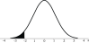
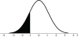
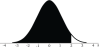

---
output:
  pdf_document: default
---

```{r message=FALSE, warning=FALSE, include=FALSE}
source("depencias.R")
knitr::opts_chunk$set(echo = FALSE, message = FALSE, warning = FALSE)
kable_outp <- ifelse(knitr::is_latex_output(), "latex", "html")
```

# Probabilidad: los modelos

## Concepto de modelización

La asignación a priori de probabilidades, presentada con los ejemplos
elementales de la moneda o el dado es parte de una forma muy general de
tratar con los fenómenos que dependen del azar. El supuesto inicial de
probabilidad $1/2$ a cada lado, constituye un *modelo de probabilidad*, es
una anticipación acerca de lo que se espera que suceda. No es
arbitrario, ya que deben tenerse razones para suponer que el modelo se
sostiene, pero en todos los casos es una aproximación a lo que sucede en
la realidad. Tratamos de modelar (o modelizar) lo que observamos a fin
de simplificarlo, pero un modelo puede ser más o menos adecuado a la
realidad, por eso dijimos que cabe la posibilidad que "el modelo no se
sostenga". La idea de simplificar está aquí utilizada en el sentido de
elegir algunos aspectos de la realidad para construir un modelo que
luego se usa para asignar probabilidades a los diferentes resultados
posibles. La riqueza y complejidad de los fenómenos sociales no se
menoscaba porque se usen modelos, salvo si se comete el error de
confundir el modelo con la realidad. Disponer de un modelo de
probabilidad permite calcular probabilidades de manera sencilla bajo
ciertos supuestos, que deben explicitarse.

Para seguir con nuestra moneda, digamos que el modelo que resume el
supuesto de iguales chances para todos los resultados, se llama
*distribución uniforme*, es válido también para un dado, si está
equilibrado, o para cualquier fenómeno aleatorio en el que se pueda
suponer que los resultados son igualmente probables. La expresión formal
de ese modelo es la siguiente:

"Si un experimento aleatorio tiene distribución uniforme y *k*
resultados posibles, entonces $P(A_{i}) = \frac{1}{k}$,
donde $A_{i}$ es uno cualquiera de los $k$ resultados"

Por lo tanto si se trata de una moneda (2 caras) la probabilidad de
cualesquiera de sus caras será $1/2$, si es un dado, cada lado tiene
probabilidad $1/6$, y si es un icosaedro regular (veinte caras iguales,
parecido a un globo de espejos) cada cara tendrá probabilidad 1/20 de
salir.

La representación gráfica de este modelo, es para cada uno de los
ejemplos, la siguiente:

```{r echo=FALSE, message=FALSE, warning=FALSE}
lado <- c("cara", "número")
probs <- c(.5, .5)
moneda <- data.frame(lado, probs)
ggplot(moneda, aes(lado, probs)) +
  geom_bar(stat = "identity", fill = "green") +
  theme_tufte() +
  xlab("lado de la moneda") +
  ylab("probabilidades")

cara_dado <- c(1:6)
probs <- rep(1 / 6, 6)
dado <- data.frame(cara_dado, probs)
ggplot(dado, aes(cara_dado, probs)) +
  geom_bar(stat = "identity", fill = "green") +
  theme_tufte() +
  xlab("número del dado") +
  ylab("probabilidades")

cara_icos <- c(1:20)
probs <- rep(1 / 20, 20)
icos <- data.frame(cara_icos, probs)
ggplot(icos, aes(cara_icos, probs)) +
  geom_bar(stat = "identity", fill = "green") +
  theme_tufte() +
  xlab("cara del icosaedro") +
  ylab("probabilidades")
```

En estos gráficos, la idea de uniformidad (para todos los eventos la
misma probabilidad) se transmite en la igual altura de todas las
columnas.

Además de este modelo uniforme, en este capítulo presentaremos cinco
modelos de probabilidad que serán necesarios para lo que sigue de
nuestros contenidos; el primero para variables discretas y los demás
para continuas. Hay una gran cantidad de modelos que permiten asignar
probabilidades a priori a diferentes fenómenos observables. El
tratamiento que haremos a continuación será de carácter utilitario, es
decir estará centrado en el uso que podemos hacer de cada distribución
teórica. Haremos las referencias matemáticas mínimas que sean necesarias
para comprender las propiedades y condiciones de aplicación de los
modelos.

## Distribución binomial

Esta distribución se usa para modelar fenómenos aleatorios que pueden
dar solo dos resultados, a los que se llama "éxito" y "fracaso". La
elección de cuál es éxito es arbitraria y corresponde a la categoría que
el investigador toma como de interés. La variable aleatoria que se
considera es el número de veces que se obtienen éxitos, o simplemente el
número de éxitos que resultan luego de una cierta cantidad de
repeticiones de la experiencia. La condición para que este modelo sea
válido es que cada repetición sea independiente de las anteriores, es
decir, que cada realización del experimento no incida sobre la
siguiente.

Nuevamente con la moneda equilibrada que hemos tratado, este modelo va a
facilitar el cálculo de, por ejemplo, qué probabilidad hay de obtener 3
caras en 4 tiradas de la moneda. Resolvamos primero el problema de
manera manual. En la tabla siguiente mostramos los resultados posibles
de ese experimento (lanzar cuatro veces una moneda equilibrada) y el
valor que corresponde a la variable aleatoria "número de caras", a la
que llamaremos *x*[^51].

```{r}
aux_table <- tibble::tribble(
  ~"Resultado del experimento", ~'Valor de la variable "número de caras" x',
  "XXXX", "0",
  "XXXC", "1",
  "XXCX", "1",
  "XXCC", "2",
  "XCXX", "1",
  "XCXC", "2",
  "XCCX", "2",
  "XCCC", "3",
  "CXXX", "1",
  "CXXC", "2",
  "CXCX", "2",
  "CXCC", "3",
  "CCXX", "2",
  "CCXC", "3",
  "CCCX", "3",
  "CCCC", "4",
)
knitr::kable(
  aux_table, kable_outp,
  booktabs = TRUE, align = "lc"
) %>%
  kableExtra::kable_styling(latex_options = "striped")
```

Como estos 16 resultados son igualmente probables, le corresponde una
probabilidad de 1/16 (0,0625) a cada uno, por lo que podemos calcular
las probabilidades de cada valor sumando los que corresponden a las
formas en que pueden lograrse. Por ejemplo, tres caras (x=3) puede ser
consecuencia de cualquiera de los eventos XCCC, CXCC, CCXC, CCCX, por lo
que hay cuatro eventos a su favor y su probabilidad es 4/16. Resumiendo
entonces la tabla anterior, tenemos:

```{r}
aux_table <- tibble::tribble(
  ~"$x$", ~"$P(x)$",
  "0", "1/16 (0,0625)",
  "1", "4/16 (0,25)",
  "2", "6/16 (0,375)",
  "3", "4/16 (0,25)",
  "4", "1/16 (0,0625)",
  "Total", "1",
)
knitr::kable(
  aux_table, kable_outp,
  booktabs = TRUE, align = "cc"
) %>%
  kableExtra::kable_styling(latex_options = "striped")
```

Como esperábamos, "lo más probable" es obtener dos caras, porque se
espera que la moneda caiga cara la mitad de las veces, ahora sabemos
también cuán probable es que caiga una cantidad diferente de veces cara.
La respuesta a la pregunta que formulamos arriba es 0,25 y lo expresamos
simplemente:

$$P(x = 3) = 0,25$$

Para construir la tabla y responder a la pregunta hemos usado como
información:

- la cantidad de repeticiones del experimento ($n=4$)

- la probabilidad del evento cada vez que se lo repite ($p=0,5$)

- el número de veces cuya probabilidad calculamos (el número de éxitos) ($x=3$)

Esta información es suficiente para aplicar el modelo binomial, que se va a escribir formalmente como $$B(n, p, x)$$. En la que la $B$ es por binomial, $n$ es el número de repeticiones, $p$ es la probabilidad de éxito a cada repetición y $x$ el número de éxitos cuya probabilidad se calcula.

Cuando se trata de variables discretas como en este ejemplo, los modelos admiten el cálculo de la probabilidad:

-	de un valor particular de la variable, es decir un determinado número de éxitos: $P(X=x)$

O bien

-	de un conjunto de valores por debajo de un valor dado, es decir, la probabilidad acumulada: $P(X\leq x)$

Si se requiere la probabilidad de los valores mayores a uno dado $P(X>x)$, se complementa (se resta de 1) la probabilidad acumulada.

Cuando se trata de variables continuas, las probabilidades exactas son cero, por lo que solo pueden calcularse la acumuladas: $P(X\leq x)$ y su complemento a uno: $P(X>x)$

Resulta claro que la realización manual de estas operaciones es larga y engorrosa, sobre todo en situaciones reales donde hay más observaciones que en la moneda. Por ejemplo, un examen consiste de 20 preguntas de opción múltiple con cinco opciones de respuesta cada una, una sola de las cuales es correcta. Para aprobar el examen es necesario contestar bien al menos 12 de ellas (el 60%). Se pregunta: ¿Qué probabilidad tiene un estudiante de aprobar solo por azar? Es decir si responde a cada pregunta por sorteo. Es una problema de distribución binomial: hay 20 repeticiones (una por cada pregunta) de un experimento que tiene 0.20 (1/5) de probabilidad de éxito. Para aprobar se necesitan al menos 12 éxitos. La resolución manual de este problema requiere considerar que para aprobar los éxitos pueden ser 12, 13, 14, etc. Y que cada cantidad de éxitos puede lograrse de varias formas. Doce aciertos pueden provenir de las doce primeras preguntas, o de las diez primeras y las dos últimas, o muchas otras combinaciones posibles. 

Si bien existen fórmulas para simplificar estas operaciones, usaremos directamente el software para calcular la probabilidad bajo modelos dados, a condición que el modelo se adapte al problema y que se cumplan sus supuestos. En este caso, la expresión, para exactamente 12 éxitos es $$B(20, .20, 12)$$
Pero para aprobar, 12 es el número mínimo de aciertos que se requieren, por lo que hará falta la probabilidad de 12 y de todos los valores siguientes, hasta 20. 

En R disponemos de las rutinas para calcular probabilidades simples y acumuladas bajo diferentes modelos. Para la binomial, el comando `dbinom`, tiene como argumentos: el número de éxitos cuya probabilidad se solicita($x$), el número de repeticiones ($n$) y la probabilidad de éxito a cada repetición ($p$). La probabilidad de obtener una cara al lanzar una moneda equilibrada ($p=0.5$), dos veces es:

```{r}
dbinom(1, 2, .5)
```

Y la probabilidad de tres caras en cuatro lanzamientos de una moneda equilibrada ($P(X=3)$) es:

```{r}
round(dbinom(3, 4, .5), 4)
```

El la que hemos pedido un redondeo a dos decimales.

Para pedir la probabilidad acumulada, como por ejemplo la de obtener tres caras o menos ($P(X\leq 3)$) en cuatro lanzamientos, el comando es `pbinom`, con los mismos argumentos:

```{r}
round(pbinom(3, 4, .5), 4)
```

La respuesta al problema del examen se resuelve en dos pasos, porque para aprobar hacen falta 12 aciertos *o más*. Entonces, primero calculamos la probabilidad acumulada de 11 ($P(X\leq 11)$), que es la probabilidad de no aprobar (obtener 11 aciertos o menos):

```{r}
round(pbinom(11, 20, .2), 4)
```

Y luego complementamos el resultado para obtener la probabilidad de superar los 11 aciertos  
`r 1-round(pbinom(11,20,.2), 4)`.  
$P(X>11)=$ `r 1-round(pbinom(11,20,.2), 4)`.

Otro ejemplo es aquel en el que se elige una muestra aleatoria de 15 estudiantes de primer año de la carrera de Biología para un experimento. Si se sabe que la proporción de mujeres de primer año de esa carrera es del 70%, ¿Cuál es la probabilidad que en la muestra resulten todas mujeres?. Cada persona que se selecciona aleatoriamente es una repetición, en la que la probabilidad que esa persona sea mujer es 0.70, y se pregunta por la probabilidad de hallar 15 éxitos. El resultado es:

```{r}
dbinom(15, 15, .7)
```

Y el resutado se expresa así: $$P(X=15)=B(15,15,.7)=0.0047$$  
Al final del capítulo veremos cómo pedir estas probabiidades a R.  


### Esperanza y varianza

En este modelo de probabilidad, la esperanza es $n*p$, que representa
el número esperado de casos favorables a obtener en n repeticiones. En
el primer ejemplo, la esperanza es $4*0,50=2$, que quiere decir que en 4
tiradas de la moneda equilibrada, esperaríamos obtener 2 caras, como
sabemos, esto es lo que sucede luego de un gran número de repeticiones
del experimento. En el ejemplo de la selección de estudiantes, la esperanza es $0,70*15=10,5$, aunque este número decimal no es una cantidad posible de casos favorables (mujeres) a obtener en la muestra, es el promedio a futuro, luego de la realización reiterada de este experimento muchas veces. Es decir qu esi el experimento de muestrear 15 estudiantes se repitiena muchas veces, en promedio se encontrarían entre 10 y 11 mujeres en cada muestra.

En el ejemplo del examen, la esperanza $20*.20=4$ indica que el número medio de aciertos que se espera lograr por puro azar es de 4.


La varianza de la distribución binomial es $n*p*(1-p)$, que es una
medida de la variabilidad del proceso. Más adelante volveremos sobre
este tema.

El gráfico de esta distribución se construye calculando las
probabilidades de los diferentes valores de $x$, que puede ir desde 0
hasta el número total de repeticiones del experimento. El siguiente es
el correspondiente a 20 repeticiones con diferentes valores de $p$:

```{r echo=FALSE, message=FALSE, warning=FALSE}
exitos_ej_1 <- c(0:20)
valores_p <- c(.1, .3, .5, .6, .8)
ej_binom <- data.frame(cbind(
  0:20,
  do.call(cbind, lapply(valores_p, function(p) {
    dbinom(exitos_ej_1, 20, p)
  }))
))
colnames(ej_binom) <- c("exitos", paste0("probs.", valores_p))

ggps <- lapply(valores_p, function(p) {
  ggplot(ej_binom, aes_string("exitos", paste0("probs.", p))) +
    geom_bar(stat = "identity", col = "green", fill = "green") +
    xlab("cantidad de éxitos en 20 ensayos") +
    ylab("probabilidad") +
    ggtitle(paste0("p = ", p)) +
    scale_y_continuous(breaks = NULL) +
    theme_tufte()
})

grid.arrange(grobs = ggps, ncol = 2)
```

Observemos la forma en que aparece representada la diferencia entre las
varianzas de las distribuciones, la màxima ocurre con $p=0.50$ [^54].

## Distribución normal

La mayoría de los fenómenos naturales, sociales, psicológicos no tienen
distribución uniforme, es decir, no es igualmente probable que resulte
cualquiera de los resultados. Por ejemplo, para una determinada
población, el peso de los niños al nacer tiene un valor promedio y
cuando un niño nace se espera que tenga un peso cercano a ese valor
medio. No es igualmente probable que un niño nazca con que con 5800. Son
menos frecuentes los niños que nacen con pesos muy por encima o muy por
debajo del promedio. De modo similar sucede con medidas psicológicas
como el Cociente intelectual (CI); se hallan con mayor frecuencia
valores cercanos al promedio y la probabilidad de encontrar personas muy
por encima o muy por debajo de ese promedio es menor. Para este tipo de
fenómeno, hay un modelo que suele ajustar bien las probabilidades, se
llama distribución normal[^55] y su representación gráfica, una curva
unimodal, simétrica, de forma acampanada es llamada "campana de
Gauss"[^56] en referencia a Johann Carl Friedrich Gauss[^57].


```{r}
ggplot(data = data.frame(x = c(-4, 4)), aes(x)) +
  stat_function(fun = dnorm, n = 101, args = list(mean = 0, sd = 1)) +
  ylab("") +
  xlab("") +
  scale_y_continuous(breaks = NULL) + theme_tufte() +
  theme(axis.text.x = element_blank(), axis.ticks = element_blank())
```


Un primer elemento a tener en cuenta es que, a diferencia de los
gráficos anteriores, ahora se trata de una curva con trazado continuo.
Esto se debe a que esta distribución es adecuada para modelar variables
continuas. Recordemos que cuando se construyeron las distribuciones de
frecuencia, resultaba imposible enumerar todas las categorías de una
variable de este tipo, ya que son infinitas. Dijimos en ese momento que
no es posible indicar la frecuencia de un valor único de una variable
continua. Lo mismo vale ahora para las probabilidades: no calculamos
probabilidades para valores simples de variables continuas, sí
calculamos probabilidades acumuladas y, como sucedía con las frecuencias
acumuladas, éstas están representadas gráficamente en el área bajo la
curva, pero en lugar de sumar las frecuencias de valores discretos, se
realiza una operación que se llama integración[^58].

Dado que la curva que describe la distribución normal es unimodal y
simétrica; el modo, la media y la mediana coinciden, el coeficiente de
asimetría es cero ($g_{1}=0$) y la distribución es mesocúrtica ($g_{2}=0$).

El cálculo de las probabilidades bajo el modelo normal -o, lo que es lo
mismo, de las áreas bajo la curva-, es muy complejo, por lo que se
encuentra tabulado, es decir, precalculado para algunos valores de la
variable. ¿De qué variable?, hemos mencionado el peso al nacer, el IQ,
¿con qué método calcularemos probabilidades para fenómenos tan
disímiles? Antes que se difundiera el uso de la computadora personal, se
usaban tablas, ahora usamos cualquier hoja de cálculo, donde se indica
la probabilidad acumulada para diferentes valores de una variable
abstracta, sin unidades, adaptable a una diversidad de fenómenos. Se
trata de la variable $z$, que ya fue definida y que mide el número de
desviaciones estándar -contadas desde la media-, a las que se encuentra
un caso individual. Una de las aplicaciones prácticas de esta variable
es que permite comparar variables que miden cualidades muy diferentes.
Sabemos ya que la cantidad de desviaciones estándar ($z$) es una medida
de lo cerca o lejos que un caso se encuentra del promedio. Si la
variable en estudio es adecuadamente modelada con la distribución
normal, entonces podremos conocer la probabilidad de hallar casos, por
ejemplo a *más de dos desviaciones estándar de la media* y eso tendrá
una inmediata traducción a valores de la variable.

Recordemos que la variable $z$ está definida, para un valor particular
de $x$ como:

$$z = \frac{x - \overline{x}}{s}$$

Y que tiene media igual a cero y desviación estándar igual a uno. Si $x$
tiene una distribución normal con una media $\overline{x}$ y una
desviación estándar $s$, entonces $z$ tiene distribución que se llama
**normal estándar**.

Su gráfico está centrado en cero:

```{r}
ggplot(data = data.frame(z = c(-4, 4)), aes(z)) +
  stat_function(fun = dnorm, n = 101, args = list(mean = 0, sd = 1)) +
  ylab("") +
  xlab("z") +
  scale_y_continuous(breaks = NULL) +
  theme_tufte()
```

Cualquier hoja de cálculo (como OpenOfficeCalc o Excel)
calcula las probabilidades (o áreas) bajo la curva normal. En R es muy directo, porque del mismo modo en que dispusimos de una función para la binomial acumulada (pbinom), tenemos ahora el comando `pnorm` para obtener probabilidades acumuladas ($P(Z\leq z)$) bajo un modelo de distribución normal estándar. Y, al igual que con cualquier otra distribución, el valor de $P(Z>z)$ se logra restando de 1, que es el área completa bajo la curva. Por ejemplo, el área acumulada por debajo de $z=0$ es la mitad de la campana, $P(Z\leq 0)=0.5$, por lo que $P(Z>z)=0.5$.

Si lo pedimos a R, el resultado es:
```{r}
pnorm(0)
```

Cuyo gráfico es:

```{r}
ggplot(NULL, aes(c(-4, 4))) +
  geom_area(
    stat = "function",
    fun = dnorm,
    col = "black",
    fill = "green",
    xlim = c(-4, 0)
  ) +
  geom_area(
    stat = "function",
    fun = dnorm,
    col = "black",
    fill = "white",
    xlim = c(0, 4)
  ) +
  ylab("") +
  xlab("z") +
  scale_y_continuous(breaks = NULL) +
  theme_tufte()
```

El área sombreada vale 0.50.

Para el área por debajo de $z=2$, redondeado a cuatro decimales:

```{r}
round(pnorm(2), 4)
```

Y su representación: 

```{r}
ggplot(NULL, aes(c(-4, 4))) +
  geom_area(
    stat = "function",
    fun = dnorm,
    col = "black",
    fill = "green",
    xlim = c(-4, 2)
  ) +
  geom_area(
    stat = "function",
    fun = dnorm,
    col = "black",
    fill = "white",
    xlim = c(2, 4)
  ) +
  ylab("") +
  xlab("z") +
  scale_y_continuous(breaks = NULL) +
  theme_tufte()
```

Queda delimitada por debajo de $z=2$ un área de 0.9772. $P(z\leq2)=0.9772$.

Si solicitamos las probabilidades acumuladas por debajo de diferentes valores de $z$, empezando con los negativos, pasando por el cero y siguiendo por los positivos, obtenemos lo siguiente:

<!-- todo: poner las imagenes -->
<!-- acá voy a copiar la imagen, muy complicado pedirlos con este formato a R-->
------ ------------ ------------------------------------------------------------------------------------------------- -- ----- ------------ ------------------------------------------------------------------------------------------------
  *z*    *P(&lt;z)*   Ubicación                                                                                             *z*    *P(&lt;z)*   Ubicación
  -3,0   0,00135      {width="0.8188976377952756in" height="0.3937007874015748in"}      0,0   0,50000      {width="0.8188976377952756in" height="0.3937007874015748in"}
  -2,0   0,02275      {width="0.8188976377952756in" height="0.3937007874015748in"}      1,0   0,84134      {width="0.8188976377952756in" height="0.3937007874015748in"}
  -1,0   0,15866      {width="0.8188976377952756in" height="0.3937007874015748in"}      2,0   0,97725      {width="0.8188976377952756in" height="0.3937007874015748in"}
                                                                                                                           3,0   0,99865      {width="0.8188976377952756in" height="0.3937007874015748in"}
  ------ ------------ ------------------------------------------------------------------------------------------------- -- ----- ------------ ------------------------------------------------------------------------------------------------

Las probabilidades acumuladas (es decir, las áreas a la izquierda) van
creciendo desde casi cero en el valor más pequeño que pusimos ($z = -4$) y
llegan hasta casi uno en el máximo valor ($z = 4$). En el modelo
matemático, $z$ tiene como campo de variación todos los valores, es decir,
desde menos infinito hasta más infinito ($-\infty$; $\infty$), pero como vemos,
en la realidad, los valores -4 y 4 son muy extremos, en el sentido que
las probabilidades acumuladas son **casi** cero y **casi** uno
respectivamente. Aunque el modelo teórico tiene un comportamiento
asintótico respecto del eje horizontal, en el gráfico, la curva se
confunde con el eje para valores cercanos a 4. La notación para estos
resultados es la siguiente (usando hasta cuatro decimales que es lo más
frecuente), por ejemplo: $P(z\leq-2)= 0.0227$ ó también $P(z\leq1) = 0,8413$. Las representaciones gráficas de estas probabilidades son las
siguientes:

```{r}
ggplot(NULL, aes(c(-4, 4))) +
  geom_area(
    stat = "function",
    fun = dnorm,
    col = "black",
    fill = "green",
    xlim = c(-4, -2)
  ) +
  geom_area(
    stat = "function",
    fun = dnorm,
    col = "black",
    fill = "white",
    xlim = c(-2, 4)
  ) +
  ylab("") +
  xlab("z") +
  geom_segment(aes(x = -3, xend = -2.2, y = .09, yend = .02), arrow = arrow()) +
  annotate(geom = "text", label = "P(z<-2) = 0.0227", x = -3, y = .1) +
  scale_y_continuous(breaks = NULL) +
  theme_tufte()

ggplot(NULL, aes(c(-4, 4))) +
  geom_area(
    stat = "function",
    fun = dnorm,
    col = "black",
    fill = "green",
    xlim = c(-4, 1)
  ) +
  geom_area(
    stat = "function",
    fun = dnorm,
    col = "black",
    fill = "white",
    xlim = c(1, 4)
  ) +
  ylab("") +
  xlab("z") +
  geom_segment(aes(x = -3, xend = -2, y = .23, yend = .15), arrow = arrow()) +
  annotate(geom = "text", label = "P(z<1) = 0.8413", x = -3, y = .25) +
  scale_y_continuous(breaks = NULL) +
  theme_tufte()
```

A continuación vemos la representación gráfica de la relación entre las
probabilidades "por encima" y "por debajo" de $z=1$, sabiendo que $P(z\leq1)+P(z>1)=1$.

```{r}
ggplot(NULL, aes(c(-4, 4))) +
  geom_area(stat = "function", fun = dnorm, col = "black", fill = "green", xlim = c(-4, 1)) +
  geom_area(stat = "function", fun = dnorm, col = "black", fill = "grey", xlim = c(1, 4)) + ylab("") + xlab("z") + geom_segment(aes(x = -3, xend = -.5, y = .23, yend = .15), arrow = arrow()) + annotate(geom = "text", label = "P(z<1) = 0.8413", x = -3, y = .25) + annotate(geom = "text", label = "P(z>1) = 0.1587", x = 3, y = .25) + geom_segment(aes(x = 3, xend = 1.5, y = .23, yend = .08), arrow = arrow()) +
  scale_y_continuous(breaks = NULL) + theme_tufte()
```

También se pueden identificar probabilidades **entre** valores de z, por
ejemplo cuál es el área entre -1 y 1 (es decir cuál es la probabilidad
de encontrar a z entre esos valores). Esto se escribe así:
$P(-1<z<1)$. Para calcularla solo usaremos la información sobre la
probabilidad acumulada: el área por debajo de $-1$ vale $0,1587$ y el área por debajo de $1$ es $0,8413$, si restamos esas dos áreas tendremos lo que queda entremedio: $0,8413 - 0,1587 = 0,6835$, gráficamente:

<!-- mejorar las flechas, mas chicas-->

```{r}
ggplot(NULL, aes(c(-4, 4))) +
  geom_area(stat = "function", fun = dnorm, col = "black", fill = "green", xlim = c(-4, -1)) +
  geom_area(stat = "function", fun = dnorm, col = "black", fill = "grey", xlim = c(-1, 1)) +
  geom_area(stat = "function", fun = dnorm, col = "black", fill = "white", xlim = c(1, 4)) +
  ylab("") + xlab("z") + geom_segment(aes(x = -4, xend = -1, y = .3, yend = .3)) + annotate(geom = "text", label = "P(z<-1) = 0.1587", x = -3, y = .32) +
  geom_segment(aes(x = -4, xend = 1, y = .4, yend = .4)) + annotate(geom = "text", label = "P(z<1) = 0.8413", x = -3, y = .42) +
  geom_segment(aes(x = -1, xend = -1, y = .3, yend = .25), arrow = arrow()) +
  geom_segment(aes(x = 1, xend = 1, y = .4, yend = .25), arrow = arrow()) +
  geom_segment(aes(x = 2, xend = 0, y = .35, yend = .3), arrow = arrow()) +
  annotate(geom = "text", label = "P(-1<z<1) = 0.6835", x = 3, y = .37) +
  scale_y_continuous(breaks = NULL) + theme_tufte()
```


El área comprendida entre -2 y 2 se calcula del mismo modo, solicitado a R, se obtiene:

P(z < 2) = ´ r round(pnorm(-2), 4)´  
P(z < - 2) = ´r round(pnorm(2), 4)´

$$P(- 2 < z < 2) = P(z < 2) - P(z < - 2) = 0,9772 - 0,0228 = 0,9544$$

Y los valores $\pm3$ delimitan:

```{r}
round((pnorm(3) - pnorm(-3)), 4)
```

Es decir que:

$$P(- 3 < z < 3) = P(z < 3) - P(z < - 3) = 0,9986 - 0,0013 = 0,9973$$


La regla empírica que se mencionó en el capítulo <!-- ya veremos cual es, o quizás en la página...-->, tiene aquí su origen. Ya que si la distribución es similar a la normal (unimodal  y simétrica), entonces *aproximadamente* el 68% estará a menos de una desviación estándar de la media, el 95% a menos de dos, y el 99,7  a una distancia no mayor a tres desviaciones estándar. Son los valores de $z$, que mide distancia a la media en términos de desviaciones estándar.


### Percentiles

De mismo modo que con las distribuciones de frecuencia, los valores de la variable que acumulan una determinada probabilidad son los percentiles. El valor $z=-1$ es el percentil $15.87$ de la variable y $z=2$  es el percentil $97.72$.

Para determinar ahora los valores de $z$ que acumulan cierta probabilidad, se necesita la operación inversa a la que se realizó hasta aquí, porque hay que hallar cuál es el valor de la variable ($z$) que deja por debajo una determinada probabilidad. Según la definición de percentiles, el percentil $P_{r}$ de la variable es el valor por debajo del cual la probabilidad de hallarla es $r\%$. Gráficamente, se trataría de fijar el área ($r\%$) y determinar cuál es el $z$ que la acumula.

Nuevamente, recurrimos a R para solicitar este valor, que a partir de la probabilidad acumulada, devuelve el valor de $z$. Por ejemplo, el percentil $95$ ($P_{95}$) de la distribución normal es:

```{r}
round(qnorm(.95), 4)
```

El valor 1.6449 acumula el 95% o bien $P(z\leq1.6449=.95)$. Y del mismo modo el percentil 99 es:

```{r}
round(qnorm(.99), 4)
```

$$P_{99}=2.3263$$

Por la simetría de la distribución, los percentiles complementarios son valores opuestos de la variable:

```{r}
round(qnorm(.05), 4)
round(qnorm(.01), 4)
```
Con los que, bajo el modelo normal estándar: $P_{5}=-1.6449$ y $P_{1}=-2.3263$

Por el uso  que haremos de la distribución normal hay algunos prcentiles de mucha importancia y conviene recordar: son los que delimitan áreas centrales de probabilidad .90, .95 y .99.

Para determinarlos, hay que identificar a qué percentiles corresponden. Para el área central de .90, el área de .10 que queda fuera se reparte de manera simétrica en las dos colas de la distribución, a razón de .05 en cada una:

```{r}
ggplot(NULL, aes(c(-4, 4))) +
  geom_area(stat = "function", fun = dnorm, col = "black", fill = "grey", xlim = c(-4, qnorm(.05))) +
  geom_area(stat = "function", fun = dnorm, col = "black", fill = "green", xlim = c(qnorm(.05), qnorm(.95))) +
  geom_area(stat = "function", fun = dnorm, col = "black", fill = "grey", xlim = c(qnorm(.95), 4)) + ylab("") + xlab("z") +
  annotate(geom = "text", label = ".90", x = 0, y = .25) +
  annotate(geom = "text", label = ".05", x = -2, y = .03) +
  annotate(geom = "text", label = ".05", x = 2, y = .03) +
  scale_y_continuous(breaks = NULL) +
  theme_tufte()
```

Entonces, hay que determinar los valores de $z$ que acumulan $.05$ y $.95$, dicho de otro modo, hay que calcular $P_{5}$ y $P_{95}$, que son:

```{r}
qnorm(.05)
qnorm(.95)
```

Redondeados a dos decimales:
```{r}
round(qnorm(.05), 2)
round(qnorm(.95), 2)
```


Con lo que los valores $\pm1.64$ delimitan un área central en la que hay una probabilidad .90 de encontrar a la variable normal estándar.

$$P(- 1.64 < z < 1.64) = 0,90$$

Del mismo modo, para el área central de $.95$, el área complementaria de $.05$ se reparte en dos, y los percentiles que se requieren son: $P_{2.5}$ y $P_{97.5}$, que son:

```{r}
round(qnorm(.025), 2)
round(qnorm(.975), 2)
```

Así:
$$P(- 1.96 < z < 1.96) = 0,95$$

Y para $.99$, el $.01$ restante se divide en dos, por lo que los $z$ que se buscan son los valores que acumulan $.005$ y $.995$, es decir: $P_{.5}$ y $P_{99.5}$, que resultan:

```{r}
round(qnorm(.005), 2)
round(qnorm(.995), 2)
```

Entonces:
$$P(- 2.58 < z < 2.58) = 0,99$$

<!-- faltan los valores de z anotados sobre el eje y eliminar todo lo demás, también en y-->
```{r}
normal_central_90 <- ggplot(NULL, aes(c(-4, 4))) +
  geom_area(stat = "function", fun = dnorm, col = "black", fill = "grey", xlim = c(-4, qnorm(.05))) +
  geom_area(stat = "function", fun = dnorm, col = "black", fill = "green", xlim = c(qnorm(.05), qnorm(.95))) +
  geom_area(stat = "function", fun = dnorm, col = "black", fill = "grey", xlim = c(qnorm(.95), 4)) + ylab("") + xlab("z") +
  annotate(geom = "text", label = ".90", x = 0, y = .25) +
  annotate(geom = "text", label = ".05", x = -2, y = .03) +
  annotate(geom = "text", label = ".05", x = 2, y = .03) +
  scale_y_continuous(breaks = NULL) +
  theme_tufte()


normal_central_95 <- ggplot(NULL, aes(c(-4, 4))) +
  geom_area(stat = "function", fun = dnorm, col = "black", fill = "grey", xlim = c(-4, qnorm(.025))) +
  geom_area(stat = "function", fun = dnorm, col = "black", fill = "green", xlim = c(qnorm(.025), qnorm(.975))) +
  geom_area(stat = "function", fun = dnorm, col = "black", fill = "grey", xlim = c(qnorm(.975), 4)) + ylab("") + xlab("z") +
  annotate(geom = "text", label = ".95", x = 0, y = .25) +
  annotate(geom = "text", label = ".025", x = -2.5, y = .02) +
  annotate(geom = "text", label = ".025", x = 2.5, y = .02) +
  scale_y_continuous(breaks = NULL) +
  theme_tufte()

normal_central_99 <- ggplot(NULL, aes(c(-4, 4))) +
  geom_area(stat = "function", fun = dnorm, col = "black", fill = "grey", xlim = c(-4, qnorm(.005))) +
  geom_area(stat = "function", fun = dnorm, col = "black", fill = "green", xlim = c(qnorm(.005), qnorm(.995))) +
  geom_area(stat = "function", fun = dnorm, col = "black", fill = "grey", xlim = c(qnorm(.995), 4)) + ylab("") + xlab("z") +
  annotate(geom = "text", label = ".99", x = 0, y = .25) +
  annotate(geom = "text", label = ".005", x = -3, y = .01) +
  annotate(geom = "text", label = ".005", x = 3, y = .01) +
  scale_y_continuous(breaks = NULL) +
  theme_tufte()

normal_central_90
normal_central_95
normal_central_99
```

#### Usos de la distribución normal

La distribución normal es muy valiosa, por muchas razones, de las cuales nos interesan dos.

La primera es que es adecuada para modelar muchos fenómenos observables,
en especial variables biológicas como el *peso* de los niños al nacer,
la *talla* para diferentes edades. Hay variables psicológicas como el
*coeficiente intelectual*, para las que se elaboran instrumentos de
medición cuyos puntajes se distribuyen de manera normal. Otras
variables, como el *rendimiento en la escuela*, o las *actitudes* medidas con escalas numéricas, a menudo, pueden aproximarse de manera adecuada con un modelo normal.

La segunda razón es que cuando se extraen muestras aleatorias de una
población, algunas medidas que se calculan sobre esas muestras tienen
una distribución que se aproxima a la normal a medida que las muestras
tienen mayor tamaño. Eso será lo que nos permita realizar nuestras
primeras estimaciones de valores poblacionales a partir de muestras.

Hasta este punto trabajamos con la distribución normal de una variable
abstracta, sin unidades, a la que llamamos $z$, a cuyos valores pudimos
asignar probabilidades. La función que describe la curva acampanada está expresada en términos de $z$. Pero cuando vamos a trabajar
con una variable real, como las que mencionamos, por ejemplo, el peso de los niños cuando nacen o el CI, es necesario disponer de una variable concreta, a la que llamamos $x$. ¿Qué relación tiene esa variable, cuya distribución podría modelarse bien con una curva normal, con la $z$, que nos permite hallar las probabilidades bajo el modelo normal? Es decir, ¿qué relación tiene $x$ con $z$? Ya la conocemos, porque $z$ es el desvío estándar que definimos en el capítulo <!-- referencia al capítulo o seccion donde está la definición de z-->, es:

$$z = \frac{x - \overline{x}}{s}$$

Que cuenta la cantidad de desviaciones estándar ($s$) a que se encuentra un valor ($x$) de la media ($\overline{x})$. Para encontrar
probabilidades correspondientes a valores reales de una variable y no
solo los $z$ abstractos, debemos transformar esos valores en puntajes
$z$, con la expresión de arriba.

Veamos esto en un ejemplo: a partir de las historias clínicas de varios
años de un hospital materno infantil, conocemos que el peso medio en el
momento de nacer (de niños varones, a término, con madre entre 20 y 29
años) es de 3300 gramos y que la desviación estándar es de 800 gramos. Además sabemos que la distribución normal es adecuada para describir la variable *peso al nacer*. Entonces podemos calcular la probabilidad que un niño al nacer tenga un peso por debajo de los 1500 gramos. El problema es averiguar el área sombreada en el siguiente gráfico:

<!-- en eje x solo 3300 y 1500, en eje y, nada-->
```{r}
normal.1 <- function(x) dnorm(x, mean = 3300, sd = 800)

ggplot(NULL, aes(c(100, 6500))) +
  geom_area(stat = "function", fun = normal.1, col = "black", fill = "green", xlim = c(100, 1500)) +
  geom_area(stat = "function", fun = normal.1, col = "black", fill = "white", xlim = c(1500, 6500)) + ylab("") + xlab("x = pesos de los niños al nacer") +
  scale_y_continuous(breaks = NULL) + theme_tufte()
```

Para calcular el área marcada -que corresponde a la probabilidad
solicitada-, vamos a transformar el valor de $x$ (1500) a puntaje $z$,
haciendo:

$$z = \frac{x - \overline{x}}{s} = \frac{1500 - 3300}{800} = - 2.25$$

Ahora es equivalente solicitar la probabilidad de $x$ menor que 1500 que la de $z$ menor que -2,25, en símbolos:

$$P(x < 1500) = P(z < - 2.25)$$

Y el gráfico anterior expresado en términos de $z$ resulta:

```{r}
ggplot(NULL, aes(c(-4, 4))) +
  geom_area(stat = "function", fun = dnorm, col = "black", fill = "green", xlim = c(-4, -2.25)) +
  geom_area(stat = "function", fun = dnorm, col = "black", fill = "white", xlim = c(-2.25, 4)) + ylab("") + xlab("z") +
  scale_y_continuous(breaks = NULL) + theme_tufte()
```

Esta probabilidad es:
```{r}
pnorm(-2.25)
```

Indica la probabilidad de hallar niños que al nacer tengan pesos inferiores a los 1500 gramos.

Del mismo modo podemos operar si nos interesa conocer la probabilidad de hallar niños que nazcan con peso comprendido entre 3500 y .
Transformando cada uno de los valores se obtiene:

$$x = 3500 \arrow z = \frac{3500 - 3300}{800} = 0,25$$

$$x = 4500 \arrow z = \frac{4500 - 3300}{800} = 1,50$$

Entonces, que $x$ (el peso de los niños al nacer) esté entre 3500 y equivale a que $z$ (cantidad de desviaciones estándar) se encuentre entre 0,25 y 1,50. Esto se expresa simbólicamente así:

$$P(3500 < x < 4500) = P(0,25 < z < 1,50)$$

Y se representa gráficamente así:

En términos de:

```{r}
p10_x <- ggplot(NULL, aes(c(100, 6500))) +
  geom_area(stat = "function", fun = normal.1, col = "black", fill = "white", xlim = c(100, 3500)) +
  geom_area(stat = "function", fun = normal.1, col = "black", fill = "green", xlim = c(3500, 4500)) +
  geom_area(stat = "function", fun = normal.1, col = "black", fill = "white", xlim = c(4500, 6500)) + ggtitle("la variable original x") +
  ylab("") + xlab("x = pesos de los niños al nacer") +
  scale_y_continuous(breaks = NULL) + theme_tufte()


p10_z <- ggplot(NULL, aes(c(-4, 4))) +
  geom_area(stat = "function", fun = dnorm, col = "black", fill = "white", xlim = c(-4, .25)) +
  geom_area(stat = "function", fun = dnorm, col = "black", fill = "green", xlim = c(.25, 1.5)) + ylab("") +
  geom_area(stat = "function", fun = dnorm, col = "black", fill = "white", xlim = c(1.5, 4)) + ggtitle("la variable transformada z") +
  xlab("z") +
  scale_y_continuous(breaks = NULL) + theme_tufte()

grid.arrange(p10_x, p10_z, ncol = 2)
```

Para calcular el área comprendida entre los dos puntos, es decir la
probabilidad de hallar a $x$ entre 3500 y 4500, restamos, a la
probabilidad acumulada hasta $z=1.50$, la acumulada hasta $z=0.25$:

$$P(3500 < x < 4500) = P(0,25 < z < 1,50) = P(z < 1,50) - P(z < 0,25)$$

La última operación la solicitamos a R:

```{r}
round(pnorm(1.5) - pnorm(.25),4)
```

Leemos el resultado diciendo que la probabilidad de hallar a un niño que haya nacido con un peso comprendido entre los 3500 y los 4500 gramos es de $0.3345$.

Toda variable que puede modelarse con una distribución normal puede
transformarse a puntaje $z$ y así hallar la probabilidad asociada a
diferentes intervalos.

Hemos realizado las operaciones de este modo hasta aquí, porque es importante tener clara la relación entre las variable concreta que se mide u observa, con la variable abstracta, $z$. Sin embargo, es posible ingresar al comando de R directamente con los valores de la variable original e informar la media y la desviación estándar, para obtener las probabilidades correspondientes. Veamos el modo de obtener el resultado de manera directa, sin pasar por $z$. La
probabilidad que nos interesa es, como antes:

$$P(3500 < x < 4500)$$

Que se calcula como la diferencia entre la probabilidad acumulada hasta
4500 menos la acumulada hasta 3500.

$$P(3500 < x < 4500) = P(x < 4500) - P(x < 3500)$$

En R puede solicitarse la probabilidad directamente sobre $x$ indicando los valores de la media y la desviación estándar, y se obtiene:

```{r}
pnorm(4500, 3300, 800) - pnorm(3500, 3300, 800)
```

Es el mismo resultado al que habíamos llegado a través de la
transformación a puntaje $z$, pero ahora pidiéndola directamente desde
$x$. Aunque éste sea el procedimiento más cómodo para calcular
probabilidades, es necesario estar familiarizado con la distribución
normal estándar (en $z$), por los usos que haremos en los próximos
capítulos.  
Al final de capítulo veremos cómo pedir a R el cálculo.  

La distribución normal tiene un uso muy amplio y varios campos de aplicación. Más adelante veremos que para aplicar algunos procedimientos de análisis, es necesario que los datos provengan de una distribución normal, y existen pruebas para verificar que esto se cumpla. Una primera
aproximación para ver si un conjunto de datos tiene distribución cercana a la normal es observar el histograma y evaluar si su forma se aproxima a la normalidad: si es unimodal y aproximadamente simétrica, es decir si la mediana es semejante a la media. Luego se calculan los coeficientes
de curtosis y asimetría y, si éstos están entre $-0,50$ y $+0,50$, puede aceptarse, en primera instancia, la normalidad de los datos.

## La idea de grados de libertad

Antes de avanzar hacia los otros modelos de probabilidad que
presentaremos en este capítulo, es necesario tener una idea aproximada
de un concepto que juega un papel de importancia en esas distribuciones,
el de "grados de libertad", un número que, como veremos enseguida,
determina la forma de algunas distribuciones. Se trata de un concepto
matemático complejo, al que vamos a definir como el número de
observaciones linealmente independientes que existen en una suma de
cuadrados[^60], pero del que haremos un uso exclusivamente instrumental.
Su denominación es gl o bien df en inglés (degrees of freedom).

Consideremos el caso del cálculo de la varianza, cuyo numerador es:
$\sum_{i = 1}^{n}(x_{i} - \overline{x})^{2}$. Que es la
suma de $n$ términos, cada uno de ellos elevado al cuadrado. Identificar
los grados de libertad de esa expresión equivale a responder a ¿cuántos
términos de esa suma no dependen del valor que asumen los demás?
Supongamos que se conoce la media muestral; esto establece un número
fijo para la suma de las $n$ observaciones: $x_{1}, x_{2}, \ldots, x_{n}$, por lo que solo $n-1$ de ellas pueden elegirse "libremente", la última
observación queda determinada.

Por ejemplo, si se trata de cuatro observaciones de las que sabemos que
su media es cinco, entonces la suma de los cuatro números debe ser 20
¿Cuáles son los valores posibles para las cuatro observaciones $x_{1}, x_{2}, x_{3}, x_{4}$? Hay infinitas combinaciones posibles que darían suma igual a 20, fijemos arbitrariamente algunos de los valores: $x_{1}=3, x_{2}=4, x_{3}=4$, estos tres números suman 11, por lo que el cuarto solo puede ser 9 (para lograr la suma de 20 y que entonces la media sea 5). Otra combinación posible de valores es $x_{1}=4, x_{2}=5, x_{3}=10$, con lo que $x_{4}=1$ necesariamente. Cualquiera sea la elección que se haga, siempre serán tres de los cuatro valores los que puedan elegirse libremente; decimos entonces que los grados de libertad son tres.

En general, para este problema, los grados de libertad se calcularán
como $n-1$, donde $n$ es el número de observaciones, diremos así que, de $n$ observaciones, $n-1$ son independientes, si se fija el resultado de la suma.

Una situación diferente es cuando se trata con una tabla de doble
entrada con frecuencias marginales fijas; allí los grados de libertad se
interpretan de modo distinto. No están relacionados con el número de
observaciones sino con la dimensión de la tabla. Veamos la siguiente
tabla de dos por tres, con frecuencias marginales fijadas:

```{r}
aux_table <- tibble::tribble(
  ~"", ~"A", ~"B", ~"C", ~"Total",
  "R", "", "", "", "10",
  "S", "", "", "", "30",
  "Total", "5", "10", "25", "40",
)
knitr::kable(
  aux_table, kable_outp,
  booktabs = TRUE, align = "lcccc"
) %>%
  kableExtra::kable_styling(latex_options = "striped")
```

En ella se relacionan dos variables cuyas categorías son $A$, $B$ y $C$ para
la de las columnas y $R$ y $S$ para la de las filas. En la tabla, hemos
fijado las frecuencias marginales. No hay dudas que hay infinitos
valores posibles para las frecuencias conjuntas que podrían sumar lo que
piden las marginales. Nos preguntamos ¿Cuántas de las frecuencias de las
celdas (frecuencias conjuntas) pueden elegirse libremente? Si elegimos
el valor 2 para la celda $RA$, queda determinado un 3 en la celda $SA$ (para
que cumpla con sumar 5 verticalmente). Si luego elegimos un 4 en la
celda $RB$, la $SB$ queda determinada a ser 6 (para sumar 10 en la segunda
columna). Al mismo tiempo, la celda $RC$ debe ser también 4 para sumar 10
en la primera fila y también se determina la celda $SC$, que no puede ser
sino 21, para sumar 30 en la segunda fila y 25 en la tercera columna. La
tabla queda así completada, solo las celdas $RA$ y $RB$ fueron elegidas, las
demás quedaron determinadas por la exigencia de respetar las frecuencias
marginales.

```{r}
aux_table <- tibble::tribble(
  ~"", ~"A", ~"B", ~"C", ~"Total",
  "R", "2", "4", "4", "10",
  "S", "3", "6", "21", "30",
  "Total", "5", "10", "25", "40",
)
knitr::kable(
  aux_table, kable_outp,
  booktabs = TRUE, align = "lcccc"
) %>%
  kableExtra::kable_styling(latex_options = "striped")
```

¿Cuántos serán los grados de libertad en este ejemplo?, de las seis
celdas que debían completarse con frecuencias, solo 2 pudieron elegirse
libremente. Éstos últimos son los grados de libertad: 2.

De manera general, para una tabla de dimensión $f X c$ (donde $f$ es
la cantidad de filas y $c$ la de columnas, como antes), los grados de
libertad se calculan multiplicando $(f-1)$ por $(c-1)$. En la tabla que
acabamos de usar como ejemplo, la dimensión es 2 por 3, por lo que los
grados de libertad son $(2-1)*(3-1)= 1*2=2$, que son las dos celdas
cuyas frecuencias pudimos fijar "libremente".

A los fines de nuestro curso, esta introducción a la idea de grados de
libertad es suficiente, el concepto es amplio y su tratamiento más
profundo exigiría algunos conocimientos de álgebra lineal, que no
necesitamos desarrollar aquí.

## La distribución ji cuadrado ($\chi^{2}$)

Esta distribución es el primer modelo que veremos con forma
asimétrica[^61]. Una de sus aplicaciones es la estimación de la
varianza, nosotros la utilizaremos más adelante, cuando tratemos sobre
estadística no paramétrica, en especial para probar si una variable
puede modelarse con cierta distribución (pruebas de bondad de ajuste) y
también para analizar la independencia entre variables nominales.

Del mismo modo en que tratamos a la distribución normal, no haremos uso
de la fórmula para calcular probabilidades, sino que las pediremos a R. Además de la forma asimétrica, hay otra diferencia con la distribución normal, la $\chi^{2}$ no es una distribución única: no es suficiente especificar un valor de la variable para conocer su probabilidad acumulada sino que la forma que tenga dependerá de los recientemente mencionados "grados de libertad", los cuales en una primera aproximación tomaremos como $n-1$, donde $n$es el tamaño de la muestra.  

Las siguientes son las formas diferentes que tiene la distribución $\chi^{2}$ para diferentes valores de los $gl$, el eje horizontal indica los valores de la variable $\chi^{2}$. Como en la normal, las probabilidades se representan como áreas bajo la curva:

```{r fig.cap="distribución $chi^{2}$ con diferentes grados de libertad (df)."}
ggplot(data = data.frame(chi = c(0, 20)), aes(chi)) +
  stat_function(fun = dchisq, n = 101, args = list(df = 1)) +
  ylab("") + xlab("z") +
  scale_y_continuous(breaks = NULL) + theme_tufte() + ggtitle("df = 1")
ggplot(data = data.frame(chi = c(0, 20)), aes(chi)) +
  stat_function(fun = dchisq, n = 101, args = list(df = 3)) +
  ylab("") + xlab("z") +
  scale_y_continuous(breaks = NULL) + theme_tufte() + ggtitle("df = 3")

ggplot(data = data.frame(chi = c(0, 20)), aes(chi)) +
  stat_function(fun = dchisq, n = 101, args = list(df = 10)) +
  ylab("") + xlab("z") +
  scale_y_continuous(breaks = NULL) + theme_tufte() + ggtitle("df = 10")
```

Los gráficos muestran que a medida que se incrementan los grados de libertad, la forma de la distribución gana en simetría y se asemeja a la distribución normal.

Para hallar las probabilidades correspondientes a valores de la variable, usaremos nuevamente el comando de R que provee probabilidades bajo modelos especificados; al final del capítulo veremos los comandos para hacerlo. Para hallar la probabilidad acumulada hasta el valor 8 bajo un modelo $\chi^{2}$ con $10$ grados de libertad, obtenemos:

```{r}
pchisq(8, 10)
```

La información requerida para el cálculo (los argumentos) son el valor de la variable ($8$) y los grados de libertad del modelo ($10$). Gráficamente se ubica en:

```{r}
ggplot(NULL, aes(c(0, 30))) +
  geom_area(stat = "function", fun = dchisq, args = list(df = 10), col = "black", fill = "green", xlim = c(0, 8)) +
  geom_area(stat = "function", fun = dchisq, args = list(df = 10), col = "black", fill = "white", xlim = c(8, 30)) + ylab("") + xlab("") +
  scale_y_continuous(breaks = NULL) + theme_tufte()
```

Y se escribe:

$$P(\chi_{10}^{2} \leq 8) = 0.3712$$

Para el área superior a 8, se complementa la probabilidad acumulada.
 
$$P(\chi_{10}^{2} > 8) = 1-P(\chi_{10}^2 \leq 8)= 1-0.3712=0,6288$$

Que es la superficie sombreada en el gráfico siguiente.

```{r}
ggplot(NULL, aes(c(0, 30))) +
  geom_area(stat = "function", fun = dchisq, args = list(df = 10), col = "black", fill = "white", xlim = c(0, 8)) +
  geom_area(stat = "function", fun = dchisq, args = list(df = 10), col = "black", fill = "green", xlim = c(8, 30)) + ylab("") + xlab("") +
  scale_y_continuous(breaks = NULL) + theme_tufte()
```

Para encontrar percentiles bajo este modelo, se debe contar como argumentos: la probabilidad acumulada y los grados de libertad, el comando adecuado (ver al final del capítulo) devuelve el valor de la variable $\chi^{2}$. Por ejemplo, el percentil 95 de una distribución $\chi^{2}$ con 15 grados de libertad es:
```{r}
qchisq(.95, 15)
```

$$P_{95}=24.99$$

Dicho de otra manera, el 5% de los valores de la variable $\chi^{2}$ con 15 grados de libertad, supera al valor 24.99. O también, los valores superiores a 24.99 tienen probabilidad menor a 5% de obtenerse bajo este modelo.

La distribución $\chi^{2}$ tiene muchas aplicaciones, una de las más
frecuentes es para poner a prueba la independencia entre dos variables
nominales. El vínculo entre esta distribución y el puntaje $\chi^{2}$
que ya se mencionó, se verá más adelante.

## La distribución t de Student

El tercer modelo especial de probabilidades para variables continuas que nos interesa describir es la distribución t, conocida como "de Student", por el seudónimo que utilizaba quien la aplicó por primera vez, William Gosset[^62].

Se trata de una distribución que, como la normal es simétrica y como la
$\chi^{2}$ depende de los grados de libertad[^63]. Su forma es la
siguiente, dependiendo de los grados de libertad:

Distribución t de Student con diferentes grados de libertad:

```{r}
ggplot(data = data.frame(t = c(-4, 4)), aes(t)) +
  stat_function(fun = dt, n = 101, args = list(df = 3)) +
  ylab("") + xlab("z") +
  scale_y_continuous(breaks = NULL) + theme_tufte() + ggtitle("df = 3")

ggplot(data = data.frame(t = c(-4, 4)), aes(t)) +
  stat_function(fun = dt, n = 101, args = list(df = 15)) +
  ylab("") + xlab("z") +
  scale_y_continuous(breaks = NULL) + theme_tufte() + ggtitle("df = 15")

ggplot(data = data.frame(t = c(-4, 4)), aes(t)) +
  stat_function(fun = dt, n = 101, args = list(df = 60)) +
  ylab("") + xlab("z") +
  scale_y_continuous(breaks = NULL) + theme_tufte() + ggtitle("df = 60")
```

A partir de 30 grados de libertad, la distribución toma una forma que va haciéndose más similar a la normal. Las probabilidades acumuladas se
buscan con R, con el comando `dt`, que tiene como argumentos el
valor de la variable y los grados de libertad. La probabilidad que una variable con distribución $t$ con $un$ grado de libertad, esté por debajo del valor $2$ se escribe:

$$P(t_{1} \leq 2)$$

Solicitado a R, se debe informar el valor de la variable ($2$) y los grados de libertad ($1$):

```{r}
pt(2, 1)
```

Que dice que $$P(t_{1} \leq 2)=0.8524$$  
Su ubicación gráfica es:
```{r}
ggplot(NULL, aes(c(-8, 8))) +
  geom_area(stat = "function", fun = dt, args = list(df = 1), col = "black", fill = "green", xlim = c(-8, 2)) +
  geom_area(stat = "function", fun = dt, args = list(df = 1), col = "black", fill = "white", xlim = c(2, 8)) + ylab("") + xlab("") +
  scale_y_continuous(breaks = NULL) + theme_tufte()
```

Como en las otras distribuciones, el área superior se calcula como el complemento: $$P(t_{1} > 2)=1-P(t_{1}\leq2)=1-0.8524=0.1476$$ 

Para ver los efectos del cambio en los grados de libertad, vamos a
comparar la probabilidad que una variable t con 30 grados de libertad
supere a 2, es decir:

$$P(t_{30} > 2)$$

Pedido a R resulta:

```{r}
round((1 - pt(2, 30)),4)
```

Los dos resultados tienen estas representaciones gráficas;

```{r}
ggplot(NULL, aes(c(-8, 8))) +
  geom_area(stat = "function", fun = dt, args = list(df = 1), col = "black", fill = "white", xlim = c(-8, 2)) +
  geom_area(stat = "function", fun = dt, args = list(df = 1), col = "black", fill = "green", xlim = c(2, 8)) + ylab("") + xlab("") + theme_tufte() + ggtitle("df = 1")
ggplot(NULL, aes(c(-8, 8))) +
  geom_area(stat = "function", fun = dt, args = list(df = 30), col = "black", fill = "white", xlim = c(-8, 2)) +
  geom_area(stat = "function", fun = dt, args = list(df = 30), col = "black", fill = "green", xlim = c(2, 8)) + ylab("") + xlab("") +
  scale_y_continuous(breaks = NULL) + theme_tufte() + ggtitle("df = 30")
```

En los gráficos y en los valores de las probabilidades se ve que el
aumento de los grados de libertad en la distribución t tiene el efecto
de reducir la probabilidad de los valores extremos.

Los percentiles de la distribución t se solicitan, si se conocen los grados de libertad y el percentil, por ejemplo, el percentil 95 bajo un modelo t con 1 grado de libertad es:

```{r}
round(qt(.95, 1),4)
```

Y el mismo percentil, si la distribución tiene 30 grados de libertad es:

```{r}
round(qt(.95, 30),4)
```

Esto quiere decir que un valor t como por ejemplo 3, se considerará extremo bajo una distribución con 30 grados de libertad, pero será un valor esperable si la distribución tiene 1 grado de libertad.

Cuando trabajemos con inferencia, veremos que la distribución t se
aplica en reemplazo de la normal, cuando se trabaja con muestras
pequeñas y que se va volviendo más equivalente a ella a medida que las
muestras son de mayor tamaño.

### La distribución F

El último de los modelos de probabilidad que necesitamos para usar en
los próximos capítulos en la realización de inferencias, es la
distribución F de Fisher. Es una distribución asimétrica, no negativa y
su forma depende de los valores de los grados de libertad del numerador
y del denominador[^64]. Es una curva muy asimétrica a la derecha cuando
los grados de libertad son pocos y tiende a la normalidad a medida que
aumentan los $gl$. Veamos dos casos de combinaciones de grados de
libertad en el numerador y en el denominador:

```{r}
ggplot(data = data.frame(F = c(0, 10)), aes(F)) +
  stat_function(fun = df, n = 101, args = list(df1 = 3, df2 = 2)) +
  ylab("") + xlab("") +
  scale_y_continuous(breaks = NULL) + theme_tufte() + ggtitle("df = 3,2")
ggplot(data = data.frame(F = c(0, 10)), aes(F)) +
  stat_function(fun = df, n = 101, args = list(df1 = 15, df2 = 10)) +
  ylab("") + xlab("") +
  scale_y_continuous(breaks = NULL) + theme_tufte() + ggtitle("df = 15,10")
```

En el cálculo de las probabilidades, ahora debemos informar los grados de libertad del numerador y del denominador separadamente. Para solicitar, por ejemplo, la $P(F_{3,2} \leq 4)$, se indica el valor de la variable (4) y los grados de libertad del numerador y el denominador en ese orden (3,2):

```{r}
round(pf(4, 3, 2),4)
```

Es decir: $P(F_{3,2} \leq 4)=0.7936$

Cuyo gráfico es:
```{r}
ggplot(NULL, aes(c(0, 10))) +
  geom_area(stat = "function", fun = df, args = list(df1 = 3, df2 = 2), col = "black", fill = "green", xlim = c(0, 4)) +
  geom_area(stat = "function", fun = df, args = list(df1 = 3, df2 = 2), col = "black", fill = "white", xlim = c(4, 10)) + ylab("") + xlab("") +
  scale_y_continuous(breaks = NULL) + theme_tufte()
```

El área superior es la diferencia a uno:

```{r}
round((1 - pf(4, 3, 2)),4)
```

De modo que $P(F_{3,2} > 4) = 0,2064$.

El percentil 95 de una distrindución F con 3 grados de libertad en el numerador y dos en el denominador es:

```{r}
round(qf(.95, 3, 2),4)
```

Que se lee indicando que el 5% de los valores de la variable $F_{3,2}$ superan a $19.16$. $P(F_{3,2}>19.16)=.05$

Cuando pedimos el mismo percentil de otra variable que tenga distribución $F_{5,10}$, se obtiene:

```{r}
round(qf(.95, 5, 10),4)
```

Los gráficos del $P_{95}$ en las dos distribuciones son los siguientes:

```{r}
ggplot(NULL, aes(c(0, 10))) +
  geom_area(stat = "function", fun = df, args = list(df1 = 3, df2 = 2), col = "black", fill = "white", xlim = c(0, qf(.95, 3, 2))) +
  geom_area(stat = "function", fun = df, args = list(df1 = 3, df2 = 2), col = "black", fill = "green", xlim = c(qf(.95, 3, 2), 10)) + ylab("") + xlab("") +
  scale_y_continuous(breaks = NULL) + theme_tufte() + ggtitle("df = 3,2")

ggplot(NULL, aes(c(0, 10))) +
  geom_area(stat = "function", fun = df, args = list(df1 = 5, df2 = 10), col = "black", fill = "white", xlim = c(0, qf(.95, 5, 10))) +
  geom_area(stat = "function", fun = df, args = list(df1 = 5, df2 = 10), col = "black", fill = "green", xlim = c(qf(.95, 5, 10), 10)) + ylab("") + xlab("") +
  scale_y_continuous(breaks = NULL) + theme_tufte() + ggtitle("df = 5,10")
```

También en esta distribución vemos que el aumento de los $gl$ tiene el
efecto de reducir la probabilidad de los valores extremos.

La distribución F es usada para comparar la dispersión de dos
distribuciones, a través del cociente de las varianzas.

## Hacerlo en R

### Probabilidades

Para solicitar las probabilidades acumuladas hasta determinado valor ($x$) de la variable, bajo diferentes modelos, los comandos llevan una $p$ delante del nombre de la distribución: pbinom, pnorm, pchisq, pt, pf. Y según la distribución, deben indicarse los *parámetros* que la especifican:

- Binomial: pbinom(x, "cantidad de ensayos", "probabilidad de éxito a cada ensayo")
- Normal estándar: pnorm (z), la media vale cero y la desviación estándar, uno. No hace falta indicarlo.
- Normal: pnorm(x, "media", "desviación estándar" )
- Ji cuadrado: pchisq(x, "grados de libertad")
- t de Student: pt(x, "grados de libertad")
- F de Fisher: pf(x, "grados de libertad del numerador", "grados de libertad del denominador")

#### Ejemplos

##### Normal estándar  

$P(z<1.5)$
```{r echo=TRUE}
pnorm(1.5)
```

Redondeado a cuatro decimales:

```{r echo=TRUE}
round(pnorm(1.5),4)
```

$P(z>2.3)$
```{r echo=TRUE}
round((1-pnorm(2.3)),4)
```

#### Normal  

Si $x$ tiene distribución normal con media 5 y desviación estándar 2, la $P(x<6.3)$
```{r echo=TRUE}
round(pnorm(6.3,5,2),4)
```

$P(6<x<8)$
```{r echo=TRUE}
round((pnorm(8,5,2)-pnorm(6,5,2)),4)
```

#### Chi cuadrado
$P(\chi^2_{15}<10)$
```{r echo=TRUE}
pchisq(10,15)
```

Redondeado
```{r echo=TRUE}
round(pchisq(10,15),4)
```

#### t de Student

$P(t_{10}<2.5)$

```{r  echo=TRUE}
pt(2.5,10)
```
O bien:

```{r  echo=TRUE}
round(pt(2.5,10),4)
```

$P(t_{25}>1.8)$
```{r  echo=TRUE}

round((1-pt(1.8,25)),4)
```


#### F de Fisher

$P(F_{5,7}<2.7)$

```{r echo=TRUE}
pf(2.7,5,7)
```
Y el área por encima, $P(F_{5,7}>2.7)$:

```{r echo=TRUE}
1-pf(2.7,5,7)
```

### Percentiles

Para hallar percentiles, los comandos tienen una $q$ delante del nombre del modelo: qbinom, qnorm, qchisq, qt, qf. Y debe indicarse el percentil que se busca, junto a los parámetros que corresponden a cada distribución. Llamando r al percentil que interesa encontrar, la solicitud a R para cada modelo es:

- Binomial: qbinom($r/100$, "cantidad de ensayos", "probabilidad de éxito a cada ensayo")
- Normal estándar: qnorm ($r/100$), la media vale cero y la desviación estándar, uno. No hace falta indicarlo.
- Normal: qnorm($r/100$, "media", "desviación estándar" )
- Ji cuadrado: qchisq($r/100$, "grados de libertad")
- t de Student: qt($r/100$, "grados de libertad")
- F de Fisher: qf($r/100$, "grados de libertad del numerador", "grados de libertad del denominador")

### Áreas centrales

En lo que sigue será frecuente que se necesiten percentiles de la variable que delimitan determinadas áreas centrales de la distribución. Cualquiera sea el modelo de probabilidad que se use, suele denominarse $1-\alpha$ al área central, con lo que $\alpha$ es el área que queda por fuera de la zona central, dividida en dos. Los percentiles que delimitan esa área central de $1-\alpha$ son $\frac{\alpha}{2}$ y $1-\frac{\alpha}{2}$.

Por ejemplo, para determinar cuáles son los valores de una distribución $\chi^2$ con 13 grados delibertad que delimitan un 90% de área central, calculamos $\alpha$, que es el 10% restante y los percentiles son: 5 ($\frac{\alpha}{2}$) y 95 ($1-\frac{\alpha}{2}$). 
```{r}
qchisq(.05, 13)
qchisq(.95, 13)
```

Que gráficamente se ve así:

```{r}
ggplot(NULL, aes(c(0, 30))) +
  geom_area(
    stat = "function",
    fun = dchisq,
    args = list(df = 13),
    col = "black",
    fill = "white",
    xlim = c(0, qchisq(.05, 13))
  ) +
  geom_area(
    stat = "function",
    fun = dchisq,
    args = list(df = 13),
    col = "black",
    fill = "green",
    xlim = c(qchisq(.05, 13), qchisq(.95, 13))
  ) +
  geom_area(
    stat = "function",
    fun = dchisq,
    args = list(df = 13),
    col = "black",
    fill = "white",
    xlim = c(qchisq(.95, 13), 30)
  ) +
  ylab("") +
  xlab("") +
  scale_y_continuous(breaks = NULL) +
  theme_tufte()
```

[^51]: Con lo que hemos elegido tomar como éxito el resultado *cara*

[^54]: Para explicar la diferencia, considere los coeficientes de
    variación de las dos distribuciones.

[^55]: El nombre "normal" de este modelo no hace referencia al sentido
    coloquial del término, como juico acerca de la salud o el
    comportamiento humano, sino a un modelo de distribución en el que es
    más frecuente hallar valores cercanos al promedio y resultan
    igualmente infrecuentes valores extremos mayores o menores.

[^56]: Este modelo tiene una expresión matemática más compleja que la primera que vimos, solo a título ilustrativo la mencionamos: $$P(z < x) = \frac{1}{\sqrt{2\pi}}\int_{- \infty}^{x}e^{- \frac{z^{2}}{2}} dz$$ jamás la usaremos para calcular probabilidades.

[^57]: 1777-1855, matemático, astrónomo y físico alemán. El primero en
    expresar la función y calcular áreas fue Abraham De Moivre
    matemático francés que trabajó en Inglaterra junto a Newton y Halley
    (Tankard, 1984).

[^58]: El símbolo de esta operación es $\int$, una $S$ estilizada, que indica
    su origen en una suma.

[^60]: Solo nos interesará contar con una idea intuitiva y ejemplos de
    aplicación.

[^61]: La definición de la variable $\chi^{2}$ con $n$ grados de
    libertad es la suma de $n$ variables aleatorias normales estándar
    elevadas al cuadrado: $\chi^{2} = \sum_{i = 1}^{n}z_{i}^{2}$, en la
    que cada $z$ es una variable distribuida normalmente con media cero
    y desviación estándar igual a uno.

[^62]: Químico y Estadístico inglés (1876-1937), era empleado de la
    cervecería Guiness y allí desarrolló procedimientos adecuados para
    trabajar con pequeñas muestras. Una de las versiones acerca de por
    qué publicó con el seudónimo Student es que la empresa temía que se
    revelaran secretos industriales.

[^63]: La definición de la variable con distribución $t$ con $n$ grados de
    libertad es el cociente entre una variable con distribución normal
    estándar y la raíz cuadrada de una $\chi^{2}$ dividida por sus
    grados de libertad: $t = \frac{z}{\sqrt{\frac{\chi_{n}^{2}}{n}}}$.

[^64]: Estos nombres para los grados de libertad se originan en que la $F$
    se define como el cociente de dos distribuciones $\chi^{2}$, cada
    una dividida por sus grados de libertad:
    $F_{n_{1},n_{2}} = \frac{\frac{\chi_{1}^{2}}{n_{1}}}{\frac{\chi_{2}^{2}}{n_{2}}}$.
