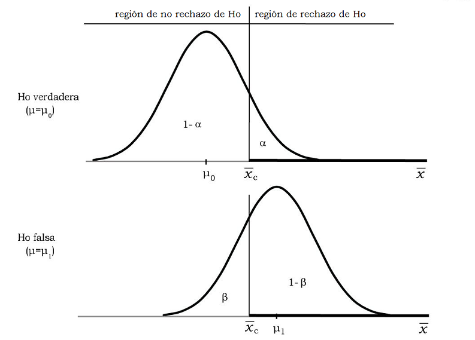
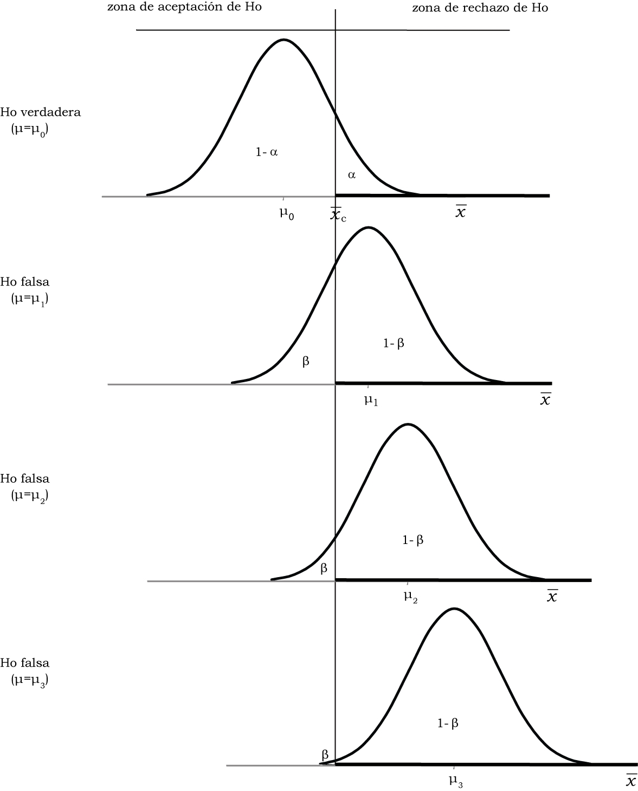
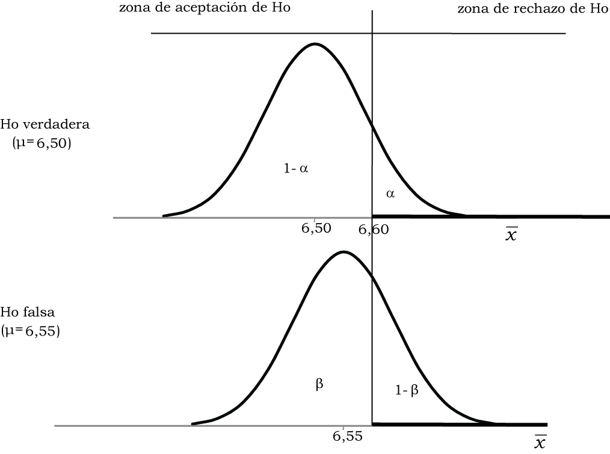

---
output:
  pdf_document: default
---

```{r message=FALSE, warning=FALSE, include=FALSE}
source("depencias.R")
```

# Prueba de hipótesis: la lógica

En este capítulo ingresamos a uno de los procedimientos de mayor difusión en investigación cuantitativa: la prueba de hipótesis, que se en los mismos principios de estimación de parámetros que fundamentan la construcción de intervalos de confianza, por lo que su objetivo también es hacer uso de resultados muestrales para obtener conocimiento acerca de la población. Este procedimiento no está exento de críticas [@meehl1978,  @gelman2006, @vidgen2016,  @krueger2017,  @greenland2019]; sin embargo es básico para hacer inferencias sobre la población y conserva amplia difusión tanto en ciencias sociales como naturales,  [@Halsey2019]. Las propuestas que existen como técnicas alternativas  que superan las falencias que acusan sus críticos [@Goedhart2018], requieren que se tenga dominio de las pruebas de hipótesis.

## El razonamiento de la prueba de hipótesis

La prueba de hipótesis tiene como objetivo el de proveer argumentos para
decidir en contextos de incertidumbre. A partir de lo que sabemos sobre
las distribuciones en el muestreo, ése es el caso cuando necesitamos
concluir acerca de una población, a partir de información que tenemos
disponible en una muestra aleatoria. El resultado de la prueba permitirá
decidir si lo que se observa en la muestra es compatible con una
aseveración hipotética sobre la población. Nunca será posible decidir de
manera taxativa que la hipótesis es verdadera, eso es algo que no
podemos saber; por el contrario, podemos ver hasta qué punto lo que
observamos en la muestra contradice -o no- lo que se afirma a escala
poblacional. Es decir que podremos descartar una hipótesis por no ser
compatible con lo que se observa, pero no a la inversa: no será posible
"confirmar" una hipótesis, solo podremos concluir que la evidencia *no la contradice*, lo que también se expresa diciendo que *no hay evidencia para rechazarla*.

Empezaremos con ejemplos no muy cercanos a la investigación social cuantitativa, para mostrar que esta forma de razonar no es ajena a lo cotidiano. Una prueba de hipótesis puede compararse con un juicio penal: la persona acusada no es condenada hasta que no hay evidencia suficiente para hacerlo. La evidencia (las pruebas, en el lenguaje de la justicia) rara vez son completas, se trata de información fragmentada, sujeta a interpretaciones diferentes. En el inicio del juicio, "la persona acusada es inocente", en nuestra notación llamaremos a esa afirmación, **hipótesis nula**, y la indicaremos $H_{0}$. Esta expresión indica que se trata de un estado inicial: toda persona es inocente hasta que se prueba lo contrario, por lo que la hipótesis nula señala que esta persona en particular (la acusada), no es diferente de cualquiera que no ha cometido delito. Mientras no haya pruebas suficientes, la hipótesis nula se considerará aceptada. En el juicio, la fiscalía aportará pruebas en dirección contraria a esta hipótesis. Buscará información para probar que debe rechazarse la hipótesis nula y condenar a la persona acusada. Difícilmente estarán a la vista
todos los datos necesarios para reconstruir la situación y dar una
respuesta absolutamente inequívoca, pero si hay suficiente evidencia, se dará la hipótesis nula por rechazada. La decisión de condenar a la persona acusada solo se tomará cuando haya muy poco riesgo de equivocarse, cuando la probabilidad de decidir de manera errada sea muy pequeña.

En este ejemplo, la población es el conjunto completo de información necesaria para tomar la decisión de manera certera, sin error. Se trataría de un conjunto infinito de datos que permitiría la reconstrucción exacta de los hechos en los que participó la persona acusada. Por cierto, esa información nunca está disponible, por lo que la decisión debe tomarse a partir de un fragmento de ella, que son las pruebas que han podido reunirse (la evidencia). En la analogía que hacemos con nuestros procedimientos, esta evidencia constituye la
muestra a partir de la que se juzgará la hipótesis nula: rechazarla o no 
rechazarla. La muestra constituye el fragmento de información
disponible, solo que en el caso de la estimación, ésta es obtenida con
procedimientos que buscan su representatividad.

Otro ejemplo: tenemos dudas sobre lo equilibrada que pueda estar una
moneda que va a usarse en un juego de azar. Repitiendo la notación del
ejemplo anterior, formularemos una hipótesis nula que dice que X sale
con la misma frecuencia que C, que equivale a decir que hasta que no se
pruebe lo contrario, X no tiene ninguna diferencia con C, la moneda está
equilibrada. Esta hipótesis nula puede escribirse de manera formal,
porque "salir con la misma frecuencia que C" equivale a decir que, "en
infinitas tiradas, la mitad de la veces saldrá X", por lo que
escribiremos nuestra hipótesis nula así: $H_0: P=1/2$, a la que leeremos
"la hipótesis nula afirma que la proporción de veces que saldrá cara es
1/2". Como no es posible arrojar la moneda infinitas veces, generamos un conjunto de datos para hacer la prueba, tirando al moneda un nùmero finito de veces, digamos cien veces, esa es la muestra de tiradas.  
Al arrojarla 100 veces esperaríamos -si la hipótesis nula se sostiene-, que
salga aproximadamente 50 veces X. Las 100 tiradas son una muestra de las
infinitas tiradas de la moneda, por lo que posiblemente no salga
exactamente 50 veces X, podría salir 51 veces ó 52 y serían resultados
esperables, debido a fluctuaciones propias del azar. Pero si de las 100
tiradas sale 80 veces X, concluiremos con pocas dudas que hay que
rechazar la hipótesis nula. A la misma conclusión llegaríamos si, de 100
tiradas, solo sale 25 veces X. La pregunta que nos ayudará a responder
el procedimiento de prueba de hipótesis es ¿cuántas más o menos veces
que 50 debería salir X para que consideremos que tenemos "suficiente
evidencia", para creer que la moneda no está equilibrada?

La lógica de la prueba de hipótesis consiste en plantear el escenario en el que $H_{0}$ es verdadera y observar cuán probable es lo que hallamos en la muestra en ese caso. En el primer ejemplo el planteo es ¿cuán probable sería haber hallado *estas pruebas* (la evidencia) contra la persona acusada, si ésta fuera inocente? En el segundo preguntamos ¿cuán probable habría sido hallar *esta cantidad de veces* que salió $X$, si la moneda estuviera equilibrada? De manera general la pregunta es ¿cuán probable sería *éste resultado muestral* si la hipótesis nula fuera cierta?

Si la respuesta a esas preguntas es "muy probable", la decisión será la
de no rechazar la hipótesis nula, porque los resultados muestrales
hallados serían esperables (muy probables) bajo $H_{0}$. Al contrario, si la respuesta es "muy poco probable" decidiremos rechazar $H_{0}$, ya que se trata de un resultado poco esperable si $H_{0}$ fuera cierta.

En investigación, la prueba de hipótesis suele formularse de tal modo
que rechazar $H_{0}$ implica aportar un nuevo hallazgo, por el contrario, no rechazar $H_{0}$ equivale a que no hay cambios respecto de alguna situación inicial.

Algunos ejemplos de hipótesis nulas:

- Esta droga no produce ningún efecto sobre la memoria.

- La técnica terapéutica A es igualmente eficaz que la B.

- Los métodos A y B para enseñar a leer en la escuela primaria producen iguales resultados.

- La proporción de votos que obtendrá un partido politico no ha variado respecto de las últimas elecciones.

- Un programa de potabilización de agua no reduce la diarrea infantil.

- La edad no hace diferencia en las orientaciones políticas de las  personas.

- Un plan de capacitación para madres que se ha implementado no tiene efecto en el desarrollo de sus hijas o hijos.


En casi todos los casos, la expectativa de la investigación está en
rechazar la $H_{0}$, porque eso significa que se ha hallado algo de interés: que la droga produce efectos, que hay técnicas terapéuticas mejores que otras y por tanto recomendables, que se pueden elegir mejores métodos para enseñar a leer, que el favor del electorado hacia un partido político es más o menos extendido, que el programa de potabilización mejoró la salud infantil, que la edad es un factor explicativo de las diferencias ideológicas, que el plan de capacitación impactó (positivamente).  

||
|:--:|
| La hipótesis nula es una **afirmación** sobre un **parámetro** que indica ausencia de diferencia en ralción a cierto valor de referencia. |

El sentido de esa diferencia difiere según el tipo de prueba, veremos
que hay pruebas que confrontan con valores históricos o con promedios
generales o bien que realizan comparaciones entre grupos. En todos los
casos la hipótesis nula afirma algo que puede expresarse como "no hay
diferencia", o "no hay cambio" o "no hay relación".

Hasta este punto se trata de la definición original de estas pruebas,
desarrolladas inicialmente por Sir Ronald @Fisher a las que llamó
*pruebas de significación*. La idea básica es la de comparar los datos
observados con la hipótesis que se pone a prueba. Fisher las ideó como
manera de medir el grado de incompatibilidad de un conjunto de datos con la hipótesis nula, evaluando la probabilidad de hallar resultados como los observados o más extremos, si la hipótesis nula fuera cierta. Si esa probabilidad es muy pequeña, puede suceder que la muestra que se
seleccionó haya sido excepcional, o bien que la afirmación hipotética
sea falsa. Fisher argumentó que se trataba de un método objetivo para
poner a prueba teorías y que puede ser usado en diferentes campos de
conocimiento.

Con posterioridad a Fisher, @neyman1928 introducen dos
cambios importantes en el procedimiento.

- El primero consiste en tratar a las prueba no ya como métodos para
validar teorías, sino como reglas de decisión, es decir, criterios que
permiten decidir en las situaciones en que no se cuenta con toda la
información necesaria.

- El segundo cambio consiste en oponer a la hipótesis nula, otra hipótesis, llamada hipótesis alternativa, a la que se indica como $H_{1}$, que es hacia la que se suma evidencia cuando se rechaza $H_{0}$.

Veamos la aplicación de este modelo, que es el que usaremos a partir de
ahora. La afirmación "los niños y las niñas que provienen de hogares con alto nivel de educación tienen rendimiento en la escuela superior al promedio general" es una hipótesis, porque pretende tener carácter general, hace
referencia a la población de quienes están en la escuela, quienes asisten ahora y quienes asistirán en el futuro; no podemos observar a la población completa, por lo tanto la hipótesis no puede probarse de manera definitiva, solo puede hacerse a partir de una muestra. Para formalizar
esa hipótesis, construiremos una $H_{0}$ que niegue cualquier diferencia: "el rendimiento de los niños y las niñas que provienen de hogares de alto nivel educativo es el mismo que el del promedio". A esta hipótesis, opondremos otra, que afirme "los niños y las niñas que provienen de hogares de alto nivel educativo tienen rendimiento superior al promedio". A esta última llamaremos hipótesis alternativa, $H_{1}$. Así formalizamos el planteo del problema.

Supongamos ahora que conocemos ese rendimiento promedio, medido por el
puntaje en las pruebas y que vale 60 puntos para la población completa
de estudiantes, de un nivel determinado al que se acota la investigación. De modo que podemos formular las hipótesis ahora así:

$H_{0}$: "El rendimiento promedio de los niños y las niñas que provienen de hogares de alto nivel educativo es de 60 puntos"

$H_{1}$: "El rendimiento promedio de los niños y las niñas que provienen de hogares de alto nivel educativo es superior a 60 puntos"

Para poner a prueba la hipótesis tomaremos una muestra de niños y niñas que provienen de hogares de alto nivel educativo y veremos si su rendimiento es superior a 60 puntos. Supongamos que en la muestra hallamos una media de 62 puntos, ¿hay razón suficiente para rechazar la $H_{0}$? La respuesta no es inmediata, porque, si bien 62 es mayor que 60, una diferencia de solo 2 puntos parece demasiado pequeña y podríamos atribuirla al azar. Aquí nos interesa evaluar la probabilidad de ocurrencia del resultado que se
observa, si la hipótesis nula fuera cierta. En este caso será: "Si quienes provienen de familias con alto nivel de educación tuvieran el mismo rendimiento que el promedio ($H_{0}$ verdadera), entonces una diferencia de 2 puntos en el promedio muestral es probable, es esperable, puede deberse a la variabilidad propia de los datos muestrales. En consecuencia, esa diferencia no es suficiente para rechazar la $H_{0}$". En otros términos: "Si quienes vienen de familias con mucha educación tuvieran un rendimiento promedio de 60 puntos, no sería de extrañar que una muestra arroje un resultado de 62 puntos". Dicho de otro modo: el resultado muestral no se aleja tanto de lo que esperaríamos si la $H_{0}$ fuera cierta, por lo tanto, no podemos rechazarla y concluimos que los niños y las niñas que provienen de hogares de alto nivel educativo no difieren en su rendimiento escolar del promedio general.

Un elemento de mucha importancia es recordar que la hipótesis hace
referencia a la población, mientras que la información disponible es muestral, y sabemos que los resultados muestrales difieren de los valores paramétricos porque son variables aleatorias.

¿Qué habría sucedido si hubiésemos observado que el grupo de quienes vienen de familias muy educadas tiene un rendimiento promedio de 95
puntos? Este resultado se aleja mucho de 60 que es el que sostiene $H_{0}$, es decir, si el hipotético fuera verdadero, sería muy poco probable hallar una muestra que promedie 95 puntos. En consecuencia seguramente rechazaríamos la $H_{0}$.

Al realizar pruebas de hipótesis, en lugar de evaluar intuitivamente si
un valor muestral está cerca o lejos del valor hipotético, lo que
haremos será evaluar cuál sería la probabilidad de hallarlo si fuera
cierta la hipótesis nula. Cuando esta probabilidad sea grande no habrá
evidencia para rechazarla, cuando sea pequeña decidiremos rechazarla.
¿Cuán grande o pequeña? Es de lo que nos ocuparemos a continuación.

Para realizar una prueba de hipótesis, necesitamos calcular la
probabilidad del valor observado, si $H_{0}$ fuera cierta, es decir, si el
parámetro tuviera ese valor (el que señala $H_{0}$). Es una probabilidad condicional que podemos por ahora escribir así:

$$P(observado/la\:hipotesis\:nula\:es\:verdadera)$$

Luego haremos más precisa esta expresión.

Comenzaremos con el ejemplo de una prueba de hipótesis sobre la media de una variable cuantitativa y luego acerca de la proporción para una
categoría de una variable nominal.

## Prueba sobre la media

Ejemplo (datos ficticios): para una determinada carrera universitaria,
el tiempo promedio para completarla ha sido, históricamente, de 7.30 años. Decimos históricamente para indicar que son datos acumulados
por largo tiempo y que provienen de los registros de la facultad de años atrás. Se ha introducido un cambio en el plan de estudios de la carrera
y puede creerse que con esa modificación, el tiempo para terminar la carrera haya cambiado. Tenemos entonces un promedio de la población de
quienes se recibieron en las anteriores condiciones, es una media
poblacional porque describe al conjunto completo de quienes se recibieron con ese plan, que ya caducó. El objetivo es hacer inferencia sobre la media
poblacional de quienes cursan con el nuevo plan, que no son totalmente accesibles, porque hay quienes están cursando y quienes lo harán en el futuro (porque el nuevo plan seguirá vigente durante los próximos años), por lo que de esa población solo puede conocerse a una muestra de quienes ya han egresado y ver cuánto tiempo han tardado en terminar la carrera.

La hipótesis nula es:

$$H_{0}:\mu = 7.30$$
A la que oponemos una hipótesis alternativa: 

$$H_{1}:\mu \neq 7.30$$

La hipótesis nula indica que la media poblacional de quienes
cursan con el nuevo plan es la misma que antes, que no hay diferencia,
que no hay cambios. La hipótesis alternativa afirma lo contrario: que el tiempo promedio que tardan en terminar la carrera quienes la cursan con el nuevo plan es diferente a los 7.30 años históricos. No anticipamos si aumentó o disminuyó el tiempo para recibirse, solo que no es el mismo que con el plan viejo.

Ambas son afirmaciones sobre la población (sobre el parámetro media poblacional), por eso son hipótesis.

Si la hipótesis nula fuera cierta, por lo que sabemos sobre las
distribuciones en el muestreo, la siguiente sería la distribución de las medias muestrales:

```{r echo=FALSE, message=FALSE, warning=FALSE, fig.cap="Distribución de las medias muestrales bajo la hipótesis nula"}
ggplot(data = data.frame(z = c(-4, 4)), aes(z)) +
  stat_function(fun = dnorm) +
  ylab("") + xlab("") + scale_x_discrete(breaks = NULL) +
  geom_segment(x = -4, xend = 4, y = 0, yend = 0) +
  scale_y_continuous(breaks = NULL) + theme_tufte() +
  geom_text(aes(label = TeX("$\\mu =7.30$", output = "character")), x = 0, y = -.019, parse = TRUE) +
  geom_text(aes(label = TeX("$\\bar{x}", output = "character")), x = 3.5, y = -.02, parse = TRUE) +
  annotate(geom = "rect", xmin = -.01, xmax = .01, ymin = -.01, ymax = .01, col = "red")
```

La campana está centrada en la media hipotética, que es el escenario en el que $H_{0}$ es verdadera. La probabilidad que la curva asigna a los diferentes valores de $\overline{x}$, quiere decir que "lo más probable" sería hallar a la media muestral (la única que tendremos como dato) alrededor de 7.30. Hay poca probabilidad de encontrar valores muy
lejanos a 7.30, como lo muestran las áreas decrecientes, a medida que
nos alejamos de la media hipotética. Por esta razón, para decidir si un
resultado muestral se aleja mucho o poco del valor paramétrico,
deberemos determinar si es poco probable o muy probable. Será
equivalente decir que un valor se aleja mucho de la media hipotética que decir que se trataría de un valor poco probable, si la media fuera la que propone la $H_{0}$.

||
|:--:|
| Afirmar que un valor muestral **se aleja mucho del valor poblacional** equivale a decir que **sería muy poco probable si el valor poblacional fuera el hipotético**. |

A fin de realizar la prueba de hipótesis debemos obtener una muestra.
Supongamos que seleccionamos 100 personas que han terminado la carrera (usando un muestreo irrestricto aleatorio) y que encontramos un tiempo promedio ha sido de 7.50 años con una desviación estándar de 1.30
años ($\overline{x} = 7.50$ y $s = 1.30$). Debemos tener un criterio
para decidir si este valor observado es compatible con la hipótesis nula ($\mu = 7.30$) o si constituye evidencia suficiente para rechazarla en favor de la hipótesis alternativa ($\mu \neq 7.30$). El criterio es el de ver cuán probable sería este valor observado si la hipótesis nula fuera cierta. En consecuencia, debemos calcular la probabilidad que tiene $\overline{x}$ de asumir el valor observado. Sin embargo, no es posible hallar probabilidades para valores únicos de una variable continua, por lo que buscaremos la probabilidad de hallar valores como el observado ($\overline{x}=7.50$) *o más extremos que él*. Esto significa que nos preguntamos por la probabilidad que tiene la variable $\overline{x}$ de asumir el valor 7.50 *o uno más extremo*, -es decir un valor que se aleje más de la media hipotética-, si $H_{0}$ es verdadera. Tengamos muy presente que:  

**alejado $\rightarrow$ poco probable si $H_{0}$ fuera cierta**

Por eso, los valores alejados se encuentran en los extremos de la distribución de $\overline{x}$, bajo el supuesto de $H_{0}$ verdadera (es decir, centrada en la media hipotética).

Para decidir si la evidencia hallada en la muestra es suficiente para
rechazar la hipótesis nula, vamos a establecer a priori un valor máximo
para la probabilidad de ocurrencia del valor muestral, o lo que es lo
mismo, un valor máximo para el área extrema donde consideraremos que se
encuentran los valores "alejados".

**¿cuán alejado? $\rightarrow$ ¿cuán poco probable?**

### La toma de decisión

La $H_{0}$ se rechaza si hay poca probabilidad de hallar un valor como el observado o uno más extremo que él. Lo que llamamos poca probabilidad,
puede establecerse a priori, por ejemplo en 0.05. Eso indica que
consideraremos a los resultados con probabilidad menor a 0.05 como muy
improbables de hallar si $H_{0}$ fuera cierta y, cuando los hallemos, la decisión será
rechazarla. Por el contrario, si encontramos valores cuya probabilidad
de ocurrencia es superior a 0.05, los trataremos como valores esperables y nos conducirán a no rechazar la $H_{0}$.

Como sabemos de la distribución normal, los valores de $z = \pm 1.96$ delimitan un área central de 95%, es decir que dejan fuera un área de 5%. Los valores de $z$ superiores a 1.96 ó inferiores a -1.96 tienen una probabilidad de ocurrencia de 0.05, repartida en las dos "colas" de la distribución normal.

```{r echo=FALSE, message=FALSE, warning=FALSE, fig.cap="Áreas extremas que totalizan una probabilidad de 0.05"}
ggplot(data = data.frame(z = c(-4, 4)), aes(z)) +
  geom_area(stat = "function", fun = dnorm, fill = "green", xlim = c(-4, qnorm(.025)), col = "black") +
  geom_area(stat = "function", fun = dnorm, fill = "white", xlim = c(qnorm(.025), qnorm(.975)), col = "black") +
  geom_area(stat = "function", fun = dnorm, fill = "green", xlim = c(qnorm(.975), 4), col = "black") +
  ylab("") + xlab("") + scale_x_discrete(breaks = NULL) +
  geom_segment(x = -4, xend = 4, y = 0, yend = 0) +
  geom_segment(x = qnorm(.975), xend = qnorm(.975), y = 0, yend = dnorm(qnorm(.975))) +
  geom_segment(x = qnorm(.025), xend = qnorm(.025), y = 0, yend = dnorm(qnorm(.025))) +
  scale_y_continuous(breaks = NULL) + theme_tufte() +
  geom_text(aes(label = "0"), x = 0, y = -.019) +
  geom_text(aes(label = "-1.96"), x = -1.96, y = -.019) +
  geom_text(aes(label = "1.96"), x = 1.96, y = -.019) +
  geom_text(aes(label = "z"), x = 3.5, y = -.01) + geom_text(aes(label = "0.025"), x = 2.35, y = .023, size = 4) + geom_text(aes(label = "0.025"), x = -2.35, y = .023, size = 4) +
  annotate(geom = "rect", xmin = -.01, xmax = .01, ymin = -.01, ymax = .01, col = "red")
```

Los valores de $\overline{x}$ que correspondan a puntajes *z* que
superen a 1.96 ó sean inferiores a -1.96 serán valores con probabilidad
menor a 0.05, por lo que serán considerados como poco probables y
conducirán a rechazar $H_{0}$. Por el contrario, los valores que tengan $z$ comprendido entre -1.96 y 1.96 serán probables y llevarán a no rechazar $H_{0}$. Estos dos puntos (-1.96 y 1.96) se denominan **valores críticos** de $z$ y se indican con un subíndice: $z_{c}$.

En nuestro ejemplo, el valor observado es $\overline{x} = 7.50$, de aquí en adelante lo llamaremos ${\overline{x}}_{obs}$ (el valor de la
media observado en la muestra). El puntaje $z$ equivalente a ese
${\overline{x}}_{obs}$ se llama $z$ observado, se indica como $z_{obs}$, y vale:

$$z_{obs} = \frac{{\overline{x}}_{obs} - \mu}{\frac{s}{\sqrt{n}}} = \frac{7.50 - 7.30}{\frac{1.30}{\sqrt{100}}} = 1.54$$

Se trata de la transformación a puntaje $z$ del valor observado de la
media muestral, que mide a cuántas desviaciones estándar se encuentra $\bar{x}$ de la media hipotética $\mu$. Se conoce con el nombre de **estadístico de prueba**.

Este puntaje no está en la zona extrema, porque no va más allá de 1.96;
por el contrario, está entre -1.96 y 1.96 que pertenece a la parte de
valores centrales de la distribución, los más probables. En
consecuencia, la decisión es la de no rechazar $H_{0}$ y concluir que no hay evidencia para creer que el tiempo se tarda en completar la carrera haya cambiado respecto del valor histórico. Dicho de otra manera, el valor observado de
${\overline{x}}_{obs} = 7.50$ es un resultado esperable si la
media poblacional fuera de $7.30$. Una media muestral de $7.50$ es compatible con una media problacional de $7.30$.

Por la forma en que hemos razonado y tomado la decisión, se comprende
que a los valores de $z$ comprendidos entre -1.96 y 1.96 se los denomine **zona de no rechazo de $H_{0}$**. El otro conjunto de valores de $z$, los mayores a 1.96 junto a los menores a -1.96, constituyen la **zona de rechazo de $H_{0}$**.

Luego de haber considerado a 0.05 como la probabilidad a la que llamamos "pequeña", quedaron determinados los
valores de $z_{c}$ que indican las zonas de rechazo y de no rechazo.  

||
|:--:|
| La **zona de rechazo de $H_{0}$** es el conjunto de valores extremos de la distribución, donde es poco probable encontrar los valores muestrales si $H_{0}$ es verdadera. |

||
|:--:|
| La **zona de no rechazo de $H_{0}$** es el conjunto de valores centrales de la distribución, donde es más probable encontrar los valores muestrales si $H_{0}$ es verdadera. Es el conjunto de valores muestrales que son compatibles con el valor paramétrico que sostiene la $H_{0}$. |

Luego de eso, el procedimiento que seguimos fue: calcular el puntaje $z$ que corresponde al valor observado de $\overline{x}$, y luego ver si éste se encuentra en la zona de rechazo o de no rechazo de $H_{0}$.

La probabilidad 0.05 como valor pequeño fue una elección y podría haber
sido diferente; ese número tiene una larga tradición histórica, Fisher
lo usaba regularmente, aunque aclarando que no era obligatorio y que no
hay nada especial para elegirlo[^82]. Se conoce como **nivel de significación** y se indica con la letra $\alpha$ (alfa). Es la
probabilidad de hallar un valor como el observado o más extremo que él,
si la hipótesis nula fuera cierta, por lo que es una probabilidad
condicional que ahora escribimos como:

$$P(z\leq -1.96 \cup z\geq 1.96 / H_{0} V)=0.05$$


De esta expresión es importante recordar que $\alpha$ mide la probabilidad de hallar a $z$ en la región de rechazo (más allá de los puntos críticos) si $H_{0}$ es verdadera.

El valor que elijamos para $\alpha$ indica a qué valores vamos a considerar como poco probables: en este caso se trata de valores tan poco probables como el 5%. Puede usarse un nivel de significación diferente, por ejemplo del 10% y los valores críticos de $z$ serán diferentes. En efecto los puntos que dejan un área extrema del 10% son $z_{c}=\pm1.64$.

En ese caso escribiremos:

$$P(z\leq -1.64 \cup z\geq 1.64 / H_{0} V)=0.10$$


||
|:--:|
| Se llama **nivel de significación** a la probabilidad de hallar al valor muestral en la zona de rechazo de $H_{0}$, si $H_{0}$ es verdadera. Se indica como $\alpha$, y es elegido por el equipo de investigación. |

```{r echo=FALSE, message=FALSE, warning=FALSE, fig.cap="Áreas extremas que totalizan una probabilidad de 0.10"}
ggplot(data = data.frame(z = c(-4, 4)), aes(z)) +
  geom_area(stat = "function", fun = dnorm, fill = "green", xlim = c(-4, qnorm(.05)), col = "black") +
  geom_area(stat = "function", fun = dnorm, fill = "white", xlim = c(qnorm(.05), qnorm(.95)), col = "black") +
  geom_area(stat = "function", fun = dnorm, fill = "green", xlim = c(qnorm(.95), 4), col = "black") +
  ylab("") + xlab("") + scale_x_discrete(breaks = NULL) +
  geom_segment(x = -4, xend = 4, y = 0, yend = 0) +
  geom_segment(x = qnorm(.95), xend = qnorm(.95), y = 0, yend = dnorm(qnorm(.95))) +
  geom_segment(x = qnorm(.05), xend = qnorm(.05), y = 0, yend = dnorm(qnorm(.05))) +
  scale_y_continuous(breaks = NULL) + theme_tufte() +
  geom_text(aes(label = "0"), x = 0, y = -.019) +
  geom_text(aes(label = "-1.64"), x = -1.64, y = -.019) +
  geom_text(aes(label = "1.64"), x = 1.64, y = -.019) +
  geom_text(aes(label = "z"), x = 3.5, y = -.01) + geom_text(aes(label = "0.05"), x = 2, y = .023, size = 4) + geom_text(aes(label = "0.05"), x = -2, y = .023, size = 4) +
  annotate(geom = "rect", xmin = -.01, xmax = .01, ymin = -.01, ymax = .01, col = "red")
```

Por lo que, si el nivel de significación es $0.10$ ($\alpha=0.10$), la zona de no rechazo de $H_{0}$ es el conjunto de valores $z$ comprendidos entre -1.64 y 1.64 (centrales), mientras que la zona de rechazo de $H_{0}$ son los $z$ menores a -1.64 y los mayores a 1.64 (los valores extremos cuya probabilidad es el área sombreada en el gráfico). El valor muestral del ejemplo ($z_{obs} = - 1.54$) está también en la zona de no rechazo para este nivel, por lo que tampoco se rechaza la $H_{0}$ a un nivel de significación de 0.10.

Otro nivel de significación que suele usarse es del 1%. Para él, los
valores de $z$ son $\pm2.56$, por lo que la regla de decisión será: "si el valor de $z$ correspondiente al valor observado de $\overline{x}$ está entre -2.56 y 2.56 no se debe rechazar la $H_{0}$, mientras que si es menor a -2.56 o superior a 2.56 sí debe rechazarse la $H_{0}$.

Expresamos la probabilidad condicional como:

$$P(z\leq -2.56 \cup z\geq 2.56 / H_{0} V)=0.01$$

Al igual que en los casos anteriores, cuando se expresan en términos de
puntajes *z*, estos valores son fijos; no dependen de los resultados
muestrales que se encuentren, constituyen una regla de decisión
establecida a priori.  
Cuanto más pequeño se elige $\alpha$, tanto más exigente
es la prueba, en el sentido de que solo rechaza la hipótesis de
no-diferencia si se observan valores muy alejados del hipotético. Por el contrario, un $\alpha=0.10$ se considera un nivel tolerante, porque demanda menos alejamiento para decidir rechazar la $H_0$.

De manera general, si llamamos $z_{\alpha/2}$ al puntaje $z$ que corresponde a un área acumulada de $\alpha/2$ de la distribución normal estándar (el percentil $\alpha/2$) y $z_{(1-\alpha/2)}$ al percentil: $(1-\alpha/2)$, la expresión queda:

$$P(z\leq z_{\alpha/2} \cup z\geq z_{(1-\alpha/2)} / H_{0} V)=\alpha $$

Y las representaciones gráficas de las áreas de rechazo para los tres niveles de significación mencionados son:  

```{r echo=FALSE, message=FALSE, warning=FALSE, fig.cap="Comparación de las zonas de rechazo de $H_{0}$ con niveles de significación del 10, del 5 y del 1%"}

graf_prueb_hip_10 <- ggplot(data = data.frame(z = c(-4, 4)), aes(z)) +
  geom_area(stat = "function", fun = dnorm, fill = "green", xlim = c(-4, qnorm(.05)), col = "black") +
  geom_area(stat = "function", fun = dnorm, fill = "white", xlim = c(qnorm(.05), qnorm(.95)), col = "black") +
  geom_area(stat = "function", fun = dnorm, fill = "green", xlim = c(qnorm(.95), 4), col = "black") +
  ylab("") + xlab("") + scale_x_discrete(breaks = NULL) +
  geom_segment(x = -4, xend = 4, y = 0, yend = 0) +
  geom_segment(x = qnorm(.95), xend = qnorm(.95), y = 0, yend = dnorm(qnorm(.95))) +
  geom_segment(x = qnorm(.05), xend = qnorm(.05), y = 0, yend = dnorm(qnorm(.05))) +
  scale_y_continuous(breaks = NULL) + theme_tufte() +
  geom_text(aes(label = "0"), x = 0, y = -.019) +
  geom_text(aes(label = "-1.64"), x = -1.64, y = -.019) +
  geom_text(aes(label = "1.64"), x = 1.64, y = -.019) +
  geom_text(aes(label = "z"), x = 3.5, y = -.01) + geom_text(aes(label = "0.05"), x = 2, y = .023, size = 4) + geom_text(aes(label = "0.05"), x = -2, y = .023, size = 4) +
  annotate(geom = "rect", xmin = -.01, xmax = .01, ymin = -.01, ymax = .01, col = "red")


graf_prueb_hip_5 <- ggplot(data = data.frame(z = c(-4, 4)), aes(z)) +
  geom_area(stat = "function", fun = dnorm, fill = "green", xlim = c(-4, qnorm(.025)), col = "black") +
  geom_area(stat = "function", fun = dnorm, fill = "white", xlim = c(qnorm(.025), qnorm(.975)), col = "black") +
  geom_area(stat = "function", fun = dnorm, fill = "green", xlim = c(qnorm(.975), 4), col = "black") +
  ylab("") + xlab("") + scale_x_discrete(breaks = NULL) +
  geom_segment(x = -4, xend = 4, y = 0, yend = 0) +
  geom_segment(x = qnorm(.975), xend = qnorm(.975), y = 0, yend = dnorm(qnorm(.975))) +
  geom_segment(x = qnorm(.025), xend = qnorm(.025), y = 0, yend = dnorm(qnorm(.025))) +
  scale_y_continuous(breaks = NULL) + theme_tufte() +
  geom_text(aes(label = "0"), x = 0, y = -.019) +
  geom_text(aes(label = "-1.96"), x = -1.96, y = -.019) +
  geom_text(aes(label = "1.96"), x = 1.96, y = -.019) +
  geom_text(aes(label = "z"), x = 3.5, y = -.01) + geom_text(aes(label = "0.025"), x = 2.22, y = .011, size = 4) + geom_text(aes(label = "0.025"), x = -2.22, y = .011, size = 4) +
  annotate(geom = "rect", xmin = -.01, xmax = .01, ymin = -.01, ymax = .01, col = "red")


graf_prueb_hip_1 <- ggplot(data = data.frame(z = c(-4, 4)), aes(z)) +
  geom_area(stat = "function", fun = dnorm, fill = "green", xlim = c(-4, qnorm(.005)), col = "black") +
  geom_area(stat = "function", fun = dnorm, fill = "white", xlim = c(qnorm(.005), qnorm(.995)), col = "black") +
  geom_area(stat = "function", fun = dnorm, fill = "green", xlim = c(qnorm(.995), 4), col = "black") +
  ylab("") + xlab("") + scale_x_discrete(breaks = NULL) +
  geom_segment(x = -4, xend = 4, y = 0, yend = 0) +
  geom_segment(x = qnorm(.995), xend = qnorm(.995), y = 0, yend = dnorm(qnorm(.995))) +
  geom_segment(x = qnorm(.005), xend = qnorm(.005), y = 0, yend = dnorm(qnorm(.005))) +
  scale_y_continuous(breaks = NULL) + theme_tufte() +
  geom_text(aes(label = "0"), x = 0, y = -.019) +
  geom_text(aes(label = "-2.56"), x = -2.56, y = -.019) +
  geom_text(aes(label = "2.56"), x = 2.56, y = -.019) +
  geom_text(aes(label = "z"), x = 3.5, y = -.01) + geom_text(aes(label = "0.005"), x = 3, y = .02, size = 4) + geom_text(aes(label = "0.005"), x = -3, y = .02, size = 4) +
  annotate(geom = "rect", xmin = -.01, xmax = .01, ymin = -.01, ymax = .01, col = "red")

graf_prueb_hip_10
graf_prueb_hip_5
graf_prueb_hip_1
```


Ejemplo (datos ficticios): para la misma carrera universitaria del
ejemplo anterior, el promedio de calificaciones al egreso era, según registros históricos, de 6.50. Nos
preguntamos si, luego del cambio en el plan de estudios, esta nota
promedio ha cambiado o sigue siendo la misma. El planteo de las
hipótesis será ahora:

$$H_{0}:\ \mu = 6.50$$

$$H_{1}:\ \mu \neq 6.50$$

Por la misma razón que antes, no podemos analizar a la población
completa, usaremos los datos obtenidos en una muestra. En ella
encontramos, por ejemplo, que el promedio de 100 egresadas y egresados es de
6.65 con desviación estándar de 0.60, es decir:
$\overline{x} = 6.65$ y $s = 0.60$. A un nivel de significación del 5%,
los puntos críticos vuelven a ser $Z_{c}=\pm1.96$. Buscamos el
estadístico de prueba transformando el valor observado de $\overline{x}$ a puntaje $z$ y encontramos:

$$z_{obs} = \frac{{\overline{x}}_{obs} - \mu}{\frac{s}{\sqrt{n}}} = \frac{6.65 - 6.50}{\frac{0.6}{\sqrt{100}}} = 2.50$$

El valor observado de $\overline{x}$ corresponde entonces a un $z$ que
supera al punto crítico (que es $z_{c}=1.96$), por lo que está en la zona de rechazo de $H_{0}$. La decisión es rechazar $H_{0}$ y concluir que el promedio al egreso es actualmente diferente del promedio histórico.

En los dos ejemplos vemos que la regla de decisión depende del nivel de
significación. Cuando se fija en el 5% entonces se puede expresar como
"si el valor de $z$ correspondiente al valor observado de $\overline{x}$ está entre -1.96 y 1.96 no se puede rechazar $H_{0}$, si es menor a -1.96 o superior a 1.96 se debe rechazar la $H_{0}$". Cuando el nivel de significación es del 10%, diremos que "si el valor $z$ correspondiente al valor observado de $\overline{x}$ está entre -1.64 y 1.64 no se puede rechazar $H_{0}$, si es menor a -1.64 o superior a 1.64 se debe rechazar $H_{0}$.

Veamos más en detalle el significado de esta probabilidad que hemos
fijado en 0.05 y que puede también elegirse en 0.10 ó en 0.01 y que
llamamos $\alpha$. Se trata de la probabilidad de hallar el valor observado en la muestra (o uno más extremo a él) si $H_{0}$ fuera verdadera, por lo que cada vez que hallemos valores muestrales que se encuentran allí, tomaremos la decisión de rechazar $H_{0}$. Si la hipótesis nula fuera efectivamente verdadera, la decisión sería incorrecta, pero a eso no lo sabemos, porque nunca conocemos el verdadero valor del parámetro. Aunque sí podemos afirmar que al fijar $\alpha$ en el 5%, ésas serán las chances de equivocarnos rechazando una hipótesis nula que era verdadera. En el
segundo ejemplo, cuyo resultado fue el de rechazar $H_{0}$, es muy
importante indicar a qué nivel de significación se toma la decisión,
porque ese número (5%) indica la probabilidad de haber tomado la
decisión erróneamente. Mide la probabilidad de haber encontrado el
promedio muestral de 6.65 por azar. Como esa probabilidad es pequeña,
decidimos rechazar $H_{0}$.

### Los puntos críticos en términos del estimador

Hay una manera diferente de establecer las zonas de aceptación y
rechazo, que consiste en fijar los puntos críticos en términos de
$\overline{x}$, en lugar de hacerlo como puntajes $z$. Por lo que en lugar
de determinar los dos $z_{c}$, hallaremos los dos valores críticos de
$\overline{x}$, a los que llamaremos ${\overline{x}}_{c}$:

$${\overline{x}}_{c} = \mu \pm z_{c}*\frac{s}{\sqrt{n}}$$

En el ejemplo sobre el tiempo que se tarda en terminar una
carrera y a un nivel de significación de 5%, los valores de
${\overline{x}}_{c}$ son:

$${\overline{x}}_{c} = \mu \pm z_{c}*\frac{s}{\sqrt{n}} = 7.30 \pm 1.96*\frac{1.30}{\sqrt{100}} = 7.30 \pm 0.25$$

Al sumar obtenemos 7.55 y al restar 7.05. Estos son los puntos críticos
expresados en términos de la variable original. La regla de decisión es
ahora "si se encuentra un valor de ${\overline{x}}_{obs}$
comprendido entre 7.05 y 7.55 no se puede rechazar la $H_{0}$. Si el valor observado de ${\overline{x}}_{obs}$ es inferior a 7.05 ó superior
a 7.55 se debe rechazar $H_{0}$.

Para expresarlo como probabilidad condicionada:

$$P((\overline{x} \leq 7.05 \cup \overline{x} \geq 7.55)/\mu=7.30)=0.05$$

Que afirma que la probabilidad de hallar a $\overline{x}$ por debajo de
7.05 o por encima de 7.55 si la media de la población es 7.30, vale
0.05.

Al hacer la prueba, vemos que ${\overline{x}}_{obs} = 7.50$, que
no va más allá de los puntos críticos, por lo que pertenece a la zona de no rechazo de $H_{0}$. Concluimos que no se rechaza $H_{0}$ y que no ha cambiado el tiempo que se tarda en terminar la carrera.

La regla de decisión es la misma que antes, solo que ahora está expresada en el lenguaje de $\overline{x}$ y no de $z$ y la conclusión también es la misma.

Volviendo ahora sobre el caso de los promedios al egreso, para hallar los valores críticos de la media muestral hacemos:

$${\overline{x}}_{c} = \mu \pm z_{c}*\frac{s}{\sqrt{n}} = 6.50 \pm 1.96*\frac{0.60}{\sqrt{100}} = 6.50 \pm 0.12$$

Y resultan: 6.38 y 6.62. El promedio observado fue de 6.65, que supera
al punto crítico superior y se encuentra en la zona de rechazo.
Concluimos que se rechaza la $H_{0}$ y que, con el nuevo plan, la calificación promedio al egreso difiere de la histórica. Nuevamente, es la misma conclusión que si se trabaja sobre $z$.

Comparemos los dos procedimientos:

A. Usando valores críticos de $z$

1.  Habiendo establecido el nivel de significación, determinar los
    valores $z$ que dejan esa probabilidad en los extremos. Éstos son
    los $z_{c}$.

2.  Para hallar el estadístico de prueba, transformar el valor observado de $\overline{x}$ en puntaje $z$ haciendo:

$$z_{\text{obs}} = \frac{{\overline{x}}_{\text{obs}} - \mu}{\frac{s}{\sqrt{n}}}$$

3.  Observar la posición de este valor transformado en la distribución
    de probabilidades z

Para un nivel de significación de 0.05 (ó 5%), en el ejemplo, el gráfico es el \@ref(fig:rechZ):

```{r rechZ, echo=FALSE, message=FALSE, warning=FALSE, fig.cap="Ubicación de la zona de rechazo de $H_{0}$ a un nivel de significación de 0.05, sobre puntajes estándar ($z$), y del valor observado"}
library("ggplot2")
library("ggthemes")

ggplot(data = data.frame(z = c(-4, 4)), aes(z)) +
  geom_area(stat = "function", fun = dnorm, fill = "green", xlim = c(-4, qnorm(.025)), col = "black") +
  geom_area(stat = "function", fun = dnorm, fill = "white", xlim = c(qnorm(.025), qnorm(.975)), col = "black") +
  geom_area(stat = "function", fun = dnorm, fill = "green", xlim = c(qnorm(.975), 4), col = "black") +
  ylab("") + xlab("") + scale_x_discrete(breaks = NULL) +
  geom_segment(x = -4, xend = 4, y = 0, yend = 0) +
  scale_y_continuous(breaks = NULL) + theme_tufte() +
  geom_text(aes(label = "0"), x = 0, y = -.019) +
  geom_text(aes(label = "-1.96"), x = -1.96, y = -.019) +
  geom_text(aes(label = "1.96"), x = 1.96, y = -.019) +
  geom_text(aes(label = "z"), x = 3.5, y = -.01) + geom_text(aes(label = "0.025"), x = 2.25, y = .011, size = 4) + geom_text(aes(label = "0.025"), x = -2.25, y = .011, size = 4) +
  annotate(geom = "rect", xmin = -.01, xmax = .01, ymin = -.01, ymax = .01, col = "red") +
  geom_text(aes(label = TeX("$\\z_{obs} = 1.54$", output = "character")), x = 2, y = .22, parse = TRUE) +
  geom_point(aes(x = 1.54, y = 0), col = "green", size = 5) +
  geom_segment(x = 1.54, xend = 1.54, y = .2, yend = 0, arrow = arrow())
```

B. Usando los valores críticos de $\overline{x}$

1. Habiendo establecido el nivel de significación, determinar los
valores $z$ que dejan esa probabilidad en los extremos. Éstos son los
$z_{c}$.

2. Usar los $z_{c}$ para determinar los correspondientes ${\overline{x}}_{c}$ haciendo:

$${\overline{x}}_{c} = \mu \pm z_{c}*\frac{s}{\sqrt{n}}$$

3. Ver la posición de ${\overline{x}}_{\text{obs}}$ en la distribución
de probabilidades de $\overline{x}$.

Para el nivel de significación de 0.05 y el mismo ejemplo, resulta el gráfico \@ref(fig:rechX).

```{r rechX, echo=FALSE, message=FALSE, warning=FALSE, fig.cap="Ubicación de la zona de rechazo de $H_{0}$ a un nivel de significación de 0.05, sobre valores de la variable $\\overline{x}$, y del valor observado"}

ggplot(data = data.frame(z = c(-4, 4)), aes(z)) +
  geom_area(stat = "function", fun = dnorm, fill = "green", xlim = c(-4, qnorm(.025)), col = "black") +
  geom_area(stat = "function", fun = dnorm, fill = "white", xlim = c(qnorm(.025), qnorm(.975)), col = "black") +
  geom_area(stat = "function", fun = dnorm, fill = "green", xlim = c(qnorm(.975), 4), col = "black") +
  ylab("") + xlab("") + scale_x_discrete(breaks = NULL) +
  geom_segment(x = -4, xend = 4, y = 0, yend = 0) +
  scale_y_continuous(breaks = NULL) + theme_tufte() +
  geom_text(aes(label = "7.3"), x = 0, y = -.019) +
  geom_text(aes(label = "7.04"), x = -1.96, y = -.019) +
  geom_text(aes(label = "7.55"), x = 1.96, y = -.019) +
   geom_text(aes(label = TeX("$\\bar{x}$", output = "character")), x = 3.5, y = -.01, parse = TRUE) +
    geom_text(aes(label = "0.025"), x = 2.25, y = .011, size = 4) + geom_text(aes(label = "0.025"), x = -2.25, y = .011, size = 4) +
    annotate(geom = "rect", xmin = -.01, xmax = .01, ymin = -.01, ymax = .01, col = "red") +
  geom_text(aes(label = TeX("$\\bar{x}_{obs} = 7.5$", output = "character")), x = 2, y = .22, parse = TRUE) +
  geom_text(aes(label = TeX("$\\mu = 7.3", output = "character")), x = 7.3, y = .1, parse = TRUE) +
  geom_point(aes(x = 1.54, y = 0), col = "green", size = 5) +
  geom_segment(x = 1.54, xend = 1.54, y = .2, yend = 0, arrow = arrow())
```


La diferencia entre las dos formas de establecer los puntos críticos es
que con la primera se determinan los valores de $z_{c}$ a partir del
nivel de significación y luego se transforma a puntaje $z$ el valor
muestral observado de ${\overline{x}}_{obs}$.

En el segundo modo, los $z_{c}$ se transforman (al revés) en puntos críticos de ${\overline{x}}_{c}$ y luego se compara el ${\overline{x}}_{obs}$ directamente, sin transformarlo.

Los gráficos \@ref(fig:rechZ) y \@ref(fig:rechX) expresan lo mismo, el primero en el lenguaje estandarizado de $z$, el segundo en el de $\overline{x}$. Los procedimientos son equivalentes y puede vérselos aplicados de manera indiferenciada. Las campanas tienen la escala del eje horizontal ajustada para que mantengan la misma forma, y así quede clara la equivalencia de los procedimientos, pero no debe olvidarse que la variabilidad es diferente entre las dos distribuciones. La primera está estandarizada a uno y la segunda depende de la varianza poblacional y del tamaño de la muestra. La primera corresponde a una normal estándar, con $\sigma = 1$, mientras que, en este ejemplo, la segunda es la distribución normal de las $\overline{x}$, con $\sigma_{\overline{x}} = \frac{\sigma}{\sqrt{n}} = 0.13$.   

### Pruebas unilaterales

A menudo la hipótesis alternativa no expresa solo que la media difiera
del valor hipotético, sino que indica en qué *dirección* se espera que
difiera. Por ejemplo, puede esperarse, en el ejemplo anterior, que la carrera es termine con promedio superior a 6.50, con lo que ahora la $H_{1}$ dirá que $\mu > 6.50$. Se trata en este caso de una prueba unilateral y solo rechazaremos la $H_{0}$ si encontramos valores sustancialmente *mayores* que 6.50. Para el mismo nivel de significación del 5%, el valor $z$ que nos interesa es el que delimita un área *superior* de 0.05.

Notemos la diferencia con las pruebas que tratamos antes: al nivel de 5% buscábamos dos $z$ que dejaban en total 0.05 de área extrema (por encima y por debajo) o lo que es lo mismo, los dos $z$ que dejan el 95% del área central. Ahora, como la prueba es unilateral y solo nos interesan valores que se excedan, solo buscamos un $z$ crítico, el que deja al 5% por encima. Ese valor de $z_c$ es 1.64.[^83]

```{r echo=FALSE, message=FALSE, warning=FALSE, fig.cap="Ubicación de la zona de rechazo de Ho para una prueba unilateral derecha a un niel de significación del 5%"}
ggplot(data = data.frame(z = c(-4.4)), aes(z)) +
  geom_area(stat = "function", fun = dnorm, fill = "white", xlim = c(-4, qnorm(.95)), col = "black") +
  geom_area(stat = "function", fun = dnorm, fill = "green", xlim = c(qnorm(.95), 4), col = "black") +
  ylab("") + xlab("") + scale_x_discrete(breaks = NULL) +
  geom_segment(x = -4, xend = 4, y = 0, yend = 0) +
  scale_y_continuous(breaks = NULL) + theme_tufte() +
  geom_text(aes(label = "0"), x = 0, y = -.015) +
  geom_text(aes(label = TeX("$\\z_{c} = 1.64$", output = "character")), x = 1.64, y = -.015, parse = TRUE) +
  geom_text(aes(label = "z"), x = 3.5, y = -.01) + annotate(geom = "rect", xmin = -.01, xmax = .01, ymin = -.01, ymax = .01, col = "red")
```

Por oposición a las anteriores, las pruebas unilaterales se llaman
**pruebas de una cola**. Como vemos en el gráfico, el conjunto de
valores $z$ que conducen a rechazar $H_{0}$ se encuentran solo a la
derecha.

Ejemplo (datos ficticios): en la situación en que nuestro interés esté
en analizar si el promedio al egreso es
*superior* al valor histórico (y no solo diferente a él), las hipótesis
de la prueba se expresan:

$$H_{0}:\ \mu = 6.50$$

$$H_{1}:\ \mu > 6.50$$

Haremos la prueba sobre los valores de $\overline{x}$, a un nivel de
significación del 5% entonces:

$${\overline{x}}_{c} = \mu + z_{c}*\frac{s}{\sqrt{n}} = 6.50 + 1.64*\frac{0.60}{\sqrt{100}} = 6.50 + 0.10$$

Al sumar obtenemos 6.60, que es el único punto crítico que nos interesa
por tratarse de una prueba unilateral y hemos sumado porque la prueba es derecha. Con lo que resulta la siguiente región de rechazo de $H_{0}$:

```{r echo=FALSE, message=FALSE, warning=FALSE, fig.cap="Región de rechazo unilateral derecha de $H_{0}: \\mu = 6.50$ a un nivel de significación del 5%, con una muestra de 100 casos y desviación estándar 0.60, y ubicación del valor observado del estimador"}
ggplot(data = data.frame(z = c(6.26, 6.74)), aes(z)) +
  geom_area(stat = "function", fun = dnorm, args = list(mean = 6.5, sd = .06), fill = "white", xlim = c(6.26, qnorm(.95, 6.5, .06)), col = "black") +
  geom_area(stat = "function", fun = dnorm, args = list(mean = 6.5, sd = .06), fill = "green", xlim = c(qnorm(.95, 6.5, .06), 6.74), col = "black") +
  ylab("") + xlab("") + scale_x_discrete(breaks = NULL) +
  geom_segment(x = 6.26, xend = 6.74, y = 0, yend = 0) +
  scale_y_continuous(breaks = NULL) +
  geom_text(aes(label = TeX("$\\mu = 6.50$", output = "character")), x = 6.5, y = -.3, parse = TRUE) +
  geom_text(aes(label = TeX("$\\bar{x}_c = 6.60$", output = "character")), x = 6.6, y = -.25, parse = TRUE) +
  geom_text(aes(label = TeX("$\\bar{x}$", output = "character")), x = 6.7, y = -.3, parse = TRUE) +
  annotate(geom = "rect", xmin = 6.499, xmax = 6.501, ymin = -.1, ymax = .1, col = "red") +
  geom_text(aes(label = TeX("$\\bar{x}_{obs} = 6.65$", output = "character")), x = 6.7, y = 1.5, parse = TRUE) +
  geom_segment(x = 6.7, xend = 6.65, y = 1.3, yend = 0, arrow = arrow()) + xlim(6.2, 6.8) + theme_tufte()
```

El valor observado de $\overline{x}$ había sido 6.65 que es mayor que el punto crítico, con lo que rechazamos la $H_{0}$ y concluimos que el promedio al egreso es significativamente mayor al histórico.

Si hubiésemos planteado la regla de decisión sobre los valores de $z$, a un nivel de significación del 5%, hay que calcular el puntaje $z$ correspondiente al valor observado de la media muestral:

$$z_{\text{obs}} = \frac{{\overline{x}}_{\text{obs}} - \mu}{\frac{s}{\sqrt{n}}} = \frac{6.65 - 6.50}{\frac{0.60}{\sqrt{100}}} = 2.5$$

Dado que este resultado supera al punto crítico $z_c = 1.64$, concluimos nuevamente que el promedio al egreso es significativamente mayor al histórico.


En los párrafos anteriores hemos introducido una expresión nueva, que
tiene un sentido preciso. Cuando decimos "significativamente mayor" no
nos referimos al uso que suele darse en el lenguaje cotidiano, que es
sinónimo de importante, de gran magnitud, grande, etc. Diremos que un
valor es significativamente mayor o menor si se ha rechazado una prueba
unilateral, o bien que es significativamente diferente o que la
diferencia es significativa, si la $H_{0}$ que fue rechazada pertenece a una prueba bilateral. Además debe indicarse el nivel de significación de la prueba, por lo que diremos: según los datos observados y a un nivel del 5%, la calificación promedio al egreso de la carrera es significativamente superior a la histórica.

||
|:--:|
| Un resultado es **significativo** cuando conduce a rechazar una $H_{0}$ a un determinado nivel de significación. |

Un resultado puede ser significativo a un nivel y no serlo a otro. Por
ejemplo, si en una prueba bilateral y luego de transformar el valor
observado a puntaje $z$, se obtiene $z=2.3$, este resultado conducirá a que se rechace $H_{0}$ al 5% (porque $2.3$ es mayor que $1.96$) pero que no se rechace al 1% (porque $2.3$ no es mayor que $2.56$). En ese caso diremos que se obtienen resultados significativos al 5% pero no al 1%. Luego veremos que esta clasificación puede hacerse más precisa.

### Otros ejemplos de prueba de hipótesis sobre la media

La investigación con sujetos animales en Psicología se basa en que
distintas especies comparten mecanismos básicos, y los animales no
humanos presentan un nivel de complejidad menor, lo que facilita la
comprensión de fenómenos complejos en personas. De hecho, los *modelos
animales* han permitido avanzar en el conocimiento de mecanismos
neurofisiológicos, cognitivos y comportamentales de seres humanos,
siendo clave en el ámbito de la psicopatología y terapia psicológica.

En este contexto, alumnas de Psicología interesadas en la vulnerabilidad
adolescente hacia el uso y abuso de drogas, recurrieron a un modelo
animal para estudiar los efectos del alcohol @Dziula2005. Uno de los posibles
factores que determinan las primeras aproximaciones a las drogas es la
búsqueda de nuevas sensaciones, que se manifiesta en niveles elevados
tanto en adolescentes humanos como no humanos, particularmente en
roedores. En modelos animales, una manera de indagar el comportamiento
de búsqueda de novedad es a través del uso de un objeto novedoso. Debido
al escaso conocimiento sobre el comportamiento de los roedores ante
tales objetos, las alumnas desarrollaron un estudio piloto.
Concretamente, expusieron a 32 ratas Wistar[^85] adolescentes (28 a 42
días de edad) a un objeto novedoso durante 3 minutos en distintos
intervalos de tiempo.

A continuación, se retoman datos parciales del estudio piloto a los
fines de exponer la modalidad de trabajo cuando se realiza una prueba de
hipótesis sobre un valor determinado de la media. Primero ilustramos el
caso de una prueba bilateral y luego unilateral.

Ejemplo (datos modificados[^86]): en algunos estudios se ha observado
que el tiempo que tardan los roedores (en general) en contactar un
objeto novedoso (llamado tiempo de latencia, o simplemente latencia) es
de 150 seg. En función de ello, se indaga si la latencia de contacto con
el objeto en ratas Wistar adolescentes es la misma o no en relación a la
reportada previamente en otros trabajos con roedores. Las hipótesis
formuladas son:

$$H_{0}:\mu = 150$$

$$H_{1}:\mu \neq 150$$

En la muestra utilizada, la latencia media de contacto con el objeto es
de 138.42 seg. y la desviación estándar 42.98. Se establece un nivel de
significación del 5%, por lo que los puntos críticos en puntajes *z* son $z_{c}=\pm 1.96$

Luego, se transforma el valor de $\overline{x}$ observado en puntaje $z$ a través de la siguiente fórmula:

$$z_{\text{obs}} = \frac{{\overline{x}}_{\text{obs}} - \mu}{\frac{s}{\sqrt{n}}} = \frac{138.42 - 150}{\frac{42.98}{\sqrt{32}}} = \frac{- 11.58}{7.59} = - 1.52$$

Vemos que al valor de ${\overline{x}}_{\text{obs}}$ le corresponde un
valor $z_{\text{obs}}$ que se encuentra entre los puntos críticos $z_{c}=\pm 1.96$, es decir que se halla en la zona de no rechazo de la $H_{0}$, por lo que concluimos que no hay evidencia que indique que la latencia media de contacto con un objeto novedoso en ratas Wistar es distinta a la latencia que manifiestan los roedores en general.

Se obtiene la misma conclusión si se utilizan los valores críticos de
$\overline{x}$. Revisemos el procedimiento: luego de haber establecido
el nivel de significación al 5%, se obtienen los puntos críticos en
puntajes originales (${\overline{x}}_{c}$) a partir de los puntos
críticos en puntajes $z$ (los $z_{c}$), a través de la siguiente
fórmula[^87]:

$${\overline{x}}_{c} = \mu \pm z_{c}*\frac{s}{\sqrt{n}} = 150 \pm 1.96*\frac{42.98}{\sqrt{32}} = 150 \pm 14.89$$

Entonces, los ${\overline{x}}_{c}$ que delimitan las zonas de rechazo y
no rechazo son 135.02 y 164.89, y el valor observado de
$\overline{x} = 138.42$ se encuentra comprendido entre ellos, por lo que no se rechaza la $H_{0}$.


Ejemplo (datos reales[^88]): la literatura sobre comportamiento
exploratorio en roedores (en general) indica que cuando los organismos
son expuestos durante 180 seg a un objeto novedoso permanecen en
contacto con el mismo (duración) 14 seg en promedio. Debido a las
características del período adolescente, en este trabajo se formula una
hipótesis que indica que las ratas adolescentes estarán más tiempo en
contacto con el objeto. Las hipótesis formuladas son:

$$H_{0}:\mu = 14$$

$$H_{1}:\mu > 14$$

En los animales que comprenden la muestra bajo análisis, se observa que
la duración de contacto con el objeto es de 17.43 seg y la desviación
estándar 4.25. El nivel de significación se establece en el 5% y, dado
que la prueba es unilateral derecha, el punto crítico en puntaje $z$ es
1.64.

Luego, transformamos el valor de $\overline{x}$ observado en puntaje
$z$:

$$z_{\text{obs}} = \frac{{\overline{x}}_{\text{obs}} - \mu}{\frac{s}{\sqrt{n}}} = \frac{17.43 - 14}{\frac{4.25}{\sqrt{32}}} = \frac{3.43}{0.75} = 4.57$$

Al valor de $\overline{x}$ observado le corresponde un valor $z=4.57$,
que resulta superior al $z_c = 1.64$, por lo que se rechaza la $H_0$, es
decir que las ratas adolescentes muestran una duración mayor de contacto
con un objeto novedoso que lo señalado por la literatura para roedores
en general.

Obtenemos la misma conclusión si usamos los valores críticos de
$\overline{x}$. Una vez establecido el nivel de significación al 5%, se
obtienen los puntos críticos en puntajes originales
(${\overline{x}}_{c}$) a partir de los puntos críticos en puntajes $z$
($z_{c}$)[^89]:

$${\overline{x}}_{c} = \mu + z_{c}*\frac{s}{\sqrt{n}} = 14 + 1.64*\frac{4.25}{\sqrt{32}} = 14 + 1.23 = 15.23$$

El valor observado de $\overline{x} = 17.43$ resulta mayor a
${\overline{x}}_{c} = 15.23$, por lo que se rechaza la $H_{0}$, y
concluimos que la duración promedio de contacto con un objeto novedoso
en ratas adolescentes es significativamente mayor a 14.

Ejemplo (datos reales): luego de haber evaluado la latencia de contacto
con un objeto novedoso de los animales en repetidas ocasiones, se observa un valor promedio de 112.48 seg. Ahora, el  equipo de investigación se interesa en indagar cuál será la latencia de contacto si las ratas
son nuevamente expuestas al objeto novedoso, suponiendo que será menor
debido a la disminución del carácter novedoso que hacía que los animales
tardaran en contactar el objeto en las exposiciones iniciales. Las
hipótesis formuladas son:

$$H_{0}:\mu = 112.48$$

$$H_{1}:\mu < 112.48$$

En la nueva exposición, la latencia promedio de contacto con el objeto
es de 71.36 y la desviación estándar es de 45.77. El nivel de
significación se establece en el 5% y, dado que la prueba es unilateral
izquierda, el punto crítico en puntaje es $z_{c}=-1.64$.

Luego, transformamos el valor de ${\overline{x}}_{c}$ observado en
puntaje $z$ con el estadístico de prueba:

$$z_{\text{obs}} = \frac{{\overline{x}}_{\text{obs}} - \mu}{\frac{s}{\sqrt{n}}} = \frac{71.36 - 112.48}{\frac{45.77}{\sqrt{32}}} = \frac{- 41.12}{8.09} = - 5.08$$

Vemos entonces que al valor de ${\overline{x}}_{c}$ observado le
corresponde un valor $z=-5.08$, que resulta inferior al $z_{c}=-1.64$, por lo que se rechaza la $H_{0}$, es decir que se concluye que, a un nivel de significación del 5%, la latencia de contacto con el objeto novedoso en una nueva exposición es significativamente menor a 112.48 seg.

A la misma conclusión se arriba si se realizan los cálculos con los
valores críticos de ${\overline{x}}_{c}$, que se obtienen a partir de
los puntos críticos en puntajes $z$ /$z_{c}$, a través de la siguiente
fórmula[^90]:

$${\overline{x}}_{c} = \mu - z_{c}*\frac{s}{\sqrt{n}} = 112.48 - 1.64*\frac{45.77}{\sqrt{32}} = 112.48 - 13.27 = 99.21$$

El valor observado de $\overline{x} = 71.36$ resulta menor a
${\overline{x}}_{c} = 99.21$, por lo que se rechaza la $H_{0}$, la latencia promedio de contacto con el objeto novedoso en la nueva exposición es, al 5% de significación, significativamente menor a 112.48 seg.


Debemos recordar que el carácter unilateral o bilateral de la prueba no
depende de la $H_{0}$ sino de la  $H_{1}$. En efecto, la  $H_{0}$ siempre indica un valor determinado para el parámetro (hasta aquí la media), mientras que la  $H_{1}$ puede indicar un valor diferente si la prueba es bilateral, o bien señalar la dirección de la diferencia hacia los mayores o menores y en esos casos, la prueba es unilateral. La decisión de hacer una prueba unilateral o bilateral depende de cada investigación concreta, de la pregunta que el investigador formula.

```{r}
aux_table <- tibble::tribble(
  ~"", ~"Bilateral", ~"Unilateral derecha", ~"Unilateral izquierda",
  "$0.10$", "$\\pm 1.64$", "$+1.28$", "$-1.28$",
  "$0.05$", "$\\pm 1.96$", "$+1.64$", "$-1.64$",
  "$0.01$", "$\\pm 2.57$", "$+2.33$", "$-2.33$",
)
knitr::kable(
  aux_table, kable_outp,
  booktabs = TRUE, align = "cccc", escape = FALSE, caption = "Valores críticos usuales de la distribución normal",
) %>%
  kableExtra::add_header_above(c("Significación" = 1, "Puntaje z para prueba:" = 3)) %>%
  kableExtra::kable_styling(latex_options = c("striped", "HOLD_position"))
```

## Prueba sobre la proporción

De modo equivalente a los intervalos de confianza, comenzaremos con la
prueba de hipótesis sobre una proporción usando la distribución
binomial, para luego usar la aproximación normal, si los supuestos se
cumplen. El procedimiento conlleva los mismos pasos que cuando se trata
de la media: se plantean, en primer lugar, las hipótesis nula y
alternativa. La hipótesis nula afirma un valor para la proporción
poblacional, mientras que la hipótesis alternativa puede, o bien solo
indicar que el valor es diferente (prueba bilateral), o bien precisar si
la diferencia se espera hacia valores mayores o menores que los
indicados por la hipótesis nula (prueba unilateral). Una vez fijado el
nivel de significación ($\alpha$) y la lateralidad de la prueba, deben
determinarse los valores de $\widehat{p}$ que dejan esa probabilidad por
encima (en el caso de una prueba unilateral derecha), por debajo
(unilateral izquierda), o bien repartida en ambas colas (si es una
prueba bilateral). La determinación de esos puntos se realiza con la
distribución binomial, por lo que es necesario transformar la variable
*proporción de éxitos* ($p$) al *número de éxitos* ($x$). Esta
transformación vale para la proporción hipotética ($P$) y para la
observada ($\widehat{p}$): $$P = \frac{X}{n}$$ es decir $$X = P*n$$
Del mismo modo que: 
$$\widehat{p} = \frac{\widehat{x}}{n}$$ equivale a 
$$\widehat{x} = \widehat{p}*n$$

Ejemplo (datos ficticios): un partido político tenía, haces tres meses una intención de voto equivalente al 30% del padrón. De acuerdo con algunas acciones de campaña, se cree que esta proporción pudo haber aumentado, por lo que el planteo de las hipótesis es:

$$H_{0}:P = 0.30$$

$$H_{1}:P > 0.30$$

Hipótesis que se pondrá a prueba sobre una muestra de 50 casos. Al igual que sucedió con la media, estos son valores que planteamos de manera hipotética acerca del parámetro, en este caso la proporción poblacional ($P$). La  $H_{0}$ indica que la proporción de votos sigue siendo la misma. Se trata de una prueba unilateral derecha, porque el interés está en encontrar un eventual aumento en la proporción de votantes que tiene el partido, por eso la $H_{1}$ indica una proporción mayor.

Se fija un nivel de significación de 5% y, para determinar los puntos
críticos bajo un modelo binomial, se transforma el valor hipotético de $P$ al correspondiente a X en la muestra dada:

$$X = P*n = 0.30*50 = 15$$

Con lo que el punto crítico es el valor de $\widehat{x}$ que deja por
encima (porque es una prueba unilateral derecha) al 5% de los valores
posibles. Buscamos el percentil 95 de la distribución binomial corespondiente a los parámetros:
$n = 50$, $P = 0.30$ y $P( X > x) = 0.05$

La probabilidad es la de la cola derecha de la distribución, por ser una prueba unilateral derecha, y corresponde a una probabilidad acumulada de 0.95, de modo que el percentil es 95, que equivale a $P( X \leq x) = 0.95$ es:

```{r echo=TRUE}
qbinom(.95, 50, .30)
```

El número de éxitos es 20. Por lo que el valor de $\widehat{x}$ que
es superado por el 5% de los valores muestrales posibles es 20. La
representación gráfica es la siguiente:


```{r echo=FALSE, message=FALSE, warning=FALSE}
ggplot(data = data.frame(x = c(0:50)), aes(x)) +
  geom_point(stat = "function", fun = dbinom, args = list(size = 50, prob = .3)) + ylab("") + xlab("") + scale_x_discrete(breaks = NULL) +
  geom_segment(x = 0, xend = 50, y = 0, yend = 0) +
  scale_y_continuous(breaks = NULL) +
  geom_segment(x = 20, xend = 20, y = 0, yend = dbinom(x = 20, size = 50, prob = .3), col = "green") + geom_text(aes(label = "región de rechazo"), x = 27, y = dbinom(x = 20, size = 50, prob = .3)) +
  geom_text(aes(label = "cantidad de éxitos"), x = 40, y = -.0035) +
  geom_text(aes(label = "20"), x = 20, y = -.0035) +
  geom_text(aes(label = "0"), x = 0, y = -.0035) +
  geom_text(aes(label = "50"), x = 50, y = -.0035) +
  geom_text(aes(label = "15"), x = 15, y = -.0055) +
  annotate(geom = "rect", xmin = 14.95, xmax = 15.05, ymin = -.003, ymax = .003, col = "red") + theme_tufte()
```

Repasemos la interpretación de estas operaciones: si la proporción de
votos que el candidato tiene en la población total fuera del 30% (esa es
la hipótesis nula), entonces se esperaría que en una muestra de 50
casos, haya 15 que lo voten (15 es el 30% de 50, es la media de la distribución binomial; su esperanza). Como la muestra es
aleatoria, la cantidad de votos que se obtienen en ella es
aleatoria, puede ir desde cero hasta cincuenta, con diferentes
probabilidades, que muestra el gráfico anterior. El criterio del 5%,
establece al valor 20 votos como punto crítico. Eso quiere decir que, si
la proporción de votos que el candidato tiene en toda la población fuera
del 30%, la probabilidad de encontrar más de 20 votos en una muestra de
50 es menor al 5%. La regla de decisión será entonces: rechazar la
hipótesis nula si en la muestra se encuentran más de 20 votos.

Si en la encuesta realizada sobre la muestra de 50 casos se encuentran
16 personas que dicen que lo votarán (con lo que[^91]
$\widehat{p} = 32\%$), la decisión será la de no rechazar $H_{0}$ y
considerar que no hay evidencia para creer que la proporción de votos
que el candidato tiene, haya aumentado de su 30% anterior.

El punto crítico situado en 20 éxitos equivale a
${\widehat{p}}_{c} = 0.40$. La comparación de los 16 éxitos muestrales
con los 20 del punto crítico es la misma que la del 32% muestral frente
al 40% crítico.

Si se tratara de una muestra de mayor tamaño y tanto $n*P$ como
$n*(1 - P)$ fueran mayores a 5, podríamos usar la aproximación normal de
la distribución binomial. Para ello, establecemos un nivel de
significación de 5%, y el valor crítico de $z$ (en prueba unilateral) es $1.64$. Ahora en términos de $z$, la zona de rechazo queda así:


```{r echo=FALSE, message=FALSE, warning=FALSE}
ggplot(data = data.frame(z = c(-4.4)), aes(z)) +
  geom_area(stat = "function", fun = dnorm, fill = "white", xlim = c(-4, qnorm(.95)), col = "black") +
  geom_area(stat = "function", fun = dnorm, fill = "green", xlim = c(qnorm(.95), 4), col = "black") +
  ylab("") + xlab("") + scale_x_discrete(breaks = NULL) +
  geom_segment(x = -4, xend = 4, y = 0, yend = 0) +
  scale_y_continuous(breaks = NULL) + theme_tufte() +
  geom_text(aes(label = "0"), x = 0, y = -.015) +
  geom_text(aes(label = TeX("$\\z_{c} = 1.64$", output = "character")), x = 1.64, y = -.015, parse = TRUE) +
  geom_text(aes(label = "z"), x = 3.5, y = -.01) + annotate(geom = "rect", xmin = -.01, xmax = .01, ymin = -.01, ymax = .01, col = "red")
```


Una vez fijado el nivel de significación ($\alpha$) y la lateralidad de la prueba (derecha), quedan determinados el o los puntos críticos en términos de $z$.

La principal diferencia a tener en cuenta para la transformación a
puntaje $z$ de la proporción es el cálculo de su error estándar que, en
la aproximación normal de la distribución en el muestreo de las
$\widehat{p}$ es:

$$\sigma_{\widehat{p}} = \sqrt{\frac{P*(1 - P)}{n}}$$

En la construcción de intervalos de confianza es necesario aproximar
$P*(1 - P)$ a través de $\widehat{p}*(1 - \widehat{p})$, porque se
ignora el valor de la proporción poblacional. Pero en la prueba de hipótesis, la situación es diferente, porque se cuenta con una $P$ (poblacional) hipotética, y es esa la que se utiliza para el cálculo de
$\sigma_{\widehat{p}}$. Por lo tanto, la transformación del valor
observado en la muestra a puntajes $z$ se hará según:

$$z_{\text{obs}} = \frac{{\widehat{p}}_{\text{obs}} - P}{\sqrt{\frac{P*(1 - P)}{n}}}$$

Que es el estadístico de prueba para la prueba de proporciones que debe
usarse cuando sea válida la aproximación normal para la distribución
binomial. De acuerdo a que la posición de este $z_{obs}$ sea en la zona de rechazo o no rechazo de $H_{0}$, se toma la decisión.

Nuevamente sobre el ejemplo con las mismas hipótesis, nula y alternativa

$$H_{0}:P = 0.30$$

$$H_{1}:P > 0.30$$

Sea ahora que se trató de una muestra de 200 personas habilitadas para votar, en la que se
halla que 64 dicen que van a votar a ese candidato (de este modo la
proporción muestral sigue siendo de 32%). En la muestra entonces:

$$\widehat{p} = \frac{64}{200} = 0.32$$

Nos preguntamos si este valor puede considerarse como un verdadero
aumento respecto del 30% anterior o si solo se explica por razones de
azar. Repitiendo la operación que realizamos para la media,
transformamos este valor observado de la proporción muestral a puntaje
$z$ y hallamos el estadístico de prueba:

$$z_{\text{obs}} = \frac{{\widehat{p}}_{\text{obs}} - P}{\sqrt{\frac{P*(1 - P)}{n}}} = \frac{0.32 - 0.30}{\sqrt{\frac{0.30*(1 - 0.30)}{200}}} = 0.617$$

Este puntaje de $z_{obs}$ no supera al punto crítico ($z=1.64$) por lo
que se sitúa en la zona de no rechazo de $H_{0}$. Concluimos que la
proporción no ha aumentado respecto del valor anterior.

Para repetir la prueba sobre valores del estimador $\widehat{p}$, vamos
a transformar el punto crítico de acuerdo a la expresión general:

$$\widehat{p} = P \pm z_{c}*\sqrt{\frac{P*(1 - P)}{n}}$$

de la que usaremos ambos signos cuando se trate de una prueba bilateral
o solo la suma si es unilateral derecha o solo la resta si es unilateral izquierda. Para nuestro problema, corresponde sumar, por lo que resulta:

$$\widehat{p} = P + z_{c}*\sqrt{\frac{P*(1 - P)}{n}} = 0.30 + 1.64*\sqrt{\frac{0.30*(1 - 0.30)}{200}} = 0.353$$

Representamos gráficamente la zona de rechazo como la cola derecha de la distribución de las $\widehat{p}$:

```{r echo=FALSE, message=FALSE, warning=FALSE}
ggplot(data = data.frame(z = c(.28, .32)), aes(z)) +
  geom_area(stat = "function", fun = dnorm, args = list(mean = .3, sd = .0324), fill = "white", xlim = c(.1, qnorm(.95, .3, .0324)), col = "black") +
  geom_area(stat = "function", fun = dnorm, args = list(mean = .3, sd = .0324), fill = "green", xlim = c(qnorm(.95, .3, .0324), .9), col = "black") +
  ylab("") + xlab("") + scale_x_discrete(breaks = NULL) +
  geom_segment(x = .28, xend = .32, y = 0, yend = 0) +
  scale_y_continuous(breaks = NULL) +
  geom_text(aes(label = TeX("$\\P = 0.30$", output = "character")), x = .3, y = -.7, parse = TRUE) +
  geom_text(aes(label = TeX("$\\widehat{p}_{c} = 0.353$", output = "character")), x = .353, y = -.7, parse = TRUE) +
  geom_text(aes(label = TeX("$\\widehat{p}$", output = "character")), x = .41, y = -.7, parse = TRUE) +
  annotate(geom = "rect", xmin = .299, xmax = .301, ymin = -.1, ymax = .1, col = "red") +
  geom_text(aes(label = TeX("$\\widehat{p}_{obs}=0.32$", output = "character")), x = .32, y = 5, parse = TRUE) + xlim(.15, .45) + ylim(-1, 13) +
  geom_segment(x = 0.32, xend = 0.32, y = 4.5, yend = 0, arrow = arrow()) + theme_tufte()
```


El valor hallado en la muestra (${\widehat{p}}_{\text{obs}} = 0.32$) es
menor que el punto crítico, por lo que no está en la zona de rechazo, en consecuencia, no rechazamos la $H_{0}$ y concluimos que no hay evidencia para creer que el
candidato haya aumentado su proporción de votos. Como había sucedido
antes, la conclusión es la misma si trabajamos sobre los puntajes
estandarizados o sobre valores del estimador. Sin embargo, el punto
crítico expresado en términos de $\widehat{p}$ es diferente, cuando se
usó la distribución binomial su valor fue 40% y ahora es 35%.

En los ejemplos siguientes trabajaremos con muestras grandes por lo que
las pruebas se realizan usando la aproximación normal.

Ejemplo (datos reales): en el estudio Latinobarómetro[^92] se menciona
la importancia de comprender la percepción de la gente sobre el cambio
generacional: cómo creen que vivían sus padres y madres, y cómo creen que vivirán sus hijos e hijas. En el año 2004, el
58.2% de las personas encuestadas en Argentina consideraba que los hijos e hijas vivirían mejor que ellos. En el año 2005, se indaga nuevamente la expectativa futura. Dado que se habían observado fluctuaciones en años previos, cabe preguntar si esa expectativa positiva habrá cambiado o no respecto del año anterior. Las hipótesis que se formulan son:

$$H_{0}:P = 0.582$$

$$H_{1}:P \neq 0.582$$

En el estudio del año 2005, observaron que 676 participantes de 1200
que componían la muestra consideraban que sus hijos e hijas vivirían mejor que la generación anterior, con lo que, la proporción en la muestra es:

$$\widehat{p} = \frac{676}{1200} = 0.563$$

El nivel de significación se establece al 5%, por lo que los puntos
críticos en puntajes $z$ son $z_{c}=\pm1.96$ (prueba bilateral).

Para responder a la hipótesis planteada, se transforma el valor de
proporción observado a puntaje $z$ haciendo:

$$z_{\text{obs}} = \frac{{\widehat{p}}_{\text{obs}} - P}{\sqrt{\frac{P*(1 - P)}{n}}} = \frac{0.563 - 0.582}{\sqrt{\frac{0.582*(1 - 0.582)}{1200}}} = - 1.36$$

El valor $z_{obs}=-1.36$ se encuentra entre los puntos críticos $\pm1.96$, es decir que se halla en la zona de no rechazo de la $H_{0}$, por lo cual
se concluye que no hay evidencia que indique que la proporción de
expectativas positivas haya cambiado; la proporción no es
significativamente distinta de 0.582.

Se alcanza la misma conclusión si se realizan los cálculos en función de
los valores del estimador. Establecido el nivel de significación en el 5%,
se obtienen los puntos críticos en puntajes originales ($\widehat{p}$) a
partir de los puntos críticos en puntajes $z$ ($z_{c}$):

$$\widehat{p}_{c} = P \pm z_{c}*\sqrt{\frac{P*(1 - P)}{n}} = 0.582 \pm 1.96*\sqrt{\frac{0.582*(1 - 0.582)}{1200}} = 0.582 \pm 0.027$$

De esta manera se obtienen los ${\widehat{p}}_{c}$ que delimitan las
zonas de rechazo y no rechazo: 0.55 y 0.61. El valor
${\widehat{p}}_{\text{obs}} = 0.563$ se encuentra comprendido entre
ellos, por lo que no se rechaza la $H_{0}$.

Ejemplo (datos reales): otro de los aspectos indagados en el estudio
Latinobarómetro se refiere a la opinión sobre progreso en la reducción de la corrupción
en las instituciones del Estado. En el año 2004, en Argentina, el 3.33% de quienes respondieron consideraba que se había progresado mucho en ese
aspecto. En el estudio del 2005, se espera que los resultados sean más
favorables debido a la aplicación de una serie de medidas tendientes a
controlar la corrupción institucional. Así, las hipótesis que se
formulan son:

$$H_{0}:P = 0.033$$

$$H_{1}:P > 0.033$$

De las 1200 respuestas recogidas en el año 2005, 51 indican que se ha
progresado mucho en reducir la corrupción institucional, es decir que la proporción en la muestra es

$$\widehat{p}_{obs} = \frac{51}{1200} = 0.043$$

El nivel de significación se establece en el 5%, dado que la prueba es
unilateral derecha el único punto crítico en puntaje $z$ es $1.64$.

Luego, se transforma el valor de proporción observado en puntaje $z$,
usando el estadístico de prueba:

$$z_{obs} = \frac{{\widehat{p}}_{obs} - P}{\sqrt{\frac{P*(1 - P)}{n}}} = \frac{0.043 - 0.033}{\sqrt{\frac{0.033*(1 - 0.033)}{1200}}} = 1.94$$

El valor $z_{obs}=1.94$ resulta superior al $z_{c}=1.64$, por lo que
se rechaza la $H_0$. Por eso concluimos que la proporción de personas que
declara que se ha progresado en la reducción de la corrupción
institucional se incrementó de manera significativa.

Se obtiene la misma conclusión a partir de los valores del estimador.
Establecido el nivel de significación en el 5%, se obtiene el punto crítico
en puntaje original (${\widehat{p}}_{c}$) a partir del punto crítico en
puntaje $z$ ($z_{c}$):

$$\widehat{p}_{c} = P + z_{c}*\sqrt{\frac{P*(1 - P)}{n}} = $$
$$0.033 + 1.64*\sqrt{\frac{0.033*(1 - 0.033)}{1200}} = 0.033 + 0.008 = 0.041$$

El valor observado de ${\widehat{p}}_{\text{obs}} = 0.043$ resulta mayor
a ${\widehat{p}}_{c} = 0.041$, por lo que se rechaza la $H_{0}$, y se
concluye que la proporción de quienes creen que se ha progresado en la
reducción de la corrupción institucional se ha incrementado de manera
significativa de 2004 a 2005.

Ejemplo (datos reales): otro tema que aborda Latinobarómetro es el
interés por la política. En el estudio del año 2004, el 11% de las personas encuestadas en Argentina manifestó estar muy interesado en la política. Si bien no ha habido notables cambios en la última década con respecto al interés de la ciudadanía en la política, una serie de indicadores llevaron al equipo de investigación a considerar que el interés en esta cuestión podría haber disminuido. Las hipótesis planteadas son:

$$H_{0}:P = 0.11$$

$$H_{1}:P < 0.11$$

De la muestra de Argentina de 1200 casos correspondiente el año 2005, 111 manifiestan un elevado interés en la política, la proporción en la
muestra es:

$$\widehat{p}_{obs} = \frac{111}{1200} = 0.093$$

El nivel de significación se establece en el 5%, dado que la prueba es
unilateral izquierda el punto crítico en puntaje $z$ es $-1.64$ . Con el
estadístico de prueba se transforma el valor de proporción observado en
puntaje $z$:

$$z_{\text{obs}} = \frac{{\widehat{p}}_{\text{obs}} - P}{\sqrt{\frac{P*(1 - P)}{n}}} = \frac{0.093 - 0.11}{\sqrt{\frac{0.11*(1 - 0.11)}{1200}}} = - 1.88$$

El valor $z_{obs}=-1.88$ resulta inferior al $z_{c}=-1.64$, por lo que
se rechaza la $H_{0}$. Concluimos que la proporción de personas que
manifiestan elevado interés en la política ha disminuido de manera
significativa de un año al siguiente.

Como antes, puede alcanzarse la misma conclusión realizando los cálculos
con el valor crítico del estimador:

$${\widehat{p}}_{c} = P - z_{c}*\sqrt{\frac{P*(1 - P)}{n}} = 0.11 - 1.64*\sqrt{\frac{0.11*(1 - 0.11)}{1200}} = 0.11 - 0.015 = 0.095$$

El valor observado de ${\widehat{p}}_{\text{obs}} = 0.093$ resulta menor
a ${\widehat{p}}_{c} = 0.095$, por lo que se rechaza la $H_{0}$. Se
concluye entonces que, en Argentina, la proporción de personas con alto
interés en la política en el año 2005 es significativamente menor a
0.11.

## Tipos de error en las pruebas de hipótesis

Dado que la decisión de aceptar o rechazar la $H_{0}$ se toma de manera
probabilística, siempre existe la posibilidad de tomar una decisión
incorrecta. Esto sucede porque las muestras son tomadas al azar y puede
suceder que la que usamos para tomar la decisión sea una muestra
extrema. Aunque es un resultado poco probable, no es imposible.

Como hemos visto, el nivel de significación mide la probabilidad de
hallar un determinado resultado muestral si la $H_{0}$ fuera cierta, es una
probabilidad pequeña, que habitualmente fijamos en 0.05 ó 0.01. Si la
$H_{0}$ es cierta y la muestra sobre la que basamos la decisión es extrema,
es decir, tiene un valor ubicado en alguna de las colas de la
distribución, la decisión será la de rechazar $H_{0}$ y esa decisión será
errónea. La decisión de rechazar puede deberse o bien a que $H_{0}$ sea
efectivamente falsa, o bien a que $H_{0}$ sea verdadera y se haya obtenido
una de esas muestras muy poco probables. Por esta razón el nivel de
significación mide la probabilidad de errar en la decisión de esta
manera: rechazando una $H_{0}$ que es verdadera. Al igual que en los
intervalos de confianza, éste no es un error de cálculo ni una
equivocación, sino una imprecisión inherente a todos los procesos de
estimación. Éste error se conoce como **Error de Tipo I** (ETI).

||
|:--:|
| El **Error de Tipo I** es tomar una decisión errónea que consiste en rechazar la $H_{0}$ cuando esta es verdadera. Su probabilidad está fijada de antemano y es $\alpha$, el nivel de significación de la prueba. |

En consecuencia, establecer $\alpha$ es afirmar que se está dispuesto a correr
ese riesgo de cometer el ETI. En un experimento que consiste en decidir
si una droga produce efectos sobre un determinada patología, la $H_{0}$ dirá
que no hay efecto, por lo que cometer el ETI será creer que hay efecto
(rechazar $H_{0}$) cuando en realidad no lo haya ($H_{0}$ verdadera). Como no
sabemos si $H_{0}$ es verdadera o falsa, cada vez que rechacemos $H_{0}$
debemos recordar que hay una probabilidad $\alpha$ de haber tomado una decisión
incorrecta. Esta incertidumbre está siempre presente en evaluación humana en los campos psicológico y educativo, así como en la evaluación de efectos e impactos de programas de intervención social, o en la comparación de grupos para conocer diferencias entre varones y mujeres, medir los efectos del nivel de educación, etc. En general, está presente en la toma de decisión en contextos de incertidumbre, que son aquellos en que no se conocce a todos los elementos de una población, sino a una muestra de ellos.

Ejemplo ilustrativo: las preguntas de un examen oral son una muestra de
lo que quien está rindiendo sabe y, si se usa un bolillero, la elección del tema que debe desarrollarse es aleatoria. Supongamos que alguien va a un examen y ha estudiado muy poco, pero la unidad que le toca desarrollar es la única que sí estudió.  
En ese caso responderá correctamente y la decisión del o la docente será darle por aprobado el examen. Si supiéramos que ignora todos
los demás temas de la materia, la decisión correcta sería que no
apruebe. La formalización de este problema es la siguiente: la
hipótesis nula es la conservadora, esto es, que quien rinde no sabe; será necesario sumar evidencia para que se tome la decisión de rechazar esa hipótesis y dar el examen por aprobado. La muestra de información que tiene el o la docente a su disposición (las unidades que salieron por azar) es correctamente desarrollada, lo que conduce a la
decisión de rechazar la $H_{0}$ y dar el examen por aprobado. Para quien tiene toda la información (que quien rindió solo sabía esa unidad del programa), se ha cometido un Error de Tipo I, pero el o la docente nunca lo sabrá. Si el programa tenía 20 unidades, la probabilidad de extraer la única bolilla que sabe es $\frac{1}{20} = 0.05$, si la saca, se trata de una de esas "muestras extremas" que llevan a tomar la decisión incorrecta a la que llamamos Error de Tipo I.  

En investigación nunca tenemos "toda la información", trabajamos con muestras, por lo que nunca sabemos si, cuando rechazamos $H_{0}$ y concluimos que algo cambió o que hay un efecto, estamos cometiendo este error o no. Esta es la razón por la que $\alpha$ se elige con valores pequeños, pero no se
puede reducir indefinidamente el valor de $\alpha$, porque también existe el riesgo de no rechazar $H_{0}$ siendo falsa.

Éste es otro tipo de error, que se llama **Error de Tipo II** (ETII) que sucede cuando no se rechaza una $H_{0}$, siendo ésta falsa. En el experimento anterior, cometer este error consiste en creer que la droga no es efectiva (no rechazar $H_{0}$) cuando en realidad sí tiene efectos ($H_{0}$ es falsa). En el ejemplo del examen, se trata de aplazar a alguien que rindió (aceptar $H_{0}$) cuándo sí sabía, porque le tocó -a la inversa que en el caso anterior- una de las únicas bolillas que no había estudiado.

||
|:--:|
| Se llama **Error de Tipo II** a la decisión equivocada de no rechazar una hipótesis nula cuando ésta es falsa. |

Según la prueba de que se trate, el costo de cometer cada tipo de error
es diferente. Si se trata de evaluar el efecto de una intervención
terapéutica, la $H_{0}$ dirá que no produce efectos. Entonces, cometer un
ETI equivaldrá a recomendar la intervención y que no produzca efecto.
Mientras que el ETII consistirá en desestimar una intervención que sí
tenía efectos. Si se trata de una intervención muy riesgosa, el ETI es
muy grave, porque implicará poner en peligro al paciente, por nada. Por
su parte, el ETII conlleva la pérdida del beneficio que la intervención
habría dado. La decisión sobre qué error es más grave debe tomarse en
cada caso y no pertenece al terreno de la estadística.

Esto se vincula a los errores a que están expuestas las pruebas
diagnósticas.

Cuando la prueba da un resultado positivo al ser aplicada a una persona sana, se llama *falso positivo*. De modo más general, esa expresión
indica que el error consiste en creer que "sucedió algo" cuando no fue
así y corresponde, en las pruebas de hipótesis, al ETI.

De modo equivalente, el resultado negativo de una prueba diagnóstica
aplicada a una persona que sí está enferma se llama *falso negativo*. Se
trata del error opuesto, porque cuando se comete se cree que "no sucedió nada" cuando en realidad sí sucedió. Es el ETII.

Si insistimos sobre estos errores es para llamar la atención sobre dos
aspectos fundamentales de las pruebas de hipótesis:

- Las conclusiones son probabilísticas, no son verdaderas ni falsas.

- Toda conclusión proveniente de estos procedimientos está sujeta a error.

Y estos no son problemas del procedimiento de prueba de hipótesis, sino que es reflejo de las posibilidades humanas de contruir conocimiento: no hay certezas, solo hay aproximaciones.  

## *ETII:* $\mu$, $\alpha$ y $n$

A diferencia del ETI, la probabilidad de cometer un ETII no es fijada de
antemano, al contrario, el riesgo de creer que $H_{0}$ es verdadera cuando
no lo es, depende de cuál sea la verdadera. Intuitivamente: no es
igualmente probable creer que no hay diferencia entre dos valores cuando
en realidad éstos son muy cercanos, que cuando difieren mucho, es más
fácil confundir cosas que están cerca (creyendo que son iguales) que
cuando están lejos.

Llamaremos $\beta$ a la probabilidad de cometer el ETII y veremos cómo
calcularla según las diferentes posibilidades del verdadero valor del
parámetro sobre el cual se realiza la prueba.

El gráfico \@ref(fig:etii5) corresponde a una prueba de hipótesis unilateral derecha
sobre la media poblacional[^93], con la forma:

$$H_{0}:\mu = \mu_{0}$$

$$H_{1}:\mu > \mu_{0}$$

Donde $\mu_{0}$ es un valor determinado e hipotético para la media de la
población. En el gráfico se ha ubicado ése valor hipotético y la zona de
rechazo de $H_0$, estableciendo el nivel de significación ($\alpha$) en 0.05.
Además, hemos dibujado otra curva, centrada en otra media poblacional
que podría ser verdadera[^94]. Así, la curva superior representa la
distribución de probabilidad de $\overline{x}$ si $H_0$ fuera verdadera
($\mu = \mu_{0}$). La curva inferior muestra la distribución de
probabilidades de $\overline{x}$ si $H_{0}$ fuera falsa ($\mu > \mu_{0}$) y
la verdadera media poblacional fuera $\mu_{1}$ (que es una de las
posibles entre las mayores que $\mu_{0}$).

```{r etii5, fig.cap="Comparación de la probabilidad de hallar a $\\overline{x}$ en zona de rechazo o no rechazo, según sea $H_{0}$ verdadera o falsa $(\\alpha = 0.05)$", fig.asp = 0.1, fig.width = 3, fig.align='center'}

```


La parte superior del gráfico muestra que, si $H_{0}$ es verdadera,
$\overline{x}$ tiene una probabilidad $\alpha$ de estar en la zona de rechazo,
por lo que, si $H_{0}$ es verdadera y $\overline{x}$ está en esa zona,
tomaremos la decisión errada de rechazarla. El complemento del nivel de
significación ($1-\alpha$), es la probabilidad de tomar la decisión correcta de no rechazar $H_{0}$ cuando ésta es verdadera. Es la probabilidad de hallar a $\overline{x}$ en la zona de no rechazo de $H_{0}$.

En la parte inferior del gráfico vemos que, si $H_{0}$ es falsa, $\overline{x}$ tiene
probabilidad $1-\beta$ de estar en la zona de rechazo, lo que llevará a tomar
la decisión correcta de rechazar una $H_{0}$ falsa. Bajo el mismo supuesto de $H_{0}$ falsa, $\beta$ es el área correspondiente a la zona de no rechazo de $H_{0}$, por lo que mide la probabilidad de errar aceptando una $H_{0}$ falsa.

Debido a que no podemos tener certeza acerca de la verdad o falsedad de
$H_{0}$, es que se nos plantean dos posibles escenarios: que $H_{0}$ sea
verdadera o que sea falsa. En base a los datos con que contamos en la
muestra podemos tomar dos decisiones: rechazar $H_{0}$ o no rechazarla, con lo que la decisión que tomemos puede ser correcta o incorrecta.

Esquema 1: Posibles combinaciones de estados de realidad y decisión que
se toma. (Entre paréntesis, la probabilidad de cada evento):

```{r}

aux_table <- tibble::tribble(
  ~"", ~"No rechazar $H_0$", ~"Rechazar $H_0$",
  "$H_0$ Verdadera", "Decisión correcta ($1-\\alpha$)", "Error de tipo I ($\\alpha$)",
  "$H_0$ Falsa", "Error de tipo II ($\\beta$)", "Decisión correcta (1-$\\beta$)",
)
knitr::kable(
  aux_table, kable_outp,
  booktabs = TRUE, align = "cccc", escape = FALSE,
) %>%
  kableExtra::add_header_above(c("Estado de realidad" = 1, "Decisión" = 2)) %>%
  kableExtra::kable_styling(latex_options = "striped")
```

La última celda del esquema corresponde a la decisión correcta de
rechazar una $H_{0}$ que es falsa, y se la denomina **potencia de la prueba**. Es un indicador de la capacidad de la prueba para detectar
hipótesis nulas que son falsas y rechazarlas.

||
|:--:|
| Se llama **potencia de una prueba** a la probabilidad de rechazar una $H_{0}$ cuando ésta es falsa. |

Es una importante medida de la calidad de la prueba, luego volveremos
sobre su cálculo, y en el último capítulo ofrecemos más detalles.

Así entonces, $\alpha$ es elegido en el marco de la investigación, según criterios del equipo y mide el riesgo que está dispuesto a correr de rechazar una $H_{0}$ que es verdadera. Por el contrario, $\beta$ depende de varios elementos:

En primer lugar, depende de $\alpha$: si se reduce el nivel de significación, aumenta el riesgo de cometer
ETII.

Si se cambia el gráfico \@ref(fig:etii5), reduciendo el nivel de significación, ahora la posición relativa de las áreas de rechazo y no rechazo queda:

```{r etii1, fig.cap="Comparación de la probabilidad de hallar a $\\overline{x}$ en zona de rechazo o no rechazo, según sea $H_{0}$ verdadera o falsa $(\\alpha = 0.01)$", fig.asp = 0.1, fig.width = 3, fig.align='center'}
knitr::include_graphics("imagenes/etii1.png")
```

Como vemos, la reducción del nivel de significación del 5% al 1% hace
que el punto crítico se desplace hacia la derecha y, en consecuencia,
que aumente el área bajo la otra curva, que corresponde a $H_{0}$ falsa.
Este cambio consiste en hacer a la prueba más exigente, al reducir las
chances de rechazar $H_{0}$ por error, del 5 al 1%. Su consecuencia es la de aumentar las chances de aceptar $H_{0}$ por error, aumentando el valor de $\beta$.

El ETII depende también de cuál sea la verdadera media poblacional. En
los gráficos \@ref(fig:etii5) y \@ref(fig:etii1) planteamos como "otra posibilidad" que la verdadera media fuera $\mu_{1}$, que es una de las formas en que puede ser $H_{0}$ falsa.
Siendo $H_{0}$ falsa, $\mu$ puede tener distintos valores y ellos incidirán en la probabilidad de cometer ETII. En el gráfico siguiente, además de $\mu_{1}$ agregamos otras dos medias poblacionales posibles $\mu_{2}$ y $\mu_{3}$.


```{r compHallarX, fig.cap="Comparación de la probabilidad de hallar a $\\overline{x}$ en zona de rechazo o no rechazo, según sea $H_0$ verdadera o falsa, de tres modos diferentes", fig.asp = 0.1, fig.width = 3, fig.align='center'}

```

El gráfico muestra que si la verdadera media poblacional difiere mucho
de la hipotética (como es el caso de $\mu_{3}$), es menor la probabilidad $\beta$ de cometer ETII: $\beta$ va decreciendo a medida que se consideran medias más alejadas de la que sostiene la $H_{0}$. Ésta es una manera de formalizar la idea intuitiva que mencionamos más arriba: es más fácil aceptar un valor equivocado de $\mu$ si el verdadero se le parece, que si es muy diferente.
Más concreto aún: es más fácil aceptar por error un billete falso si se
le parece mucho al verdadero que si es muy distinto, y cuanto más difiera, menor será la probabilidad de aceptarlo por error.

El gráfico \@ref(fig:compHallarX) también muestra que, de manera complementaria, $1-\beta$ (la potencia de la prueba), va creciendo a medida que se consideran medias alternativas más alejadas de la hipotética.

Volvamos al ejemplo (ficticio) sobre el promedio al egreso de una carrera universitaria en la prueba unilateral derecha, cuyas
hipótesis son:

$$H_{0}:\mu = 6.50$$

$$H_{1}:\mu > 6.50$$

Preguntamos: si la verdadera media de nota al egreso fuera de 6.55, ¿cuál habría sido la probabilidad de haber
aceptado $H_{0}$? Dicho de otra forma ¿qué probabilidad hay de creer que la media sigue siendo 6.50 si en realidad ha aumentado a 6.55? Se trata de calcular la probabilidad de cometer ETII, que consiste en aceptar una $H_{0}$ que es falsa. A un nivel de significación del 5%, el punto crítico que habíamos encontrado es 6.60, por lo que:


```{r etii, fig.cap="Ubicación de los tipos de error de la prueba si $H_{0}$ es verdadera o si es falsa", fig.asp = 0.1, fig.width = 2.7, fig.align='center'}

```

La probabilidad de ETII en este caso es el área bajo la curva inferior
que está por debajo del punto crítico, 6.60. Para calcular $\beta$ es
necesario hallar esa área bajo la curva normal centrada en 6.55, lo que
requiere que se lo transforme a puntaje $z$:

$$z = \frac{6.60 - 6.55}{\frac{0.60}{\sqrt{100}}} = \frac{0.05}{0.06} = 0.83$$

Cuya área izquierda asociada es:

```{r echo=TRUE}
pnorm(.83)
```

$P(z \leq 0.83)=0.7967$

Éste es el valor de $\beta$ para esta prueba y esta media alternativa. Leemos
el resultado diciendo que: "si el verdadero promedio al egreso fuera de 6.55, habría una probabilidad de 0.7967 de creer que sigue siendo igual al histórico, de 6.60".

Calculamos la potencia de esta prueba, como el complemento de $\beta$:

$Potencia = 1-\beta = 1-0.7967 = 0.2033$

Esta potencia es la probabilidad de detectar una diferencia de 0.05
entre la media real y la hipotética (es la diferencia entre 6.50 y 6.55) a un nivel de significación del 5%, con una muestra de 100
observaciones. Estos cuatro elementos: magnitud de la diferencia, tamaño de la muestra, nivel de significación y potencia están vinculados entre sí y deben tenerse en cuenta al planificar un estudio que vaya a usar pruebas de hipótesis.

### Curva de potencia

Dado que no se conoce la verdadera media de la población, solo podemos
conjeturar acerca de ella y calcular el ETII ($\beta$) y la potencia ($1-\beta$) para diferentes valores posibles, como hemos hecho para tres valores en el gráfico \@ref(fig:compHallarX). En general, resulta más valioso calcular la potencia ($1-\beta$) porque nos informa sobre la calidad de la prueba. El cálculo es largo
porque deben seguirse los mismos pasos que en el ejemplo anterior para
cada una de las medias posibles, pero podemos automatizarlo en una hoja
de cálculo. La tabla para calcular la potencia de la prueba anterior se
construye manteniendo el punto crítico fijo en 6.60 (y también la
desviación estándar y el tamaño de la muestra), y calculando el puntaje
$z$ correspondiente a ese valor "desde" diferentes medias poblacionales
alternativas, a las que hemos llamado $\mu_{k}$. Así resulta:

```{r}
aux_table <- tibble::tribble(
  ~"Media alternativa $\\mu_{k}$", ~"$z = \\frac{6.60 - \\mu_{k}}{\\frac{0.60}{\\sqrt{100}}}$", ~"$\\beta$", ~"$1 - \\beta$",
  "6.51", "1.50", "0.9332", "0.0668",
  "6.53", "1.17", "0.8783", "0.1217",
  "6.55", "0.83", "0.7977", "0.2023",
  "6.57", "0.50", "0.6915", "0.3085",
  "6.59", "0.17", "0.5662", "0.4338",
  "6.61", "-0.17", "0.4338", "0.5662",
  "6.63", "-0.50", "0.3085", "0.6915",
  "6.65", "-0.83", "0.2023", "0.7977",
  "6.67", "-1.17", "0.1217", "0.8783",
  "6.69", "-1.50", "0.0668", "0.9332",
  "6.71", "-1.83", "0.0334", "0.9666",
  "6.73", "-2.17", "0.0151", "0.9849",
  "6.75", "-2.50", "0.0062", "0.9938",
  "6.77", "-2.83", "0.0023", "0.9977",
  "6.79", "-3.17", "0.0008", "0.9992",
  "6.81", "-3.50", "0.0002", "0.9998",
  "6.83", "-3.83", "0.0001", "0.9999",
  "6.85", "-4.17", "0.0000", "1.0000",
  "6.87", "-4.50", "0.0000", "1.0000",
)
knitr::kable(
  aux_table, kable_outp,
  booktabs = TRUE, align = "cccc", escape = FALSE,
) %>%
  kableExtra::kable_styling(latex_options = "striped")
```

Resultan así diferentes valores para la potencia, uno para cada media
posible y vemos, ahora numéricamente, como disminuye el riesgo de
aceptar $H_0$ a medida que la verdadera media es más lejana. Al mismo
tiempo, aumenta la probabilidad de rechazar $H_0$ (aumenta la potencia).
Esos resultados se representan gráficamente en lo que se denomina
**curva de potencia**. Para el ejemplo anterior, la curva de potencia es
la de la figura \@ref(fig:pot1).

```{r pot1, fig.cap="Curva de potencia con $\\mu_{0} = 6.50$, $\\alpha = 0.05$ y $n = 100$"}
mues <- seq(6.51, 6.87, .01)
z <- (6.6 - mues) / .06
beta <- pnorm(z)
potencia <- 1 - beta
para.potencia <- data.frame(mues, potencia)
ggplot(para.potencia) + geom_line(aes(mues, potencia)) + xlab("valores posibles dela media poblacional") + ylab("Potencia (n=100)") + theme_tufte()
```

En el eje horizontal se ubican las posibles medias poblacionales (las
distintas $\mu_{k}$) y en el vertical, la potencia asociada a cada una
de ellas. Vemos que si la verdadera media es la hipotética
($\mu = 6.50$), la probabilidad de rechazarla es $\alpha$, y esa probabilidad
aumenta a medida que se consideran medias más lejanas a $\mu_{0}$. Si la
verdadera media poblacional fuera tan lejana como 6.90, la probabilidad
de rechazar $H_{0}$ es casi 1, lo que indica que es casi seguro que se
rechazará esa hipótesis.

Dijimos antes que la potencia es una medida de la calidad de la prueba,
en efecto, cuanto más rápidamente crezca esta curva, tanto más sensible
será la prueba, porque será más probable detectar hipótesis nulas que
son falsas y rechazarlas. Dicho de otro modo, será alta la probabilidad
de rechazar una hipótesis nula si la verdadera media difiere -aunque sea
poco-, de la hipotética.

La forma de la curva de potencia depende de varios factores, de los que
solo nos detendremos en el tamaño de la muestra. Con muestras más
grandes, si todo lo demás se mantiene sin cambios, la potencia de la
prueba aumenta. Inversamente, muestras pequeñas reducen la potencia.

Veamos esto gráficamente, si la muestra fuera de menor tamaño que la del ejemplo, como *n=50*, la curva de potencia es la de la figura \@ref(fig:pot2):

```{r pot2, fig.cap="Curva de potencia con $\\mu_{0} = 6.50$, $\\alpha = 0.05$ y $n = 50$"}
z50 <- (6.6 - mues) / .0848
beta50 <- pnorm(z50)
potencia50 <- 1 - beta50
para.potencia50 <- data.frame(mues, potencia50)
ggplot(para.potencia50) + geom_line(aes(mues, potencia50)) + xlab("valores posibles dela media poblacional") + ylab("Potencia (n=50)") + theme_tufte()
```


Igual que antes, en 6.50, la probabilidad de rechazo es 0.05, que es $\alpha$.
Pero cuando consideramos valores más lejanos de la media poblacional, la
curva sube con más lentitud que la anterior, podríamos decir que "tarda
más en reaccionar", son necesarios alejamientos más grandes para que
crezca la probabilidad de rechazo.

Por el contrario, si se trata de una muestra de mayor tamaño, como 200
casos, la curva tiene la forma de la figura \@ref(fig:pot3):

```{r pot3, fig.cap="Curva de potencia con $\\mu_{0} = 6.50$, $\\alpha = 0.05$ y $n = 200$"}
z200 <- (6.6 - mues) / .0424
beta200 <- pnorm(z200)
potencia200 <- 1 - beta200
para.potencia200 <- data.frame(mues, potencia200)
ggplot(para.potencia200) + geom_line(aes(mues, potencia200)) + xlab("valores posibles dela media poblacional") + ylab("Potencia (n=200)") + theme_tufte()
```

Que muestra un aumento más rápido de la probabilidad de rechazar una
$H_0$ cuando ésta es falsa.

Es importante destacar que la potencia no depende del resultado
observado en la muestra, por el contrario, es un indicador de la calidad
de la prueba como tal, independientemente de lo que se encuentre en la
muestra. Por esta razón, el análisis de la potencia se realiza al
momento de planificar un experimento. Tiene mucha importancia para
calcular el tamaño de muestra necesario para detectar una determinada
diferencia entre grupos.

Existen índices para estandarizar la distancia entre el verdadero valor
del parámetro y el hipotético. Esos índices permiten comparar entre
pruebas de diferente naturaleza (porque están estandarizados), se
denominan *medidas del tamaño del efecto.* Ellis (2010) provee un
tratamiento detallado de este tema, en el apéndice regresaremos sobre
ellas.

### Significación estadística y valor $p$

Hasta este punto se ha indicado que el equipo de investigación establece el nivel
de significación estadística al realizar una prueba de hipótesis, a
partir de lo cual se determinan zonas de rechazo y no rechazo de la
hipótesis nula y que esto puede hacerse sobre valores estandarizados o
del estimador. Luego, una vez obtenido el resultado de la muestra, se
indica en qué zona se ubica, y se decide si se acepta o rechaza la $H_{0}$.
La forma en que se comunican los resultados es, por ejemplo: "se rechaza
la $H_{0}$ a un nivel del 5%". De modo que, como hemos dicho, se establece
una regla de decisión y en base a ella se decide por sí o por no.

En una prueba unilateral derecha al 5%, el puntaje $z$ que determina el
punto de corte entre las zonas de rechazo y no rechazo es $z_{c}=1.64$, por lo que, si se obtiene un $z_{obs}= 2$, se rechaza
$H_{0}$ y también se rechaza si se obtiene $z_{obs}= 3.20$, porque ambos son
superiores al punto crítico. Sin embargo, encontrar $z_{obs}= 3.20$ indica que
el valor observado se aleja en gran magnitud del hipotético, mientras
que si $z_{obs}= 2$, se rechaza más cerca del límite. Entre dos situaciones,
que ambas llevan a rechazar $H_{0}$, puede haber diferencias de
importancia; por eso es necesaria una medida de la magnitud de la
diferencia. Para ver esto gráficamente, se denomina $z_{obs}^{(a)}$ y $z_{obs}^{(b)}$ a dos puntajes $z_{obs}$ obtenidos de la estandarización de los resultados de dos observaciones diferentes:


```{r dosz, fig.cap="Ejemplo de dos valores posibles de $z_{obs}$ que conducen a rechazar $H_0$"}
ggplot(data = data.frame(z = c(-4.4)), aes(z)) +
  geom_area(stat = "function", fun = dnorm, fill = "white", xlim = c(-4, qnorm(.95)), col = "black") +
  geom_area(stat = "function", fun = dnorm, fill = "green", xlim = c(qnorm(.95), 4), col = "black") +
  ylab("") + xlab("") + scale_x_discrete(breaks = NULL) +
  geom_segment(x = -4, xend = 4, y = 0, yend = 0) +
  scale_y_continuous(breaks = NULL) + theme_tufte() +
  geom_text(aes(label = "0"), x = 0, y = -.015) +
  geom_text(aes(label = TeX("$\\z_c=1.64$", output = "character")), x = 1.64, y = -.015, parse = TRUE) +
  geom_text(aes(label = "z"), x = 4, y = -.01) + annotate(geom = "rect", xmin = -.01, xmax = .01, ymin = -.01, ymax = .01, col = "red") + geom_point(aes(x = 2, y = 0), size = 2.5) +
  geom_text(aes(label = TeX("$\\z_{obs}^{(a)}=2$", output = "character")), x = 2, y = .17, parse = TRUE) +
  geom_segment(x = 2, xend = 2, y = .15, yend = 0, arrow = arrow()) + geom_point(aes(x = 3.2, y = 0), size = 2.5) +
  geom_text(aes(label = TeX("$\\z_{obs}^{(b)}=3.2$", output = "character")), x = 3.2, y = .1, parse = TRUE) +
  geom_segment(x = 3.2, xend = 3.2, y = .08, yend = 0, arrow = arrow()) + geom_point(aes(x = 3.2, y = 0), size = 2.5)
```


Aunque los dos valores de $z_{obs}$ llevan a concluir que se debe rechazar la
$H_{0}$ (porque ambos están en la zona de rechazo), el valor $3.20$ es
sustancialmente menos probable que el $2$, por lo que podríamos decir
que en ese caso ($z_{obs}=3.20$) tenemos *más* evidencia para rechazar
$H_{0}$, sin embargo, si solo informamos que "se rechaza $H_{0}$ a un nivel
del 5%", quien lee no puede saber si se trató de una diferencia grande o
pequeña.

El modo en que se transmite esta información es ofreciendo el **valor de probabilidad** asociado al resultado muestral, que también se llama
**valor $p$**. Se trata de la probabilidad de observar en la experiencia
un resultado igual o más extremo que el obtenido a partir de los datos
muestrales, bajo el supuesto de que la hipótesis nula es cierta. Es
decir, la probabilidad de hallar un resultado como el que se encontró o
más extremo que él, solo por azar. Un valor $p$ pequeño indica que el
resultado observado (o resultados más extremos que él) son poco
probables bajo el supuesto de hipótesis nula cierta, por lo cual hay
evidencia en contra de la hipótesis nula.

El valor $p$ es una probabilidad condicional a la que escribimos
formalmente como:

$$p=P( |u| \geq u_{obs}/H_{0}  V )$$

Donde $u$ es el estimador del parámetro al que se refiere la $H_{0}$. La
expresión $|u| \geq u_{obs}$ es la forma reducida de
decir que $u$ sea más extrema (por encima o por debajo) que el valor
observado.

Cuanto más pequeño es el valor $p$, tanta más evidencia hay para
rechazar $H_{0}$. Por el contrario, un valor $p$ grande indica que el
resultado observado es muy probable bajo el supuesto de hipótesis nula
cierta, lo que no aporta evidencia en contra de la hipótesis nula y
conduce a no rechazarla. El uso del valor $p$ es más cercano al enfoque original de Fisher, el cual, a diferencia del de Neyman y Pearson, no establece un punto de corte para tomar una decisión dicotómica, sino que *mide* la "fuerza de la evidencia" en contra de $H_0$ por medio de una probabilidad. Pero esa probabilidad no está asociada a $H_0$, lo cual es un error de interpretación frecuente, sino a los valores muestrales.

Esta manera de indicar cuán esperable sería lo que hemos observado si $H_{0}$ fuera cierta, puede vincularse con el razonamiento anterior, comparando el valor $p$ con el nivel de significación fijado de antemano. Así resultan dos posibilidades:  

- Si el valor $p$ es menor que el nivel de significación establecido
($p<\alpha$): se rechaza la hipótesis nula y se describe como "un
resultado estadísticamente significativo". Esto quiere decir que la
probabilidad de haber hallado este resultado por azar es pequeña, por lo
que se trata de un efecto o diferencia que muy difícilmente se puede
atribuir al azar.

- Si el valor $p$ es mayor que el nivel de significación establecido
($p>\alpha$): no se rechaza la hipótesis nula y se expresa como "un
resultado no estadísticamente significativo". Lo que expresa que la
probabilidad de haber hallado este resultado por azar es mayor que el
máximo establecido, por lo que es razonable atribuirlo al azar, es decir a la variabilidad propia de los resultados muestrales.

Es decir, se trata de dicotomizar el continuo del campo de variación de $p$, que es $0\geq p\geq1$ a que sea mayor o menor que $\alpha$.  
Pero aun cuando esta modalidad de presentar el resultado puede hacerse
equivalente a la toma de decisión por sí o por no, constituye un aporte importante de información, porque pasa de la conclusión
dicotómica (se rechaza o no se rechaza) a la probabilidad de hallar este resultado si la hipótesis nula fuera cierta.

A continuación calculamos estas probabilidades en los ejemplos vistos,
empezando por pruebas unilaterales:

En el ejemplo sobre el promedio al egreso de una carrera universitaria:

$$H_{0}:\mu = 6.50$$

$$H_{1}:\mu > 6.50$$

En la muestra de 100 estudiantes habíamos hallado
${\overline{x}}_{\text{obs}} = 6.65$ y $s = 0.60$, con esos datos
debe calcularse la probabilidad de hallar "un valor tan extremo como el
observado o más extremo que él, si $H_{0}$ es verdadera". Se trata de una
probabilidad condicional, en la que la condición es que $H_{0}$ sea
verdadera, lo escribimos así:

$$P\left( \overline{x} \geq 6.65/\mu = 6.50 \right)$$

Que expresa la probabilidad de coincidir con 6.65 o superarlo (se trata
de una prueba unilateral derecha, por eso usamos el signo $\geq$), si la
media poblacional fuera la hipotética (6.50). Para encontrar la
probabilidad, transformamos $\overline{x}$ a puntaje $z$:

$$z = \frac{6.65 - 6.50}{\frac{0.60}{\sqrt{100}}} = \frac{0.15}{0.06} = 2.50$$

Entonces debemos hallar $P( z \geq 2.50 )$ y ya no hace falta
indicar la condición (si $\mu = 6.50$), porque está incluida en el
cálculo de $z$. Para eso complementamos la probabilidad acumulada hasta $2.50$:
```{r echo=TRUE}
round(1 - pnorm(2.5), 4)
```

$$P( z \geq 2.50) = 0.0062$$

Ese es el valor $p$, e indica cuál es la probabilidad de encontrar un
valor como el observado o uno más extremo que él, si la $H_{0}$ fuera
verdadera. Vemos que se trata de un valor pequeño, es menor a 0.05 y
también menor a 0.01, por lo que podemos decir que la $H_{0}$ se rechaza a
un nivel del 5% y también del 1%. Pero además de esto, comunicamos el
valor $p$ obtenido, porque eso da al lector una idea más completa de
nuestro resultado.

Para el caso de la proporción, consideremos la segunda parte del ejemplo
del candidato, cuando usamos una muestra grande:

$$H_{0}:P = 0.30$$

$$H_{1}:P > 0.30$$

En la muestra de $n = 200$ casos habíamos hallado
${\widehat{p}}_{\text{obs}} = 0.32$.

Por tratarse de una prueba unilateral derecha, necesitamos conocer la
probabilidad condicional de hallar un valor como el observado -o más
extremo que éste-, si fuera verdadera $H_{0}$

$$P( \widehat{p} \geq 0.32/P = 0.30)$$

Para calcular esta probabilidad transformamos el valor de $\widehat{p}$
a puntaje $z$:

$$z = \frac{\widehat{p} - P}{\sqrt{\frac{P*(1 - P)}{n}}} = \frac{0.32 - 0.30}{\sqrt{\frac{0.30*(1 - 0.30)}{200}}} = 0.617$$


```{r echo=TRUE}
round(1 - pnorm(.617), 4)
```

$$P( \widehat{p} \geq 0.32/P = 0.30)=0.2686$$
Se trata de una probabilidad "grande", si se compara con los niveles de
significación que usamos, es superior a 0.05 y también superior a 0.10,
por lo que la decisión será la de no rechazar $H_{0}$ y concluir que el
candidato no mejoró su proporción de votos.

En el mismo ejemplo, cuando se trabaja con la muestra pequeña, no es
válida la aproximación normal, por lo que debe usarse la binomial. El
cálculo del valor $p$ es equivalente, solo que se realiza en términos de
la variable *número de éxitos*. En el ejemplo, el número observado de
éxitos era de 16, la probabilidad condicional que corresponde al valor $p$ es entonces la probabilidad de hallar en la muestra de 50 casos, 16
personas o más que vayan a votar al candidato, si en la población la
proporción de quienes lo votarán fuera de 30% ($H_0$ verdadera). Se complementa la probabilildad acumulada hasta 15 (variable dicreta):

```{r echo=TRUE}
round(1 - pbinom(15, 50, .3), 4)
```


$$P(\widehat{x} \geq 16/n = 50,\ P = 0.30) = 0.4308$$

Nuevamente es un valor elevado para p, por lo que no se rechaza $H_{0}$.

Los software de análisis de datos ofrecen, como resultado de las pruebas
de hipótesis este valor, a veces llamado $p$, $p-value$, $valor \, p$ o $significacion$; y es en él que hay que basar la decisión.

## Muestras pequeñas y pruebas $t$

Se ha mencionado que la distribución *t de Student*, es un modelo de
probabilidades con una forma similar a la distribución normal, pero más
aplanada y dependiente de un dato al que se llama "grados de libertad".
Estos grados de libertad dependen del número de casos que haya en la
muestra. También se indicó que a medida que los grados de libertad
aumentan, la curva $t$ tiende a asemejarse más a la normal. De modo que
si se trata de muestras grandes, la distribución $t$ es muy similar a la
normal. Esto se denomina convergencia de la distribución $t$ hacia la
normal.

Vamos a usar esa distribución en las pruebas de hipótesis cuando
trabajemos con muestras pequeñas, pero con una restricción. En aquellos
casos en que sea posible suponer que la variable de origen (en la
población) tiene distribución normal, entonces la distribución de las
medias muestrales es adecuadamente modelada por la distribución $t$.
Dicho de otro modo: si la variable tiene -en la población-, distribución
normal, entonces las medias muestrales, cuando se trate de muestras
pequeñas, tienen *distribución t*. Nos encontramos así con distintas
situaciones, de acuerdo al tamaño de la muestra y a la normalidad o no
de la variable en la población.

Muestras grandes: Por el teorema central del límite, estamos autorizados
a usar distribución normal para la media muestral, sin importar cuál sea
la distribución de la variable en la población.

Muestras pequeñas: Si la variable tiene distribución paramétrica normal (es decir si tiene esa distribución en la población), usamos distribución *t de Student*, con $n-1$ grados de libertad para modelar la distribución de las $\bar{x}$.

De estas dos condiciones (tamaño de muestra y normalidad de la variable
en la población) resultan cuatro combinaciones:


Tamaño de muestra     |               Distribución paramétrica            |
----------------------|---------------------------|-----------------------|
           .          |  **Normal**               |**No normal**          |
grande ($n \geq 30$)  |distribución normal        |Por TCL tiende a normal|
pequeña ($n < 30$)    |distribución *t de Student*|Ninguna[^95]           |


De modo que hay una situación que no podemos abordar con estos
procedimientos: la de muestras pequeñas provenientes de poblaciones no
normales, para ellas disponemos de procedimientos llamados "no
paramétricos" de los que nos ocuparemos más adelante. Las demás
combinaciones pueden todas ellas resolverse con la distribución $t$ que
es específica en el caso de muestras pequeñas y es equivalente a la
normal cuando la muestra es grande (porque lo son los grados de
libertad).

Por esta razón, en la mayoría de los paquetes informáticos de análisis
de datos, se habla de *pruebas t* de manera genérica para las pruebas
sobre la media, y el estadístico de prueba constituye un valor $t$ en
lugar de $z$. La lógica es exactamente la que hemos seguido en este
capítulo, solo que el programa hace las cuentas usando la distribución
$t$ que, cuando se trabaja con una muestra grande, da el mismo resultado
que la normal.

Además de operar internamente con la distribución *t de Student*, los
programas de análisis de datos ofrecen los resultados de las pruebas de
hipótesis siempre en términos del valor $p$. Eso permite que quien lee
la salida pueda decidir si rechaza o no rechaza la $H_{0}$, de acuerdo al
nivel de significación que haya fijado. Para facilitar la interpretación, los programas de análisis de datos indican la "fuerza de la evidencia", que se espresa en cuán pequeño es el valor $p$, con asteriscos $*$ simples, dobles, etc. La interpretación es la siguiente: 

| Símbolo  | Significado      |
|----------|------------------|
|   $ns$   | $p \geq 0.05$    |
|   $*$    | $p \leq 0.05$    |
|   $**$   | $p \leq 0.01$    |
|   $***$  | $p \leq 0.001$   |
|   $****$ | $p \leq 0.0001$  |

La recomendación de @APA2010 es hasta tres asteriscos, todos los valores $p$ menores a $0.001$ se codifican con $***$

\pagebreak  

## Hacerlo en R  

### Prueba sobre la media

Sea el caso de una prueba de hipótesis acerca del promedio del número de hijas e hijos por mujer en una comunidad dada. Se busca evidencia para decidir si, según los datos de una muestra de 150 casos, la población de la que esa muestra proviene tiene en promedio dos hijos e hijas por mujer o si ese promedio es mayor a 2. En la muestra de 150 observaciones se obtuvieron las siguientes medidas descriptivas (los datos son ficticios, por lo que se generan aleatoriamente a partir de una distribución normal, la variable se llama $x$):

```{r echo=TRUE, message=FALSE, warning=FALSE}
set.seed(13)
x <- rnorm(150, 2.15, 1)
```

```{r echo=TRUE}
round(mean(x), 2)
round(sd(x), 2)
length(x)
```

Con el valor muestral de 2.09, la pregunta es si se trata de evidencia suficiente como para afirmar que la media poblacional supera al valor de dos hijos e hijas por mujer.
Las hipótesis entonces son:

$$H_{0}:\ \mu = 2$$

$$H_{0}:\ \mu > 2$$


El comando para solicitar la prueba es t.test al que hay que informar, la variable (proveniente de una matriz de datos), el valor de la media bajo la hipótesis nula y la lateralidad de la prueba. Para esto último,las opciones son:

- Bilateral: alternative = "two.sided"
- Unilateral derecha: alternative = "greater"
- Unilateral izquierda: alternative = "less"

Así, la prueba se pide:

```{r echo=TRUE}
t.test(x, alternative = "greater", mu = 2)
```

El resultado muestra el valor $t=1.15$, la cantidad de desviaciones estándar a que se encuentra el resultado muestral alejado de la media hipotética. No es un número grande, según los criterios vistos y eso se confirma con el valor $p$, que es $0.12$. Esta es una probabilidad mayor a todos los niveles de significación usuales, es decir que lo observado es esperable bajo la hipótesis nula, lo que conduce a no rechazar $H_{0}$. Así, la conclusión es que no hay evidencia para creer que la población de la cual esta muestra proviene, tenga un promedio de más de dos hijas e hijos por mujer.

Luego, la salida ofrece un intervalo que tiene un solo límite; el inferior. Es un intervalo unilateral derecho, porque así es como fue formulada la $H_{1}$, que indica que, con una confianza de 95%, el número medio de descendientes por mujer supera el valor $1.96$. Como este intervalo, que comienza en $1.96$ y sigue hacia la derecha, contiene al valor hipotético ($2$), es compatible con la decisión de no rechazar $H_0$.

### Prueba sobre la proporción

Sea que interesa comparar la proporción de población adulta de Argentina que sufre de obesidad  con los valores mundiales de obesidad de personas adultas. Se define como obesas a las personas cuyo índice de masa corporal (peso en Kg dividido talla en metros al cuadrado) es mayor o igual a 30. Según la Organización Mundial de la Salud [@WHO], en 2016, un 13% de la población mundial sufría de obesidad.

Para el problema de interés, la hipótesis se plantea en dirección a que la población adulta de Argentina probablemente tengan una prevalencia de obesidad superior a la media de todo el mundo. La hipótesis nula afirmará que la proporción de personas con sobrepeso en Argentina no es diferente del promedio mundial. Es decir: 

$$H_{0}:P = 0.13$$

$$H_{1}:P > 0.13$$

La base de la Encuesta Nacional de Factores de Riego 2013 contiene la variable "IMC_agrupado", con categorías:

- 1 Peso normal
- 2 Sobrepeso
- 3 Obesidad
- 9 Ns/Nc peso y/o talla

Para obtener la distribución, primero se lee la base (que tiene separador de campos el signo "$|$"), se solicita la tabla con el total y luego la tabla de de frecuencias relativas se redondea a 3 decimales:

```{r echo=TRUE}
ENFR2013 <- read.csv(
  "bases/archivostxt/ENFR2013_baseusuario.txt",
                     sep = "|")

addmargins(table(ENFR2013$IMC_AGRUPADO))
round(addmargins(prop.table(table(ENFR2013$IMC_AGRUPADO))), 3) * 100
```

Esta tabla está construida sobre los datos muestrales, una comparación correcta exige que se usen los factores de ponderación de la encuesta, que están calculados teniendo en cuenta el diseño de la muestra. Para tenerlos en cuenta, hace falta la función "wtd.table" (tabla ponderada), del paquete `questionr`, y cuyos argumentos son: la o las variables que se van a tabular y la variable que define las ponderaciones.  
Se instala el paquete correspondiente:

```{r echo=TRUE, eval=FALSE, message=FALSE, warning=FALSE}
install.packages("questionr")
```

Y carga en sesión 
```{r echo=TRUE}
library("questionr")
```

Tomando en cuenta los ponderadores de la ENFR2013, la tabla tiene esta forma:

```{r echo=TRUE, warning=FALSE}
addmargins(wtd.table(ENFR2013$IMC_AGRUPADO, weights = ENFR2013$PONDERACION))

round(
  addmargins(
    prop.table(
      wtd.table(
        ENFR2013$IMC_AGRUPADO,
        weights =ENFR2013$PONDERACION))), 3) * 100
```

Que expande los aproximadamente 35 mil casos relevados a casi 26 millones de la población a la que la ENFR2013 representa. Las frecuencias relativas de las dos tablas son similares. Aplicar los ponderadores es útil para observar medidas descriptivas, pero no puede usarse para hacer inferencias, ya que se incrementaría de manera artificial el tamaño de la muestra. Esto debe cuidarse en algunos programas de análisis de datos, que permiten fijar poderadores y dejarlos activos para cualquier procedimiento. Una prueba de hipótesis o un intervalo de confianza realizado con los factores de ponderación están mal calculados, porque el tamaño de muestra es falso. Salvo en el caso que los ponderadores estén reescalados a $1$, porque así no se altera el tamaño de la muestra, solo se ajusta su composición.  

Para realizar la prueba sobre la proporción, se debe construir la categoría de referencia, que en este caso es la 3 de las tablas anteriores (obesidad). Se genera una nueva variable, que se llamará "obesidad" en la matriz de datos, de tal modo que: cuando "IMC_agrupado" valga 3 tengamos lo que llamamos "éxito"; cuando sea 9, sea un caso perdido (NA): y si vale 1 ó 2, vale cero.  
Luego se verifica que las nuevas categorías coincidan con las previstas, por medio de una tabla bivariada entre la variable original y la nueva. Una tabla univariada da los absolutos de "obesidad" y finalmente los relativos, donde se ve que en la muestra, la proporción de personas con obesidad es del $21\%$.

```{r echo=TRUE}
ENFR2013$obesidad <- ifelse(ENFR2013$IMC_AGRUPADO == 3, 1, ifelse(ENFR2013$IMC_AGRUPADO == 9, NA, 0))

table(ENFR2013$IMC_AGRUPADO, ENFR2013$obesidad)

addmargins(table(ENFR2013$obesidad))

round(addmargins(prop.table(table(ENFR2013$obesidad))), 3) * 100
```

El resultado muestral es una prevalencia de obesidad de $21.5\%$ en los 30290 casos válidos de la muestra, $\widehat{p}=0.215$.  La diferencia con el $20.1\%$ de la primera tabla es porque ahora no se están contando los casos perdidos.  
Ahora puede realizarse una prueba $t$ idéntica a la de la media, porque se cuenta con una variable dicotómica con categorías 0 - 1:

```{r echo=TRUE}
t.test(ENFR2013$obesidad, mu = .13, alternative = "greater")
```

El primer resultado es $t=35.9$ que indica un alejamiento de la media hipotética (que en este caso mide la proporción de 1s) de casi 36 desviaciones estándar. Es una valor muy grande y se corresponde con el de $p$ muy pequeño. Esto indica que si $H_{0}$ fuera verdadera (si la prevalencia de obesidad en Argentina fuera la misma que el promedio de todo el mundo), entonces habríamos encontrado un resultado tan poco probable como si, jugando a la ruleta, el número que elegimos hubiese salido nueve veces seguidas(dos en diez mil billones). Por lo cual decidimos (con mucha evidencia a favor) que la proporción de personas con obesidad en Argentina supera a la media mundial.
Luego tenemos un intervalo que es unilateral, como lo es la prueba que planteamos, que indica que, con una confianza del 95%, el intervalo que comienza en 21.09 contiene a la prevalencia de obesidad en Argentina. El hecho que este intervalo excluya al valor hipotético ($13\%$) coincide con el rechazo de $H_0$.  
El último renglón de la salida es el valor muestral, que conocíamos de la tabla anterior.

## Resumen de pruebas sobre una muestra

```{r}
aux_table <- tibble::tribble(
  ~"Parámetro", ~"Estimador", ~"Estadístico de prueba", ~"Puntos críticos en términos del estimador", ~"Supuestos",
  "$\\mu$", "$\\overline{x}$", "$t = \\frac{\\overline{x} - \\mu}{\\frac{s}{\\sqrt{n}}}$", "${\\overline{x}}_{c} = \\mu \\pm z*\\frac{s}{\\sqrt{n}}$", "$n \\geq 30$ ó distribución normal de *x* en la población",
  "P", "$\\widehat{p}$", "$z = \\frac{\\widehat{p} - P}{\\sqrt{\\frac{P*(1 - P)}{n}}}$", "${\\widehat{p}}_{c} = P \\pm z*\\sqrt{\\frac{P*(1 - P)}{n}}$", "$n*P \\geq 5$ ó $n*(1 - P) \\geq 5$",
)
knitr::kable(
  aux_table, kable_outp,
  booktabs = TRUE, align = "ccccc", escape = FALSE,
) %>%
  kableExtra::kable_styling(latex_options = "striped")
```

Usando el valor $p$, la lectura del resultado de la prueba de hipótesis
se expresa:

Si la hipótesis nula fuera verdadera, habría una probabilidad $p$ de
hallar un valor como el observado o uno más extremo.

[^82]: En 1965, en *Statistical methods and scientific inference*, Fisher señaló: "Ningún investigador tiene un nivel de significación fijo, al cual año tras año y en toda circunstancia rechaza hipótesis; más bien entrega su mente a cada caso particular a la luz de la evidencia y de sus ideas".

[^83]: Este número es el mismo que usamos al nivel del 10% en pruebas bilaterales. Esto se debe a que en ese caso el 10% extremo se reparte en 5% en cada cola; ahora nos interesa una sola cola, del 5%.

[^85]: Se trata de una línea albina de la rata parda. Fue desarrollada en el Wistar Institute en 1906 para fines de investigación biomédica, se trata de la primera rata empleada como organismo modelo (anteriormente se trabajaba con el ratón).

[^86]: Algunos de los datos son ficticios debido a la falta de disponibilidad y a la necesidad de adaptar el ejemplo a nuestros fines. Se mantiene la temática del estudio de referencia, aunque los resultados mostrados no corresponden exactamente a él.

[^87]: Sumamos y restamos para obtener dos puntos críticos, porque se trata de una prueba bilateral.

[^88]: Ver nota anterior

[^89]: Solo se suma para obtener el punto crítico de la derecha, porque se trata de una prueba unilateral derecha.

[^90]: Solo se resta para obtener el punto crítico izquierdo, porque es una prueba unilateral izquierda.

[^91]: $\widehat{p} = \frac{16}{50} = 0.32$

[^92]: Latinobarómetro es un estudio de opinión pública que aplica anualmente alrededor de 19.000 entrevistas en 18 países de América Latina representando a más de 400 millones de habitantes. Corporación Latinobarómetro es una ONG sin fines de lucro con sede en Santiago de Chile, única responsable de la producción y publicación de los datos. [http://www.latinobarometro.org/](http://www.latinobarometro.org/).

[^93]: Aunque ejemplificaremos solo para el caso de la media y para una prueba unilateral derecha, el concepto de errores de tipo I y II es general y vale del mismo modo para la proporción y para pruebas de hipótesis sobre otros parámetros, en pruebas unilaterales o bilaterales.

[^94]: Lo que sigue tiene objetivos orientativos, si se necesita un tratamiento más detallado del tema -que requiere considerar que si $H_0$ es falsa entonces la distribución del estimador no es necesariamente simétrica-, puede consultarse @cumming2012.

[^95]: Existe un procedimiento basado en un resultado importante de la estadística que se conoce como "desigualdad de Tchebycheff", que establece que la probabilidad de encontrar a una variable a una distancia de su media superior a $k$ desviaciones estándar es menor a $\frac{1}{k^{2}}$. Se expresa como $P\left( \left| x - E(x) \right| > k\sigma \right) < \frac{1}{k^{2}}$. También es posible recurrir a la distribución empírica, obtenida por remuestreo. Más adelante se verán pruebas que permiten resolver situaciones en las que no se cumplen los supuestos, como pequeñas muestras, distribución no normal y/o nivel de medición no métrico.
