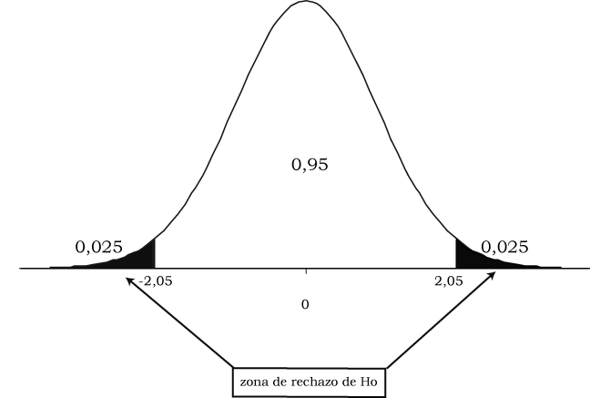

---
output:
  pdf_document: default
---

```{r message=FALSE, warning=FALSE, include=FALSE}
source("depencias.R")
```

#  Prueba de hipótesis: las aplicaciones 

Hasta aquí, la prueba de hipótesis es un procedimiento para evaluar si
un valor observado en la muestra es compatible con el valor poblacional
que plantea la hipótesis nula, para la media o la proporción. Se trabajó
sobre una única población y se puso a prueba un valor determinado para
un parámetro (media o proporción). Ahora ampliamos el análisis, porque
vamos a poner a prueba la eventual diferencia entre dos grupos y la
correlación entre dos variables. Probaremos por ejemplo, si puede
aceptarse que dos poblaciones tengan la misma media en una variable
cuantitativa o también la misma proporción de casos en una categoría de
una variable cualitativa. Como antes, la hipótesis nula será la de no
diferencia, es decir que formularemos como $H_{0}$ que las dos poblaciones
tienen la misma media o bien la misma proporción. Para la correlación,
la $H_{0}$ indica que, a nivel poblacional, el coeficiente vale cero.

En este capítulo se abordan los procedimientos que permiten comparar las
medias o proporciones de dos grupos y determinar si las diferencias que
se encuentran son significativamente mayores de lo que pudiera esperarse
por puro azar. Es decir, recorreremos los pasos necesarios para tomar
una decisión en términos estadísticos, a favor o en contra de la
hipótesis que sostiene que dos grupos son iguales respecto del parámetro
bajo análisis. Un modo alternativo de expresar el problema es considerar
que lo que se pone a prueba es si las dos muestras provienen de la misma
población o de dos poblaciones diferentes.

En el diseño experimental, a menudo interesa conocer, si un grupo sometido a
cierto tratamiento muestra cambios diferentes a los que experimenta otro
grupo que no fue sometido a ese tratamiento. Los procedimientos que
veremos se utilizan para determinar si las ganancias obtenidas en una
muestra de sujetos tras un tratamiento -por ejemplo de entrenamiento
cognitivo-, son lo suficientemente amplias como para representar
diferencias en la población. En este tipo de casos, se realiza una
primera evaluación del grupo (pre-test), se obtiene la media de ciertas
variables (aciertos en una prueba de atención, palabras recordadas,
aciertos en la correspondencia entre nombres y caras, etc.). Luego se
somete a los sujetos a un período de entrenamiento y a continuación son
nuevamente evaluados (post-test). Necesitamos determinar si los cambios,
medidos a través de la diferencia de los promedios, son de una magnitud
tal que podamos atribuirlos al entrenamiento o bien si pueden explicarse
por azar. La misma lógica, en condiciones menos controladas se usa en evaluación de impacto de intervenciones, para comparar a un grupo que se benefició de un programa con otro que no lo hizo, o también para comparar un grupo consigo mismo antes y después de una intervención [@Gertler2017].

Los procedimientos destinados a comparar grupos tienen gran difusión en
investigación. Muchos de los problemas que interesa resolver usándolos
se encuentran vinculados a distintos campos de las Ciencias Sociales, ya que se comparan grupos que han recibido una droga con
quienes no la han recibido, que han pasado por un período de
entrenamiento o no, que han participado en grupos terapéuticos o han
desarrollado otra actividad; estudiantes que usan una u otra estrategia de estudio; comunidades, familias o personas que han sido o no beneficiadas por una política pública; países con diferentes regímenes políticos; personas con diferente ideología política, etc. En todos los casos se realiza una comparación en algún resultado,
que puede ser el puntaje en un test, la valoración de la democracia, el rendimiento escolar o cualquier otra variable sobre la
que se busca intervenir. Por ejemplo, en una tesis de Maestría en
Psicología Clínica, el autor separa a un grupo de personas menores de edad deficientes
mentales en dos grupos. Uno de ellos participa de un taller con
actividades de protección ambiental (se lo llama "grupo experimental"), mientras que
el otro grupo no lo hace (es el denominado "grupo control"). A través de
pruebas estandarizadas se mide la sociabilidad, esperando que las
actividades en las que participaron pudieran estimularla. Se comparan
los niveles de sociabilidad de quienes participaron del taller con
los de quienes no lo hicieron, esta evaluación se hace antes y después
de la realización de estas actividades, que se prolongaron por un mes.
En este ejemplo hay dos comparaciones: la socialización de quienes
participaron con la de quienes no lo hicieron, y la de la sociabilidad
de quienes participaron, antes del taller y luego de él. En ambos casos
se utilizan las pruebas sobre las que trata este capítulo.  

Siempre la hipótesis nula sostendrá que no hay diferencias entre las
puntuaciones obtenidas antes y después del tratamiento, o por un grupo y
el otro; o lo que es lo mismo, que las diferencias son cero (nulas). En
la hipótesis alternativa se planteará la situación opuesta, sea
bilateral (que las medias difieren) o unilateral (que una media es mayor que la otra).

Estos procedimientos no sólo se utilizan en experimentos -que contruyen los grupos con criterios preestablecidos-, sino también en estudios que analizan datos de observación, que pueden provenir de encuestas o de observación directa. Así una variable independiente puede constituirse por
grupos o muestras de sujetos que conforman categorías diferentes.
Varones versus mujeres, población rural versus población urbana, estudiantes de escuela primaria
que repiten o no repiten un grado. Pueden interesar entonces, ciertas
diferencias en los promedios de alguna variable entre estos grupos.
¿Tienen los mismos ingresos promedio los varones jefes de hogar que las
mujeres que son jefas de hogar? ¿La proporción de analfabetos es la
misma entre provincias del NOA o del Centro del país? La edad promedio
de las madres primerizas que se atienden en hospitales públicos, ¿es la
misma que la de quienes van a privados? Podemos comparar varones y
mujeres y evaluar si hay diferencia entre el promedio de un grupo y otro en relación a la introversión, el neuroticismo o su afabilidad. También podríamos comparar personas mayores y jóvenes en relación a los
promedios que obtuvieran en pruebas de inteligencia fluida o
cristalizada.  
En estos ejemplos, jefes y jefas de hogar,
NOA y Centro del país, personas jóvenes y adultas mayores, mujeres y varones, etc. son
grupos independientes, que se diferencian por los valores de una
variable (región, edad, género) y nos interesa investigar si estos
agrupamientos evidencian diferencias en otras variables de interés: como los ingresos, el analfabetismo, la inteligencia, la
introversión.

Cuando apreciamos que las medias de dos grupos son diferentes, no
podemos saber a priori si las muestras provienen de poblaciones cuyas
medias son diferentes o no, porque las diferencias observadas entre los
resultados muestrales pueden provenir de azar. Por eso, encontrar que
${\overline{x}}_{1} \neq {\overline{x}}_{2}$ (en las muestras) no
conduce inmediatamente a que $\mu_{1} \neq \mu_{2}$ (en las
poblaciones).

El procedimiento para comparar los parámetros (medias o proporciones) de
dos poblaciones consiste en extraer una muestra de cada población:
llamaremos a los tamaños de esas muestras $n_{1}$ y $n_{2}$. En
cada muestra se calculan -como antes-, los estimadores correspondientes.
Si se estima una diferencia de medias calcularemos las medias
(${\overline{x}}_{1}$ y ${\overline{x}}_{2}$), así como las desviaciones
estándar ($s_{1}$ y $s_{2}$) de cada una.  
Si lo que se estima es una
diferencia de proporciones, en cada muestra se calculará la proporción
de casos en la categoría de interés: ${\widehat{p}}_{1}$ y
${\widehat{p}}_{2}$ que son los estimadores de los parámetros $P_{1}$ y $P_{2}$.

Aquellas situaciones en que no se puedan calcular medias y varianzas
porque las variables son ordinales o bien no se sostengan los supuestos
sobre normalidad de las distribuciones poblacionales, se aplican otro
tipo de prueba de hipótesis, que serán tratados en el próximo capítulo.

Veamos en primer lugar el caso en que la variable bajo análisis es
cuantitativa y entonces nos interesa comparar las medias poblacionales.
El parámetro que se estima es la diferencia entre las medias
poblacionales: $\mu_{1} - \mu_{2}$, y la estimación se hace a través de
la diferencia entre las medias muestrales:
${\overline{x}}_{1} - {\overline{x}}_{2}$. El error estándar de ese
estimador (que será necesario para estandarizar el valor observado) va a depender del tipo de prueba de que se trate. En este capítulo trataremos
dos situaciones, cuando sean muestras independientes, y muestras
apareadas o dependientes.

## Muestras independientes

### Prueba de diferencia de medias

La comparación de las medias de dos poblaciones independientes se
realiza comparando los correspondientes estimadores de las medias
poblacionales. De modo equivalente a la relación media muestral - media poblacional, ahora parámetro a estimar es la diferencia de medias poblacionales: $\mu_1-\mu_2$, y el estimador es la diferencia de medias muestrales: $\bar{x}_1-\bar{x}_2)$. Esta última es la variable aleatoria que, bajo los supuestos mencionados antes, tiene distribución normal centrada en el parámetro. El siguiente esquema recuerda la notación:

```{r warning=FALSE}
ggplot(data = data.frame(z = c(-4, 4)), aes(z)) +
  stat_function(fun = dnorm) + xlab((TeX("$\\mu_1 - \\mu_2$"))) + ylab("") + scale_x_discrete(breaks = NULL) + scale_y_continuous(breaks = NULL) + annotate("text", x = 4, y = -.03, label = TeX("$\\bar{x}_1 - \\bar{x}_2$")) + annotate(geom = "rect", xmin = -.01, xmax = .01, ymin = -.01, ymax = .01, col = "black") + theme_tufte()
```

Una vez que se dispone de los datos muestrales, el estadístico de prueba toma la forma;

$$\frac{(\overline{x}_{1} - \overline{x}_{2}) - {(\mu}_{1} - \mu_{2})}{s_{\overline{x}_{1} - \overline{x}_{2}}}$$


Es decir, se trata de la diferencia entre la diferencia de las medias
muestrales y la diferencia de las medias poblacionales, dividida por el
error estándar de la diferencia (el error estándar del estimador). La
expresión mantiene la estructura que mencionamos en el capítulo
anterior: estimador menos parámetro sobre el error estándar del
estimador. En este caso el estimador es la diferencia de las medias
muestrales y el parámetro es la diferencia de las medias poblacionales.


Este estadístico de prueba tiene distribución normal si los tamaños de las muestras son suficientemente grandes (mayores a 30 casos) y tiene distribución *t de Student* si se trata de muestras pequeñas y puede además suponerse que las variables que se analizan tienen distribución normal en la población. Debido a que la distribución $t$ tiende a la normal a medida que aumenta el tamaño de la muestra, y como lo hicimos antes para una sola muestra, escribiremos de manera general:

$$t = \frac{(\overline{x}_{1} - \overline{x}_{2}) - {(\mu}_{1} - \mu_{2})}{s_{\overline{x}_{1} - \overline{x}_{2}}}$$


Como sabemos, cuando las muestras sean
grandes, las probabilidades asociadas al valor de $t$ coincidirán con
las de la distribución normal.

El denominador del estadístico de prueba puede
ser calculado de dos maneras diferentes y eso va a depender de que
podamos suponer que las varianzas de las dos poblaciones de las que
provienen las muestras son iguales o que no sea así.


#### Caso 1: Varianzas poblacionales iguales  

$\sigma_{1}^{2} = \sigma_{2}^{2}$


Si puede suponerse que las varianzas poblacionales son iguales, entonces las dos varianzas que se calculan desde las muestras, constituyen dos estimadores (diferentes por azar) del mismo parámetro. Cada muestra ofrece una estimación de la varianza, que es la misma en las dos poblaciones de origen. En ese caso, calcularemos primero un promedio[^96] de las dos estimaciones dadas por las varianzas muestrales, a la que llamaremos varianza combinada:  

$$s_{\text{comb}}^{2} = \frac{\left( n_{1} - 1 \right)*s_{1}^{2} + \left( n_{2} - 1 \right)*s_{2}^{2}}{n_{1} + n_{2} - 2}$$


Usando este estimador de la (supuestamente única) varianza poblacional,
el estadístico de prueba asume la forma:  

$$t = \frac{(\overline{x}_{1} - {\overline{x}}_{2}) - {(\mu}_{1} - \mu_{2})}{s_{\text{comb}}*\sqrt{\frac{1}{n_{1}} + \frac{1}{n_{2}}}}$$


Cuyos grados de libertad se calculan, en función de los tamaños de las muestras como: $gl = n_{1} + n_{2} - 2$.


#### Caso 2: Varianzas poblacionales diferentes  

$\sigma_{1}^{2} \neq \sigma_{2}^{2}$  

Si no es posible suponer que las varianzas de
las poblaciones de donde provienen las muestras son iguales, entonces
debemos usar las varianzas muestrales de manera separada. Cuando éste es
el caso, el estadístico de prueba es:

$$t = \frac{(\overline{x}_{1} - {\overline{x}}_{2}) - {(\mu}_{1} - \mu_{2})}{\sqrt{\frac{s_{1}^{2}}{n_{1}} + \frac{s_{2}^{2}}{n_{2}}}}$$


Esta expresión es más sencilla, porque mantiene las varianzas originales en lugar de combinarlas, pero el
cálculo de los grados de libertad de la distribución *t de Student* se
vuelve más complejo. La fórmula para hacerlo es[^97]

$$gl = \frac{\left( \frac{s_{1}^{2}}{n_{1}} + \frac{s_{2}^{2}}{n_{2}} \right)^{2}}{\frac{\left( \frac{s_{1}^{2}}{n_{1}} \right)^{2}}{n_{1} - 1} + \frac{\left( \frac{s_{2}^{2}}{n_{2}} \right)^{2}}{n_{2} - 1}}$$


No vamos a usar esta expresión para calcular los grados de libertad,
pero es la que usan los programas de análisis de datos cuando detectan
que las varianzas poblacionales no son iguales.  

#### Comparación de las varianzas  
De acuerdo a esto, cuando vamos a hacer una prueba $t$ para comparar las medias de dos grupos debemos antes saber si estamos ante el caso 1 ó el caso 2; lo que significa que deberemos antes decidir si las varianzas de las dos poblaciones pueden considerarse iguales o no. Dado que no conocemos estas varianzas poblacionales, la decisión se toma a partir de los datos muestrales, es decir, a partir de las varianzas halladas en las muestras ($s_{1}^{2}$ y $s_{2}^{2}$). Se realiza una prueba, cuya hipótesis nula afirma que las varianzas poblacionales son iguales y su resultado permitirá decidir, a un determinado nivel de significación, si puede tratarse a las varianzas poblacionales como iguales o si debe considerárselas diferentes, la prueba se llama prueba de homogeneidad de varianzas[^98] y tiene las siguientes hipótesis.

$$H_{0}:\ \frac{\sigma_{1}^{2}}{\sigma_{2}^{2}} = 1$$

$$H_{1}:\ \frac{\sigma_{1}^{2}}{\sigma_{2}^{2}} \neq 1$$

El estadístico de prueba es el cociente de las varianzas muestrales:

$$\frac{s_{1}^{2}}{s_{2}^{2}}$$

Y tiene una distribución F con $n_{1} - 1$ grados de libertad en el
numerador y $n_{2} - 1$ grados de libertad en el denominador.


Ejemplo 1. (datos ficticios): nos preguntamos si, para una carrera
universitaria dada, el tiempo que tardan en completar sus estudios quienes trabajan es el mismo que el que les requiere a quines no lo hacen, o si difiere.
Para ello tomamos una muestra de 100 estudiantes que trabajan y obtenemos una media de duración de la carrera de 6.7 años y una desviación estándar de 1.2 años. Extraemos otra muestra, de 150 casos que no trabajan, en la que obtenemos un promedio de los años de duración de 6.3 con una desviación estándar de 1.5 años. Todos estos datos provienen de la información descriptiva que proveen las muestras, son los que vamos a usar para hacer la inferencia acerca de las
poblaciones, constituidas por el total de quienes trabajan y no
trabajan.

Como antes, la hipótesis nula es la del "no cambio", la que afirma que
no hay diferencia, por lo que:

$$H_{0}:\mu_{1} - \mu_{2} = 0$$

Que dice que la diferencia entre las medias poblacionales es cero (es
nula). Hemos dicho que nuestro interés está en saber si las medias
poblacionales son iguales o si difieren, por lo que se trata de una
prueba bilateral, entonces la hipótesis alternativa indicará que:

$$H_{1}:\mu_{1} - \mu_{2} \neq 0$$

Para la presentación continuaremos usando la distribución normal, ya que resulta más familiar, pero los paquetes de análisis de datos usan
directamente distribuciones $t$, que en este ejemplo, con 100 y 150 casos, coincide, a los fines prácticos, con la normal.

Bajo la hipótesis nula, la distribución del estimador será:  

<!--acá también el eje x se debe llamar media dos menos media 1 -->
```{r echo=FALSE, message=FALSE, warning=FALSE}
ggplot(data = data.frame(z = c(-4, 4)), aes(z)) +
  stat_function(fun = dnorm) +
  ylab("") + xlab("") + scale_x_discrete(breaks = NULL) +
  geom_segment(x = -4, xend = 4, y = 0, yend = 0) +
  scale_y_continuous(breaks = NULL) + theme_tufte() +
  geom_text(aes(label = "0"), x = 0, y = -.019) + annotate("text", x = 2.7, y = -.03, label = TeX("$\\bar{x}_1 - \\bar{x}_2$")) +
  annotate(geom = "rect", xmin = -.01, xmax = .01, ymin = -.01, ymax = .01, col = "red")
```

Para decirlo nuevamente, la variable aleatoria es la diferencia de
medias muestrales, el centro de la distribución es el parámetro, que
según la hipótesis nula es cero.

Fijamos el nivel de significación de la prueba en el 5% y los puntos
críticos resultan, sobre la distribución normal estándar ±1.96,
gráficamente:

```{r echo=FALSE, message=FALSE, warning=FALSE}
ggplot(data = data.frame(z = c(-4, 4)), aes(z)) +
  geom_area(stat = "function", fun = dnorm, fill = "green", xlim = c(-4, qnorm(.025)), col = "black") +
  geom_area(stat = "function", fun = dnorm, fill = "white", xlim = c(qnorm(.025), qnorm(.975)), col = "black") +
  geom_area(stat = "function", fun = dnorm, fill = "green", xlim = c(qnorm(.975), 4), col = "black") +
  ylab("") + xlab("") + scale_x_discrete(breaks = NULL) +
  geom_segment(x = -4, xend = 4, y = 0, yend = 0) +
  geom_segment(x = qnorm(.975), xend = qnorm(.975), y = 0, yend = dnorm(qnorm(.975))) +
  geom_segment(x = qnorm(.025), xend = qnorm(.025), y = 0, yend = dnorm(qnorm(.025))) +
  scale_y_continuous(breaks = NULL) + theme_tufte() +
  geom_text(aes(label = "0"), x = 0, y = -.019) +
  geom_text(aes(label = "-1.96"), x = -1.96, y = -.019) +
  geom_text(aes(label = "1.96"), x = 1.96, y = -.019) +
  geom_text(aes(label = "z"), x = 3.5, y = -.01) + geom_text(aes(label = "0.025"), x = 2.35, y = .023, size = 4) + geom_text(aes(label = "0.025"), x = -2.35, y = .023, size = 4) +
  annotate(geom = "rect", xmin = -.01, xmax = .01, ymin = -.01, ymax = .01, col = "red")
```

Ahora transformamos a puntaje $z$ los valores observados en las
muestras. Recordemos para ello que el puntaje $z$ se define como la
diferencia entre el estimador (observado) y el parámetro (hipotético), dividida por el error
estándar del estimador. Para esta prueba, el parámetro es la diferencia
de medias poblacionales, su estimador es la diferencia de medias
muestrales, con lo que:

$$z_{\text{obs}} = \frac{(\overline{x}_{1} - {\overline{x}}_{2}) - {(\mu}_{1} - \mu_{2})}{s_{({\overline{x}}_{1} - {\overline{x}}_{2})}}$$

Y queda por decidir cómo calcular el denominador, lo que va a depender
de que puedan o no suponerse iguales las varianzas poblacionales. Para
decidirlo, se realiza la prueba de homogeneidad de varianzas:

$$H_{0}:\ \frac{\sigma_{1}^{2}}{\sigma_{2}^{2}} = 1$$

$$H_{1}:\ \frac{\sigma_{1}^{2}}{\sigma_{2}^{2}} \neq 1$$

El estadístico de prueba es

$$\frac{s_{1}^{2}}{s_{2}^{2}} = \frac{1.2^{2}}{1.5^{2}} = 0.64$$

Se busca la probabilidad asociada a un valor como el
observado o mayor, bajo un modelo F con grados de libertad determinados por el tamaño de las muestras (de 100 y 150 observaciones)
$P(F_{n_{1} - 1,\ n_{2} - 1}) = P(F_{99,\ 149})>0.64$  
Que equivale a:  
$1-(P(F_{99,\ 149})<0.64)$

Y resulta: 
```{r}
round(1 - pf(.64, 99, 149), 4)
```

Gráficamente, la distribución $F$ tiene poca asimetría, porque los grados de libertad son elevados, y el área que queda a la derecha del valor $F_{obs}$ es casi 1:  

```{r echo=FALSE, message=FALSE, warning=FALSE}
ggplot(data = data.frame(F = c(0, 4)), aes(F)) +
  geom_area(stat = "function", fun = df, args = list(df1 = 99, df2 = 149), fill = "green", xlim = c(.64, 4), col = "black") +
  geom_area(stat = "function", fun = df, args = list(df1 = 99, df2 = 149), fill = "white", xlim = c(0, .64), col = "black") +
  ylab("") + xlab("") + scale_x_discrete(breaks = NULL) +
  scale_y_continuous(breaks = NULL) + theme_tufte() +
  geom_text(aes(label = ".64"), x = .64, y = -.05)
```

Esa área es el valor $p$, por lo que debe interpretarse como la probabilidad de hallar un cociente entre las varianzas muestrales como el observado o más extremo, si las varianzas poblacionales fueran iguales. Dado que es un número muy alto, no se rechaza la hipótesis nula, y se concluye que las varianzas pueden suponerse iguales. Se trata entonces de lo que se ha llamado "caso 1" y, para el denominador del estadístico de prueba, se calcula la varianza combinada[^99]:

$$s_{\text{comb}}^{2} = \frac{\left( n_{1} - 1 \right)*s_{1}^{2} + \left( n_{2} - 1 \right)*s_{2}^{2}}{n_{1} + n_{2} - 2}$$

Con los datos del ejemplo, la varianza combinada es:

$$s_{\text{comb}}^{2} = \frac{\left( 100 - 1 \right)*{1.2}^{2} + \left( 150 - 1 \right)*{1.5}^{2}}{100 + 150 - 2} = \frac{477.81}{249} = 1.92$$

por lo que la desviación estándar combinada resulta:

$$s_{\text{comb}} = \sqrt{1.92} = 1.38$$

Como la hipótesis nula establece que la diferencia de medias
poblacionales es cero $\mu_{1} - \mu_{2} = 0$, entonces, el estadístico
de prueba queda:

$$z = \frac{\left( 6.7 - 6.3 \right) - 0}{1.38*\sqrt{\frac{1}{100} + \frac{1}{150}}} = \frac{0.4}{0.18} = 2.22$$

Este es el estadístico de prueba correspondiente a la diferencia de
medias para muestras independientes cuando las varianzas poblacionales
pueden suponerse iguales. Este valor de $z$ (2.22) se encuentra en la zona de rechazo de $H_{0}$, por lo que la decisión será la de rechazar $H_{0}$ y concluir que el tiempo que tardan en terminar la carrera quienes trabajan difiere significativamente del que tardan quienes no trabajan. Dicho de otro modo: la diferencia observada en las medias de las muestras es significativa a un nivel del 5%.  


Ejemplo 2. Si los mismos resultados se hubiesen hallado en muestras más pequeñas, por ejemplo de 20 casos que trabajan y 25 que no, y además hubiésemos podido suponer que las dos poblaciones son normales en la variable *duración de la carrera*; entonces habría correspondido usar una prueba $t$ [^100]. La prueba de homogeneidad de varianzas da, con esos nuevos tamaños de muestra, $p = 0.16$. Un valor que también es elevado, por lo que se puede tratar a las varianzas como iguales.

Los grados de libertad de la distribución $t$ se calculan sumando los
tamaños de muestra y restando dos:

$$gl = n_{1} + n_{2} - 2 = 20 + 25 - 2 = 43$$

Con 43 grados de libertad, los valores $t_{c}$ que delimitan un 5% extremo en la distribución de probabilidades son ±2.02, que gráficamente se representan así:

```{r echo=FALSE, message=FALSE, warning=FALSE}
ggplot(data = data.frame(t = c(-4, 4)), aes(t)) +
  geom_area(stat = "function", fun = dt, args = list(df = 43), fill = "green", xlim = c(-4, qt(.025, df = 43)), col = "black") +
  geom_area(stat = "function", fun = dt, args = list(df = 43), fill = "white", xlim = c(qt(.025, df = 43), qt(.975, df = 43)), col = "black") +
  geom_area(stat = "function", fun = dt, args = list(df = 43), fill = "green", xlim = c(qt(.975, df = 43), 4), col = "black") +
  ylab("") + xlab("t") + scale_x_discrete(breaks = NULL) +
  geom_segment(x = -4, xend = 4, y = 0, yend = 0) +
  scale_y_continuous(breaks = NULL) + theme_tufte() +
  geom_text(aes(label = "0"), x = 0, y = -.019) +
  geom_text(aes(label = "-2.02"), x = qt(.025, df = 43), y = -.019) +
  geom_text(aes(label = "2.02"), x = qt(.975, df = 43), y = -.019) + geom_text(aes(label = "0.025"), x = 2.35, y = .023, size = 4) + geom_text(aes(label = "0.025"), x = -2.35, y = .023, size = 4) +
  annotate(geom = "rect", xmin = -.01, xmax = .01, ymin = -.01, ymax = .01, col = "red")
```

Para tomar la decisión calculamos el estadístico de prueba con el mismo
procedimiento anterior, para lo que es necesario contar primero con la
desviación estándar combinada. Calculamos primero la varianza combinada:

$$s_{\text{comb}}^{2} = \frac{\left( 20 - 1 \right)*{1.2}^{2} + \left( 25 - 1 \right)*{1.5}^{2}}{20 + 25 - 2} = \frac{81.36}{43} = 1.89$$

Y la desviación estándar combinada es:

$$s_{\text{comb}} = \sqrt{1.89} = 1.37$$

por lo que el estadístico de prueba resulta:

$$t = \frac{\left( 6.7 - 6.3 \right) - 0}{1.37*\sqrt{\frac{1}{20} + \frac{1}{25}}} = \frac{0.4}{0.41} = 0.97$$

Este valor no se ubica en la zona de rechazo de $H_{0}$, como se ve en el gráfico:

```{r echo=FALSE, message=FALSE, warning=FALSE}
ggplot(data = data.frame(t = c(-4, 4)), aes(t)) +
  geom_area(stat = "function", fun = dt, args = list(df = 43), fill = "green", xlim = c(-4, qt(.025, df = 43)), col = "black") +
  geom_area(stat = "function", fun = dt, args = list(df = 43), fill = "white", xlim = c(qt(.025, df = 43), qt(.975, df = 43)), col = "black") +
  geom_area(stat = "function", fun = dt, args = list(df = 43), fill = "green", xlim = c(qt(.975, df = 43), 4), col = "black") +
  ylab("") + xlab("t") + scale_x_discrete(breaks = NULL) +
  geom_segment(x = -4, xend = 4, y = 0, yend = 0) +
  scale_y_continuous(breaks = NULL) + theme_tufte() +
  geom_text(aes(label = "0"), x = 0, y = -.019) +
  geom_text(aes(label = "-2.02"), x = qt(.025, df = 43), y = -.019) +
  geom_text(aes(label = "2.02"), x = qt(.975, df = 43), y = -.019) + geom_text(aes(label = "0.025"), x = 2.35, y = .023, size = 4) + geom_text(aes(label = "0.025"), x = -2.35, y = .023, size = 4) +
  annotate(geom = "rect", xmin = -.01, xmax = .01, ymin = -.01, ymax = .01, col = "red") +
  geom_text(aes(label = ".97"), x = .97, y = -.019) +
  annotate(geom = "rect", xmin = .96, xmax = .98, ymin = -.01, ymax = .01, col = "black")
```

La conclusión será en este caso que no hay evidencia para creer que el
tiempo promedio que tardan en terminar la carrera quienes
trabajan sea diferente que el de quienes no trabajan.

La comparación de las conclusiones de estos dos ejemplos muestra algo
muy importante: una misma diferencia absoluta de 0.4 años en los
promedios muestrales de los grupos, es significativa cuando proviene de
muestras grandes (100 y 150 casos) y deja de serlo cuando se obtiene en
muestras pequeñas (20 y 25 casos). El tamaño de las muestras incide en
la potencia de la prueba, que es su capacidad para detectar diferencias.

Por las razones que ya hemos mencionado, en el cálculo informatizado del estadístico de prueba no se distingue entre utilizar distribución normal ($z$) para muestras grandes y $t$ para muestras chicas, como
acabamos de hacer en los ejemplos anteriores. Por el contrario, se usa
siempre distribución $t$ [^101]. Así, esta prueba se conoce como *prueba t de diferencia de medias*.


Ejemplo 3 (datos reales): la salida que mostramos a continuación es una
comparación de la edad promedio de docentes varones y mujeres del
nivel medio. Los datos provienen de una muestra aleatoria de 246
docentes de la ciudad de Córdoba. La hipótesis nula de esa comparación
es que no hay diferencia en la edad promedio de mujeres y varones
docentes del nivel medio, que se confronta con una hipótesis alternativa
que afirma que sí hay diferencia. Se trata de una prueba bilateral que
se expresa así:

$$H_{0}:\mu_{1} - \mu_{2} = 0$$

$$H_{1}:\mu_{1} - \mu_{2} \neq 0$$

Donde los subíndices 1 y 2 se refieren a los grupos formados por
docentes mujeres y varones respectivamente. Al final del capítulo se verá como pedir a R la realización de esta prueba, la salida es:

```{r echo=FALSE, message=FALSE, warning=FALSE}
set.seed(5)
edad.v <- rnorm(66, 41, 4)
edad.m <- rnorm(180, 40, 4)
edad <- c(edad.v, edad.m)
sexo <- c(rep("varones", 66), rep("mujeres", 180))
docentes <- data.frame(sexo, edad)
t.test(edad ~ sexo)
```

El título es el de prueba t de dos muestras de Welch, que se refiere a la corrección de Welch-Satterthwaite. Se indican los datos, que es edad según sexo (la comparación de las edades según sexo).  
Lugo se ofrece el valor $t_{obs}$, de -1.99, los grados de libertad y el valor $p$, de 0.048. Se indica cuál fue la hipotesis alternativa (que las medias difieres, es decir bilateral).  
Luego se lee un intervalo de confianza para estimar la diferencia de las media, construido, por defecto al 95% y, finalmente las medias muestrales.

La lectura de esta salida es que, a un nivel de significación del 5%, hay evidencia para rechazar la hipótesis de igualdad de las medias poblacionales, dado que el valor $p$ hallado es menor a ese criterio. Pero si se reduce el riesgo de cometer error de tipo I y se baja el  nivel de sigificación al 1%, entonces el resultado ya no es significativo a este nivel. La lectura del resultado debe incluir esta interpretación, para que quede constancia que la $H_{0}$ ha sido rechazada con poca evidencia en su contra.  
Un dato adicional que obtenemos en la salida es el intervalo de confianza que estima la diferencia poblacional. Leemos que, con una confianza del 95%, el intervalo que va de 0.007 a 2.280, contiene a la diferencia de edades que hay en la población. Para la lectura del intervalo no se tiene en cuenta el signo negativo, que proviene  de haber restado $edad.mujeres - edad.varones$ y que habría sido positivo de haber elegido restar en otro orden. Sí importa, por el contrario, que los signos de los límites sean iguales (ambos positivos o ambos negativos) porque eso quiere decir que, al nivel de confianza establecido, se excluye al cero del intervalo. Por eso este resultado es siempre compatible con la decisión de aceptar o rechazar $H_{0}$, al mismo nivel de significación.

Cuando una prueba de hipótesis sobre diferencia de medias se rechaza a un nivel de significación $\alpha$, entones, un intervalo construido con una confianza del $1-\alpha$, excluye al cero entre sus límites. Dicho de otra manera, el límite inferior y el límite superior tienen el mismo signo.

Cuando una prueba de hipótesis sobre diferencia de medias no se rechaza a un nivel de significación $\alpha$, entones, un intervalo construido con una confianza del $1-\alpha$, incluye al cero entre sus límites. Dicho de otra manera, el límite inferior es negativo y el límite superior es positivo.

La lateralidad de la prueba que analizamos en el capítulo anterior,
sigue del mismo modo cuando trabajamos con diferencias de medias.  


Ejemplo 4. Se espera que una droga que se está experimentando produzca efectos sobre la depresión, en dirección a reducir el puntaje que alcanzan las personas diagnosticadas, en un test que la evalúa.
Para poner a prueba la droga será necesario diseñar un experimento, no
avanzaremos en ese tema pero de manera muy simple, podemos pensar en dos grupos de personas que padecen depresión, a uno de los cuales se administra la
droga (grupo 1) y al otro no (grupo 2)[^102]. Concluiremos que la droga
tiene efectos si luego de un tiempo de su administración, el grupo de
pacientes que la recibió experimentó cambios positivos en mayor
magnitud que el otro. Dicho de otro modo, habrá efectos si la media de
puntaje en el test que evalúa depresión es significativamente menor en
el grupo que se sometió al tratamiento.  
Como siempre, la hipótesis nula afirmará que no hay diferencia:

$$H_{0}:\mu_{1} - \mu_{2} = 0$$

Como ahora interesa que el grupo 1 haya *reducido* su puntaje en el
test de depresión, esperamos que la media del grupo 1 sea menor que la
del grupo 2, lo cual se escribe:

$$H_{1}:\mu_{1} - \mu_{2} < 0$$

Por la lateralidad de la prueba, solo hay una zona extrema de rechazo,
la izquierda. Fijando un 5% de nivel de significación, si se tratara de
muestras grandes, en las que podemos usar distribución normal, esta zona se representa del modo habitual:

```{r echo=FALSE, message=FALSE, warning=FALSE}
ggplot(data = data.frame(z = c(-4, 4)), aes(z)) +
  geom_area(stat = "function", fun = dnorm, fill = "green", xlim = c(-4, qnorm(.05)), col = "black") +
  geom_area(stat = "function", fun = dnorm, fill = "white", xlim = c(qnorm(.05), 4), col = "black") +
  ylab("") + xlab("") + scale_x_discrete(breaks = NULL) +
  geom_segment(x = -4, xend = 4, y = 0, yend = 0) +
  scale_y_continuous(breaks = NULL) + theme_tufte() +
  geom_text(aes(label = "0"), x = 0, y = -.019) +
  geom_text(aes(label = "-1.64"), x = -1.64, y = -.019)
```

Por el contrario, si se trata de muestras pequeñas, corresponde usar
distribución *t*, y el punto crítico dependerá de los grados de
libertad.  

Un grupo de 15 sujetos que recibió un medicamento arroja un puntaje promedio en la prueba que evalúa la depresión de 5.7 puntos, con desviación estándar de 1.1 puntos. Otro grupo, de 10 pacientes, que no recibieron el medicamento alcanza un puntaje promedio
de 7.2 puntos, con desviación estándar de 1.6 (datos ficticios). La prueba previa sobre la homogeneidad de las varianzas indica que no puede suponérselas iguales, por lo que estamos en el caso 2. Debe utilizarse la distribución t con grados de libertad que deben calcularse con la expresión de Welch-Satterthwaite, el resultado[^103] es 15. El punto crítico $t_{15, .05}$, es -1.75.

El estadístico de prueba vale:

$$t = \frac{\left( 5.7 - 7.2 \right) - 0}{\sqrt{\frac{1.1}{15} + \frac{1.6}{10}}} = \frac{-1.5}{0.48} = -3.10$$

Es un valor que se sitúa a la izquierda del punto crítico, por lo que se
rechaza la $H_0$ y se concluye que el grupo que recibió la droga alcanzó
un puntaje significativamente menor que el otro grupo.

Ejemplo (datos reales): en un estudio realizado en el Centro de
Promoción del Adulto Mayor, se seleccionaron aleatoriamente entre todos
los asistentes, a 503 personas mayores de 50 años. Entre otras
preguntas, se computó el número de hijas e hijos de cada persona.

Se conformaron dos grupos con los sujetos estudiados, quienes tenían
hasta 65 años en el momento del estudio y quienes tenían 66 o más años.
En este ejemplo, estos dos grupos, si bien no fueron asignados de manera
aleatoria, se comportarían como muestras independientes.

Podríamos suponer que las personas de mayor edad tendrían más descendencia,
dadas ciertas razones históricas, religiosas y culturales que
habitualmente inciden en el control de la natalidad. Esta hipótesis está
basada también en el conocimiento demográfico; sabemos que las tasas de
fecundidad en nuestro país han venido descendiendo desde hace varias
décadas. Sostenemos así que quienes conforman el grupo de 66 años y más
tendrán más hijos e hijas que los de 65 años o menos, con lo que se trata de una
prueba unilateral. Si llamamos 1 al grupo de hasta 65 años y 2 al
de quienes tienen 66 ó más, las hipótesis se expresan de la siguiente
manera:

$$H_{0}:\mu_{1} - \mu_{2} = 0$$

$$H_{1}:\mu_{1} - \mu_{2} < 0$$

Los resultados descriptivos de los dos grupos son:

```{r}
library("doBy")

adultos_mayores <- read.csv("bases/archivostxt/Adultos.mayores.txt",
  sep = ";", header = TRUE, fileEncoding = "latin1"
)

adultos_mayores$edad <- as.numeric(as.character(adultos_mayores$edad))
adultos_mayores$hijes <- as.numeric(as.character(adultos_mayores$hijos))

adultos_mayores$grupo_edad <- ifelse(adultos_mayores$edad < 66, 1, 2)
adultos_mayores$grupo_edad <- as.factor(adultos_mayores$grupo_edad)
resumen_hijes <- summaryBy(
  hijes ~ grupo_edad,
  data = adultos_mayores[
    !is.na(adultos_mayores$hijes) & !is.na(adultos_mayores$grupo_edad),
  ],
  FUN = c(length, mean, median, sd)
)
# colnames(resumen_hijos) <- gsub("_", "\\.", colnames(resumen_hijos))
knitr::kable(
  resumen_hijes, kable_outp,
  booktabs = TRUE, align = "ccccc", escape = TRUE,
) %>%
  kableExtra::kable_styling(latex_options = "striped")
```

El nombre de la variable `grupo_edad`, corresponde a los grupos 1, hasta 65 años y 2, de 66 ó más. Los grupos tienen 243 y 260 personas
respectivamente. La descripción muestra la media, mediana y desviación estándar.

Vemos que hay diferencia en la descendencia promedio de los dos
grupos. Las personas del segundo grupo (66 o más) tienen en promedio 0.12 hijos o hijas más que las del otro grupo. Ahora bien, dadas estas diferencias entre
las medias muestrales encontradas, nos interesa determinar si se deben al azar o
bien si tienen una magnitud tal que representen una diferencia que pueda
atribuirse a la diferencia de edad de quienes están en cada uno de los dos grupos.

Para realizar una prueba de diferencia de medias entre muestras independientes, se puede usar la distribución normal como buena aproximación, debido a que las muestras son grandes. La prueba es unilateral izquierda, porque interesa saber si el grupo 1 tiene menos hijas e hijos que el grupo 2. El punto crítico de esa prueba es $z_{.05}=-1.64$. La región de rechazo está conformada por todos los valores de *z* que sean inferiores a $-1.64$. Para hacer la prueba manualmente, ahora se calcula el $z_{obs}$ y según sea menor o mayor que ese punto crítico, se rechaza o no se rechaza $H_0$. 

La salida R para esta prueba es:

```{r message=FALSE, warning=FALSE}
t.test(hijes ~ grupo_edad, data = adultos_mayores, alternative = "less")
```

Por cuestiones de economía de recursos, los software usan siempre distribución $t$. La salida muestra: la variable que se analiza (`hijes`, por hijas o hijos), según (`by`) la que clasifica los grupos (`grupo_edad`), el valor del estadístico de prueba ($t=-0.94$), los grados de libertad ($495$), el valor de probabilidad asociado a la
prueba ($0.17$), el tipo de prueba, que es unilateral izquierda en este caso, un intervalo de confianza unilateral, como fue pedida la prueba y finalmente, las medias ($2.49$ y $2.61$) de cantidades de hijos e hijas de cada grupo

El $t_{obs}$ de la prueba es $-0.94$, que se ubica en la zona de no rechazo. Con ese resultado ya estamos en condiciones de concluir sobre la prueba: no se rechaza $H_0$, las medias no difieren de manera significativa, no hay diferencia en el tamaño de la descendencia entre los grupos conformados.

Si no hubiésemos calculado previamente el punto crítico, podemos llegar
a esta conclusión a partir del valor *p*, que en este caso es $0.1751$ y
representa la probabilidad de haber hallado esa diferencia o una mayor,
por puro azar. Este es el valor que, como sabemos, se juzga en
comparación con el nivel de significación, por ser mayor a $0.05$ que
habíamos establecido, decidimos no rechazar la $H_0$. Cuanto más pequeña
sea esta probabilidad, tanta más evidencia habrá para rechazar $H_0$, en
este caso la consideramos grande y no rechazamos. La lectura del valor
*p* es, en este caso "si el número promedio de hijos e hijas de los dos grupos fuera el mismo, la probabilidad de haber encontrado entre dos muestras de tamaños $243$ y $260$, una diferencia de $0.12$ ó superior, es de $0.1751$".
Brevemente:

$$P({(\overline{x}}_{1} - {\overline{x}}_{2} < - 0.12)/{(\mu}_{1} - \mu_{2} = 0)) = 0.1751$$

#### Prueba de diferencia de proporciones

Compararemos ahora dos muestras en cuanto a la proporción de casos que
hay en una categoría de una variable que puede ser nominal o también de
un nivel superior[^104]. Aunque en los programas de análisis de datos
este procedimiento se realiza también solicitando *prueba t*, esto sólo
está autorizado si se trabaja con muestras grandes.

De manera muy similar a la prueba de diferencia de medias, la $H_0$
afirma que no hay diferencia entre las proporciones de las dos
poblaciones, por lo que tiene la forma:

$$H_{0}:\ P_{1} - P_{2} = 0$$

Mientras que la $H_1$ puede indicar que las proporciones solo difieren:

$$H_{1}:\ P_{1} - P_{2} \neq 0$$

Cuando la prueba es bilateral o bien, si es unilateral derecha:

$$H_{1}:\ P_{1} - P_{2} > 0$$

O izquierda:

$$H_{1}:\ P_{1} - P_{2} < 0$$

Dado que solo trabajaremos con muestras grandes al analizar la
diferencia de proporciones, solo usaremos la distribución normal. El
estadístico de prueba tiene forma similar al que usamos en la prueba de
la proporción para una sola muestra, solo que ahora hay que hacer
participar los datos que provienen de dos muestras. Así resulta:

$$z = \frac{(\widehat{p}_{1} - \widehat{p}_{1}) - (P_{1} - P_{2})}{\sqrt{\frac{\widehat{p}_{1}*(1 - \widehat{p}_{1})}{n_{1}} + \frac{\widehat{p}_{2}*(1 - \widehat{p}_{2})}{n_{2}}}}$$

Donde ${\widehat{p}}_{1}$ y ${\widehat{p}}_{2}$ son los estimadores de
$P_1$ y $P_2$ respectivamente. A diferencia de la prueba sobre una sola
proporción, ahora no se cuenta con valores poblacionales de $P_1$  ni de $P_2$, ya que la $H_0$ solo enuncia que son iguales. Por eso ahora, el error estándar del estimador (el denominador del estadístico de prueba) se calcula en base a las proporciones muestrales.

Ejemplo (datos ficticios): se dispone de datos de la proporción de
aplazos sobre el total de materias rendidas que tienen varones y mujeres
estudiantes de una carrera universitaria. En una muestra de 200 mujeres
hay un 15% de aplazos, mientras que entre los 150 varones que componen
la otra parte de la muestra, el porcentaje es del 17%. Nos preguntamos
si se trata de una diferencia significativa o si puede explicarse por la
variabilidad propia de los datos. Así, las hipótesis de la prueba serán:

$$H_{0}:P_{1} - P_{2} = 0$$

$$H_{1}:P_{1} - P_{2} \neq 0$$

Es decir que la hipótesis nula afirma que la diferencia en la proporción
de aplazos entre varones y mujeres es cero en la población, y la
hipótesis alternativa, dice que esa diferencia es distinta de cero.

Fijamos el nivel de significación en el 5% y, por tratarse de una prueba bilateral, los puntos críticos son $\pm 1.96$.

A continuación calculamos el estadístico de prueba, que resulta:

$$z = \frac{(\widehat{p}_{1} - \widehat{p}_{1}) - (P_{1} - P_{2})}{\sqrt{\frac{\widehat{p}_{1}*(1 - {\widehat{p}}_{1})}{n_{1}} + \frac{\widehat{p}_{2}*(1 - \widehat{p}_{2})}{n_{2}}}} = \frac{\left( 0.15 - 0.17 \right) - 0}{\sqrt{\frac{0.15*(1 - 0.15)}{200} + \frac{0.17*(1 - 0.17)}{150}}} = - 0.50$$

Es un valor que no se ubica en la zona de rechazo, por lo que la
decisión es la de aceptar $H_0$ y concluir que no hay evidencia para
creer que la proporción de aplazos entre mujeres y varones sea
diferente.

### Muestras apareadas

Esta prueba es útil cuando se buscan diferencias que puedan haber
aparecido en sujetos individuales. La prueba se llama así porque las
diferencias se consideran en pares o en parejas. En lugar de comparar
muestras provenientes de dos poblaciones independientes, compararemos
unidades de análisis consigo mismas, en dos momentos distintos. Ejemplo
típico de este uso lo constituyen las pruebas en las que se compara una
situación "antes y después". Así, cuando cierta característica de las personas que integran el grupo experimental se evalúa antes de un tratamiento y se vuelve a
medir luego del tratamiento, interesa conocer en qué medida se han
producido cambios *individuales*. Observamos a cada individuo en dos
momentos y comparamos las dos observaciones (mediciones). En el contexto
del diseño experimental, la medición en el momento inicial se llama
*pretest* y la posterior *postest*.

Pero no es el único ámbito en que se usa, cuando se comparan los logros
que alcanzan quienes recorren una determinada experiencia
pedagógica, es valioso poder comparar el "estado inicial" (anterior a la experiencia) con el "estado final" (posterior) de cada participante, sea en términos de cuánto aprendieron o de los cambios que hubo en  determinada conducta. Esta prueba
pone el acento en los cambios sucedidos en cada participante y no en las
diferencias entre ellos. Cuando interesa conocer la diferencia de
presión arterial a la mañana y al atardecer, corresponde medir la
presión arterial de cada persona en los dos horarios y comparar uno a
uno. Por cierto, luego los resultados se agregan, pero las diferencias
se miden caso por caso.

No hay cambio conceptual en el planteo de las hipótesis: la $H_0$ afirma que no hay diferencia entre las dos mediciones (o entre las mediciones hechas en momentos distintos) y la $H_1$ podrá ser unilateral o bilateral. Sin embargo cambiamos levemente la notación, porque vamos a resumir la diferencia en la letra $\overline{D}$ (por media de diferencias) y equivale a $\mu_{1} - \mu_{2}$. El objetivo de este cambio es poner el acento en que no tratamos con dos poblaciones
independientes (una representada por $\mu_{1}$ y la otra por $\mu_{2}$)
sino con las diferencias entre dos mediciones. $\overline{D}$ es un
parámetro y es sobre $\overline{D}$ que formulamos ahora las hipótesis:

$$H_{0}:\ \overline{D} = 0$$

La hipótesis alternativa puede ser bilateral

$$H_{1}:\ \overline{D} \neq 0$$

Unilateral derecha

$$H_{1}:\ \overline{D} > 0$$

O bien unilateral izquierda

$$H_{1}:\ \overline{D} < 0$$

El estimador de $\overline{D}$ se llamará $\overline{d}$ y es la media
de las diferencias individuales, que tiene distribución *t de Student*
con *n-1* grados de libertad. Como se trata de una sola variable, el
estadístico de prueba es semejante al que usábamos para una sola
muestra, porque resume las diferencias para cada caso:

$$t = \frac{\overline{d} - \overline{D}}{\frac{s_{d}}{\sqrt{n}}} = \frac{\overline{d}}{\frac{s_{d}}{\sqrt{n}}}$$

La última igualdad se debe a que, bajo la $H_0$, $\overline{D} = 0$.

$s_{d}$ es la desviación estándar de la variable $d$, que mide las
diferencias individuales.

Ejemplo (parcial[^105]): se busca detectar el eventual efecto que
tendría una intervención terapéutica sobre el bienestar de personas
diagnosticadas de depresión. Disponemos de un test que nos permite
evaluar el bienestar con nivel cuantitativo, en una
escala que va de 0 (mínimo bienestar) a 10 (máximo bienestar). Para
evaluar la terapia, nos interesamos por los cambios que suceden en el
bienestar entre el momento previo y el posterior a la misma. Hacemos esto por medio de la aplicación del test a una muestra de 7 pacientes con depresión, en dos momentos: antes de la terapia y al cabo de ella.

Esperamos que la terapia tenga por efecto el de aumentar el bienestar de quienes la reciben, dicho de otro modo, esperamos cambios
positivos en el puntaje del test. Las hipótesis son entonces:

$$H_{0}:\ \overline{D} = 0$$

$$H_{1}:\ \overline{D} > 0$$

Fijado el nivel de significación en el 5% y suponiendo que la variable
se distribuye de manera normal en la población, el punto crítico de la
distribución *t* con 6 grados de libertad, de una cola derecha es
$t_{c} =+1.943$.

Los siguientes son los datos recogidos:

```{r}
aux_table <- tibble::tribble(
  ~"persona", ~"antes $x_1$", ~"después $x_2$", ~"diferencia $d_i$",
  "1", "5", "7", "2",
  "2", "4", "7", "3",
  "3", "6", "6", "0",
  "4", "3", "5", "2",
  "5", "4", "5", "1",
  "6", "5", "6", "1",
  "7", "7", "7", "0",
)
knitr::kable(
  aux_table, kable_outp,
  booktabs = TRUE, align = "cccc", escape = FALSE,
) %>%
  kableExtra::kable_styling(latex_options = "striped")
```

Esta tabla indica, para cada persona, el puntaje que obtuvo en la
prueba que mide bienestar tomada antes de la terapia ($x_1$) y en la
tomada después ($x_2$). Además, muestra la diferencia para cada caso, que es la resta de la segunda menos la primera, a esas diferencias las
llamamos $d_i$, el subíndice $i$ se refiere a cada caso y va desde 1
hasta 7.

La hipótesis nula de la prueba es que no hay diferencia en las dos
mediciones, es decir que no hay efectos de la terapia, que el bienestar
luego del tratamiento es igual que antes de él. El cambio
respecto de las pruebas para muestras independientes es que ahora
pasamos a trabajar con $d$ como variable, sus medidas descriptivas son;
la media de las $d_i$, $\overline{d} = 1.286$, y desviación estándar,
$s_{d} = 1.113$.

Con esa información se llega al estadístico de prueba:

$$t_{\text{obs}} = \frac{\overline{d}}{\frac{s_{d}}{\sqrt{n}}} = \frac{1.286}{\frac{1.113}{\sqrt{7}}} = 3.057$$

Por ser mayor que el punto crítico ($t_{\text{obs}} > t_{c}$), está en
la zona de rechazo de $H_0$, y se concluye que hay evidencia para
considerar que los puntajes en el test de bienestar son mayores luego de la terapia.

<!--falta-->

La salida R para esta prueba es:

```{r}
antes <- c(5, 4, 6, 3, 4, 5, 7)
despues <- c(7, 7, 6, 5, 5, 6, 7)
para_prueba_apareada <- data.frame(antes, despues)
t.test(antes, despues, data = para_prueba_apareada, paired = TRUE, alternative = "less")
```

Que indica, las dos variables que se comparan (antes y después), el valor t, los grados de libertad y el valor $p$, que
vale 0.01115. Es una probabilidad pequeña (menos del 0.05) que confirma
el rechazo de $H_0$.  


### Coeficiente r de Pearson

En el análisis de relaciones entre variables a partir de datos de
muestras, se han calculado coeficientes para medir el grado (o
intensidad) de la asociación. Luego de haber visto los procedimientos de
inferencia, corresponde generalizar las conclusiones obtenidas en estos
análisis a toda la población de referencia. Ahora se dispone de las
herramientas necesarias para hacer esa generalización. Para el
coeficiente *r de Pearson* la lógica para la prueba de hipótesis es la
que ya conocemos, solo cambia la forma de calcular el estadístico de
prueba. Para niveles de medición más bajos (ordinales o nominales), se
usan otras pruebas, que se desarrollan en el próximo capítulo

Si ha sido obtenido en una muestra representativa, el coeficiente de
correlación de Pearson allí calculado es un estimador del coeficiente de
correlación poblacional, es decir que mide la intensidad de la
asociación entre las variables en la población; así como $\overline{x}$
es el estimador de $\mu$ y $\widehat{p}$ el estimador de $P$.
Manteniendo la notación anterior, usaremos la letra griega $\rho$ (rho)
para referirnos al coeficiente de correlación paramétrico (o
poblacional) que es estimado por el muestral: $r$.

Si se extraen todas las muestras posibles de una población dada y en
cada una se calcula $r$, la media de todos los coeficientes de
correlación encontrados, coincide con el coeficiente de correlación
paramétrico. A esa media, que no calculamos, porque no es posible
extraer "todas las muestras de la población", la llamamos esperanza.

Dicho de otra manera, $r$ es un estimador insesgado de $\rho$. Los
escribimos: $E(r) = \rho$.

Por su parte, la varianza de r es:

$$\sigma_{r}^{2} = \frac{1 - r^{2}}{n - 2}$$

Por lo que el error estándar del estimador tiene la forma:

$$\sigma_{r} = \sqrt{\frac{1 - r^{2}}{n - 2}}$$

Y, tal como sucedió con la media y la proporción, el Teorema Central del Límite indica que a medida que aumenta el tamaño de las muestras, la distribución de los $r$ tiende a ser normal. Si podemos suponer que en la población, la variable bajo análisis tiene distribución normal, es válido usar la distribución $t$ cuando la muestra es pequeña. Cuando
aumenta el tamaño de la muestra esta distribución tiende a la normal. En consecuencia, y como sucedió con la media, usaremos distribución *t de Student* siempre.

Para esta prueba de hipótesis, la distribución $t$ tiene grados de
libertad que se calculan como el tamaño de la muestra menos dos:

$$gl = n - 2$$

Conociendo la distribución de probabilidades para $r$ podemos construir
el estadístico de prueba restando el estimador menos el parámetro y
dividiendo por el error estándar del estimador:

$$t = \frac{r - \rho}{\sqrt{\frac{1 - r^{2}}{n - 2}}}$$

La hipótesis de carácter conservador (aquella que señala la
no-diferencia) será la que afirme que en la población no hay relación
entre las variables, por lo que si en la muestra hallamos un valor de
$r$ no nulo, habrá sido por azar. Nuevamente se trata de decidir si un
valor muestral observado es evidencia suficiente para rechazar la $H_0$; a la que escribiremos:

$$H_{0}:\rho = 0$$

La hipótesis alternativa puede ser bilateral:

$$H_{1}:\rho \neq 0$$

O unilateral derecha:

$$H_{1}:\rho > 0$$

O unilateral izquierda:

$$H_{1}:\rho < 0$$

Y en todos los casos transformaremos el coeficiente $r$ observado a puntaje t, haciendo:

$$t = \frac{r_{\text{obs}} - \rho}{\sqrt{\frac{1 - r_{\text{obs}}^{2}}{n - 2}}} = \frac{r_{\text{obs}}}{\sqrt{\frac{1 - r_{\text{obs}}^{2}}{n - 2}}}$$

La última igualdad se debe a que la hipótesis nula afirma que $\rho = 0$.

Ejemplo (datos ficticios): se observa la relación entre el tiempo que se dedicó a preparar el examen de una materia y la calificación obtenida en ese examen, a partir de una muestra de 27 estudiantes. Se obtiene un coeficiente de correlación lineal de Pearson de $r_{obs} = + 0.37$. El signo positivo de este coeficiente indica que la relación es directa, por lo que, en la muestra, quienes dedican más tiempo a la preparación, tienden a tener notas más altas. El valor absoluto indica que se trata de una relación moderada entre las dos variables. Ahora nos interesa probar si este resultado es suficiente evidencia para creer que en la población, las dos variables están relacionadas, es decir, que en la población el coeficiente de correlación no es cero. La pregunta es si hemos encontrado $r=+0.37$ porque en la población las variables están correlacionadas o solo por las variaciones propias del procedimiento aleatorio de muestreo, es decir, solo por azar.

Las hipótesis correspondientes a este problema son:

$$H_{0}:\rho = 0$$

$$H_{1}:\rho \neq 0$$

Es bilateral porque nuestro interés es saber si $\rho$ difiere de cero.

Fijamos el nivel de significación en el 5% y hallamos en una
distribución *t de Student* con 25 grados de libertad ($n-2=27-2=25$)
los valores críticos correspondientes son $±2.05$, gráficamente:

<!--falta-->

```{r fig.cap="", fig.asp = 0.1, fig.width = 3, fig.align='center'}

```

El área sombreada constituye la probabilidad extrema de 0.05, repartida
en dos colas de 0.025 cada una. La zona de rechazo de $H_0$ se constituye
por el conjunto de los valores $t$ mayores a 2.05 así como los menores a -2.05.

Ahora transformamos el valor de $r$ obtenido a puntaje $t$, calculando
el estadístico de prueba:

$$t = \frac{r_{\text{obs}}}{\sqrt{\frac{1 - r_{\text{obs}}^{2}}{n - 2}}} = \frac{0.37}{\sqrt{\frac{1 - {0.37}^{2}}{27 - 2}}} = 1.99$$

Un valor que no se encuentra en la zona de rechazo, por lo que la
decisión es la de aceptar $H_0$ y concluir que no hay suficiente
evidencia para afirmar que haya una correlación lineal no nula entre el
tiempo que se dedica a preparar una materia y la nota que se
obtiene en el examen. Diremos que el coeficiente de correlación hallado
en la muestra no difiere significativamente de cero o, más simplemente,
que no es significativo.

Como siempre puede hacerse en las pruebas de hipótesis, vamos a llegar a
la misma conclusión calculando el valor $p$ asociado al coeficiente $r$
muestral. Se trata de encontrar la probabilidad de hallar un valor de
$r$ como el observado o uno más extremo que él, si la hipótesis nula
fuera cierta. Como la prueba es bilateral debemos tratar a la expresión
"más extremo" como incluyendo dos posibilidades, que $r$ sea mayor que
el observado o menor que su opuesto, por lo que la probabilidad que
buscamos se escribe:

$$P( r < -r_{obs} \cup r > r_{obs} / H_0 \; es \; verdadera) = P(r < -0.37 \cup r > 0.37/ \rho = 0)$$

Que se lee como "la probabilidad que $r$ sea menor que el opuesto al
valor observado o mayor que el valor observado, dado que la hipótesis
nula es verdadera"

Usando el estadístico de prueba, transformamos los dos valores de
$r_{obs}$ en puntajes $t$ y entonces esa probabilidad, expresada en
términos de $t$, nos queda:

$$P(t < - 1.99 \cup t > 1.99)$$

En la que no incluimos la condición que $H_0$ sea verdadera
$(\rho = 0)$ porque está implícita en la distribución $t$
de $r$. Esta probabilidad es `r round(2*pt(-1.99,25), 4)`. Debido a que es mayor a nuestro nivel de significación
$(\alpha = 0.05)$, la decisión es la de no rechazar $H_0$.
La lectura de este valor $p$ es "si en la población no existiera
correlación entre las variables, la probabilidad de haber hallado un
valor como el observado o más extremo que él sería de 0.0576.
Consideramos a este valor como elevado, por lo que no rechazamos la
hipótesis de ausencia de correlación".

*Dos consecuencias de este resultado:*

Primera: un coeficiente que, a nivel muestral habríamos juzgado como
moderado no puede generalizarse como significativo a toda la población.
Esto se debe principalmente al reducido tamaño de la muestra. Así, para
que este valor de $r$ hubiese representado una asociación significativa
en la población, habría sido necesario que proviniese de una muestra de
mayor tamaño.

Segunda: el valor de $t_{obs}$ es cercano al punto crítico (1.99 frente a 2.05), de modo que es "poco lo que le falta" para que la hipótesis sea rechazada. En el procedimiento a través del valor $p$, eso equivale a que dicho valor de probabilidad apenas supera al nivel de significación establecido: 5.6% frente a 5%. Aun así, nuestro criterio fijado a priori indica que no debemos rechazar $H_0$. Pero esto debe informarse en el reporte, para que el lector pueda interpretar los resultados.

La salida R para esta operación es:

```{r}
# acá se generan datos que se adaptan al ejemplo:

theta <- acos(.37195)
x1 <- rnorm(27, 3, .5)
x2 <- rnorm(27, 6, 1)
X <- cbind(x1, x2)
Xctr <- scale(X, center = TRUE, scale = FALSE)

Id <- diag(27)
Q <- qr.Q(qr(Xctr[, 1, drop = FALSE]))
P <- tcrossprod(Q)
x2o <- (Id - P) %*% Xctr[, 2]
Xc2 <- cbind(Xctr[, 1], x2o)
Y <- Xc2 %*% diag(1 / sqrt(colSums(Xc2^2)))

x <- Y[, 2] + (1 / tan(theta)) * Y[, 1]

tiempo_prep <- x1
calif <- 3+x
calif<-10*(calif-min(calif))/(max(calif)-min(calif))
cor.test(tiempo_prep, calif)
```

La lectura es que el puntaje $t$ asociado al valor muestral es 2.0035, al que, con 25 grados de libertad, le corresponde una probabilidad extrema de 0.05608. El intervalo de confianza estima, al 95%, el coeficiente poblacional. Que este intervalo incluya al cero es consistente con que al un nivel del 5% la $H_0$ no sea rechazada.  
Al final está el coeficiente de correlación muestral, de 0.37195 cuya  probabilidad de haber sido encontrado por puro azar es 0.05608.  
A un nivel de significación del 5% no se rechaza la $H_0$ según la cual las variables no están correlacionadas. Aunque sí se rechaza si se fija un nivel de significación "más tolerante" del 10%.

Resumen de pruebas tratadas en el capítulo

```{r}
aux_table <- tibble::tribble(
  ~"Parámetro", ~"Estimador", ~"Estadístico de prueba", ~"Supuestos",
  "$\\mu_{1} - \\mu_{2}$", "${\\overline{x}}_{1} - {\\overline{x}}_{2}$", "$t = \\frac{(\\overline{x}_{1} - {\\overline{x}}_{2})}{s_{comb}*\\sqrt{\\frac{1}{n_{1}} + \\frac{1}{n_{2}}}}$", "Grupos independientes",
  "", "", "$gl = n_{1} + n_{2} - 2$", "Distribución normal en la dos poblaciones ó $n_{1} > 30$ y $n_{2} > 30$",
  "", "", "$s_{comb}^{2} = \\frac{(n_{1} - 1)*s_{1}^{2} + (n_{2} - 1)*s_{2}^{2}}{n_{1} + n_{2} - 2}$", "Varianzas iguales",
  "$\\mu_{1} - \\mu_{2}$", "${\\overline{x}}_{1} - {\\overline{x}}_{2}$", "$t = \\frac{(\\overline{x}_{1} - {\\overline{x}}_{2})}{\\sqrt{\\frac{s_{1}^{2}}{n_{1}} + \\frac{s_{2}^{2}}{n_{2}}}}$", "Grupos independientes",
  "", "", "$gl = \\frac{( \\frac{s_{1}^{2}}{n_{1}} + \\frac{s_{2}^{2}}{n_{2}} )^{2}}{\\frac{( \\frac{s_{1}^{2}}{n_{1}} )^{2}}{n_{1} - 1} + \\frac{( \\frac{s_{2}^{2}}{n_{2}} )^{2}}{n_{2} - 1}}$", "Distribución normal en la dos poblaciones ó $n_{1} > 30$ y $n_{2} > 30$",
  "", "", "", "Varianzas diferentes",
  "$P_{1} - P_{2}$", "${\\widehat{p}}_{1} - {\\widehat{p}}_{2}$", "$z = \\frac{(\\widehat{p}_{1} - {\\widehat{p}}_{1})}{\\sqrt{\\frac{\\widehat{p}_{1}*(1 - {\\widehat{p}}_{1})}{n_{1}} + \\frac{\\widehat{p}_{2}*(1 - {\\widehat{p}}_{2})}{n_{2}}}}$", "Grupos independientes y $n_{1} > 100$ y $n_{2} > 100$",
  "$\\overline{D}$", "$\\overline{d}$", "$t = \\frac{\\overline{d}}{\\frac{s_{d}}{\\sqrt{n}}};gl = n - 2$", "Distribución normal de $d$ ó $n > 30$",
  "$\\rho$", "r", "$t = \\frac{r}{\\sqrt{\\frac{1 - r^{2}}{n - 2}}}$", "Distribución normal"
)
knitr::kable(
  aux_table, kable_outp,
  booktabs = TRUE, align = "cccc", escape = FALSE,
) %>%
  kableExtra::kable_styling(latex_options = c("striped", "scale_down"))
```

\pagebreak  

## Hacerlo en R  

### Ejemplo 1.  

Diferencia de medias muestras grandes  

Generamos datos ficticios:
```{r echo=TRUE}
set.seed(1)
duracion <- c(rnorm(100, 6.7, 1.2), rnorm(150, 6.3, 1.5))
trabaja <- c(rep("si", 100), rep("no", 150))
datos.ejemplo.1 <- data.frame(trabaja, duracion)
```

Y solicitamos la prueba $t$ a la que hay que indicar:  
- qué variable se compara (la  duración de la carrera)  
- entre quiénes se compara (quienes trabajan y quienes no)  
- de dónde provienen los datos (la matriz de datos)  

La variable cuyas medias se comparan y la que define los grupos se separan con el signo `~` (alt+0126 en windows), los datos, luego de una coma.  

```{r echo=TRUE}
t.test(duracion ~ trabaja, data = datos.ejemplo.1)
```

La salida indica que es una prueba t de Welch, implica que introduce la corrección en el cálculo de la varianza combinada cuando las varianzas poblacionales se consideran diferentes a un nivel del 5%.  
Los valores que interesan son:   
- el puntaje $t$ que indica la cantidad de desviaciones estándar que la diferencia observada se aleja de cero. El signo depende del modo en que han sido elegidas para restar, no tiene interpretación en pruebas bilaterales.   
- la lateralidad de la prueba, indicada en "alternative hypothesis: true difference in means is not equal to 0"   
- el valor p que indica la probabilidad de encontrar una diferencia entre las medias muestrales como la observada o más extrema si en la población la diferencia fuera cero. Por ser un valor pequeño (<0.01), se decide rechazar $H_{0}$ y concluir que las media poblacionales difieren significativamente.   
- los valores de las medias muestrales

Los valores numéricos no  son los mismos que se obtuvieron manualmente, porque la generación aleatoria produce las cantidades de casos que se piden (100 y 150) extraídos de distribuciones con los parámetros ($\mu$ y $\sigma$) indicados, pero los estadísticos muestrales  ($\bar{x}$ y $s$) no necesariamente coinciden con ellos, como sabemos desde que tratamos las distribuciones en el muestreo.  
La conclusión de la prueba sí es la misma.  

### Ejemplo 2.

Diferencia de medias muestras grandes  

Generamos datos ficticios igual que antes, pero con 20 y 25 observaciones:

```{r echo=TRUE}
set.seed(1)
duracion.2 <- c(rnorm(20, 6.7, 1.2), rnorm(25, 6.3, 1.5))
trabaja.2 <- c(rep("si", 20), rep("no", 25))
datos.ejemplo.2 <- data.frame(trabaja.2, duracion.2)
```

Solicitamos la prueba  como antes:  

```{r echo=TRUE}
t.test(duracion.2 ~ trabaja.2, data = datos.ejemplo.2)
```

Ahora la lectura es que el valor p es grande por lo que no se rechaza la $H_{0}$. No hay evidencia para considerar que las medias poblacionales difieran.  

### Aplicación a los datos de Población Adulta Mayor

Se lee la base y se la nombra como `adultes_mayores`:

```{r echo=TRUE}
adultes_mayores <- read.csv("bases/archivostxt/Adultos.mayores.txt",
  sep = ";", header = TRUE, fileEncoding = "latin1"
)
```

Luego, se llevan a numéricas la edad y la cantidad de hijas e hijos, porque fueron leídas como factores:  

```{r echo=TRUE}
adultes_mayores$edad <- as.numeric(as.character(adultes_mayores$edad))
adultes_mayores$hijes <- as.numeric(as.character(adultes_mayores$hijos))
```

Se construye la variable que agrupa las edades (1 para menores de 66, 2 para el resto):  

```{r echo=TRUE}
adultes_mayores$grupo_edad <- ifelse(adultes_mayores$edad < 66, 1, 2)
```

Y se solicita la prueba de `hijes` según `grupo_edad`, unilateral izquierda:

```{r echo=TRUE}
t.test(hijes ~ grupo_edad, data = adultes_mayores, alternative = "less")
```

### Prueba apareada

Se contruye la matriz de datos ficticios:  

```{r echo=TRUE}
antes <- c(5, 4, 6, 3, 4, 5, 7)
despues <- c(7, 7, 6, 5, 5, 6, 7)
para_prueba_apareada <- data.frame(antes, despues)
```

Y se solicita la prueba $t$, indicando en el argumento que es apareada:

```{r echo=TRUE}
t.test(antes, despues, data = para_prueba_apareada, paired = TRUE)
```

### Coeficiente de correlación

Sea que se cuenta con datos de 27 estudiantes sobre el tiempo dedicado a preparar un parcial (`tiempo_prep`) y la calificación obtenida (`calif`). Para solicitar la prueba de significación sobre el coeficiente r de Pearson, simplememente se solicita:

```{r echo=TRUE}
cor.test(tiempo_prep, calif)
```

Como sucedió con el comando *cor* que ofrecía el coeficiente de correlación, esta prueba por defecto calcula el coeficiente de Pearson, si se necesita el coeficiente de Spearman, debe indicarse en el argumento *method*:

```{r echo=TRUE}
cor.test(tiempo_prep, calif, method = "spearman")
```

[^96]: La fórmula de este promedio tiene en cuenta que las varianzas provienen de muestras de diferente tamaño y que los denominadores de las varianzas son $n-1$. Por eso no es simplemente la suma de ambas dividida dos. Solo en el caso que las muestras son de igual tamaño ($n_1=n_2$), se trata del promedio simple y $s_{comb}^{2} = \frac{s_{1}^{2} + s_{2}^{2}}{2}$

[^97]: Esta expresión se conoce como la ecuación de Welch–Satterthwaite y fue desarrollada en el campo de la teoría de errores, los programas de análisis de datos la aplican de manera automática cuando las varianzas son diferentes a cierto nivel de significación.

[^98]: Se llama homogeneidad aquello que coloquialmente podría expresarse como "suficientemente parecidas como para tratarlas como iguales".

[^99]: Con algunos programas de análisis de datos se verifica si puede suponerse que las varianzas poblacionales son iguales o no y, en base al resultado de esa verificación, se calcula el error estándar de la diferencia con una fórmula o con otra. Otros programas ofrecen ambos resultados e incluyen la prueba de homogeneidad de varianzas, para que el usuario elija.

[^100]: Recordemos que la distribución normal vale para muestras grandes, por el Teorema Central del Límite.

[^101]: Recordemos que esta distribución tiende a la normal cuando las muestras son grandes.

[^102]: Se trata de una versión muy simplificada, solo para ilustrar un uso de esta prueba.

[^103]: Redondeado al entero.

[^104]: Aunque la prueba se usa principalmente para comparar variables nominales, no hay inconveniente en usarla con variables métricas, definiendo con precisión qué se compara. Por ejemplo, si la variable es la edad, podemos comparar la proporción de personas mayores de 65 años en dos muestras. Todos los mayores de 65 constituyen una categoría y el resto la otra. En ese caso decimos que hemos "dicotomizado" una variable métrica, la hemos transformado en una variable con dos categorías: *mayores de 65* y *65 o menos*. De mismo modo que se definen como promocionados, quienes tienen notas 7 o mayores. Se trata de dicotomías artificiales.

[^105]: Es un ejemplo incompleto porque no hay grupo control, por lo que no es seguro que los cambios observados se deban a la intervención terapéutica o a otros factores.
