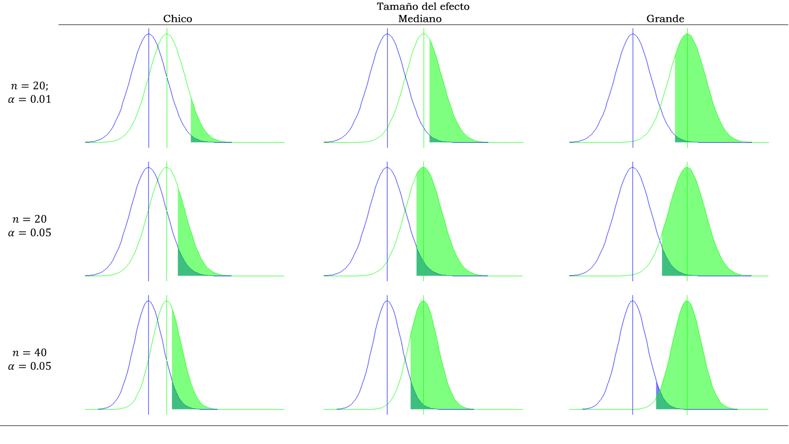

---
output:
  pdf_document: default
---

```{r message=FALSE, warning=FALSE, include=FALSE}
source("depencias.R")
knitr::opts_chunk$set(echo = FALSE, message = FALSE, warning = FALSE)
kable_outp <- ifelse(knitr::is_latex_output(), "latex", "html")
```

# Apéndice: Tamaño del efecto

## Significación estadística y significación práctica

El procedimiento de prueba de hipótesis concluye con la aseveración
acerca del rechazo o no de la hipótesis nula. Esto se hace observando
qué tan probable es hallar los resultados muestrales bajo el supuesto de
$H_0$ verdadera. El valor $p$ es una medida de esa probabilidad, por eso es
que cuando es pequeño la decisión es rechazar $H_0$ y decimos que es
resultado (la diferencia, el coeficiente, o lo que sea que se haya
puesto a prueba) es significativo, o significativamente distinto de
cero.

Sin embargo, que una prueba haya dado significativa no implica
directamente que el resultado tenga interés práctico. Como se vio en el
cálculo de la potencia, un tamaño de muestra grande, puede detectar
diferencias muy pequeñas que quizá en la práctica tengan poco interés.
La palabra significación contribuye a la confusión, porque en el
lenguaje cotidiano, una diferencia significativa a menudo quiere decir
una diferencia importante. La significación estadística, como hemos
visto, es otra cosa y puede suceder que una prueba dé significativa pero
la diferencia sea insignificante.

Por eso es necesario introducir otro concepto; el de **tamaño del efecto**. Se trata de una cuantificación de lo importante que es una
diferencia o un coeficiente, luego de haber obtenido un resultado
significativo en la prueba de hipótesis. Conocer el tamaño del efecto es
absolutamente necesario para interpretar los resultados de una
investigación. La APA (2010) destaca que "las pruebas de hipótesis no son sino el punto de partida y se requiere informar elementos adicionales tales como tamaños del efecto, intervalos de confianza y descripciones extensivas" (p. 33, traducción del autor).

Las medidas de tamaño del efecto expresan de manera estandarizada cuán
diferente de cero es una diferencia o un coeficiente. Que estén
estandarizadas permite dos cosas: evaluarlas en su magnitud, dados
ciertos criterios; y comparar efectos entre experimentos diseñados de
manera diferente, por ejemplo con distintos tamaños de muestra, lo cual
permite el meta-análisis[^113]. Para decidir cuándo un efecto es grande
mediano o pequeño, existen criterios, casi todos propuestos por Jacob
Cohen (1962), quien es autor también de la mayoría de las medidas de
tamaño del efecto.

## Medidas de tamaño del efecto

Hay una gran diversidad de medidas del tamaño del efecto, Kirk (2003)
las estima en más de setenta, y suelen clasificarse (Ellis, 2010) en dos
familias: las medidas de diferencias entre grupos y las medidas de
asociación. Para esta presentación, elegiremos algunas medidas de uso
difundido y sugerimos Ellis (2010), así como Cumming (2012) para una
descripción más detallada. Las siguientes son las medidas que más se
usan para evaluar el tamaño del efecto, según cuál sea la prueba que se
haya realizado.

### Prueba t para diferencia de medias

Conocido como *d de Cohen*, se define como:

$$\frac{{\overline{x}}_{1} - {\overline{x}}_{2}}{s_{\text{comb}}}$$

Y mide la distancia entre las medias observadas, expresada en términos
de la desviación estándar combinada de los dos grupos. Cohen (1962)
sugiere que valores de $d$ de 0.20, 0.50, y 0.80 indican tamaños de
efecto: pequeño, mediano y grande respectivamente. Medidas alternativas
al d de Cohen son *delta de Glass* y *g de Hedge*, que difieren en el
modo de calcular el denominador de la expresión anterior, pero
conceptualmente consisten también en una estandarización de la
diferencia observada.

### Análisis de la varianza

La medida se llama *f de Cohen* y se define así:

$$f = \sqrt{\frac{\sum_{i = 1}^{k}{p_{i}*{({\overline{x}}_{i} - \overline{\overline{x}})}^{2}}}{s_{res}^{2}}}$$

En la que las $p_{i}$ de la fórmula representan la proporción de casos
en cada grupo que se compara. Los valores sugeridos por Cohen son 0.10,
0.25, y 0.40 para efectos de tamaño pequeño, mediano y grande
respectivamente. Otras medidas usadas en ANOVA son $\eta^{2}$ (eta
cuadrado) y $\varepsilon^{2}$ (épsilon cuadrado). La relación entre $\eta$ y $f$ es $$f=\sqrt(\frac{\eta^2}{1-\eta^2})$$

### Correlaciones

El coeficiente de correlación es una medida estandarizada y se usa como
medida del tamaño del efecto, es decir, de la magnitud de la asociación.
Cohen considera que un efecto grande corresponde a $r = 0.50$, mediano a
$r = 0.30$ y pequeño $r = 0.10$.


### Regresión lineal

La medida estandarizada para evaluar la calidad de un modelo lineal es:

$$f^{2} = \frac{R^{2}}{1 - R^{2}}$$

Es una medida de tamaño del efecto alternativa al el coeficiente general
de correlación $R^{2}$. Cohen fija en 0.02, 0.15 y 0.35 los criterios de
pequeño, mediano y gran efecto.


### Pruebas ji cuadrado


Se utiliza la medida definida como:

$$w = \sqrt{\sum_{i = 1}^{m}\frac{{(f_{i}^{e} - f_{i}^{e1})}^{2}}{f_{i}^{e}}}$$

En la que $f_{i}^{e}$ y $f_{i}^{e1}$ son las frecuencias relativas
esperadas en la celda i bajo $H_0$ y $H_1$ respectivamente.


## Análisis de la potencia

El cálculo del tamaño del efecto permite entonces comparar resultados de
diferentes diseños experimentales y evaluar si un efecto es grande o
pequeño. Este es el análisis a posteriori, luego de haber realizado las
pruebas y haber hallado resultados estadísticamente significativos.
Cuando se trató la potencia de la prueba, se indicó que ésta crece a
medida que la diferencia entre el valor hipotético y el verdadero valor
del parámetro se agranda, es decir que si el valor real difiere mucho
del valor hipotético (tamaño del efecto grande), la probabilidad de
rechazar la hipótesis nula es también grande (potencia alta).

También participa de esta relación el tamaño de la muestra, ya que si la
muestra es de mayor tamaño, las varianzas de los estimadores se reducen
(por su propiedad de ser consistentes) y el área que corresponde a la potencia aumenta. Es decir
que muestras grandes dan lugar a mayor probabilidad de rechazar
hipótesis nulas falsas, dicho de otra manera, las muestras grandes
tienen más probabilidad de detectar diferencias, aunque éstas sean
pequeñas. Esto conduce a que muestras muy grandes pueden dar resultados
significativos aunque las diferencias sean ínfimas, por eso es muy
necesario informar el tamaño del efecto para que se pueda tener una
interpretación correcta de los resultados.  

Aún queda un componente más en esta relación: la probabilidad de cometer
error de tipo I, es decir la significación de la prueba. Si esta es muy
pequeña, fijada así para reducir el riesgo de rechazar una hipótesis
nula que sea verdadera, entonces también decrece la potencia, es decir,
se vuelve más probable aceptar una hipótesis nula que es falsa y así
pasar por alto un resultado que podría haber sido detectado.  

Son entonces cuatro los elementos que interactúan: potencia,
significación, tamaño del efecto y tamaño de la muestra. Si se establece
a priori i) cuál es el tamaño del efecto que se quiere detectar (grande,
mediano o pequeño), ii) qué riesgo de rechazar una hipótesis nula que es
verdadera se está dispuesto a correr (significación) y iii) qué
probabilidad de detectar diferencias se pretende (potencia); entonces el
tamaño de la muestra queda fijado. Análogamente, si se tiene un número
de casos dado y se fija la potencia y la significación, se puede
calcular el tamaño del efecto que la prueba será capaz de detectar. Así,
con tres de los elementos mencionados, queda determinado el cuarto. Las
previsiones sobre la relación entre estos cuatro elementos se conocen
como **análisis de la potencia** y es una parte importante del diseño de
una investigación, porque sirve para calcular a priori el tamaño de
muestra requerido para detectar un determinado tamaño de efecto con un
nivel de significación dado. Si el tamaño de muestra está fijado (por
presupuesto o tiempo), el análisis de la potencia permite saber qué
probabilidad hay de detectar un determinado tamaño del efecto. También
es posible establecer cuál es la potencia que deseamos para nuestro
estudio o, al revés, qué probabilidad de cometer Error de Tipo II (no
rechazar una $H_0$ que es falsa) estamos dispuestos a asumir.

Los gráficos de la página siguiente ilustran, como se hizo en el
capítulo XXXXX la relación entre estos elementos. Las áreas sombreadas más
claro corresponden a la potencia, las oscuras al nivel de significación,
y la distancia entre los centros de las campanas representa el tamaño
del efecto.

<!--muy dificileste gráfico-->
```{r fig.cap="Relación efecto, muestra, potencia y significación", fig.asp = 0.1, fig.width = 3, fig.align='center'}

```

Las relaciones entre el tamaño de muestra, la potencia, el tamaño del
efecto y el nivel de significación dependen de cuál sea el tipo de
estudio planteado y cuál la medida de tamaño del efecto elegida. Eso
hace que las operaciones para calcular uno de ellos conociendo los otros
tres, sean complejas. En el capítulo XXXX se construyeron las curvas de
potencia para diferentes valores de la hipótesis alternativa (es decir
del verdadero valor del parámetro) y diferentes tamaños de muestra. Sin
embargo, esos cálculos dependen de los valores concretos de los
parámetros (en particular, de las diferencias entre el valor paramétrico
que sostiene $H_0$ y el que sostienen las diferentes alternativas $H_k$);
ahora, con el tamaño del efecto estandarizado, solo hace falta saber qué
prueba se realiza para obtener la curva de potencia.

Si bien existen calculadoras on line[^114], es recomendable, por su
flexibilidad, usar el paquete `pwr` (Champely, 2017) en R. Este conjunto
de rutinas genera, para cada prueba estadística, uno de los cuatro
valores a partir de los otros tres. Por ejemplo, una prueba t unilateral
derecha, para comparar dos grupos a un nivel de significación del 5%,
con una potencia de 80% requiere, para detectar un efecto grande
(d=0.85), 18 casos.  
Primero se instala el paquete y se carga en la sesión:
<!--otra vez lo mismo con pwr, va a un sccript lo que falta acá-->


El valor 31 para el tamaño de muestra se considera óptimo porque a
partir de ahí la curva crece más lentamente y las ganancias de potencia
son pequeñas, lo que no se justifica aumentar el número de casos.

El vídeo *tamaño del efecto, muestra potencia y significación* describe
el uso del paquete `pwr` en el entorno RStudio.

[^113]: Meta-análisis es una revisión sistemática que usa procedimientos estadísticos para comparar los resultados obtenidos en diferentes estudios sobre un determinado tema.

[^114]: Por ejemplo [http://www.socscistatistics.com/effectsize/Default3.aspx](http://www.socscistatistics.com/effectsize/Default3.aspx) o también [https://www.uccs.edu/~lbecker/](https://www.uccs.edu/~lbecker/).
